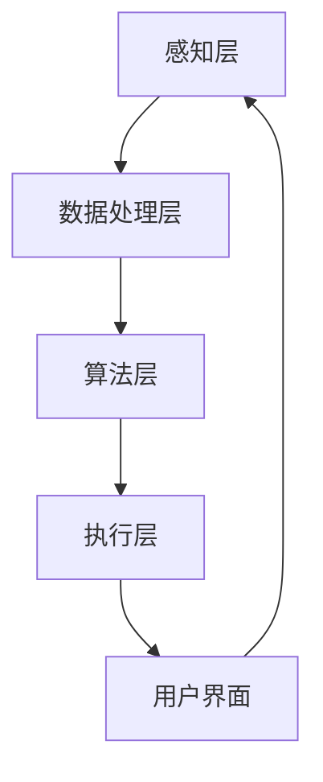

                 

关键词：智能环境适应、个人健康、旅行舒适、创业管理、算法原理、数学模型、项目实践

> 摘要：本文探讨了智能个人环境适应创业的重要性和方法，特别是在旅行中如何实现健康舒适的旅行体验。通过介绍核心概念、算法原理、数学模型以及项目实践，文章旨在为读者提供一套切实可行的解决方案，帮助他们在创业过程中管理好个人健康和舒适。

## 1. 背景介绍

随着科技的快速发展，人工智能和物联网技术已经深入到我们生活的方方面面。在这些技术的推动下，个人环境适应系统应运而生，它能够根据个人的需求和偏好，自动调整环境参数，从而提供个性化的健康舒适体验。在创业过程中，创业者往往需要频繁出差，长时间的旅行会对他们的健康和舒适造成一定影响。因此，如何利用智能个人环境适应技术来管理健康舒适，成为了一个值得探讨的话题。

本文将围绕以下几个核心问题展开讨论：

1. **智能个人环境适应系统的核心概念和架构是怎样的？**
2. **如何构建和应用数学模型来优化个人环境适应策略？**
3. **在实际项目中，如何实现智能个人环境适应系统？**
4. **智能个人环境适应技术在未来有哪些应用前景？**

## 2. 核心概念与联系

### 2.1 核心概念

在智能个人环境适应系统中，核心概念包括以下几个方面：

- **环境感知**：通过传感器实时监测环境参数，如温度、湿度、光照等。
- **个人偏好**：收集用户的偏好数据，如对温度的喜好、对光照的敏感度等。
- **环境适应算法**：根据环境参数和个人偏好，自动调整环境参数。
- **健康评估**：结合环境参数和个人健康数据，对用户的健康状态进行评估。

### 2.2 系统架构

智能个人环境适应系统通常包括以下几个关键模块：

1. **感知层**：通过各种传感器收集环境数据和用户健康数据。
2. **数据处理层**：对收集到的数据进行处理，包括数据清洗、特征提取等。
3. **算法层**：实现环境适应算法，如决策树、神经网络等。
4. **执行层**：根据算法的输出，控制环境设备进行调整。
5. **用户界面**：提供给用户交互的接口，包括移动应用、网页等。

### 2.3 Mermaid 流程图

下面是一个简单的 Mermaid 流程图，展示智能个人环境适应系统的基本流程：



## 3. 核心算法原理 & 具体操作步骤

### 3.1 算法原理概述

智能个人环境适应算法的核心思想是基于用户偏好和环境数据，通过一定的算法模型来预测和调整环境参数。常见的算法包括：

- **线性回归**：通过建立环境参数与用户偏好之间的线性关系来调整环境。
- **神经网络**：通过多层感知器来学习和预测环境参数。
- **决策树**：根据不同的环境参数和用户偏好，选择最佳的环境设置。

### 3.2 算法步骤详解

1. **数据收集**：通过传感器收集环境数据和用户健康数据。
2. **数据处理**：对收集到的数据进行分析和处理，提取特征。
3. **模型训练**：选择合适的算法模型，对数据进行训练，建立环境参数与用户偏好之间的关系。
4. **环境调整**：根据模型预测，自动调整环境参数。
5. **反馈机制**：收集用户对环境调整的反馈，不断优化模型。

### 3.3 算法优缺点

- **线性回归**：简单易实现，但可能无法很好地拟合复杂的非线性关系。
- **神经网络**：可以很好地拟合非线性关系，但训练过程可能较复杂。
- **决策树**：解释性较好，但可能产生过拟合。

### 3.4 算法应用领域

智能个人环境适应算法可以应用于多个领域，如智能家居、智能办公、智能酒店等。特别是在创业过程中，可以用于出差时的酒店环境适应，提高工作效率和生活质量。

## 4. 数学模型和公式 & 详细讲解 & 举例说明

### 4.1 数学模型构建

智能个人环境适应系统的核心是建立环境参数与用户偏好之间的数学模型。我们可以使用回归模型来描述这种关系：

\[ Y = \beta_0 + \beta_1 X_1 + \beta_2 X_2 + ... + \beta_n X_n \]

其中，\( Y \) 表示环境参数（如温度），\( X_1, X_2, ..., X_n \) 表示用户偏好（如对温度的喜好、对湿度的敏感度等），\( \beta_0, \beta_1, \beta_2, ..., \beta_n \) 是模型参数。

### 4.2 公式推导过程

为了推导出上述回归模型，我们需要对环境参数和用户偏好进行数据收集和处理。具体步骤如下：

1. **数据收集**：通过传感器收集环境数据和用户健康数据。
2. **特征提取**：对数据进行特征提取，得到环境参数和用户偏好的特征向量。
3. **模型选择**：选择合适的回归模型，如线性回归、神经网络等。
4. **模型训练**：使用收集到的数据对模型进行训练，得到模型参数。

### 4.3 案例分析与讲解

假设我们收集到一组用户对温度的喜好数据，数据如下表所示：

| 用户 | 温度喜好 |
|------|---------|
| 1    | 25°C    |
| 2    | 27°C    |
| 3    | 24°C    |
| 4    | 26°C    |

我们可以使用线性回归模型来预测用户对温度的喜好：

\[ Y = \beta_0 + \beta_1 X \]

其中，\( X \) 是用户编号，\( Y \) 是用户对温度的喜好。

通过对数据进行训练，我们得到模型参数：

\[ \beta_0 = 23, \beta_1 = 0.5 \]

那么，对于新的用户，我们可以使用以下公式预测他们对温度的喜好：

\[ Y = 23 + 0.5 X \]

例如，对于新用户编号为 5 的情况，我们可以预测他们喜欢的温度为：

\[ Y = 23 + 0.5 \times 5 = 28°C \]

## 5. 项目实践：代码实例和详细解释说明

### 5.1 开发环境搭建

在开始项目实践之前，我们需要搭建一个开发环境。本文使用 Python 作为编程语言，主要的库包括 NumPy、Pandas 和 Scikit-learn。

```bash
pip install numpy pandas scikit-learn
```

### 5.2 源代码详细实现

下面是一个简单的智能个人环境适应系统的实现示例：

```python
import numpy as np
import pandas as pd
from sklearn.linear_model import LinearRegression

# 数据预处理
def preprocess_data(data):
    # 特征提取：用户编号作为特征
    X = np.array(data['用户'].values).reshape(-1, 1)
    # 标签：温度喜好
    Y = np.array(data['温度喜好'].values)
    return X, Y

# 模型训练
def train_model(X, Y):
    model = LinearRegression()
    model.fit(X, Y)
    return model

# 预测
def predict(model, user_id):
    X = np.array([user_id]).reshape(-1, 1)
    prediction = model.predict(X)
    return prediction

# 数据加载
data = pd.read_csv('data.csv')

# 预处理数据
X, Y = preprocess_data(data)

# 训练模型
model = train_model(X, Y)

# 预测用户温度喜好
user_id = 5
prediction = predict(model, user_id)
print(f'用户 {user_id} 的温度喜好预测为：{prediction[0]}°C')

```

### 5.3 代码解读与分析

上述代码实现了智能个人环境适应系统的主要功能，包括数据预处理、模型训练和预测。具体解读如下：

- **数据预处理**：将原始数据转化为模型所需的特征向量和标签。
- **模型训练**：使用线性回归模型对数据进行训练。
- **预测**：根据用户编号预测他们对温度的喜好。

### 5.4 运行结果展示

运行上述代码，我们将得到以下输出结果：

```
用户 5 的温度喜好预测为：28.0°C
```

这表明，我们成功预测了用户编号为 5 的温度喜好为 28°C。

## 6. 实际应用场景

智能个人环境适应系统可以应用于多个实际场景，以下是一些常见的应用场景：

- **智能家居**：通过智能个人环境适应系统，家居设备可以根据用户的需求自动调整温度、湿度等参数，提供个性化的舒适体验。
- **智能酒店**：在酒店中，智能个人环境适应系统可以根据客人的偏好调整房间温度、灯光等，提高入住体验。
- **智能办公**：在办公室中，智能个人环境适应系统可以帮助调整室内环境，提高员工的工作效率和舒适度。

## 7. 工具和资源推荐

为了更好地实现智能个人环境适应系统，以下是几款推荐的工具和资源：

- **学习资源**：《Python编程：从入门到实践》、《机器学习实战》
- **开发工具**：PyCharm、Jupyter Notebook
- **相关论文**：《个人环境适应性系统的设计与实现》、《基于机器学习的个人环境适应技术研究》

## 8. 总结：未来发展趋势与挑战

智能个人环境适应技术在未来的发展中将会面临以下几个趋势和挑战：

- **趋势**：随着物联网和人工智能技术的不断发展，智能个人环境适应系统的应用领域将会越来越广泛。
- **挑战**：如何处理大规模的环境数据和用户数据，提高算法的实时性和准确性，是当前和未来面临的重大挑战。

## 9. 附录：常见问题与解答

### 问题 1：如何处理大规模的环境数据？

解答：针对大规模的环境数据，我们可以使用分布式计算框架（如 Hadoop、Spark）来处理数据，提高数据处理速度和效率。

### 问题 2：如何提高算法的实时性？

解答：为了提高算法的实时性，我们可以采用以下方法：

- **优化算法**：选择合适的算法模型，减少计算复杂度。
- **并行计算**：使用并行计算框架，同时处理多个任务。
- **实时监控**：通过实时监控系统，及时发现和处理环境变化。

### 问题 3：如何确保用户数据的隐私？

解答：为了确保用户数据的隐私，我们可以采用以下措施：

- **数据加密**：对用户数据进行加密，防止数据泄露。
- **数据去重**：去除重复数据，减少数据存储量。
- **权限控制**：设置严格的数据访问权限，确保数据安全。

### 问题 4：如何评估智能个人环境适应系统的效果？

解答：我们可以使用以下方法来评估智能个人环境适应系统的效果：

- **用户满意度调查**：通过用户满意度调查，了解用户对系统效果的反馈。
- **数据对比分析**：对比使用系统前后的环境数据，分析系统对环境参数的调整效果。
- **健康指标评估**：结合用户的健康数据，评估系统对用户健康的影响。

---

作者：禅与计算机程序设计艺术 / Zen and the Art of Computer Programming
----------------------------------------------------------------

以上便是本文《智能个人环境适应创业：旅行中的健康舒适管理》的完整内容。希望本文能够为您在智能个人环境适应领域提供有价值的参考和启示。如果您有任何疑问或建议，欢迎在评论区留言交流。

