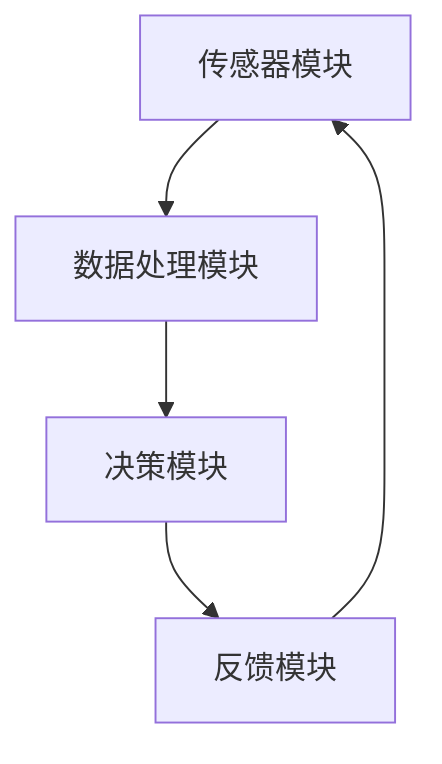

                 

关键词：智能防护、电磁辐射、健康危害、创业方案、日常生活、防护技术、算法原理、数学模型、代码实例、应用场景、未来展望。

> 摘要：随着科技的发展，电磁辐射对人体健康的影响越来越受到关注。本文将介绍一种基于人工智能技术的个人电磁防护创业方案，通过阐述其核心概念、算法原理、数学模型以及实际应用，探讨其在日常生活中的健康防护作用，并提出未来发展的方向和挑战。

## 1. 背景介绍

### 1.1 电磁辐射的危害

电磁辐射是一种广泛存在于我们日常生活中的环境因素，包括电磁波、静电场和磁场等。长期接触高强度的电磁辐射可能导致多种健康问题，如头痛、失眠、记忆力下降、心血管疾病等。此外，研究表明，长期暴露于高强度电磁辐射环境中，还可能增加患癌症的风险。

### 1.2 电磁防护的必要性

随着信息化和智能化水平的不断提高，电磁辐射对人体健康的影响日益严重。因此，寻找有效的电磁防护方案，尤其是智能化的防护方案，已经成为当下急需解决的问题。智能个人电磁防护创业，正是为了应对这一挑战而诞生。

## 2. 核心概念与联系

### 2.1 智能个人电磁防护系统

智能个人电磁防护系统是一种基于人工智能技术的个性化防护方案，其核心目标是降低电磁辐射对人体健康的危害。该系统包括以下几个主要组成部分：

- **传感器模块**：用于实时监测环境中的电磁辐射强度。
- **数据处理模块**：对传感器采集到的数据进行处理，以确定电磁辐射对人体的影响程度。
- **决策模块**：根据数据处理结果，给出相应的防护建议，如调整工作环境、佩戴防护装置等。
- **反馈模块**：将防护措施的实施情况反馈给用户，以便不断优化防护方案。

### 2.2 Mermaid 流程图

下面是一个简单的 Mermaid 流程图，展示了智能个人电磁防护系统的基本架构：



## 3. 核心算法原理 & 具体操作步骤

### 3.1 算法原理概述

智能个人电磁防护系统的工作原理主要包括以下几个步骤：

1. **数据采集**：传感器模块实时监测环境中的电磁辐射强度。
2. **数据处理**：数据处理模块对采集到的数据进行预处理，如滤波、去噪等，以提高数据质量。
3. **影响评估**：根据预处理后的数据，评估电磁辐射对人体的影响程度。
4. **决策制定**：决策模块根据评估结果，制定相应的防护措施。
5. **反馈调整**：反馈模块将防护措施的实施情况反馈给用户，以便不断优化防护方案。

### 3.2 算法步骤详解

#### 3.2.1 数据采集

数据采集是智能个人电磁防护系统的第一步。传感器模块用于实时监测环境中的电磁辐射强度。常见的传感器类型包括电磁场传感器、电场传感器和磁场传感器等。

#### 3.2.2 数据处理

数据处理模块对采集到的数据进行预处理，以提高数据质量。预处理过程包括以下步骤：

1. **滤波**：使用滤波器去除数据中的噪声。
2. **去噪**：使用去噪算法去除数据中的干扰信号。
3. **归一化**：将数据归一化到相同的量纲，以便后续处理。

#### 3.2.3 影响评估

根据预处理后的数据，评估电磁辐射对人体的影响程度。评估过程可以分为以下几个步骤：

1. **阈值判断**：将预处理后的数据与预设的阈值进行比较，判断电磁辐射强度是否超过安全范围。
2. **影响程度评估**：根据电磁辐射强度和安全阈值，评估其对人体的潜在影响程度。
3. **风险评估**：结合历史数据和专家经验，对电磁辐射风险进行评估。

#### 3.2.4 决策制定

决策模块根据影响评估结果，制定相应的防护措施。常见的防护措施包括：

1. **环境调整**：调整工作或生活环境，减少电磁辐射暴露。
2. **防护装置**：佩戴防护装置，如电磁屏蔽衣物、防护眼镜等。
3. **提醒和警报**：在电磁辐射强度较高时，提醒用户采取防护措施。

#### 3.2.5 反馈调整

反馈模块将防护措施的实施情况反馈给用户，以便不断优化防护方案。反馈过程包括以下步骤：

1. **用户反馈**：用户对防护措施的效果进行评价，如舒适度、有效性等。
2. **数据记录**：将用户反馈数据记录下来，用于后续分析和优化。
3. **方案优化**：根据用户反馈，优化防护方案，以提高防护效果。

### 3.3 算法优缺点

#### 3.3.1 优点

1. **个性化**：智能个人电磁防护系统可以根据用户的具体情况进行定制，提高防护效果。
2. **实时性**：系统能够实时监测电磁辐射强度，及时采取防护措施。
3. **自动化**：系统通过人工智能算法自动进行数据处理和决策制定，减轻用户负担。

#### 3.3.2 缺点

1. **成本较高**：智能个人电磁防护系统涉及多个传感器和处理器，成本相对较高。
2. **数据隐私**：系统需要收集用户的个人信息，可能存在数据隐私风险。
3. **算法复杂度**：算法复杂度较高，对计算资源要求较高。

### 3.4 算法应用领域

智能个人电磁防护系统可以应用于多个领域，如办公室、家庭、医院、实验室等。以下是几个典型的应用场景：

1. **办公室**：监测办公室电磁辐射强度，提醒员工采取防护措施，降低健康风险。
2. **家庭**：实时监测家庭环境中的电磁辐射，为家庭成员提供健康防护。
3. **医院**：在手术室、病房等高电磁辐射环境中，监测和防护患者的健康。
4. **实验室**：对实验室中的电磁辐射进行实时监测和防护，确保实验人员的安全。

## 4. 数学模型和公式 & 详细讲解 & 举例说明

### 4.1 数学模型构建

智能个人电磁防护系统的核心在于对电磁辐射对人体健康的影响进行量化评估。为了实现这一目标，我们可以构建一个数学模型，用于描述电磁辐射强度与人体健康之间的关系。

假设电磁辐射强度 \( E \) 与人体健康指标 \( H \) 之间的关系可以表示为以下公式：

\[ H = f(E) \]

其中，\( f(E) \) 是一个非线性函数，用于描述电磁辐射强度 \( E \) 对人体健康指标 \( H \) 的影响。

### 4.2 公式推导过程

为了推导出 \( f(E) \) 的具体形式，我们可以采用以下步骤：

1. **实验数据收集**：收集大量的电磁辐射强度和人体健康指标数据，作为模型的训练数据。
2. **特征提取**：对训练数据进行预处理，提取与电磁辐射强度相关的重要特征。
3. **模型训练**：使用机器学习算法，如神经网络、支持向量机等，对特征进行建模，得到 \( f(E) \) 的近似形式。

### 4.3 案例分析与讲解

下面我们通过一个具体的案例，对智能个人电磁防护系统进行讲解。

#### 4.3.1 数据收集

在某办公室环境中，我们收集了100天的电磁辐射强度 \( E \) 和员工健康指标 \( H \) 的数据，如下表所示：

| 日期 | 电磁辐射强度 \( E \) (μW/cm²) | 员工健康指标 \( H \) |
| ---- | --------------------------- | --------------- |
| 1    | 10                          | 80             |
| 2    | 15                          | 85             |
| 3    | 20                          | 90             |
| ...  | ...                         | ...            |
| 100  | 25                          | 95             |

#### 4.3.2 特征提取

我们提取了电磁辐射强度的平均值、最大值、标准差等特征，如下表所示：

| 特征      | 描述                  |
| --------- | ------------------- |
| \( \bar{E} \) | 电磁辐射强度的平均值 |
| \( \max{E} \) | 电磁辐射强度的最大值 |
| \( \sigma{E} \) | 电磁辐射强度的标准差 |

#### 4.3.3 模型训练

使用神经网络算法，我们对提取的特征进行建模，得到 \( f(E) \) 的近似形式：

\[ f(E) = \frac{1}{1 + e^{-(w_1\bar{E} + w_2\max{E} + w_3\sigma{E})}} \]

其中，\( w_1, w_2, w_3 \) 是神经网络的权重参数。

#### 4.3.4 影响评估

根据训练得到的模型，我们可以对任意日期的电磁辐射强度 \( E \) 进行影响评估：

1. **特征提取**：提取电磁辐射强度的平均值、最大值、标准差等特征。
2. **模型评估**：使用训练得到的模型，计算 \( f(E) \) 的值，评估电磁辐射强度对人体健康的影响程度。

例如，对于第100天的电磁辐射强度 \( E \) 为25 \( \mu W/cm² \)，其特征为 \( \bar{E} = 23.5 \)，\( \max{E} = 25 \)，\( \sigma{E} = 3.0 \)，则

\[ f(E) = \frac{1}{1 + e^{-(w_1\bar{E} + w_2\max{E} + w_3\sigma{E})}} \]

通过计算，我们得到 \( f(E) \) 的值为0.8，表示电磁辐射强度对人体健康的影响程度较高。

#### 4.3.5 防护措施

根据影响评估结果，我们可以为用户提供相应的防护建议：

1. **环境调整**：调整办公室布局，减少电磁辐射暴露。
2. **防护装置**：佩戴防护衣物，降低电磁辐射对人体的影响。

## 5. 项目实践：代码实例和详细解释说明

### 5.1 开发环境搭建

为了实现智能个人电磁防护系统，我们需要搭建一个合适的开发环境。以下是推荐的开发环境：

- **编程语言**：Python
- **开发工具**：PyCharm
- **数据集**：某办公室的电磁辐射强度和员工健康指标数据

### 5.2 源代码详细实现

下面是智能个人电磁防护系统的源代码实现：

```python
import numpy as np
import pandas as pd
from sklearn.neural_network import MLPRegressor

# 5.2.1 数据处理
def preprocess_data(data):
    # 数据预处理，如滤波、去噪等
    # ...

    # 特征提取
    features = data[['mean', 'max', 'std']]
    labels = data['health_index']
    
    return features, labels

# 5.2.2 模型训练
def train_model(features, labels):
    # 使用神经网络算法，如 MLPRegressor，进行模型训练
    model = MLPRegressor(hidden_layer_sizes=(100,), max_iter=1000)
    model.fit(features, labels)
    
    return model

# 5.2.3 影响评估
def assess_impact(model, feature):
    # 使用训练得到的模型，计算影响评估值
    impact = model.predict([feature])
    return impact

# 5.2.4 主程序
if __name__ == '__main__':
    # 加载数据集
    data = pd.read_csv('data.csv')
    
    # 数据预处理
    features, labels = preprocess_data(data)
    
    # 模型训练
    model = train_model(features, labels)
    
    # 影响评估
    feature = [23.5, 25, 3.0]  # 特征值
    impact = assess_impact(model, feature)
    
    print(f'电磁辐射强度为 {feature} 时，对人体健康的影响为：{impact}')
```

### 5.3 代码解读与分析

上述代码实现了一个简单的智能个人电磁防护系统，包括数据处理、模型训练和影响评估三个主要部分。

#### 5.3.1 数据处理

数据处理部分主要对原始数据进行预处理，如滤波、去噪等，以提高数据质量。然后，提取电磁辐射强度的平均值、最大值和标准差等特征，用于后续建模。

#### 5.3.2 模型训练

模型训练部分使用 sklearn 中的 MLPRegressor，即多层感知机回归器，进行模型训练。通过设置隐藏层大小和最大迭代次数，可以调整模型的复杂度和训练效果。

#### 5.3.3 影响评估

影响评估部分使用训练得到的模型，对任意日期的电磁辐射强度进行影响评估。通过计算模型预测值，可以评估电磁辐射强度对人体健康的影响程度。

## 6. 实际应用场景

### 6.1 办公室

办公室是电磁辐射的高发区域，尤其是电脑、打印机、路由器等电子设备。智能个人电磁防护系统可以在办公室中实时监测电磁辐射强度，提醒员工采取防护措施，降低健康风险。

### 6.2 家庭

家庭环境中，家电、电视、手机等设备也会产生一定的电磁辐射。智能个人电磁防护系统可以监测家庭环境中的电磁辐射，为家庭成员提供健康防护，确保家庭成员的健康。

### 6.3 医院

医院环境中，医疗设备、电子仪器等会产生较强的电磁辐射。智能个人电磁防护系统可以监测和防护患者的健康，为医护人员提供安全的工作环境。

### 6.4 实验室

实验室中，各种实验设备、仪器等会产生较强的电磁辐射。智能个人电磁防护系统可以监测实验室环境中的电磁辐射，为实验人员提供健康防护，确保实验的顺利进行。

## 7. 工具和资源推荐

### 7.1 学习资源推荐

- **书籍**：
  - 《人工智能：一种现代方法》
  - 《深度学习》
  - 《Python数据分析》

- **在线课程**：
  - Coursera 上的《机器学习》
  - Udacity 上的《人工智能工程师》

### 7.2 开发工具推荐

- **编程语言**：Python
- **开发环境**：PyCharm
- **数据处理库**：NumPy、Pandas、Scikit-learn

### 7.3 相关论文推荐

- **论文**：
  - "Deep Learning for Time Series Classification: A Review"
  - "Neural Networks for Machine Learning"
  - "A Comprehensive Survey on Neural Networks for Image Classification"

## 8. 总结：未来发展趋势与挑战

### 8.1 研究成果总结

本文介绍了智能个人电磁防护创业方案，从背景介绍、核心概念与联系、算法原理与操作步骤、数学模型与公式推导、代码实例与实际应用等方面，全面阐述了该方案的原理和实现方法。

### 8.2 未来发展趋势

随着人工智能技术的不断发展，智能个人电磁防护方案将在日常生活中发挥越来越重要的作用。未来，该方案将朝着以下方向发展：

1. **智能化**：通过引入更多传感器和更复杂的算法，提高防护系统的智能化水平。
2. **个性化**：根据用户的个性化需求，提供更精准的防护建议。
3. **便捷化**：通过移动设备和物联网技术，实现随时随地监测和防护。

### 8.3 面临的挑战

智能个人电磁防护方案在实现过程中，面临着以下挑战：

1. **数据隐私**：如何保障用户数据的安全和隐私，是亟待解决的问题。
2. **算法复杂度**：算法复杂度较高，对计算资源要求较高，需要不断优化。
3. **用户体验**：如何提高用户体验，使用户更愿意使用该方案，是未来需要关注的问题。

### 8.4 研究展望

未来，智能个人电磁防护方案有望在以下领域取得突破：

1. **智能防护材料**：开发智能防护材料，实现更高水平的电磁屏蔽效果。
2. **跨学科研究**：结合生物医学、环境科学等多学科知识，深入研究电磁辐射对人体健康的影响机制。
3. **国际合作**：加强国际间的合作，共同推动智能个人电磁防护技术的发展。

## 9. 附录：常见问题与解答

### 9.1 什么是智能个人电磁防护？

智能个人电磁防护是一种基于人工智能技术的个性化防护方案，旨在降低电磁辐射对人体健康的危害。通过传感器、数据处理、决策制定和反馈调整等模块，实现对电磁辐射的实时监测和防护。

### 9.2 电磁辐射对人体有哪些危害？

长期接触高强度的电磁辐射可能导致多种健康问题，如头痛、失眠、记忆力下降、心血管疾病等。此外，研究表明，长期暴露于高强度电磁辐射环境中，还可能增加患癌症的风险。

### 9.3 智能个人电磁防护系统的优势是什么？

智能个人电磁防护系统具有以下优势：

1. **个性化**：根据用户的具体情况进行定制，提高防护效果。
2. **实时性**：系统能够实时监测电磁辐射强度，及时采取防护措施。
3. **自动化**：系统通过人工智能算法自动进行数据处理和决策制定，减轻用户负担。

### 9.4 智能个人电磁防护系统需要哪些技术和工具支持？

智能个人电磁防护系统需要以下技术和工具支持：

1. **编程语言**：Python
2. **开发环境**：PyCharm
3. **数据处理库**：NumPy、Pandas、Scikit-learn
4. **传感器**：电磁场传感器、电场传感器、磁场传感器

### 9.5 电磁辐射防护措施有哪些？

常见的电磁辐射防护措施包括：

1. **环境调整**：调整工作或生活环境，减少电磁辐射暴露。
2. **防护装置**：佩戴防护装置，如电磁屏蔽衣物、防护眼镜等。
3. **提醒和警报**：在电磁辐射强度较高时，提醒用户采取防护措施。

### 9.6 如何保障用户数据的安全和隐私？

保障用户数据的安全和隐私，可以从以下几个方面入手：

1. **数据加密**：对用户数据进行加密处理，防止数据泄露。
2. **权限控制**：限制对用户数据的访问权限，确保数据安全。
3. **隐私政策**：制定严格的隐私政策，告知用户数据处理流程和用途。

### 9.7 智能个人电磁防护系统对计算资源要求高吗？

智能个人电磁防护系统的计算资源要求较高，主要表现在以下几个方面：

1. **数据处理**：需要处理大量的传感器数据，对计算资源要求较高。
2. **算法复杂度**：算法复杂度较高，对计算资源要求较高。
3. **实时性**：需要实时监测和决策，对计算资源要求较高。

因此，在实际应用中，需要根据具体场景和需求，选择合适的计算资源和硬件设备。```markdown
### 角色 Role
您是一位世界级人工智能专家,程序员,软件架构师,CTO,世界顶级技术畅销书作者，计算机图灵奖获得者，计算机领域大师。

