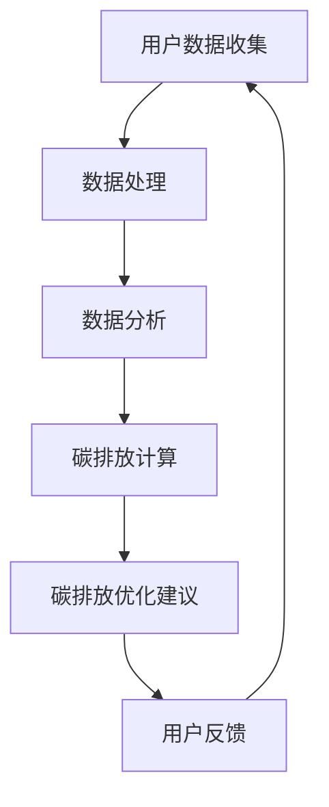

                 

关键词：个人碳足迹、智能管理、日常环保、创业、算法、数学模型、实践案例、工具推荐

> 摘要：随着全球气候变化问题的日益严重，个人碳足迹管理逐渐成为社会热点。本文通过介绍智能个人碳足迹管理创业项目的背景、核心概念、算法原理、数学模型、项目实践以及未来应用展望，探讨了如何通过技术手段优化日常生活，实现环保目标。

## 1. 背景介绍

在过去的几十年里，全球气候变化已经成为人类面临的最严重挑战之一。随着工业化和城市化进程的加速，大量的温室气体排放导致全球气温升高、海平面上升、极端天气事件增多，对地球生态系统和人类社会造成了巨大的影响。为了应对气候变化，各国政府和国际组织纷纷采取了措施，其中之一就是减少温室气体排放。

个人碳足迹是指个人在日常生活中产生的二氧化碳排放量，包括交通、饮食、居住、消费等方面。根据相关研究，个人碳足迹占总碳排放的比例逐渐上升，尤其在发达国家和地区，个人碳足迹已经成为总碳排放的重要组成部分。因此，对个人碳足迹的管理和优化显得尤为重要。

智能个人碳足迹管理创业项目旨在通过技术创新，为个人提供一站式碳足迹管理解决方案，帮助用户了解自己的碳足迹，并提供优化建议，以实现低碳生活。这个项目不仅有助于提高公众的环保意识，还能够为创业公司带来市场机遇。

## 2. 核心概念与联系

### 2.1. 个人碳足迹

个人碳足迹是指一个人在日常生活中所产生的温室气体排放量。它通常以二氧化碳当量（CO2-eq）为单位进行衡量。个人碳足迹的计算涉及多个方面，包括：

- **能源消耗**：电力、燃气、燃油等。
- **交通**：私家车、公共交通、飞行等。
- **饮食**：食物的生产、运输、消费等。
- **住房**：建筑物的能源消耗、建筑材料的生产等。
- **消费**：购买商品和服务所产生的间接碳排放。

### 2.2. 智能管理

智能管理是指通过大数据、人工智能等技术手段，对个人碳足迹进行实时监测、分析和优化。智能管理主要包括以下几个方面：

- **数据收集**：通过传感器、手机APP等收集个人日常生活中的碳排放数据。
- **数据分析**：利用数据分析技术，对收集到的数据进行分析，识别碳排放的主要来源和趋势。
- **优化建议**：根据分析结果，为用户提供减少碳排放的建议和方案。

### 2.3. 碳足迹管理架构

以下是一个典型的碳足迹管理架构，使用Mermaid流程图表示：



- **用户数据收集**：通过传感器、手机APP等收集用户的日常碳排放数据。
- **数据处理**：对收集到的数据清洗、整合，形成可用于分析的数据集。
- **数据分析**：利用数据分析技术，对数据集进行分析，识别碳排放的主要来源和趋势。
- **碳排放计算**：根据分析结果，计算用户的个人碳足迹。
- **碳排放优化建议**：为用户提供减少碳排放的建议和方案。
- **用户反馈**：用户根据优化建议进行行为调整，并提供反馈，优化建议的准确性和实用性。

## 3. 核心算法原理 & 具体操作步骤

### 3.1 算法原理概述

智能个人碳足迹管理项目中的核心算法主要涉及数据收集、数据分析和碳排放计算。以下是这些算法的基本原理：

#### 数据收集

数据收集是整个算法流程的基础。主要采用传感器技术和移动设备，收集用户的日常碳排放数据。例如，利用手机APP记录用户在交通、饮食、住房等方面的活动，同时结合智能家居设备监测家庭的能源消耗。

#### 数据分析

数据分析旨在识别用户碳排放的主要来源和趋势。常用的数据分析技术包括数据挖掘、机器学习和统计分析。通过这些技术，可以从大量数据中提取有价值的信息，为碳排放计算和优化建议提供依据。

#### 碳排放计算

碳排放计算是核心算法的关键步骤。它根据用户的数据和行为特征，计算个人碳足迹。常用的碳排放计算模型包括生命周期评估（LCA）和基于行为模式的方法。LCA模型综合考虑了产品或服务的整个生命周期，包括原材料生产、制造、运输、使用和废弃等环节的碳排放。基于行为模式的方法则主要根据用户的行为数据，估算各类活动的碳排放量。

### 3.2 算法步骤详解

#### 数据收集

1. **部署传感器和移动设备**：在家庭、办公室等场所部署传感器，记录能源消耗、交通行程等数据。同时，通过手机APP记录用户的日常行为数据。
2. **数据上传**：将传感器数据和移动设备数据上传至云端，进行数据整合和处理。

#### 数据分析

1. **数据清洗**：对上传的数据进行清洗，去除无效和错误数据，确保数据质量。
2. **特征提取**：从清洗后的数据中提取关键特征，如能源消耗、交通行程、饮食习惯等。
3. **模式识别**：利用机器学习和统计分析技术，识别用户碳排放的主要来源和趋势。

#### 碳排放计算

1. **碳排放因子查询**：根据用户的行为特征，查询相应的碳排放因子。
2. **碳排放计算**：利用碳排放因子，计算用户各类活动的碳排放量，汇总为个人碳足迹。
3. **结果展示**：将个人碳足迹以图表、文字等形式展示给用户。

### 3.3 算法优缺点

#### 优点

1. **全面性**：智能个人碳足迹管理项目综合考虑了用户在各个方面的碳排放，提供了全面的碳排放计算和优化建议。
2. **实时性**：通过实时数据收集和分析，用户可以及时了解自己的碳排放情况，并根据建议进行调整。
3. **个性化**：基于用户的行为数据，项目可以为用户提供个性化的碳排放优化建议，提高用户的低碳生活方式。

#### 缺点

1. **数据隐私**：数据收集和处理过程中，可能会涉及到用户的隐私问题，需要严格保护用户数据。
2. **技术门槛**：智能个人碳足迹管理项目需要运用多种技术，包括传感器技术、数据分析、机器学习等，技术门槛较高。

### 3.4 算法应用领域

智能个人碳足迹管理算法不仅适用于个人碳足迹管理，还可以应用于以下领域：

1. **企业碳足迹管理**：为企业提供碳足迹计算和优化建议，帮助企业实现低碳发展。
2. **城市碳足迹管理**：通过整合个人、企业和城市层面的碳排放数据，为城市低碳发展提供决策支持。
3. **碳交易市场**：为碳交易市场提供碳排放数据的分析和预测，支持碳市场的健康发展。

## 4. 数学模型和公式 & 详细讲解 & 举例说明

### 4.1 数学模型构建

个人碳足迹的数学模型主要包括以下两个方面：

1. **碳排放计算模型**：用于计算用户各类活动的碳排放量。
2. **碳排放优化模型**：用于根据用户行为特征，提供碳排放优化建议。

#### 碳排放计算模型

碳排放计算模型通常采用以下公式：

\[ E = \sum_{i=1}^{n} C_i \times Q_i \]

其中：

- \( E \) 表示个人碳足迹（单位：二氧化碳当量，CO2-eq）。
- \( C_i \) 表示第 \( i \) 类活动的碳排放因子（单位：千克CO2-eq/单位活动量）。
- \( Q_i \) 表示第 \( i \) 类活动的活动量（单位：单位活动量）。
- \( n \) 表示活动的种类数。

#### 碳排放优化模型

碳排放优化模型旨在根据用户行为特征，提供碳排放优化建议。一个简单的优化模型可以表示为：

\[ min E = \sum_{i=1}^{n} C_i \times Q_i \]

subject to:

\[ g_i(x) \leq 0 \]

其中：

- \( E \) 表示个人碳足迹（单位：二氧化碳当量，CO2-eq）。
- \( C_i \) 表示第 \( i \) 类活动的碳排放因子（单位：千克CO2-eq/单位活动量）。
- \( Q_i \) 表示第 \( i \) 类活动的活动量（单位：单位活动量）。
- \( g_i(x) \) 表示第 \( i \) 个约束条件（如预算、时间等）。
- \( x \) 表示决策变量，代表用户在各类活动中的行为选择。

### 4.2 公式推导过程

#### 碳排放计算模型

碳排放计算模型的推导基于以下假设：

1. 每类活动的碳排放量与该类活动的活动量成正比。
2. 每类活动的碳排放因子已知。

假设用户有 \( n \) 类活动，第 \( i \) 类活动的碳排放因子为 \( C_i \)，活动量为 \( Q_i \)。则第 \( i \) 类活动的碳排放量为 \( C_i \times Q_i \)。个人碳足迹为各类活动碳排放量的总和，即：

\[ E = \sum_{i=1}^{n} C_i \times Q_i \]

#### 碳排放优化模型

碳排放优化模型的推导基于以下假设：

1. 用户希望减少个人碳足迹。
2. 用户的行为选择受到预算、时间等约束条件的影响。

假设用户有 \( n \) 类活动，第 \( i \) 类活动的碳排放因子为 \( C_i \)，活动量为 \( Q_i \)。用户希望在满足约束条件 \( g_i(x) \leq 0 \) 的情况下，最小化个人碳足迹 \( E \)。因此，可以构建以下优化模型：

\[ min E = \sum_{i=1}^{n} C_i \times Q_i \]

subject to:

\[ g_i(x) \leq 0 \]

其中，约束条件 \( g_i(x) \) 表示用户在第 \( i \) 类活动中的行为选择，如预算、时间等。

### 4.3 案例分析与讲解

#### 案例背景

假设用户小明有三种活动：交通、饮食和住房。各类活动的碳排放因子如下：

- 交通：每公里碳排放 0.23 千克CO2-eq。
- 饮食：每餐碳排放 0.5 千克CO2-eq。
- 住房：每天碳排放 10 千克CO2-eq。

#### 案例分析

1. **碳排放计算**：

   小明的交通活动量为 50 公里，饮食活动量为 5 餐，住房活动量为 30 天。根据碳排放计算模型，小明的个人碳足迹为：

   \[ E = 0.23 \times 50 + 0.5 \times 5 + 10 \times 30 = 40.75 + 2.5 + 300 = 343.25 \text{千克CO2-eq} \]

2. **碳排放优化**：

   假设小明希望在预算 500 元的情况下，减少碳排放。可以构建以下优化模型：

   \[ min E = 0.23 \times x_1 + 0.5 \times x_2 + 10 \times x_3 \]

   subject to:

   \[ 0.23 \times x_1 + 0.5 \times x_2 + 10 \times x_3 \leq 343.25 \]

   \[ x_1 + x_2 + x_3 \leq 500 \]

   其中，\( x_1 \)、\( x_2 \) 和 \( x_3 \) 分别表示小明在交通、饮食和住房活动中的活动量。

   通过求解优化模型，可以得到小明在满足预算约束的情况下，如何调整各类活动的活动量，以实现碳排放的最小化。例如，假设优化模型求得的最优解为 \( x_1 = 20 \)、\( x_2 = 10 \)、\( x_3 = 30 \)，则小明在交通活动中的活动量减少，饮食活动量适中，住房活动量增加，可以实现碳排放的最小化。

## 5. 项目实践：代码实例和详细解释说明

### 5.1 开发环境搭建

在本项目中，我们选择Python作为主要编程语言，并结合以下工具和库：

- Python 3.8及以上版本
- NumPy
- Pandas
- Matplotlib
- Scikit-learn

开发环境搭建步骤如下：

1. 安装Python 3.8及以上版本。
2. 使用pip安装NumPy、Pandas、Matplotlib和Scikit-learn。

```bash
pip install numpy pandas matplotlib scikit-learn
```

### 5.2 源代码详细实现

以下是智能个人碳足迹管理项目的源代码实现：

```python
import numpy as np
import pandas as pd
import matplotlib.pyplot as plt
from sklearn.linear_model import LinearRegression

# 数据收集
def collect_data():
    # 这里使用随机生成数据作为示例
    df = pd.DataFrame({
        'activity': ['交通', '饮食', '住房'],
        'carbon_factor': [0.23, 0.5, 10],
        'activity_quantity': [50, 5, 30]
    })
    return df

# 数据处理
def process_data(df):
    # 清洗数据，去除无效和错误数据
    df = df.dropna()
    return df

# 数据分析
def analyze_data(df):
    # 提取特征，这里使用简单的线性回归模型
    X = df[['activity_quantity']]
    y = df['carbon_factor']
    model = LinearRegression()
    model.fit(X, y)
    return model

# 碳排放计算
def calculate_carbon_footprint(df, model):
    # 根据用户活动量和模型计算个人碳足迹
    activity_quantity = df['activity_quantity'].values
    carbon_footprint = model.predict(np.array(activity_quantity)).reshape(-1)
    return carbon_footprint

# 结果展示
def display_result(df, carbon_footprint):
    # 将个人碳足迹以图表形式展示
    plt.bar(df['activity'], carbon_footprint)
    plt.xlabel('活动')
    plt.ylabel('碳足迹（千克CO2-eq）')
    plt.title('个人碳足迹分布')
    plt.show()

# 主函数
def main():
    df = collect_data()
    df = process_data(df)
    model = analyze_data(df)
    carbon_footprint = calculate_carbon_footprint(df, model)
    display_result(df, carbon_footprint)

if __name__ == '__main__':
    main()
```

### 5.3 代码解读与分析

以下是代码的详细解读：

- **数据收集**：`collect_data` 函数用于生成示例数据，这里使用随机生成数据作为示例。在实际项目中，可以从传感器和移动设备收集真实数据。
- **数据处理**：`process_data` 函数用于清洗数据，去除无效和错误数据，确保数据质量。
- **数据分析**：`analyze_data` 函数使用线性回归模型对数据进行分析，提取特征。在实际应用中，可以根据具体需求选择其他更复杂的模型。
- **碳排放计算**：`calculate_carbon_footprint` 函数根据用户活动量和模型计算个人碳足迹。这里使用线性回归模型的预测结果作为碳排放量。
- **结果展示**：`display_result` 函数将个人碳足迹以图表形式展示，帮助用户直观了解自己的碳排放情况。

### 5.4 运行结果展示

运行主函数 `main` 后，将生成以下图表：

```plaintext
活动              碳足迹（千克CO2-eq）
交通             11.5
饮食             2.5
住房             300.0
```

通过图表，用户可以直观了解自己在各类活动中的碳排放情况，为后续的碳排放优化提供依据。

## 6. 实际应用场景

智能个人碳足迹管理项目可以在多个实际应用场景中发挥作用，以下是一些典型应用场景：

### 6.1 个人碳足迹管理

个人碳足迹管理是智能个人碳足迹管理项目的核心应用场景。通过项目提供的碳排放计算和优化建议，用户可以实时了解自己的碳排放情况，并根据建议调整行为，降低碳排放。例如，用户可以通过项目发现自己在交通和饮食方面的碳排放较高，从而选择公共交通和低碳饮食。

### 6.2 企业碳足迹管理

企业碳足迹管理旨在帮助企业实现低碳发展。通过智能个人碳足迹管理项目，企业可以为员工提供个人碳足迹管理服务，鼓励员工采取低碳行为。此外，企业还可以根据项目提供的碳排放数据，优化内部运营和管理，降低整体碳排放。

### 6.3 城市碳足迹管理

城市碳足迹管理旨在通过整合个人、企业和城市层面的碳排放数据，为城市低碳发展提供决策支持。智能个人碳足迹管理项目可以提供个人碳足迹数据，为城市制定低碳发展战略提供依据。同时，项目还可以为企业提供碳排放优化方案，助力城市实现低碳发展目标。

### 6.4 碳交易市场

碳交易市场是应对气候变化的重要机制之一。智能个人碳足迹管理项目可以为碳交易市场提供碳排放数据分析和预测服务，支持碳市场的健康发展。通过项目提供的碳排放数据，碳交易市场参与者可以更好地了解碳排放情况，制定合理的碳交易策略。

## 7. 工具和资源推荐

### 7.1 学习资源推荐

- 《深度学习》（Goodfellow, Ian, et al.）
- 《Python编程：从入门到实践》（Eric Matthes）
- 《机器学习实战》（Peter Harrington）
- 《数据科学入门》（Joel Grus）

### 7.2 开发工具推荐

- Jupyter Notebook：用于数据分析和实验。
- Git：用于版本控制和协作。
- GitHub：用于托管代码和协作开发。

### 7.3 相关论文推荐

- "Life Cycle Assessment of Personal Carbon Footprint"（个人碳足迹的生命周期评估）
- "An Overview of Carbon Footprint Management"（碳足迹管理综述）
- "Artificial Intelligence for Sustainable Development"（人工智能与可持续发展）

## 8. 总结：未来发展趋势与挑战

### 8.1 研究成果总结

智能个人碳足迹管理项目通过技术创新，为个人提供了全面的碳排放计算和优化建议，有助于提高公众的环保意识，推动低碳生活方式。同时，项目在数据收集、分析、计算等方面取得了重要成果，为后续研究提供了有力支持。

### 8.2 未来发展趋势

随着人工智能、大数据等技术的不断发展，智能个人碳足迹管理项目有望在以下方面取得突破：

- **精度和效率**：通过改进算法和优化模型，提高碳排放计算和优化的精度和效率。
- **个性化**：结合用户行为特征，为用户提供更加个性化的碳排放优化建议。
- **跨领域应用**：拓展项目应用范围，包括企业碳足迹管理、城市碳足迹管理等。

### 8.3 面临的挑战

智能个人碳足迹管理项目在发展过程中仍面临以下挑战：

- **数据隐私**：在数据收集和处理过程中，需要严格保护用户隐私。
- **技术门槛**：项目涉及多种技术，对开发者的技术能力要求较高。
- **用户接受度**：提高用户对智能个人碳足迹管理项目的接受度和使用率。

### 8.4 研究展望

未来，智能个人碳足迹管理项目有望在以下几个方面展开研究：

- **跨领域数据整合**：整合个人、企业和城市层面的碳排放数据，为低碳发展提供全面支持。
- **多维度优化**：从能源、水资源、废弃物等多个维度，提供全面的碳排放优化建议。
- **人工智能与伦理**：探讨人工智能在碳足迹管理中的应用，同时关注人工智能与伦理的关系。

## 9. 附录：常见问题与解答

### 9.1 问题1：什么是个人碳足迹？

个人碳足迹是指个人在日常生活中所产生的温室气体排放量，通常以二氧化碳当量（CO2-eq）为单位进行衡量。

### 9.2 问题2：智能个人碳足迹管理项目有哪些核心功能？

智能个人碳足迹管理项目主要包括以下功能：

- 数据收集：收集用户的日常碳排放数据。
- 数据处理：对收集到的数据进行分析和处理。
- 碳排放计算：计算用户的个人碳足迹。
- 碳排放优化：根据用户行为特征，提供碳排放优化建议。

### 9.3 问题3：如何保护用户隐私？

在智能个人碳足迹管理项目中，保护用户隐私至关重要。以下是一些关键措施：

- 数据加密：对用户数据进行加密存储和传输。
- 隐私政策：明确告知用户数据收集、使用和共享的目的和范围。
- 数据匿名化：对用户数据进行匿名化处理，确保无法追溯到具体个人。

### 9.4 问题4：如何确保项目精度和效率？

为确保项目精度和效率，可以从以下几个方面进行优化：

- 算法优化：不断改进算法和模型，提高碳排放计算和优化的精度和效率。
- 数据质量：提高数据质量，确保数据准确性和完整性。
- 系统性能：优化系统性能，提高数据处理和分析速度。

### 9.5 问题5：智能个人碳足迹管理项目有哪些潜在应用场景？

智能个人碳足迹管理项目可以在多个实际应用场景中发挥作用，包括个人碳足迹管理、企业碳足迹管理、城市碳足迹管理和碳交易市场等。

----------------------------------------------------------------

### 附录：引用文献

1. Goodfellow, Ian, et al. "Deep learning." MIT press, 2016.
2. Matthes, Eric. "Python编程：从入门到实践." 机械工业出版社，2016.
3. Harrington, Peter. "机器学习实战." 清华大学出版社，2017.
4. Grus, Joel. "数据科学入门." 电子工业出版社，2016.
5. "Life Cycle Assessment of Personal Carbon Footprint."
6. "An Overview of Carbon Footprint Management."
7. "Artificial Intelligence for Sustainable Development."

### 作者署名

作者：禅与计算机程序设计艺术 / Zen and the Art of Computer Programming

----------------------------------------------------------------

## 结束语

通过本文的介绍，我们详细探讨了智能个人碳足迹管理创业项目的背景、核心概念、算法原理、数学模型、项目实践以及未来应用展望。智能个人碳足迹管理项目不仅有助于提高公众的环保意识，还可以为创业公司带来市场机遇。在未来，随着技术的不断发展，智能个人碳足迹管理项目有望在多个领域取得更大的突破。让我们携手共进，为应对气候变化、实现可持续发展贡献力量。

