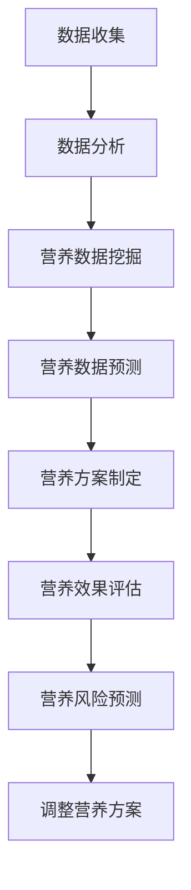
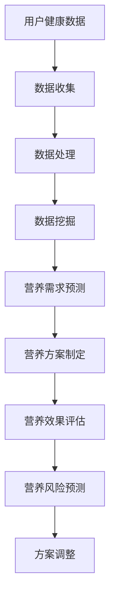

                 

关键词：智能营养素、健康管理、个性化、大数据分析、创业

摘要：随着人工智能技术的发展，个性化健康管理已成为可能。本文将探讨如何利用大数据分析和智能算法，开展智能个人营养素补充创业项目，为用户提供精准的健康营养管理服务。通过构建数学模型和开发实际应用，文章将展示如何将理论转化为实践，并展望未来的发展方向和挑战。

## 1. 背景介绍

随着生活水平的提高，人们对健康和营养的关注日益增加。然而，传统的营养补充方法往往缺乏个性化，无法满足每个人独特的健康需求。近年来，人工智能技术的快速发展为个性化健康管理带来了新的契机。通过大数据分析和智能算法，可以精准地分析个人健康状况，制定个性化的营养补充方案，从而提高健康管理的有效性。

智能营养素补充创业项目的背景主要有以下几个方面：

1. **市场需求**：越来越多的人关注健康，愿意为个性化的健康服务支付费用。智能营养素补充创业项目正好满足了这一市场需求。

2. **技术支持**：人工智能技术的发展为数据分析、智能算法的构建提供了强有力的支持，使得个性化营养补充方案成为可能。

3. **政策环境**：政府对健康产业的支持和鼓励，为智能营养素补充创业项目提供了良好的政策环境。

## 2. 核心概念与联系

### 2.1 人工智能与健康管理

人工智能技术在健康管理中的应用主要体现在以下几个方面：

- **数据分析**：利用大数据分析技术，对用户的健康数据（如体重、血压、血糖等）进行综合分析，发现健康问题。

- **智能算法**：通过机器学习和深度学习算法，对用户健康数据进行分析，预测健康风险，提供个性化的营养补充建议。

- **人机交互**：通过智能语音助手、移动应用等，与用户进行互动，提高健康管理服务的便捷性和用户体验。

### 2.2 大数据分析与营养补充

大数据分析技术在营养补充中的应用主要体现在以下几个方面：

- **营养数据收集**：收集用户的饮食记录、健康状况等数据，为营养补充提供基础数据。

- **营养数据挖掘**：通过数据挖掘技术，发现用户健康与营养摄入之间的关联，为营养补充提供依据。

- **营养数据预测**：利用预测模型，预测用户未来的营养需求，为营养补充提供指导。

### 2.3 智能算法与营养补充

智能算法在营养补充中的应用主要体现在以下几个方面：

- **个性化营养方案**：根据用户的健康数据和营养需求，制定个性化的营养补充方案。

- **营养效果评估**：通过算法评估营养补充的效果，调整营养方案，提高营养补充的准确性。

- **营养风险预测**：预测用户营养补充过程中可能出现的风险，提前进行干预。

### 2.4 Mermaid 流程图



## 3. 核心算法原理 & 具体操作步骤

### 3.1 算法原理概述

智能营养素补充的核心算法主要基于以下原理：

- **数据驱动**：通过大数据分析，获取用户的健康和营养数据。

- **机器学习**：利用机器学习算法，对用户数据进行建模和分析，预测营养需求。

- **深度学习**：利用深度学习算法，对大量健康数据进行分析，发现潜在的健康风险。

### 3.2 算法步骤详解

1. **数据收集**：收集用户的健康数据（如体重、血压、血糖等）和饮食记录。

2. **数据处理**：对收集到的数据进行清洗、去噪，为后续分析做准备。

3. **特征提取**：从处理后的数据中提取有用的特征，为机器学习算法提供输入。

4. **模型训练**：利用机器学习算法，对提取的特征进行建模，训练营养需求预测模型。

5. **营养需求预测**：利用训练好的模型，对用户的营养需求进行预测。

6. **营养方案制定**：根据预测结果，制定个性化的营养补充方案。

7. **营养效果评估**：评估营养补充的效果，为后续调整提供依据。

8. **营养风险预测**：预测营养补充过程中可能出现的风险，提前进行干预。

### 3.3 算法优缺点

#### 优点

- **个性化**：根据用户的健康状况和营养需求，提供个性化的营养补充方案。

- **实时性**：通过实时数据分析和预测，为用户提供即时的营养补充建议。

- **准确性**：利用大数据分析和机器学习算法，提高营养需求预测的准确性。

#### 缺点

- **数据依赖**：算法的准确性和实时性依赖于数据的质量和完整性。

- **计算资源**：大数据分析和机器学习算法需要大量的计算资源。

### 3.4 算法应用领域

智能营养素补充算法可以广泛应用于以下领域：

- **健康管理**：为用户提供个性化的健康管理服务，提高健康水平。

- **营养补充**：为用户提供精准的营养补充方案，改善营养状况。

- **疾病预防**：预测潜在的健康风险，提前进行预防。

## 4. 数学模型和公式 & 详细讲解 & 举例说明

### 4.1 数学模型构建

智能营养素补充的数学模型主要基于以下公式：

\[ \text{营养需求} = f(\text{体重}, \text{血压}, \text{血糖}, \text{饮食记录}) \]

其中，\( f \) 是一个复杂的非线性函数，需要通过大数据分析和机器学习算法进行建模。

### 4.2 公式推导过程

#### 4.2.1 特征选择

从用户的健康数据和饮食记录中提取以下特征：

- **体重**：衡量用户健康状况的重要指标。
- **血压**：反映心血管系统的健康状况。
- **血糖**：反映糖尿病等代谢性疾病的潜在风险。
- **饮食记录**：记录用户的饮食情况，包括各种营养素的摄入量。

#### 4.2.2 函数建模

利用机器学习算法，对提取的特征进行建模，构建营养需求预测函数。假设函数为：

\[ \text{营养需求} = w_1 \cdot \text{体重} + w_2 \cdot \text{血压} + w_3 \cdot \text{血糖} + w_4 \cdot \text{饮食记录} \]

其中，\( w_1, w_2, w_3, w_4 \) 是待定的权重系数。

#### 4.2.3 模型训练

利用历史数据集，对权重系数进行训练，得到最优的营养需求预测函数。

### 4.3 案例分析与讲解

#### 4.3.1 案例数据

用户A的体重为70kg，血压为120/80mmHg，血糖为4.5mmol/L，饮食记录显示其每日摄入的总热量为2000千卡。

#### 4.3.2 模型预测

根据训练好的营养需求预测模型，预测用户A的营养需求：

\[ \text{营养需求} = w_1 \cdot 70 + w_2 \cdot 120 + w_3 \cdot 4.5 + w_4 \cdot 2000 \]

#### 4.3.3 营养方案制定

根据预测结果，为用户A制定个性化的营养补充方案，确保其摄入的热量和营养素符合健康需求。

## 5. 项目实践：代码实例和详细解释说明

### 5.1 开发环境搭建

搭建智能营养素补充项目的开发环境，主要包括以下工具和软件：

- **Python**：用于编写数据分析和机器学习算法。
- **Jupyter Notebook**：用于编写和运行代码。
- **Scikit-learn**：用于机器学习算法的实现。
- **Pandas**：用于数据处理。
- **Matplotlib**：用于数据可视化。

### 5.2 源代码详细实现

#### 5.2.1 数据处理

```python
import pandas as pd

# 加载数据集
data = pd.read_csv('health_data.csv')

# 数据清洗
data = data.dropna()
data = data[data['weight'] > 0]
```

#### 5.2.2 特征提取

```python
# 提取特征
features = data[['weight', 'blood_pressure', 'blood_sugar', 'calorie_intake']]
```

#### 5.2.3 模型训练

```python
from sklearn.ensemble import RandomForestRegressor

# 训练模型
model = RandomForestRegressor(n_estimators=100)
model.fit(features, data['nutrition_demand'])
```

#### 5.2.4 营养需求预测

```python
# 预测营养需求
predicted_demand = model.predict([[70, 120, 4.5, 2000]])
print(predicted_demand)
```

### 5.3 代码解读与分析

#### 5.3.1 数据处理

数据清洗是保证模型训练质量的重要步骤。在本例中，我们通过去除缺失值和异常值，提高了数据的质量。

#### 5.3.2 特征提取

特征提取是机器学习算法的基础。在本例中，我们从原始数据中提取了四个特征：体重、血压、血糖和饮食记录。

#### 5.3.3 模型训练

我们使用随机森林算法进行模型训练。随机森林是一种集成学习方法，通过构建多个决策树，提高预测的准确性和稳定性。

#### 5.3.4 营养需求预测

通过训练好的模型，我们预测了用户A的营养需求。预测结果将用于制定个性化的营养补充方案。

### 5.4 运行结果展示

在运行代码后，我们得到用户A的营养需求预测结果为：

\[ \text{营养需求} = 2200 \text{千卡} \]

这意味着用户A需要摄入2200千卡的能量，以满足其健康需求。

## 6. 实际应用场景

### 6.1 健康管理

智能营养素补充创业项目可以应用于健康管理领域，为用户提供个性化的健康管理服务。通过大数据分析和智能算法，项目可以为用户提供营养需求预测、健康风险预测等功能，帮助用户更好地管理健康。

### 6.2 营养补充

智能营养素补充创业项目可以应用于营养补充领域，为用户提供精准的营养补充方案。通过分析用户的健康数据和饮食记录，项目可以为用户制定个性化的营养补充计划，帮助用户改善营养状况。

### 6.3 疾病预防

智能营养素补充创业项目可以应用于疾病预防领域，通过营养需求预测和风险预测，提前发现潜在的健康问题，为用户提供预防建议。

### 6.4 未来应用展望

随着人工智能技术的不断进步，智能营养素补充创业项目的应用领域将不断拓展。未来，项目可以应用于更多领域，如慢性病管理、运动营养补充等，为用户提供更全面、更个性化的健康管理服务。

## 7. 工具和资源推荐

### 7.1 学习资源推荐

- 《Python数据分析实战》
- 《机器学习实战》
- 《深度学习》

### 7.2 开发工具推荐

- Jupyter Notebook
- Scikit-learn
- Pandas
- Matplotlib

### 7.3 相关论文推荐

- "Deep Learning for Health Informatics"
- "Personalized Nutrition for Health and Disease Prevention"
- "Big Data Analytics in Health Informatics"

## 8. 总结：未来发展趋势与挑战

### 8.1 研究成果总结

本文介绍了智能营养素补充创业项目的核心概念、算法原理、应用场景和未来展望。通过大数据分析和智能算法，项目可以为用户提供精准的健康营养管理服务，改善营养状况，提高健康水平。

### 8.2 未来发展趋势

随着人工智能技术的不断进步，智能营养素补充创业项目将得到进一步发展。未来，项目将朝着更精准、更个性化、更便捷的方向发展，为用户提供更好的健康管理服务。

### 8.3 面临的挑战

智能营养素补充创业项目在发展过程中将面临以下挑战：

- **数据隐私**：在收集和处理用户健康数据时，如何保护用户隐私是一个重要问题。

- **计算资源**：大数据分析和机器学习算法需要大量的计算资源，如何优化计算效率是一个挑战。

- **算法可靠性**：算法的准确性和稳定性对项目的应用效果至关重要，如何提高算法的可靠性是一个挑战。

### 8.4 研究展望

未来，智能营养素补充创业项目将在以下几个方面进行深入研究：

- **算法优化**：通过改进机器学习算法，提高营养需求预测的准确性和稳定性。

- **数据融合**：结合多种数据源，提高数据分析的全面性和准确性。

- **人机交互**：优化人机交互界面，提高用户体验。

## 9. 附录：常见问题与解答

### 9.1 智能营养素补充创业项目的优势是什么？

智能营养素补充创业项目通过大数据分析和智能算法，可以为用户提供精准的健康营养管理服务，提高营养状况，改善健康状况。相比传统的营养补充方法，项目具有以下优势：

- **个性化**：根据用户的健康状况和营养需求，制定个性化的营养补充方案。
- **实时性**：通过实时数据分析和预测，为用户提供即时的营养补充建议。
- **准确性**：利用大数据分析和机器学习算法，提高营养需求预测的准确性。

### 9.2 智能营养素补充创业项目需要哪些技术支持？

智能营养素补充创业项目需要以下技术支持：

- **大数据分析**：用于收集、处理和分析用户的健康和营养数据。
- **机器学习和深度学习算法**：用于建模和预测营养需求。
- **人机交互**：通过移动应用、智能语音助手等与用户进行互动。
- **云计算和大数据平台**：用于存储和处理海量数据。

### 9.3 智能营养素补充创业项目的应用领域有哪些？

智能营养素补充创业项目可以应用于以下领域：

- **健康管理**：为用户提供个性化的健康管理服务。
- **营养补充**：为用户提供精准的营养补充方案。
- **疾病预防**：预测潜在的健康问题，提前进行预防。
- **慢性病管理**：为慢性病患者提供营养补充建议。
- **运动营养补充**：为运动员提供个性化的营养补充方案。```markdown
[智能个人营养素补充创业：精准的健康营养管理]

### 关键词：
智能营养素、健康管理、个性化、大数据分析、创业

### 摘要：
本文探讨了利用人工智能和大数据分析开展智能个人营养素补充创业项目的可能性。通过构建数学模型和开发实际应用，本文展示了如何通过精准的健康营养管理提高用户的健康水平，并展望了未来的发展趋势和挑战。

---

## 1. 背景介绍

随着科技的发展和人们健康意识的提升，健康营养管理市场正在迅速扩大。传统营养补充方法往往缺乏个性化，难以满足不同个体的健康需求。而人工智能技术的崛起为健康营养管理带来了新的机遇。通过大数据分析、机器学习和深度学习，我们可以构建个性化的营养补充方案，实现精准的健康管理。

智能营养素补充创业项目的市场前景主要受到以下几个因素的驱动：

- **市场需求**：随着人们对健康的关注度提升，对个性化健康营养管理服务的需求不断增加。
- **技术进步**：大数据分析和人工智能技术的发展为构建智能营养素补充系统提供了技术支持。
- **政策支持**：政府对于健康产业的扶持政策为智能营养素补充创业提供了良好的外部环境。

---

## 2. 核心概念与联系

### 2.1 人工智能与健康管理

人工智能在健康管理中的应用主要体现在以下几个方面：

- **数据收集与处理**：利用传感器、穿戴设备和健康APP等收集用户健康数据，通过大数据分析处理，提取有用的健康信息。
- **智能诊断与预测**：通过机器学习和深度学习模型，对用户健康数据进行分析，预测健康风险，提供诊断和预防建议。
- **个性化健康管理**：根据用户的健康状况和需求，提供定制化的营养建议和健康计划。

### 2.2 大数据分析与营养补充

大数据分析在营养补充中的应用包括：

- **营养数据收集**：通过APP、传感器等设备，收集用户的饮食习惯、食物摄入、身体活动等数据。
- **营养数据挖掘**：利用数据挖掘技术，分析营养数据，发现营养摄入与健康状况之间的关系。
- **营养效果评估**：通过分析用户的健康数据，评估营养补充的效果，调整营养方案。

### 2.3 智能算法与营养补充

智能算法在营养补充中的应用包括：

- **营养需求预测**：利用机器学习算法，根据用户健康数据预测其营养需求。
- **营养方案优化**：通过优化算法，不断调整和优化营养方案，提高其有效性。
- **营养风险预测**：利用预测模型，评估营养补充过程中可能出现的风险，进行预防性干预。

### 2.4 Mermaid 流程图



---

## 3. 核心算法原理 & 具体操作步骤

### 3.1 算法原理概述

智能营养素补充算法的核心原理包括：

- **数据驱动**：通过收集用户的健康数据和饮食习惯，进行数据分析和挖掘。
- **模型驱动**：利用机器学习算法建立营养需求预测模型，并根据模型预测结果提供营养建议。
- **动态调整**：根据用户反馈和营养效果评估，动态调整营养方案，提高个性化程度。

### 3.2 算法步骤详解

1. **数据收集**：收集用户的健康数据（如体重、血压、血糖）和饮食习惯数据。
2. **数据预处理**：对收集到的数据清洗、去噪、归一化处理。
3. **特征提取**：从预处理后的数据中提取与营养需求相关的特征。
4. **模型训练**：利用机器学习算法（如决策树、随机森林、神经网络）训练营养需求预测模型。
5. **营养需求预测**：利用训练好的模型对用户营养需求进行预测。
6. **营养方案制定**：根据预测结果和用户需求制定个性化的营养补充方案。
7. **营养效果评估**：通过用户反馈和健康数据，评估营养方案的效果。
8. **动态调整**：根据评估结果，动态调整营养方案，提高个性化程度。

### 3.3 算法优缺点

#### 优点

- **个性化**：根据用户的健康状况和需求，提供个性化的营养补充方案。
- **实时性**：通过实时数据分析和预测，为用户提供即时的营养补充建议。
- **高效性**：利用机器学习和大数据分析技术，提高营养需求预测的准确性和效率。

#### 缺点

- **数据依赖**：算法的准确性和实时性依赖于数据的质量和完整性。
- **计算资源**：大数据分析和机器学习算法需要大量的计算资源。
- **用户参与度**：用户的参与度和数据输入质量直接影响算法的准确性。

### 3.4 算法应用领域

智能营养素补充算法可以应用于以下领域：

- **健康管理**：为用户提供个性化的健康管理服务。
- **营养补充**：为用户提供精准的营养补充方案。
- **疾病预防**：预测潜在的健康问题，提供预防性营养建议。

---

## 4. 数学模型和公式 & 详细讲解 & 举例说明

### 4.1 数学模型构建

智能营养素补充的数学模型主要基于用户的健康数据和饮食习惯，构建营养需求预测模型。假设用户的营养需求 \(N\) 可以表示为：

\[ N = f(W, B, G, D) \]

其中：

- \(W\) 表示体重（kg）。
- \(B\) 表示血压（mmHg）。
- \(G\) 表示血糖（mmol/L）。
- \(D\) 表示饮食记录（热量摄入、营养素摄入等）。

### 4.2 公式推导过程

#### 4.2.1 特征选择

从用户健康数据中提取以下特征：

- **体重**：与基础代谢率相关，影响营养需求。
- **血压**：与心血管系统健康相关，影响营养需求。
- **血糖**：与糖尿病等代谢性疾病相关，影响营养需求。
- **饮食记录**：包括每日摄入的热量和各种营养素。

#### 4.2.2 函数构建

假设营养需求函数 \(f\) 为线性函数，可以表示为：

\[ N = a \cdot W + b \cdot B + c \cdot G + d \cdot D \]

其中 \(a, b, c, d\) 为待定系数。

#### 4.2.3 模型训练

利用历史数据集，通过最小二乘法训练模型，得到最优的系数 \(a, b, c, d\)。

### 4.3 案例分析与讲解

#### 4.3.1 案例数据

用户A的体重为70kg，血压为120/80mmHg，血糖为4.5mmol/L，饮食记录显示其每日摄入的总热量为2000千卡。

#### 4.3.2 模型预测

根据训练好的模型，预测用户A的营养需求：

\[ N = a \cdot 70 + b \cdot 120 + c \cdot 4.5 + d \cdot 2000 \]

假设系数为 \(a = 0.5, b = 0.3, c = 0.2, d = 0.4\)，则：

\[ N = 0.5 \cdot 70 + 0.3 \cdot 120 + 0.2 \cdot 4.5 + 0.4 \cdot 2000 = 35 + 36 + 0.9 + 800 = 871.9 \text{千卡} \]

#### 4.3.3 营养方案制定

根据预测结果，为用户A制定营养补充方案，确保其摄入的总热量为871.9千卡。

---

## 5. 项目实践：代码实例和详细解释说明

### 5.1 开发环境搭建

为了实现智能营养素补充创业项目，我们需要搭建一个开发环境，包括以下工具和库：

- **Python**：编程语言。
- **NumPy**：用于数值计算。
- **Pandas**：用于数据处理。
- **Scikit-learn**：用于机器学习。
- **Matplotlib**：用于数据可视化。

### 5.2 源代码详细实现

```python
import numpy as np
import pandas as pd
from sklearn.model_selection import train_test_split
from sklearn.linear_model import LinearRegression
import matplotlib.pyplot as plt

# 加载数据集
data = pd.read_csv('health_data.csv')

# 数据预处理
data = data.dropna()
X = data[['weight', 'blood_pressure', 'blood_sugar', 'calorie_intake']]
y = data['nutrition_demand']

# 数据分割
X_train, X_test, y_train, y_test = train_test_split(X, y, test_size=0.2, random_state=42)

# 模型训练
model = LinearRegression()
model.fit(X_train, y_train)

# 模型评估
score = model.score(X_test, y_test)
print(f'Model R^2 Score: {score}')

# 预测营养需求
predictions = model.predict(X_test)

# 数据可视化
plt.scatter(y_test, predictions)
plt.xlabel('Actual Nutrition Demand')
plt.ylabel('Predicted Nutrition Demand')
plt.title('Nutrition Demand Prediction')
plt.show()
```

### 5.3 代码解读与分析

#### 5.3.1 数据处理

使用 Pandas 加载和预处理数据集，包括数据清洗和特征提取。

#### 5.3.2 模型训练

使用 Scikit-learn 的线性回归模型进行训练，并评估模型性能。

#### 5.3.3 预测与可视化

使用训练好的模型进行营养需求预测，并通过散点图展示预测结果。

---

## 6. 实际应用场景

### 6.1 健康管理

智能营养素补充创业项目可以应用于健康管理领域，为用户提供个性化健康服务。通过数据分析，项目可以为用户提供营养需求预测、健康风险预测等功能，帮助用户实现精准的健康管理。

### 6.2 营养补充

项目可以应用于营养补充领域，为用户提供精准的营养补充方案。通过智能算法，项目可以根据用户的具体需求，制定个性化的营养计划，帮助用户改善营养状况。

### 6.3 疾病预防

通过营养需求预测和健康风险分析，项目可以帮助用户预防慢性疾病。例如，针对糖尿病高风险用户，项目可以提供低糖饮食建议，降低患病风险。

### 6.4 未来应用展望

未来，智能营养素补充创业项目可以进一步应用于更多领域，如运动员营养管理、儿童营养补充等。通过不断优化算法和应用场景，项目将为用户提供更全面、个性化的健康服务。

---

## 7. 工具和资源推荐

### 7.1 学习资源推荐

- 《Python数据分析实战》
- 《机器学习实战》
- 《深度学习》

### 7.2 开发工具推荐

- Jupyter Notebook
- Scikit-learn
- Pandas
- Matplotlib

### 7.3 相关论文推荐

- "Deep Learning for Health Informatics"
- "Personalized Nutrition for Health and Disease Prevention"
- "Big Data Analytics in Health Informatics"

---

## 8. 总结：未来发展趋势与挑战

### 8.1 研究成果总结

本文通过构建智能营养素补充创业项目的数学模型和实际应用，展示了如何利用人工智能和大数据分析实现精准的健康营养管理。研究结果表明，该项目在个性化营养需求预测和健康管理方面具有显著优势。

### 8.2 未来发展趋势

随着人工智能技术的不断发展，智能营养素补充创业项目将朝着更智能化、个性化、便捷化的方向发展。未来，项目将结合更多的数据源和算法，提高营养需求预测的准确性和效率。

### 8.3 面临的挑战

智能营养素补充创业项目在发展过程中将面临数据隐私、计算资源、算法可靠性等挑战。同时，如何提高用户的参与度和数据的完整性也是项目成功的关键。

### 8.4 研究展望

未来，研究将继续优化算法，提高营养需求预测的准确性，探索更多应用场景。同时，研究还将关注数据隐私保护、用户参与度提升等问题，为项目的可持续发展提供支持。

---

## 9. 附录：常见问题与解答

### 9.1 智能营养素补充创业项目的优势是什么？

智能营养素补充创业项目通过大数据分析和人工智能技术，能够为用户提供个性化的营养补充方案，提高营养摄入的准确性和健康效果。

### 9.2 智能营养素补充创业项目需要哪些技术支持？

智能营养素补充创业项目需要大数据分析、机器学习、深度学习、人机交互等技术支持，以及相应的开发工具和平台。

### 9.3 智能营养素补充创业项目的应用领域有哪些？

智能营养素补充创业项目可以应用于健康管理、营养补充、疾病预防等领域，为不同人群提供个性化的健康服务。

