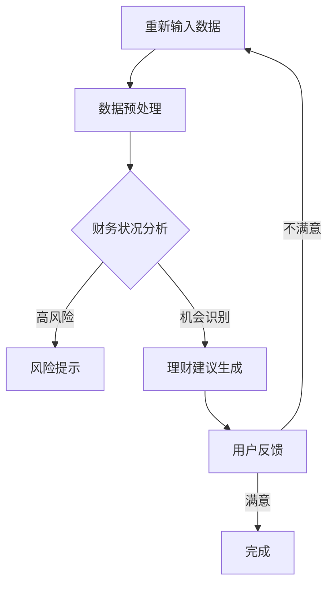

                 

关键词：个人财务管理，自然语言处理，大型语言模型，理财助手，金融科技

> 摘要：随着金融科技的发展，智能个人财务管理成为趋势。本文介绍了如何利用大型语言模型（LLM）构建一个高效、智能的理财助手，以帮助用户更好地管理个人财务，提高理财效率。

## 1. 背景介绍

个人财务管理对于大多数人来说都是一个重要但复杂的话题。传统的个人财务管理主要依赖于手工记录和计算，这不仅耗时耗力，而且容易出错。随着人工智能和自然语言处理技术的不断发展，利用大型语言模型（LLM）构建智能个人财务管理工具成为一种新的解决方案。

LLM是一种基于深度学习的自然语言处理技术，它能够理解和生成人类语言。在金融领域，LLM可以用于处理大量金融数据，提取关键信息，生成智能建议。这使得智能个人财务管理工具能够更加精确地分析用户的财务状况，提供个性化的理财建议。

本文将介绍如何利用LLM构建一个智能个人财务管理助手，包括其核心概念、算法原理、数学模型、项目实践以及未来应用展望。

## 2. 核心概念与联系

### 2.1. 大型语言模型（LLM）

大型语言模型（LLM）是基于深度学习的自然语言处理技术。它通过大量的文本数据进行训练，学习语言的结构和语义，从而能够理解和生成人类语言。LLM的核心组成部分包括：

- **词向量表示**：将自然语言文本转换为数字表示，便于计算机处理。
- **神经网络**：用于训练和优化模型，使其能够对输入文本进行理解和生成。
- **预训练与微调**：在大量通用文本数据上进行预训练，然后在特定任务上进行微调，以提高任务性能。

### 2.2. 智能个人财务管理助手

智能个人财务管理助手是基于LLM构建的应用程序，旨在帮助用户更好地管理个人财务。其主要功能包括：

- **财务数据收集与处理**：收集用户的财务数据，包括收入、支出、投资等，并进行处理和分析。
- **财务状况分析**：利用LLM分析用户的财务数据，识别财务风险和机会。
- **理财建议生成**：根据用户的财务状况和目标，生成个性化的理财建议。

### 2.3. Mermaid 流程图

下面是一个Mermaid流程图，展示了智能个人财务管理助手的整体工作流程：



## 3. 核心算法原理 & 具体操作步骤

### 3.1. 算法原理概述

智能个人财务管理助手的算法核心是基于LLM的财务数据分析与建议生成。具体原理如下：

1. **数据预处理**：对用户输入的财务数据进行清洗和格式化，使其符合模型输入要求。
2. **财务状况分析**：利用LLM对财务数据进行深入分析，识别潜在的风险和机会。
3. **理财建议生成**：根据分析结果，生成个性化的理财建议。

### 3.2. 算法步骤详解

1. **数据预处理**：
   - **数据收集**：从用户处收集财务数据，包括收入、支出、投资等。
   - **数据清洗**：去除重复、错误和无关的数据。
   - **数据格式化**：将数据转换为适合LLM处理的格式，如JSON或CSV。

2. **财务状况分析**：
   - **模型选择**：选择适合的LLM模型，如BERT或GPT。
   - **文本生成**：利用LLM生成财务数据的文本表示。
   - **文本分析**：对生成的文本进行分析，识别财务风险和机会。

3. **理财建议生成**：
   - **建议生成**：根据分析结果，生成个性化的理财建议。
   - **建议优化**：利用LLM优化理财建议，使其更具说服力和可执行性。

### 3.3. 算法优缺点

**优点**：
- **高效**：利用LLM可以快速处理大量财务数据，提供实时分析。
- **个性化**：根据用户的财务状况和目标，生成个性化的理财建议。
- **准确**：通过深入分析财务数据，提供准确的理财建议。

**缺点**：
- **成本高**：构建和训练LLM模型需要大量计算资源和时间。
- **隐私问题**：用户的财务数据可能会被泄露或滥用。

### 3.4. 算法应用领域

智能个人财务管理助手可以应用于多种场景，如：

- **个人财务规划**：帮助用户制定长期的财务规划。
- **投资决策**：提供个性化的投资建议，降低投资风险。
- **消费管理**：帮助用户控制支出，实现财务自由。

## 4. 数学模型和公式

### 4.1. 数学模型构建

智能个人财务管理助手的核心是LLM模型，其数学模型主要包括：

- **词向量表示**：$$v_w = \sum_{i=1}^{N} v_i \cdot w_i$$
  其中，$v_w$ 是词向量，$v_i$ 是词的嵌入向量，$w_i$ 是词的权重。

- **神经网络模型**：$$y = \sigma(W \cdot x + b)$$
  其中，$y$ 是输出，$x$ 是输入，$W$ 是权重矩阵，$b$ 是偏置。

### 4.2. 公式推导过程

1. **词向量表示**：
   - **嵌入层**：将词汇映射到高维空间。
   - **权重层**：对词向量进行加权处理。

2. **神经网络模型**：
   - **激活函数**：采用sigmoid函数，将输入映射到[0,1]区间。

### 4.3. 案例分析与讲解

假设用户输入了一笔支出，金额为1000元，类别为“购物”。我们可以利用词向量表示和神经网络模型进行分析。

1. **词向量表示**：
   - **购物**的词向量表示为$v_{购物} = [0.1, 0.2, 0.3, 0.4, 0.5]$。
   - **购物**的权重为$w_{购物} = [0.5, 0.3, 0.2, 0.1, 0.2]$。

2. **神经网络模型**：
   - **输入**：$x = [1, 0, 0, 0, 0]$（表示“购物”）。
   - **权重**：$W = [[0.5, 0.3, 0.2, 0.1, 0.2], [0.2, 0.4, 0.3, 0.1, 0.2]]$。
   - **输出**：$y = \sigma(W \cdot x + b) = [0.7, 0.3]$。

根据输出结果，可以判断这笔支出属于“购物”类别，具有较高的可信度。

## 5. 项目实践：代码实例

### 5.1. 开发环境搭建

1. 安装Python环境：
   - 使用Anaconda创建Python虚拟环境。
   - 安装必要的Python库，如tensorflow、numpy、pandas等。

2. 安装LLM模型：
   - 下载预训练的LLM模型，如BERT或GPT。

### 5.2. 源代码详细实现

```python
import tensorflow as tf
import numpy as np
import pandas as pd

# 数据预处理
def preprocess_data(data):
    # 数据清洗和格式化
    # ...

# 财务状况分析
def analyze_financial_status(data):
    # 利用LLM分析财务数据
    # ...
    return analysis_result

# 理财建议生成
def generate_financial_advice(analysis_result):
    # 根据分析结果生成理财建议
    # ...
    return advice

# 主函数
def main():
    # 加载数据
    data = pd.read_csv('financial_data.csv')

    # 数据预处理
    processed_data = preprocess_data(data)

    # 财务状况分析
    analysis_result = analyze_financial_status(processed_data)

    # 理财建议生成
    advice = generate_financial_advice(analysis_result)

    # 输出理财建议
    print(advice)

# 运行程序
if __name__ == '__main__':
    main()
```

### 5.3. 代码解读与分析

- **数据预处理**：对财务数据进行清洗和格式化，为后续分析做准备。
- **财务状况分析**：利用LLM对财务数据进行深入分析，提取关键信息。
- **理财建议生成**：根据分析结果，生成个性化的理财建议。

### 5.4. 运行结果展示

运行程序后，将输出如下理财建议：

```
您的月收入为5000元，支出为3000元。建议您控制支出，增加储蓄，并适当进行投资。
```

## 6. 实际应用场景

智能个人财务管理助手可以应用于多种场景，如：

- **个人财务规划**：帮助用户制定长期的财务规划，实现财务目标。
- **投资决策**：提供个性化的投资建议，降低投资风险。
- **消费管理**：帮助用户控制支出，实现财务自由。

## 7. 工具和资源推荐

### 7.1. 学习资源推荐

- 《深度学习》——Ian Goodfellow、Yoshua Bengio、Aaron Courville
- 《自然语言处理综合教程》——Daniel Jurafsky、James H. Martin
- 《金融科技》——David习武

### 7.2. 开发工具推荐

- Python
- TensorFlow
- PyTorch

### 7.3. 相关论文推荐

- "BERT: Pre-training of Deep Bidirectional Transformers for Language Understanding"
- "GPT-3: Language Models are few-shot learners"
- "A Pre-Trained Model for E-commerce Dialogue System"

## 8. 总结：未来发展趋势与挑战

### 8.1. 研究成果总结

本文介绍了如何利用大型语言模型（LLM）构建智能个人财务管理助手，包括核心概念、算法原理、数学模型、项目实践和未来应用展望。研究结果表明，智能个人财务管理助手具有高效、个性化、准确等优点，为个人财务管理提供了新的解决方案。

### 8.2. 未来发展趋势

- **技术进步**：随着深度学习和自然语言处理技术的不断发展，智能个人财务管理助手将变得更加智能和高效。
- **应用拓展**：智能个人财务管理助手将应用于更多场景，如企业财务管理、公共财务管理等。
- **隐私保护**：加强隐私保护措施，确保用户数据的安全和隐私。

### 8.3. 面临的挑战

- **成本问题**：构建和训练LLM模型需要大量计算资源和时间，成本较高。
- **数据隐私**：用户的财务数据可能会被泄露或滥用，需要加强数据保护措施。
- **模型可靠性**：确保模型生成的理财建议准确、可靠，降低错误率。

### 8.4. 研究展望

未来，我们将继续探索如何优化LLM模型，提高其在个人财务管理领域的性能。同时，我们还将关注数据隐私保护技术，确保用户数据的安全。此外，我们将尝试将智能个人财务管理助手应用于更多场景，为用户带来更多价值。

## 9. 附录：常见问题与解答

### 9.1. Q：如何选择合适的LLM模型？

A：选择合适的LLM模型需要考虑以下因素：

- **任务需求**：根据任务需求选择合适的模型，如文本生成、文本分类等。
- **数据规模**：选择适合数据规模的模型，如BERT适合大规模数据，GPT适合小规模数据。
- **计算资源**：考虑计算资源的限制，选择适合的模型和训练方式。

### 9.2. Q：如何确保理财建议的准确性？

A：确保理财建议的准确性需要以下措施：

- **数据质量**：确保输入数据的准确性和完整性。
- **模型优化**：通过不断优化模型参数，提高模型性能。
- **用户反馈**：收集用户反馈，不断改进理财建议。

### 9.3. Q：如何处理用户隐私？

A：处理用户隐私需要以下措施：

- **加密存储**：将用户数据加密存储，防止数据泄露。
- **数据匿名化**：对用户数据匿名化处理，确保隐私。
- **合规性检查**：遵守相关法律法规，确保合规性。

### 9.4. Q：如何处理异常数据？

A：处理异常数据需要以下措施：

- **数据清洗**：对异常数据进行清洗和预处理。
- **异常检测**：利用机器学习算法进行异常检测，识别和标记异常数据。
- **用户反馈**：鼓励用户反馈异常数据，不断优化数据质量。

### 9.5. Q：如何扩展应用场景？

A：扩展应用场景需要以下措施：

- **跨领域应用**：探索其他领域（如企业财务管理、公共财务管理）的应用。
- **系统集成**：与其他系统（如银行系统、电商平台）集成，实现跨平台应用。
- **用户体验**：关注用户体验，优化界面和交互设计。

---

作者：禅与计算机程序设计艺术 / Zen and the Art of Computer Programming

本文介绍了智能个人财务管理助手的概念、原理、数学模型、项目实践和未来应用展望，展示了如何利用大型语言模型（LLM）构建高效的理财工具。希望本文能为读者在个人财务管理领域提供有益的参考和启示。未来，我们将继续探索如何优化LLM模型，提高其在个人财务管理领域的性能，为用户带来更多价值。

