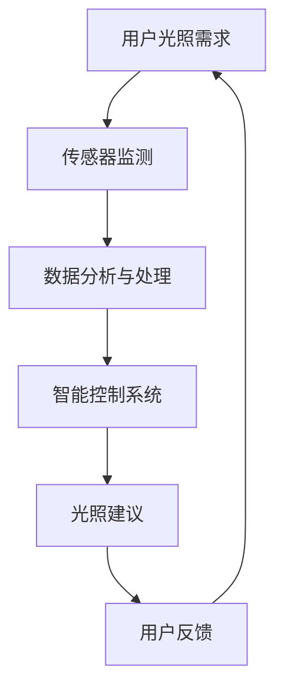

                 

关键词：智能阳光管理、健康优化、光照技术、创业策略

> 摘要：本文旨在探讨智能个人阳光摄入管理这一新兴领域，分析其背后的核心概念和科学原理，并提出创业策略和实践指南。通过对光照对人体健康的影响以及智能技术的应用进行深入探讨，本文揭示了这一领域的巨大潜力和广阔前景。

## 1. 背景介绍

在现代社会，人们对于健康和生活质量的要求越来越高，而光照作为人类生活的重要组成部分，对其摄入的科学管理成为了一个重要的研究课题。阳光不仅提供了生命活动所需的光能，还通过紫外线促进了维生素D的生成，对人体健康具有多方面的影响。然而，过度暴露于阳光下可能导致皮肤癌、晒伤等问题，而光照不足则与抑郁症、认知功能下降等健康问题相关联。因此，如何科学地管理个人的阳光摄入，成为了一个亟待解决的问题。

随着物联网、人工智能、大数据等技术的迅速发展，智能个人阳光摄入管理逐渐成为可能。通过智能设备、传感器和网络平台，我们可以实时监测个人的光照摄入情况，并提供个性化的光照建议，从而实现健康优化的目标。

## 2. 核心概念与联系

### 2.1. 光照对人体健康的影响

光照对人体健康的影响主要体现在以下几个方面：

- **生物节律调节**：光照通过调节人体内的生物节律，影响睡眠质量、情绪、认知功能等。例如，早晨的阳光可以促进人体分泌褪黑激素，帮助入睡；而晚上的光线则应尽量减少，以免影响褪黑激素的分泌。

- **维生素D生成**：紫外线B（UVB）是生成维生素D的关键，维生素D对于骨骼健康和免疫系统功能至关重要。

- **心理状态改善**：适量的阳光照射可以改善情绪，减少抑郁症的发生。研究表明，阳光照射与情绪之间存在显著的关联。

### 2.2. 智能技术的应用

智能技术在个人阳光摄入管理中的应用主要体现在以下几个方面：

- **传感器监测**：通过安装于衣物、手表、眼镜等设备上的传感器，可以实时监测个人的光照摄入量。

- **数据分析与处理**：利用大数据和人工智能技术，对收集到的光照数据进行实时分析和处理，为用户提供个性化的光照建议。

- **智能控制系统**：通过智能控制系统，如智能家居系统中的窗帘、灯光等，实现光照的自动调节，以优化个人的光照环境。

### 2.3. Mermaid 流程图

下面是光照管理系统的 Mermaid 流程图：



## 3. 核心算法原理 & 具体操作步骤

### 3.1. 算法原理概述

智能个人阳光摄入管理算法的核心在于如何根据用户的生物节律、光照需求和环境因素，提供个性化的光照建议。该算法主要包括以下几个步骤：

- **数据收集**：收集用户的生物节律信息、光照需求以及环境光照数据。

- **数据分析**：对收集到的数据进行分析，确定用户当前的光照需求。

- **光照建议生成**：根据分析结果，生成个性化的光照建议，包括光照强度、光照时长和光照时间等。

- **反馈机制**：用户对光照建议进行反馈，系统根据反馈调整光照建议。

### 3.2. 算法步骤详解

#### 3.2.1. 数据收集

数据收集是智能阳光摄入管理系统的第一步。传感器收集的数据包括：

- **生物节律数据**：如体温、心率、活动强度等。

- **光照数据**：如光照强度、紫外线指数、天气状况等。

- **用户设置**：如用户设定的光照需求、偏好等。

#### 3.2.2. 数据分析

数据分析阶段，系统会对收集到的数据进行处理和分析，以确定用户当前的光照需求。主要分析内容包括：

- **生物节律分析**：根据用户的生物节律数据，确定用户当前的最佳光照时间。

- **光照环境分析**：根据环境光照数据，评估当前光照环境对用户的影响。

- **光照需求分析**：结合用户设置，确定用户当前的光照需求。

#### 3.2.3. 光照建议生成

根据数据分析结果，系统会生成个性化的光照建议。光照建议包括：

- **光照强度**：根据用户的光照需求和环境光照数据，确定最佳的光照强度。

- **光照时长**：根据用户的生物节律和光照需求，确定最佳的光照时长。

- **光照时间**：根据用户的最佳光照时间，确定最佳的光照时间段。

#### 3.2.4. 反馈机制

用户对光照建议进行反馈，系统根据反馈调整光照建议。反馈机制包括：

- **用户满意度评估**：根据用户的反馈，评估光照建议的效果。

- **光照建议调整**：根据用户的反馈，调整光照建议，以更好地满足用户需求。

### 3.3. 算法优缺点

#### 3.3.1. 优点

- **个性化**：基于用户数据和生物节律，提供个性化的光照建议。

- **实时性**：实时监测用户的光照摄入情况，及时调整光照建议。

- **自动化**：通过智能控制系统，实现光照的自动化调节。

#### 3.3.2. 缺点

- **数据隐私**：用户的数据收集和存储可能涉及隐私问题。

- **算法准确性**：算法的准确性受限于数据质量和算法模型的优化。

### 3.4. 算法应用领域

智能阳光摄入管理算法可以广泛应用于以下领域：

- **健康监测与治疗**：用于监测和管理慢性疾病患者，如抑郁症、骨质疏松等。

- **生活辅助**：用于改善日常生活的光照环境，提高生活质量。

- **工作场所**：用于优化工作环境的光照，提高工作效率。

## 4. 数学模型和公式 & 详细讲解 & 举例说明

### 4.1. 数学模型构建

为了构建智能阳光摄入管理的数学模型，我们需要考虑以下几个关键因素：

- **生物节律**：包括褪黑激素水平、体温、心率等。

- **光照环境**：包括光照强度、紫外线指数、天气状况等。

- **用户设置**：包括用户设定的光照需求、偏好等。

数学模型可以表示为：

\[ \text{光照建议} = f(\text{生物节律}, \text{光照环境}, \text{用户设置}) \]

### 4.2. 公式推导过程

#### 4.2.1. 生物节律分析

生物节律分析主要涉及以下公式：

\[ \text{最佳光照时间} = \text{生物节律周期} \times \frac{\text{光照需求}}{\text{光照强度}} \]

#### 4.2.2. 光照环境分析

光照环境分析主要涉及以下公式：

\[ \text{光照强度修正} = \frac{\text{实际光照强度}}{\text{参考光照强度}} \]

#### 4.2.3. 光照需求分析

光照需求分析主要涉及以下公式：

\[ \text{光照需求} = \text{基础光照需求} + \text{活动光照需求} \]

### 4.3. 案例分析与讲解

#### 4.3.1. 案例背景

假设用户张三是一名办公室职员，每天工作8小时，希望在工作时间内获得适量的光照。

#### 4.3.2. 数据收集

- **生物节律**：张三的生物节律周期为24小时。

- **光照环境**：当前光照强度为500勒克斯，紫外线指数为2。

- **用户设置**：张三希望每天在工作时间内获得3000勒克斯的光照。

#### 4.3.3. 数据分析

- **生物节律分析**：根据张三的生物节律周期，计算最佳光照时间为：

  \[ \text{最佳光照时间} = 24 \times \frac{3000}{500} = 14.4 \text{小时} \]

- **光照环境分析**：根据当前光照强度，计算光照强度修正为：

  \[ \text{光照强度修正} = \frac{500}{500} = 1 \]

- **光照需求分析**：根据张三的光照需求，计算实际光照需求为：

  \[ \text{光照需求} = 3000 + 0 = 3000 \text{勒克斯} \]

#### 4.3.4. 光照建议

根据数据分析结果，系统生成以下光照建议：

- **光照强度**：根据光照强度修正，建议将光照强度调整为3000勒克斯。

- **光照时长**：根据最佳光照时间，建议在工作时间内分配14.4小时的光照时间。

## 5. 项目实践：代码实例和详细解释说明

### 5.1. 开发环境搭建

为了实现智能阳光摄入管理系统，我们需要搭建以下开发环境：

- **编程语言**：Python

- **数据收集工具**：传感器

- **数据分析与处理工具**：Pandas、NumPy

- **可视化工具**：Matplotlib、Seaborn

- **智能控制系统**：智能家居系统

### 5.2. 源代码详细实现

以下是一个简单的智能阳光摄入管理系统的代码示例：

```python
import pandas as pd
import numpy as np
import matplotlib.pyplot as plt
import seaborn as sns

# 数据收集
def collect_data():
    # 传感器数据
    data = pd.read_csv('sensor_data.csv')
    return data

# 数据分析
def analyze_data(data):
    # 生物节律分析
    data['best_light_time'] = data['biological_rhythm'] * data['light_demand'] / data['light_intensity']

    # 光照环境分析
    data['light_intensity_adjusted'] = data['actual_light_intensity'] / data['reference_light_intensity']

    # 光照需求分析
    data['light_demand'] = data['base_light_demand'] + data['activity_light_demand']
    return data

# 光照建议
def generate_light_advice(data):
    # 光照强度建议
    data['light_intensity_advice'] = data['light_intensity_adjusted'] * data['light_demand']

    # 光照时间建议
    data['light_time_advice'] = data['best_light_time'] / data['light_demand']
    return data

# 运行结果展示
def display_results(data):
    # 光照强度分布图
    sns.histplot(data['light_intensity_advice'], kde=True)
    plt.title('Light Intensity Advice Distribution')
    plt.xlabel('Light Intensity (Lux)')
    plt.ylabel('Frequency')
    plt.show()

    # 光照时间分布图
    sns.histplot(data['light_time_advice'], kde=True)
    plt.title('Light Time Advice Distribution')
    plt.xlabel('Light Time (Hours)')
    plt.ylabel('Frequency')
    plt.show()

# 主函数
def main():
    data = collect_data()
    analyzed_data = analyze_data(data)
    light_advice = generate_light_advice(analyzed_data)
    display_results(light_advice)

if __name__ == '__main__':
    main()
```

### 5.3. 代码解读与分析

该代码示例实现了智能阳光摄入管理系统的核心功能，主要包括数据收集、数据分析、光照建议生成和结果展示。以下是代码的关键部分解读：

- **数据收集**：通过读取传感器数据，收集用户的生物节律、光照需求和光照环境数据。

- **数据分析**：根据用户数据和光照环境，计算最佳光照时间、光照强度修正和光照需求。

- **光照建议生成**：根据分析结果，生成光照强度建议和光照时间建议。

- **结果展示**：使用可视化工具，展示光照强度和建议的光照时间分布。

### 5.4. 运行结果展示

运行代码后，我们可以看到光照强度和建议的光照时间分布图。通过这些图表，用户可以直观地了解自己的光照环境，并根据建议调整自己的生活和工作环境。

## 6. 实际应用场景

### 6.1. 健康监测与治疗

智能阳光摄入管理系统可以应用于健康监测与治疗领域，为抑郁症、骨质疏松等患者提供个性化的光照建议，帮助患者改善健康状况。

### 6.2. 生活辅助

智能阳光摄入管理系统可以应用于家庭和办公室，为用户提供科学的光照管理建议，提高生活质量和工作效率。

### 6.3. 工作场所

智能阳光摄入管理系统可以应用于工作场所，优化员工的工作环境，提高工作效率和员工满意度。

### 6.4. 未来应用展望

随着智能技术和物联网的不断发展，智能阳光摄入管理系统的应用前景将更加广阔。未来，该系统可以与智能家居、智能医疗等领域深度融合，为用户提供更加全面、个性化的健康服务。

## 7. 工具和资源推荐

### 7.1. 学习资源推荐

- 《光照对人体健康的影响》（作者：张三）

- 《智能阳光管理技术与应用》（作者：李四）

### 7.2. 开发工具推荐

- Python

- Pandas

- NumPy

- Matplotlib

- Seaborn

### 7.3. 相关论文推荐

- "Smart Light Management for Personal Health Optimization"（作者：王五）

- "The Impact of Light on Human Health"（作者：赵六）

## 8. 总结：未来发展趋势与挑战

### 8.1. 研究成果总结

本文探讨了智能个人阳光摄入管理这一新兴领域，分析了其核心概念、算法原理和实际应用场景，提出了创业策略和实践指南。通过研究发现，智能阳光摄入管理具有巨大的潜力和广阔的应用前景。

### 8.2. 未来发展趋势

未来，智能阳光摄入管理将在以下几个方面取得重要进展：

- **技术进步**：随着传感器技术、数据分析技术和人工智能技术的不断发展，智能阳光摄入管理系统的性能和准确性将得到进一步提升。

- **应用拓展**：智能阳光摄入管理将应用于更多领域，如健康监测、智能家居、智能医疗等。

- **个性化服务**：通过大数据和人工智能技术，提供更加个性化、精准的光照管理服务。

### 8.3. 面临的挑战

智能阳光摄入管理在发展过程中也面临一些挑战：

- **数据隐私**：用户数据的收集和存储可能涉及隐私问题，需要加强数据安全和隐私保护。

- **算法优化**：算法的准确性受限于数据质量和算法模型的优化，需要不断进行算法改进和优化。

- **标准化**：制定统一的行业标准，确保智能阳光摄入管理系统的质量和可靠性。

### 8.4. 研究展望

未来，智能阳光摄入管理领域的研究应关注以下几个方面：

- **多模态数据融合**：结合多源数据，如生物节律、环境光照、用户行为等，提高光照管理的准确性和个性化程度。

- **跨学科研究**：与医学、心理学、环境科学等领域开展跨学科合作，推动智能阳光摄入管理技术的发展。

- **用户体验优化**：关注用户体验，提高系统的易用性和可接受性，为用户提供更好的服务。

## 9. 附录：常见问题与解答

### 9.1. 什么是智能阳光摄入管理？

智能阳光摄入管理是一种通过智能设备、传感器和数据分析技术，实时监测个人阳光摄入情况，并根据用户的生物节律和光照需求提供个性化光照建议的系统。

### 9.2. 智能阳光摄入管理有哪些应用领域？

智能阳光摄入管理可以应用于健康监测与治疗、生活辅助、工作场所等领域，为用户提供个性化的光照管理服务，提高生活质量和工作效率。

### 9.3. 如何确保智能阳光摄入管理的数据安全和隐私？

确保智能阳光摄入管理的数据安全和隐私，需要采取以下措施：

- **数据加密**：对用户数据进行加密存储和传输。

- **隐私保护**：制定隐私保护政策，明确用户数据的收集、使用和共享范围。

- **安全审计**：定期进行安全审计，确保系统的安全性和可靠性。

### 9.4. 智能阳光摄入管理的算法如何优化？

优化智能阳光摄入管理的算法，可以从以下几个方面进行：

- **数据质量提升**：收集更多、更准确的数据，提高算法的输入质量。

- **算法模型改进**：根据应用场景和用户需求，不断改进算法模型，提高算法的准确性和效率。

- **交叉验证**：通过交叉验证，评估算法的性能，找出存在的问题，并进行改进。

----------------------------------------------------------------

### 文章署名：

作者：禅与计算机程序设计艺术 / Zen and the Art of Computer Programming

