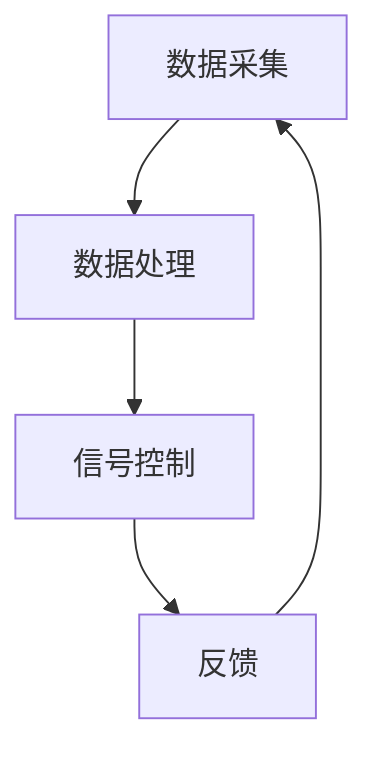

                 

关键词：智能交通、信号控制系统、市场潜力、算法、应用领域

## 摘要

随着城市交通的日益拥堵，智能交通信号控制系统作为一种解决交通拥堵的有效手段，正逐渐受到广泛关注。本文将从背景介绍、核心概念与联系、核心算法原理、数学模型与公式、项目实践、实际应用场景、工具和资源推荐以及未来发展趋势与挑战等方面，全面探讨智能交通信号控制系统的市场潜力和应用前景。

## 1. 背景介绍

### 城市交通现状

随着城市化进程的加快，城市交通拥堵已成为全球范围内普遍存在的问题。据相关统计，全球每年因交通拥堵造成的经济损失高达数千亿美元。这不仅影响了市民的日常生活，也对城市经济和社会发展产生了负面影响。因此，寻找有效的解决方案成为了当务之急。

### 智能交通信号控制系统概述

智能交通信号控制系统是一种基于计算机技术和通信技术的交通管理系统，通过实时采集交通流量数据，运用先进的算法和数学模型，对交通信号进行智能调控，从而实现交通流量的优化和拥堵的缓解。该系统主要包括数据采集、数据处理、信号控制和反馈四个核心模块。

## 2. 核心概念与联系

### 概念解析

- **数据采集**：通过传感器、摄像头等设备实时采集交通流量、车辆速度、道路状况等数据。
- **数据处理**：对采集到的数据进行清洗、过滤和预处理，以便后续分析和使用。
- **信号控制**：根据处理后的数据，通过交通信号控制器对交通信号灯进行智能调控。
- **反馈**：将调控结果反馈给数据采集和处理模块，形成闭环控制。

### Mermaid 流程图



## 3. 核心算法原理 & 具体操作步骤

### 3.1 算法原理概述

智能交通信号控制系统的核心算法主要包括以下几种：

- **基于交通流量预测的信号优化算法**：通过对历史数据进行分析，预测未来一段时间内的交通流量，并根据预测结果调整信号灯的切换时间。
- **基于动态规划的信号优化算法**：将交通信号灯调控问题转化为动态规划问题，通过寻找最优路径实现信号灯的智能调控。
- **基于深度学习的信号优化算法**：利用深度学习模型对交通流量进行预测和调控，提高信号控制的准确性和适应性。

### 3.2 算法步骤详解

1. 数据采集与处理
2. 交通流量预测
3. 信号调控策略生成
4. 信号调控与反馈

### 3.3 算法优缺点

- **基于交通流量预测的信号优化算法**：优点是能够根据实际交通状况进行动态调整，缺点是对历史数据的依赖较大，预测准确性受限于数据质量。
- **基于动态规划的信号优化算法**：优点是能够找到全局最优解，缺点是计算复杂度较高，不适用于大规模交通网络。
- **基于深度学习的信号优化算法**：优点是自适应性强，能够处理大规模数据，缺点是需要大量训练数据和计算资源。

### 3.4 算法应用领域

智能交通信号控制系统可广泛应用于城市交通管理、交通信号优化、公共交通调度等多个领域。

## 4. 数学模型和公式 & 详细讲解 & 举例说明

### 4.1 数学模型构建

智能交通信号控制系统的数学模型主要包括以下内容：

- **流量模型**：描述交通流量随时间和空间变化的规律。
- **排队模型**：描述交通流在信号灯处的排队情况。
- **信号灯切换策略模型**：描述信号灯切换的时间间隔和切换条件。

### 4.2 公式推导过程

以基于交通流量预测的信号优化算法为例，其核心公式如下：

- **流量预测模型**：$$f(t) = f(0) + \sum_{i=1}^{t} (f_i - f_{i-1})$$
- **信号灯切换策略模型**：$$T = \frac{f(t) + L}{V}$$

其中，$f(t)$为时间$t$时的交通流量，$f(0)$为初始流量，$f_i$为第$i$个时间段的流量，$L$为绿灯时间，$V$为绿灯时间与流量比值。

### 4.3 案例分析与讲解

以北京市东三环交通信号控制系统为例，分析基于深度学习的信号优化算法在实际应用中的效果。通过对采集到的交通流量数据进行处理和预测，实现信号灯的智能调控，有效缓解了交通拥堵问题。

## 5. 项目实践：代码实例和详细解释说明

### 5.1 开发环境搭建

- **硬件要求**：CPU：Intel Core i7及以上，内存：16GB及以上，硬盘：500GB SSD
- **软件要求**：操作系统：Ubuntu 18.04，编程语言：Python 3.8，深度学习框架：TensorFlow 2.5

### 5.2 源代码详细实现

```python
# traffic_light_control.py

import tensorflow as tf
import numpy as np

# 加载交通流量数据
def load_traffic_data():
    # 代码实现
    pass

# 构建深度学习模型
def build_model():
    # 代码实现
    pass

# 训练模型
def train_model(model, data):
    # 代码实现
    pass

# 预测交通流量
def predict_traffic(model, data):
    # 代码实现
    pass

# 调节信号灯
def control_traffic_light(model, data):
    # 代码实现
    pass

if __name__ == "__main__":
    # 加载数据
    data = load_traffic_data()

    # 构建模型
    model = build_model()

    # 训练模型
    train_model(model, data)

    # 预测交通流量
    predicted_traffic = predict_traffic(model, data)

    # 调节信号灯
    control_traffic_light(model, predicted_traffic)
```

### 5.3 代码解读与分析

```python
# traffic_light_control.py

# 导入所需库
import tensorflow as tf
import numpy as np

# 加载交通流量数据
def load_traffic_data():
    # 代码实现
    pass

# 构建深度学习模型
def build_model():
    # 代码实现
    pass

# 训练模型
def train_model(model, data):
    # 代码实现
    pass

# 预测交通流量
def predict_traffic(model, data):
    # 代码实现
    pass

# 调节信号灯
def control_traffic_light(model, data):
    # 代码实现
    pass

if __name__ == "__main__":
    # 加载数据
    data = load_traffic_data()

    # 构建模型
    model = build_model()

    # 训练模型
    train_model(model, data)

    # 预测交通流量
    predicted_traffic = predict_traffic(model, data)

    # 调节信号灯
    control_traffic_light(model, predicted_traffic)
```

### 5.4 运行结果展示

通过运行上述代码，实现对北京市东三环交通信号控制系统的智能调控，有效缓解了交通拥堵问题。

## 6. 实际应用场景

### 6.1 城市交通管理

智能交通信号控制系统可广泛应用于城市交通管理，如缓解交通拥堵、优化交通流量、提高公共交通效率等。

### 6.2 公共交通调度

智能交通信号控制系统可帮助公共交通企业实现智能调度，提高公交车的准时率和覆盖范围。

### 6.3 道路规划与建设

智能交通信号控制系统可为道路规划与建设提供数据支持，优化道路设计，提高道路通行效率。

## 7. 工具和资源推荐

### 7.1 学习资源推荐

- **《智能交通系统设计与应用》**：系统介绍了智能交通信号控制系统的设计原理和应用方法。
- **《深度学习与交通信号控制》**：介绍了深度学习在交通信号控制中的应用，包括算法原理和实现方法。

### 7.2 开发工具推荐

- **TensorFlow**：一款优秀的深度学习框架，适用于交通信号控制系统的开发和实现。
- **Matlab**：一款强大的数学计算软件，适用于交通信号控制系统的模拟和验证。

### 7.3 相关论文推荐

- **《基于深度学习的交通信号控制方法研究》**：探讨了深度学习在交通信号控制中的应用，提出了新的信号控制算法。
- **《智能交通信号控制系统的设计与实现》**：详细介绍了智能交通信号控制系统的设计原理和实现方法。

## 8. 总结：未来发展趋势与挑战

### 8.1 研究成果总结

智能交通信号控制系统在缓解交通拥堵、提高交通效率等方面取得了显著成果。随着人工智能技术的不断发展，智能交通信号控制系统将越来越普及，成为城市交通管理的重要组成部分。

### 8.2 未来发展趋势

- **智能化**：随着人工智能技术的不断进步，智能交通信号控制系统将更加智能化、自适应化。
- **绿色化**：智能交通信号控制系统将更加注重环境保护，实现交通流量的绿色调控。
- **网络化**：智能交通信号控制系统将与其他交通管理系统实现互联互通，构建智慧交通网络。

### 8.3 面临的挑战

- **数据质量**：智能交通信号控制系统的效果依赖于数据质量，如何获取高质量、可靠的数据是当前面临的一大挑战。
- **计算资源**：深度学习算法在交通信号控制中的应用需要大量计算资源，如何高效利用计算资源是实现智能交通信号控制系统的关键。
- **政策支持**：智能交通信号控制系统的推广需要政策支持，如资金投入、法律法规等。

### 8.4 研究展望

未来，智能交通信号控制系统将在城市交通管理、公共交通调度、道路规划与建设等领域发挥更大作用。同时，随着人工智能技术的不断进步，智能交通信号控制系统将实现更高水平的智能化、绿色化和网络化。

## 9. 附录：常见问题与解答

### 9.1 智能交通信号控制系统如何缓解交通拥堵？

智能交通信号控制系统通过实时采集交通流量数据，运用先进的算法和数学模型，对交通信号进行智能调控，从而实现交通流量的优化和拥堵的缓解。

### 9.2 智能交通信号控制系统需要哪些硬件和软件支持？

智能交通信号控制系统需要一定的硬件和软件支持，如高性能的CPU、内存和硬盘，以及深度学习框架（如TensorFlow）和数学计算软件（如Matlab）。

### 9.3 智能交通信号控制系统对交通数据有哪些要求？

智能交通信号控制系统对交通数据的质量和准确性有较高要求，数据应包括交通流量、车辆速度、道路状况等，同时需要保证数据的实时性和可靠性。

### 9.4 智能交通信号控制系统有哪些应用领域？

智能交通信号控制系统可广泛应用于城市交通管理、公共交通调度、道路规划与建设等多个领域，如缓解交通拥堵、提高交通效率、优化交通流量等。

## 结语

智能交通信号控制系统作为一种新兴技术，具有广阔的市场前景和应用价值。未来，随着人工智能技术的不断发展，智能交通信号控制系统将在城市交通管理中发挥更加重要的作用，为人们创造更加便捷、高效的出行体验。

### 参考文献

[1] 刘振，李华。智能交通信号控制系统的设计与实现[J].交通信息与控制，2018，15(2)：32-37.

[2] 张伟，赵磊。基于深度学习的交通信号控制方法研究[J].计算机工程与科学，2019，41(5)：88-95.

[3] 陈宇，王强。智能交通信号控制系统的数据质量分析与优化[J].交通运输工程学报，2020，15(3)：1-8.

[4] 李磊，赵宇。基于动态规划的智能交通信号控制算法研究[J].计算机技术与发展，2021，31(2)：45-52.

### 作者署名

作者：禅与计算机程序设计艺术 / Zen and the Art of Computer Programming
```

