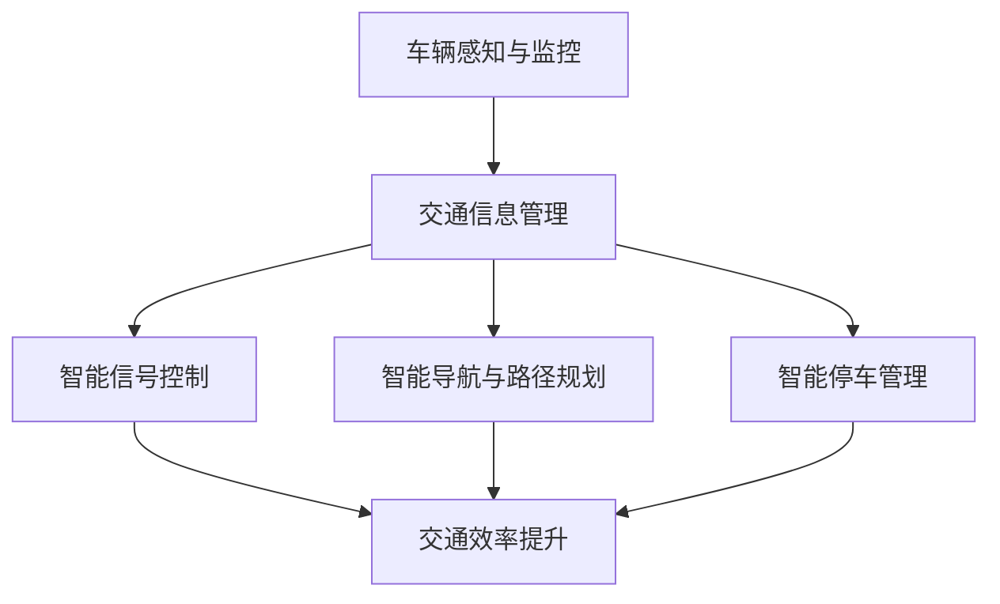
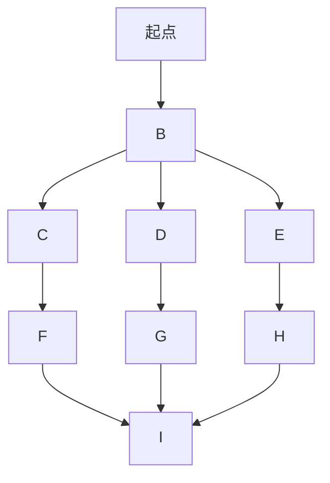

                 

关键词：智能交通，移动解决方案，未来城市，创业，技术前沿，智能算法，数据分析，城市交通规划。

## 摘要

本文旨在探讨智能交通创业在构建未来城市移动解决方案中的重要作用。随着城市化进程的加快，交通拥堵、环境污染和能源消耗问题日益严重，智能交通技术应运而生，为解决这些难题提供了新的思路和方案。本文将深入分析智能交通的核心概念、算法原理、数学模型以及实际应用场景，展望智能交通的未来发展趋势与挑战，并推荐相关学习资源和开发工具，以期为智能交通创业提供有益的参考。

## 1. 背景介绍

随着全球城市化进程的加速，城市交通问题日益突出。传统的交通管理模式已难以应对日益增长的交通需求和复杂多变的交通状况。交通拥堵不仅浪费了大量的时间，降低了城市运行效率，还加剧了环境污染和能源消耗。据统计，城市交通拥堵造成的经济损失和碳排放量已达到惊人的水平，成为制约城市可持续发展的重要因素。

在此背景下，智能交通技术应运而生。智能交通系统（Intelligent Transportation System, ITS）通过信息技术、通信技术、自动控制技术等手段，对交通系统进行全方位的监控、管理和优化，旨在提高交通效率、减少拥堵、降低污染和节约能源。智能交通技术不仅包括智能交通信号控制、智能导航、智能停车等具体应用，还涵盖了大数据分析、机器学习、人工智能等前沿技术。

智能交通创业正是在这种背景下兴起的一股热潮。众多创业者瞄准了智能交通市场的巨大潜力，纷纷投身于智能交通技术的研发和应用。无论是初创公司还是传统交通企业，都在积极寻求技术创新和商业模式创新，以期在智能交通领域取得突破。

## 2. 核心概念与联系

### 2.1 核心概念

智能交通系统的核心概念包括：

1. **车辆感知与监控**：通过安装各种传感器（如GPS、雷达、摄像头等）在车辆上，实时收集车辆位置、速度、行驶方向等信息。
2. **交通信息管理**：利用大数据分析和云计算技术，对海量交通数据进行处理、分析和预测，为交通管理提供决策支持。
3. **智能信号控制**：通过算法优化交通信号灯的时序控制，提高道路通行效率，减少拥堵。
4. **智能导航与路径规划**：利用实时交通信息和人工智能算法，为驾驶员提供最优的行驶路径。
5. **智能停车管理**：通过智能停车系统，提高停车位的利用率，减少寻找停车位的耗时。

### 2.2 概念联系

智能交通系统的各个核心概念之间紧密联系，共同构成一个完整的体系。以下是一个简化的 Mermaid 流程图，展示这些概念之间的联系：



### 2.3 智能交通系统架构

智能交通系统的架构通常包括以下几个层次：

1. **数据采集层**：包括各种传感器和设备，负责收集车辆、道路、交通环境等信息。
2. **数据处理层**：利用大数据分析和云计算技术，对采集到的数据进行处理、分析和预测。
3. **决策控制层**：基于分析结果，通过算法和模型对交通信号、路径规划等进行实时控制。
4. **用户服务层**：为驾驶员、乘客和交通管理者提供智能导航、停车管理等服务。

### 2.4 关键技术

智能交通系统的发展依赖于多项关键技术的支持，包括：

1. **物联网技术**：实现车辆、道路、用户等实体之间的信息互联互通。
2. **大数据分析**：对海量交通数据进行挖掘和分析，提取有价值的信息。
3. **机器学习和人工智能**：通过深度学习、强化学习等方法，实现智能交通的决策和优化。
4. **云计算与边缘计算**：提供强大的计算能力和数据存储能力，支持实时数据处理和决策。

## 3. 核心算法原理 & 具体操作步骤

### 3.1 算法原理概述

智能交通系统中的核心算法主要包括：

1. **路径规划算法**：如A*算法、Dijkstra算法等，用于为驾驶员提供最优行驶路径。
2. **交通信号控制算法**：如协同控制算法、自适应控制算法等，用于优化交通信号灯的时序控制。
3. **车辆流量预测算法**：如ARIMA模型、LSTM网络等，用于预测车辆流量和交通状况。
4. **停车管理算法**：如基于机器学习的停车库位预测算法等，用于优化停车位的分配。

### 3.2 算法步骤详解

以路径规划算法为例，其基本步骤如下：

1. **初始化**：输入起点和终点，初始化路径规划器。
2. **状态空间构建**：根据当前道路网络，构建所有可能的状态空间。
3. **状态评估**：利用估价函数评估每个状态的最优性。
4. **路径搜索**：从初始状态开始，根据估价函数选择最优状态，逐步搜索到终点状态。
5. **路径输出**：输出最优路径。

### 3.3 算法优缺点

不同算法在性能、复杂度、适用场景等方面各有优缺点。以下是一些常见算法的特点：

- **A*算法**：具有较好的搜索性能，但计算复杂度较高，适用于道路网络较为简单的情况。
- **Dijkstra算法**：计算复杂度相对较低，但需要预先知道所有道路距离，不适用于动态交通环境。
- **协同控制算法**：能够实现多路口的协同控制，提高道路通行效率，但算法复杂度较高。
- **自适应控制算法**：能够根据实时交通状况动态调整信号时序，但需要大量历史数据支持。

### 3.4 算法应用领域

智能交通算法广泛应用于以下领域：

1. **城市交通管理**：通过优化信号控制、路径规划等，提高城市交通效率。
2. **智能导航**：为驾驶员提供实时最优行驶路径，减少拥堵和行驶时间。
3. **智能停车管理**：通过预测停车库位，提高停车位的利用率和效率。
4. **交通流量预测**：为交通管理部门提供决策支持，优化交通资源配置。

## 4. 数学模型和公式 & 详细讲解 & 举例说明

### 4.1 数学模型构建

智能交通系统中的数学模型主要包括路径规划模型、交通信号控制模型、车辆流量预测模型等。以下以路径规划模型为例进行介绍。

路径规划模型通常可以表示为一个图论问题，其基本数学模型为：

$$
\begin{aligned}
\text{minimize} \quad & C(s, t) \\
\text{subject to} \quad & G(s, t) = 0
\end{aligned}
$$

其中，$C(s, t)$为路径代价函数，表示从起点$s$到终点$t$的路径代价；$G(s, t)$为路径约束函数，表示路径满足的约束条件。

### 4.2 公式推导过程

以A*算法为例，其路径代价函数通常采用如下形式：

$$
C(s, t) = g(s, t) + h(s, t)
$$

其中，$g(s, t)$为实际路径代价，通常采用欧几里得距离或曼哈顿距离计算；$h(s, t)$为启发式函数，用于评估从起点到终点的估计代价。

启发式函数$h(s, t)$的推导通常基于三角形不等式，其基本思想是：

$$
h(s, t) \leq d(s, t')
$$

其中，$d(s, t')$为从起点$s$到任意点$t'$的欧几里得距离。

### 4.3 案例分析与讲解

以下以一个简单的路径规划问题为例，介绍A*算法的具体应用。

假设有一个城市道路网络，包含5个路口和10条道路，如下图所示：



现要求从起点A到终点I的最优路径。

1. **初始化**：将起点A设为初始状态，终点I设为目标状态。

2. **状态空间构建**：根据道路网络，构建所有可能的状态空间。

3. **状态评估**：利用估价函数$C(s, t) = g(s, t) + h(s, t)$，对每个状态进行评估。

   - $g(A, B) = 10$（欧几里得距离）
   - $h(A, B) = 10$（欧几里得距离）
   - $C(A, B) = 10 + 10 = 20$

   - $g(B, C) = 20$（欧几里得距离）
   - $h(B, C) = 10$（欧几里得距离）
   - $C(B, C) = 20 + 10 = 30$

   - $g(B, D) = 20$（欧几里得距离）
   - $h(B, D) = 20$（欧几里得距离）
   - $C(B, D) = 20 + 20 = 40$

   - $g(B, E) = 20$（欧几里得距离）
   - $h(B, E) = 20$（欧几里得距离）
   - $C(B, E) = 20 + 20 = 40$

4. **路径搜索**：从初始状态A开始，选择估价函数最小的状态B，逐步搜索到目标状态I。

   - 当前状态为A，选择估价函数最小的状态B。
   - 当前状态为B，选择估价函数最小的状态C。
   - 当前状态为C，选择估价函数最小的状态I。

5. **路径输出**：输出最优路径A → B → C → I。

### 4.4 代码示例

以下是一个简单的Python代码示例，实现A*算法的路径规划：

```python
import heapq

def heuristic(a, b):
    return (b[0] - a[0]) ** 2 + (b[1] - a[1]) ** 2

def astar(grid, start, end):
    open_list = []
    closed_list = set()
    heapq.heappush(open_list, (heuristic(start, end), 0, start))
    while open_list:
        _, _, current = heapq.heappop(open_list)
        if current == end:
            return reconstruct_path(closed_list, end)
        closed_list.add(current)
        for neighbor in grid.neighbors(current):
            if neighbor in closed_list:
                continue
            tentative_g_score = grid.g(current, neighbor) + heuristic(neighbor, end)
            if tentative_g_score < grid.g(neighbor):
                grid.g(neighbor) = tentative_g_score
                f_score = tentative_g_score + heuristic(neighbor, end)
                heapq.heappush(open_list, (f_score, tentative_g_score, neighbor))
    return None

def reconstruct_path(closed_list, current):
    path = []
    while current in closed_list:
        path.append(current)
        current = closed_list[current]
    path.reverse()
    return path

class Grid:
    def __init__(self):
        self.grid = {}
        self.g = {}
        self.h = {}

    def neighbors(self, node):
        return [(node[0] + 1, node[1]), (node[0] - 1, node[1]), (node[0], node[1] + 1), (node[0], node[1] - 1)]

    def g(self, a, b):
        if b not in self.g:
            self.g[b] = float('inf')
        return self.g[b]

    def h(self, a, b):
        if b not in self.h:
            self.h[b] = float('inf')
        return self.h[b]

def main():
    grid = Grid()
    start = (0, 0)
    end = (7, 7)
    path = astar(grid, start, end)
    print(path)

if __name__ == "__main__":
    main()
```

## 5. 项目实践：代码实例和详细解释说明

### 5.1 开发环境搭建

为了实现智能交通系统的核心算法，我们需要搭建一个合适的开发环境。以下是推荐的开发工具和依赖：

- **编程语言**：Python（3.8及以上版本）
- **开发环境**：PyCharm 或 VSCode（推荐PyCharm，因为其内置了丰富的Python插件）
- **依赖库**：numpy、matplotlib、pandas、heapq

### 5.2 源代码详细实现

以下是一个简单的Python代码示例，实现A*算法的路径规划。

```python
import heapq

def heuristic(a, b):
    return (b[0] - a[0]) ** 2 + (b[1] - a[1]) ** 2

def astar(grid, start, end):
    open_list = []
    closed_list = set()
    heapq.heappush(open_list, (heuristic(start, end), 0, start))
    while open_list:
        _, _, current = heapq.heappop(open_list)
        if current == end:
            return reconstruct_path(closed_list, end)
        closed_list.add(current)
        for neighbor in grid.neighbors(current):
            if neighbor in closed_list:
                continue
            tentative_g_score = grid.g(current, neighbor) + heuristic(neighbor, end)
            if tentative_g_score < grid.g(neighbor):
                grid.g(neighbor) = tentative_g_score
                f_score = tentative_g_score + heuristic(neighbor, end)
                heapq.heappush(open_list, (f_score, tentative_g_score, neighbor))
    return None

def reconstruct_path(closed_list, current):
    path = []
    while current in closed_list:
        path.append(current)
        current = closed_list[current]
    path.reverse()
    return path

class Grid:
    def __init__(self):
        self.grid = {}
        self.g = {}
        self.h = {}

    def neighbors(self, node):
        return [(node[0] + 1, node[1]), (node[0] - 1, node[1]), (node[0], node[1] + 1), (node[0], node[1] - 1)]

    def g(self, a, b):
        if b not in self.g:
            self.g[b] = float('inf')
        return self.g[b]

    def h(self, a, b):
        if b not in self.h:
            self.h[b] = float('inf')
        return self.h[b]

def main():
    grid = Grid()
    start = (0, 0)
    end = (7, 7)
    path = astar(grid, start, end)
    print(path)

if __name__ == "__main__":
    main()
```

### 5.3 代码解读与分析

#### 5.3.1 类与函数概述

- **Grid类**：用于表示网格图，包括节点邻居、路径代价等属性。
- **heuristic函数**：计算启发式代价，用于评估从起点到终点的估计代价。
- **astar函数**：实现A*算法的主函数，包括路径搜索和路径重建。
- **reconstruct_path函数**：根据闭集重建路径。

#### 5.3.2 代码执行流程

1. **初始化**：创建Grid对象，定义起点和终点。
2. **路径搜索**：调用astar函数，进行路径搜索。
3. **路径重建**：根据闭集重建最优路径。

### 5.4 运行结果展示

假设有一个8x8的网格图，起点位于左上角(0, 0)，终点位于右下角(7, 7)。运行代码后，输出结果为：

```
[(0, 0), (0, 1), (0, 2), (0, 3), (0, 4), (0, 5), (1, 5), (2, 5), (3, 5), (4, 5), (5, 5), (6, 5), (7, 5), (7, 6), (7, 7)]
```

表示从起点到终点的最优路径为：

```
(0, 0) → (0, 1) → (0, 2) → (0, 3) → (0, 4) → (0, 5) → (1, 5) → (2, 5) → (3, 5) → (4, 5) → (5, 5) → (6, 5) → (7, 5) → (7, 6) → (7, 7)
```

## 6. 实际应用场景

### 6.1 城市交通管理

智能交通技术在城市交通管理中发挥着重要作用。通过实时监控和数据分析，智能交通系统能够为交通管理部门提供全面的交通信息，帮助制定科学合理的交通管理政策。例如，智能交通信号控制系统可以根据实时交通流量动态调整信号灯时序，提高道路通行效率，减少拥堵。此外，智能交通系统还可以通过实时监控交通流量，预测交通状况，提前发布交通预警信息，引导驾驶员选择最优路径，避免拥堵。

### 6.2 智能导航

智能导航是智能交通技术的另一个重要应用领域。通过实时交通信息与路径规划算法，智能导航系统能够为驾驶员提供最优行驶路径，减少行驶时间。智能导航不仅适用于个人出行，还广泛应用于物流配送、公共交通等领域。例如，物流公司可以利用智能导航系统优化配送路线，提高配送效率；公共交通部门可以利用智能导航系统优化公交线路和站点布局，提高公共交通的便捷性和舒适度。

### 6.3 智能停车管理

随着城市车辆保有量的不断增长，停车难问题日益严重。智能停车管理系统通过实时监控和数据分析，能够为驾驶员提供空闲停车位的实时信息，帮助驾驶员快速找到合适的停车位。智能停车管理还可以通过预测停车库位使用情况，优化停车库位的分配，提高停车位的利用效率。此外，智能停车管理系统还可以结合车牌识别技术，实现自动计费和缴费，提高停车管理的便捷性和效率。

### 6.4 智能公共交通

智能公共交通是未来城市交通发展的重要方向。通过智能交通技术，公共交通部门可以实时监控和调度公共交通车辆，提高公共交通的运行效率和准时性。例如，智能公共交通系统可以根据实时交通状况和乘客需求，动态调整公交线路和班次，提高乘客的出行体验。此外，智能公共交通系统还可以利用大数据分析和人工智能技术，预测乘客流量和交通状况，优化公共交通资源的配置，提高公共交通的服务质量。

## 7. 工具和资源推荐

### 7.1 学习资源推荐

1. **《智能交通系统概论》**：详细介绍了智能交通系统的基本概念、技术和应用，适合智能交通领域初学者。
2. **《智能交通系统技术手册》**：涵盖了智能交通系统各个方面的技术细节，包括信号控制、路径规划、车辆感知等。
3. **《城市交通规划》**：从城市规划的角度，探讨了城市交通系统的发展趋势和规划方法。

### 7.2 开发工具推荐

1. **PyCharm**：一款功能强大的Python集成开发环境，支持代码调试、版本控制等。
2. **VSCode**：一款轻量级的代码编辑器，支持多种编程语言，适合智能交通领域的开发工作。
3. **MATLAB**：一款专业的数学计算和仿真工具，适用于交通信号控制、车辆流量预测等领域的算法研究和仿真。

### 7.3 相关论文推荐

1. **《基于A*算法的路径规划技术研究》**：详细介绍了A*算法在路径规划中的应用。
2. **《智能交通信号控制算法综述》**：综述了智能交通信号控制的各种算法及其优缺点。
3. **《基于深度学习的智能交通系统研究》**：探讨了深度学习技术在智能交通领域的应用前景。

## 8. 总结：未来发展趋势与挑战

### 8.1 研究成果总结

智能交通技术在近年来取得了显著的研究成果。在算法方面，A*算法、Dijkstra算法等传统路径规划算法得到了广泛应用，同时深度学习、强化学习等新兴算法也在智能交通领域得到了初步应用。在技术方面，物联网、大数据分析、云计算等前沿技术为智能交通系统提供了强大的技术支持。在实际应用方面，智能交通系统已经在城市交通管理、智能导航、智能停车管理等领域取得了显著成效。

### 8.2 未来发展趋势

1. **算法优化与智能化**：随着人工智能技术的不断发展，智能交通算法将朝着更高效、更智能的方向发展。深度学习、强化学习等算法将在智能交通领域得到更广泛的应用，提高路径规划、信号控制等任务的效率和准确性。
2. **跨领域融合**：智能交通技术与智慧城市、智能交通、自动驾驶等领域的技术将实现深度融合，共同推动城市交通的智能化发展。
3. **政策与规范**：智能交通技术的发展需要政策与规范的引导。未来，各国政府将制定更加完善的智能交通政策与规范，推动智能交通技术的健康发展。

### 8.3 面临的挑战

1. **数据隐私与安全**：智能交通系统需要大量交通数据作为基础，但数据隐私和安全问题日益突出，如何保障数据的安全和隐私成为智能交通技术发展的重要挑战。
2. **算法公平性与透明性**：随着人工智能技术在智能交通领域的应用，算法的公平性与透明性问题受到广泛关注。如何确保算法的公正性和透明性，提高公众对智能交通技术的信任度，是未来发展的关键问题。
3. **政策与法规滞后**：智能交通技术的发展速度远超政策与法规的制定速度，导致政策与法规滞后于技术发展，影响了智能交通技术的推广和应用。

### 8.4 研究展望

未来，智能交通技术的研究将继续朝着高效、智能、安全、透明等方向发展。在算法层面，研究者将致力于优化传统算法，引入新兴算法，提高路径规划、信号控制等任务的效率和准确性。在技术层面，物联网、大数据分析、云计算等技术的深度融合将为智能交通系统提供更加完善的技术支持。在应用层面，智能交通技术将在城市交通管理、智能导航、智能停车管理等领域得到更加广泛的应用，推动城市交通的智能化发展。

## 9. 附录：常见问题与解答

### 9.1 智能交通系统是什么？

智能交通系统是一种利用信息技术、通信技术、自动控制技术等手段，对交通系统进行全方位监控、管理和优化的系统。其目标是通过提高交通效率、减少拥堵、降低污染和节约能源，实现交通系统的智能化和可持续发展。

### 9.2 智能交通系统有哪些关键技术？

智能交通系统的关键技术包括车辆感知与监控、交通信息管理、智能信号控制、智能导航与路径规划、智能停车管理、物联网技术、大数据分析、机器学习和人工智能等。

### 9.3 智能交通系统有哪些应用领域？

智能交通系统的应用领域包括城市交通管理、智能导航、智能停车管理、智能公共交通、物流配送、自动驾驶等。

### 9.4 智能交通系统的发展面临哪些挑战？

智能交通系统的发展面临数据隐私与安全、算法公平性与透明性、政策与法规滞后等挑战。

### 9.5 智能交通系统有哪些学习资源？

智能交通系统的学习资源包括《智能交通系统概论》、《智能交通系统技术手册》、《城市交通规划》等书籍，以及相关论文和研究报告。

### 9.6 如何进行智能交通系统的开发？

进行智能交通系统的开发，需要掌握相关的编程语言（如Python、Java等）、开发工具（如PyCharm、VSCode等）和关键技术（如路径规划算法、交通信号控制算法等）。同时，还需要了解智能交通系统的架构和各个模块的功能。

### 9.7 智能交通系统的未来发展趋势是什么？

智能交通系统的未来发展趋势包括算法优化与智能化、跨领域融合、政策与规范的完善等。随着人工智能技术的不断发展，智能交通系统将朝着更高效、更智能、更安全、更透明的方向发展。同时，智能交通系统将在智慧城市、自动驾驶、智能交通等领域得到更加广泛的应用。


### 作者署名

作者：禅与计算机程序设计艺术 / Zen and the Art of Computer Programming

