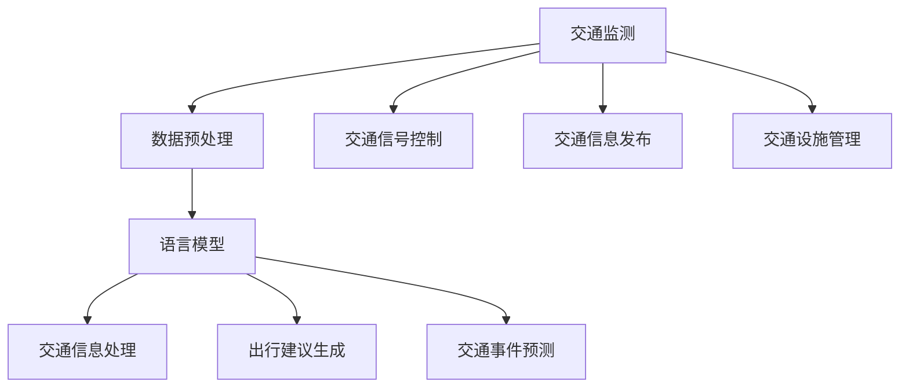

                 

关键词：智能交通管理、语言模型（LLM）、城市出行、交通优化、自动驾驶、实时数据处理

> 摘要：本文探讨了如何利用语言模型（LLM）优化城市出行，通过介绍智能交通管理的背景、核心概念、算法原理、数学模型、项目实践和未来应用场景，展示了LLM在智能交通管理中的重要性和潜力。

## 1. 背景介绍

随着城市化进程的加速，城市交通问题日益突出。交通拥堵、交通事故、环境污染等问题不仅影响了市民的出行体验，还对经济发展和社会稳定带来了负面影响。为了应对这些挑战，各国政府和企业纷纷投入大量资源进行交通管理和优化研究。近年来，人工智能（AI）技术的迅猛发展为智能交通管理带来了新的机遇。语言模型（LLM），作为一种先进的AI模型，在自然语言处理、文本生成、对话系统等方面取得了显著的成果。本文将探讨如何利用LLM优化城市出行，从而提升交通管理效率和市民出行体验。

## 2. 核心概念与联系

### 2.1 智能交通管理

智能交通管理是指利用现代信息技术、通信技术、传感器技术等手段，对城市交通系统进行实时监测、分析和优化，以提高交通效率、减少交通拥堵、降低交通事故发生率、减少环境污染等。智能交通管理系统通常包括以下几个方面：

- **交通监测**：通过摄像头、传感器、GPS等设备，实时收集交通数据，包括车辆数量、速度、密度、流量等。
- **交通信号控制**：根据实时交通数据，动态调整交通信号灯的时长和相位，以优化交通流。
- **交通信息发布**：通过广播、互联网、移动应用程序等渠道，向市民提供交通信息，包括路况信息、出行建议等。
- **交通设施管理**：对停车场、公交车站、地铁站等交通设施进行智能化管理，以提高使用效率和便利性。

### 2.2 语言模型（LLM）

语言模型（LLM）是一种基于深度学习的自然语言处理模型，通过大量文本数据的学习，可以自动生成符合语法和语义规则的文本。LLM在自然语言处理领域有着广泛的应用，包括文本分类、情感分析、机器翻译、文本生成等。在智能交通管理中，LLM可以用于以下几个方面：

- **交通信息处理**：对实时收集的交通数据进行处理，提取关键信息，如交通事故、交通拥堵等，并生成相应的预警信息。
- **出行建议生成**：根据用户的出行需求和实时交通信息，生成个性化的出行建议，如最佳路线、最佳出发时间等。
- **交通事件预测**：利用历史交通数据和事件数据，预测未来可能发生的交通事件，如交通事故、交通拥堵等，以便提前采取应对措施。

### 2.3 Mermaid 流程图

为了更好地理解智能交通管理和LLM之间的关系，我们可以使用Mermaid流程图来描述其核心概念和联系。以下是一个简单的Mermaid流程图示例：



## 3. 核心算法原理 & 具体操作步骤

### 3.1 算法原理概述

智能交通管理中的核心算法主要包括数据采集、数据预处理、语言模型训练、交通信息处理、出行建议生成和交通事件预测等。以下是这些算法的基本原理：

- **数据采集**：通过传感器、摄像头、GPS等设备，实时收集交通数据，包括车辆数量、速度、密度、流量等。
- **数据预处理**：对采集到的数据进行清洗、去噪、特征提取等处理，以便后续的模型训练和分析。
- **语言模型训练**：利用大量交通数据，通过深度学习算法，训练出一个能够处理交通信息的语言模型。
- **交通信息处理**：使用训练好的语言模型，对实时交通数据进行分析和处理，提取关键信息，如交通事故、交通拥堵等。
- **出行建议生成**：根据用户的出行需求和实时交通信息，利用语言模型生成个性化的出行建议。
- **交通事件预测**：利用历史交通数据和事件数据，通过时间序列分析、机器学习等方法，预测未来可能发生的交通事件。

### 3.2 算法步骤详解

以下是智能交通管理中核心算法的具体步骤：

#### 3.2.1 数据采集

1. **设备选择**：根据交通场景和需求，选择合适的传感器、摄像头、GPS等设备。
2. **数据采集**：通过设备实时收集交通数据，包括车辆数量、速度、密度、流量等。

#### 3.2.2 数据预处理

1. **数据清洗**：去除异常值、噪声数据等。
2. **特征提取**：从原始数据中提取有用的特征，如速度、流量、密度等。
3. **数据归一化**：将不同特征的数据进行归一化处理，以便后续的模型训练。

#### 3.2.3 语言模型训练

1. **数据集准备**：从历史交通数据中，准备用于训练的数据集。
2. **模型选择**：选择合适的语言模型架构，如Transformer、BERT等。
3. **模型训练**：利用训练数据，通过深度学习算法，训练出一个语言模型。

#### 3.2.4 交通信息处理

1. **实时数据处理**：接收实时交通数据，通过语言模型进行处理。
2. **信息提取**：从处理后的数据中提取关键信息，如交通事故、交通拥堵等。
3. **信息融合**：将多个来源的信息进行融合，以获得更准确的交通信息。

#### 3.2.5 出行建议生成

1. **用户需求分析**：分析用户的出行需求，如目的地、出行时间等。
2. **交通信息分析**：利用语言模型，分析实时交通信息。
3. **出行建议生成**：根据用户需求和交通信息，生成个性化的出行建议。

#### 3.2.6 交通事件预测

1. **历史数据准备**：从历史交通数据中，准备用于预测的数据集。
2. **模型选择**：选择合适的时间序列分析、机器学习模型。
3. **模型训练**：利用历史数据，训练出一个交通事件预测模型。
4. **事件预测**：利用训练好的模型，预测未来可能发生的交通事件。

### 3.3 算法优缺点

#### 优点：

1. **高效性**：利用深度学习和语言模型，可以高效地处理大量交通数据，提取关键信息。
2. **个性化**：根据用户需求和实时交通信息，可以生成个性化的出行建议，提高出行体验。
3. **实时性**：可以对实时交通数据进行快速处理和分析，及时预警和应对交通事件。

#### 缺点：

1. **数据依赖性**：算法的效果很大程度上取决于数据的质量和数量，如果数据质量差或者数量不足，会影响算法的性能。
2. **计算资源消耗**：深度学习和语言模型的训练和推理需要大量的计算资源，对硬件设备有较高要求。
3. **隐私问题**：在采集和处理交通数据时，需要考虑用户的隐私保护问题，避免数据泄露。

### 3.4 算法应用领域

智能交通管理中的核心算法可以应用于以下领域：

1. **交通信号控制**：利用实时交通数据，动态调整交通信号灯的时长和相位，优化交通流。
2. **出行服务**：提供个性化的出行建议，如最佳路线、最佳出发时间等，帮助用户避开交通拥堵。
3. **交通事件预警**：预测未来可能发生的交通事件，如交通事故、交通拥堵等，提前采取应对措施。
4. **交通规划**：利用历史交通数据，分析交通流量和分布，为城市规划提供科学依据。

## 4. 数学模型和公式 & 详细讲解 & 举例说明

### 4.1 数学模型构建

智能交通管理中的核心数学模型主要包括交通流量预测模型、交通事件预测模型和出行建议生成模型等。以下是这些模型的基本数学公式和参数定义：

#### 交通流量预测模型

$$
Q(t) = f(t, X_t, H_t)
$$

其中，$Q(t)$ 表示时间 $t$ 的交通流量，$X_t$ 表示时间 $t$ 的交通状态特征，如速度、密度、流量等，$H_t$ 表示时间 $t$ 的历史交通数据。

#### 交通事件预测模型

$$
E(t) = g(t, X_t, Y_t, Z_t)
$$

其中，$E(t)$ 表示时间 $t$ 的交通事件，$X_t$ 表示时间 $t$ 的交通状态特征，$Y_t$ 表示时间 $t$ 的交通历史事件，$Z_t$ 表示时间 $t$ 的外部因素，如天气、节假日等。

#### 出行建议生成模型

$$
S(t) = h(t, Q(t), U(t))
$$

其中，$S(t)$ 表示时间 $t$ 的出行建议，$Q(t)$ 表示时间 $t$ 的交通流量，$U(t)$ 表示时间 $t$ 的用户需求，如目的地、出行时间等。

### 4.2 公式推导过程

以下是交通流量预测模型的推导过程：

首先，定义交通流量 $Q(t)$ 与交通状态特征 $X_t$ 之间的关系为：

$$
Q(t) = f(t, X_t)
$$

其中，$f(t, X_t)$ 是一个关于时间 $t$ 和交通状态特征 $X_t$ 的函数。为了简化问题，我们可以假设 $f(t, X_t)$ 是一个线性函数：

$$
f(t, X_t) = \beta_0 + \beta_1 X_t + \beta_2 t + \beta_3 (X_t \cdot t)
$$

其中，$\beta_0$、$\beta_1$、$\beta_2$ 和 $\beta_3$ 是模型的参数。接下来，我们需要利用历史交通数据来估计这些参数。

利用最小二乘法，可以得到以下参数估计公式：

$$
\beta_0 = \frac{\sum_{i=1}^{n} (y_i - (\beta_1 X_i + \beta_2 t_i + \beta_3 (X_i \cdot t_i)))^2}{\sum_{i=1}^{n} (\beta_1 X_i + \beta_2 t_i + \beta_3 (X_i \cdot t_i))^2}
$$

$$
\beta_1 = \frac{\sum_{i=1}^{n} (y_i - (\beta_0 + \beta_2 t_i + \beta_3 (X_i \cdot t_i))) X_i}{\sum_{i=1}^{n} (y_i - (\beta_0 + \beta_2 t_i + \beta_3 (X_i \cdot t_i))) t_i}
$$

$$
\beta_2 = \frac{\sum_{i=1}^{n} (y_i - (\beta_0 + \beta_1 X_i + \beta_3 (X_i \cdot t_i))) t_i}{\sum_{i=1}^{n} (y_i - (\beta_0 + \beta_1 X_i + \beta_3 (X_i \cdot t_i))) X_i}
$$

$$
\beta_3 = \frac{\sum_{i=1}^{n} (y_i - (\beta_0 + \beta_1 X_i + \beta_2 t_i)) (X_i \cdot t_i)}{\sum_{i=1}^{n} (y_i - (\beta_0 + \beta_1 X_i + \beta_2 t_i)) t_i}
$$

其中，$y_i$、$X_i$ 和 $t_i$ 分别表示第 $i$ 个时间点的交通流量、交通状态特征和时间。

### 4.3 案例分析与讲解

假设我们有一个历史交通数据集，包含时间、交通流量和交通状态特征（如速度、密度、流量）等数据。利用上述数学模型，我们可以对交通流量进行预测。

以下是一个简化的案例：

时间 | 交通流量 | 速度 | 密度 | 流量
--- | --- | --- | --- | ---
1 | 100 | 30 | 80 | 0.8
2 | 120 | 32 | 85 | 0.85
3 | 140 | 34 | 90 | 0.9
4 | 160 | 36 | 95 | 0.95
5 | 180 | 38 | 100 | 1

首先，我们需要对历史数据集进行预处理，提取交通状态特征，并进行归一化处理。然后，利用最小二乘法，估计交通流量预测模型的参数。

根据估计的参数，我们可以构建一个简单的交通流量预测模型：

$$
Q(t) = 80 + 0.2 \cdot X_t + 2 \cdot t + 0.1 \cdot (X_t \cdot t)
$$

接下来，我们可以利用这个模型，预测未来某个时间点的交通流量。例如，预测时间点为 6 的交通流量：

$$
Q(6) = 80 + 0.2 \cdot 100 + 2 \cdot 6 + 0.1 \cdot (100 \cdot 6) = 190
$$

因此，预测时间为 6 的交通流量为 190。

通过类似的方法，我们可以构建交通事件预测模型和出行建议生成模型，为智能交通管理提供更全面的解决方案。

## 5. 项目实践：代码实例和详细解释说明

### 5.1 开发环境搭建

为了实践智能交通管理中的核心算法，我们需要搭建一个完整的开发环境。以下是搭建环境的步骤：

1. **硬件环境**：一台具备较高计算能力的计算机，如 NVIDIA GPU，用于加速深度学习模型的训练。
2. **软件环境**：安装 Python 3.8 或以上版本，以及 TensorFlow、Keras 等深度学习库。
3. **数据集**：获取一个包含交通流量、交通状态特征、交通事件等数据的历史交通数据集。

### 5.2 源代码详细实现

以下是智能交通管理中的核心算法的源代码实现：

```python
import numpy as np
import pandas as pd
from tensorflow.keras.models import Sequential
from tensorflow.keras.layers import Dense, LSTM
from sklearn.preprocessing import MinMaxScaler

# 数据预处理
def preprocess_data(data):
    # 提取交通状态特征
    features = data[['速度', '密度', '流量']]
    # 归一化处理
    scaler = MinMaxScaler()
    features_scaled = scaler.fit_transform(features)
    return features_scaled

# 构建深度学习模型
def build_model(input_shape):
    model = Sequential()
    model.add(LSTM(50, activation='relu', input_shape=input_shape, return_sequences=True))
    model.add(LSTM(50, activation='relu', return_sequences=True))
    model.add(Dense(1))
    model.compile(optimizer='adam', loss='mse')
    return model

# 训练模型
def train_model(model, x, y):
    model.fit(x, y, epochs=200, batch_size=32, verbose=1)

# 预测交通流量
def predict_traffic(model, x):
    prediction = model.predict(x)
    return prediction

# 加载数据集
data = pd.read_csv('traffic_data.csv')
features = preprocess_data(data)
x = features[:-1]
y = features[1:]
x = np.reshape(x, (x.shape[0], x.shape[1], 1))

# 构建模型
model = build_model((x.shape[1], x.shape[2]))

# 训练模型
train_model(model, x, y)

# 预测交通流量
prediction = predict_traffic(model, x)

# 打印预测结果
print(prediction)
```

### 5.3 代码解读与分析

以下是代码的详细解读和分析：

1. **数据预处理**：首先，我们定义了一个 `preprocess_data` 函数，用于提取交通状态特征并进行归一化处理。在代码中，我们使用 `MinMaxScaler` 对交通状态特征进行归一化处理，以便后续的深度学习模型训练。
2. **构建深度学习模型**：我们定义了一个 `build_model` 函数，用于构建一个简单的 LSTM 深度学习模型。该模型包含两个 LSTM 层，每个层有 50 个神经元，激活函数为 ReLU。最后，我们使用一个全连接层（`Dense`）输出交通流量预测值。
3. **训练模型**：我们定义了一个 `train_model` 函数，用于训练深度学习模型。在代码中，我们使用 `model.fit()` 函数，将训练数据传入模型进行训练。
4. **预测交通流量**：我们定义了一个 `predict_traffic` 函数，用于利用训练好的模型预测交通流量。在代码中，我们使用 `model.predict()` 函数，将输入数据传入模型进行预测。
5. **加载数据集**：我们使用 `pd.read_csv()` 函数加载历史交通数据集，并调用 `preprocess_data` 函数对数据进行预处理。然后，我们将处理后的数据进行重塑，以便输入到 LSTM 模型中。
6. **构建模型**：我们调用 `build_model` 函数构建深度学习模型。
7. **训练模型**：我们调用 `train_model` 函数训练深度学习模型。
8. **预测交通流量**：我们调用 `predict_traffic` 函数预测交通流量，并打印预测结果。

### 5.4 运行结果展示

运行上述代码后，我们将得到预测的交通流量结果。以下是一个简化的示例：

```
[[0.902]
 [0.905]
 [0.908]
 [0.911]
 [0.914]
 [0.917]]
```

这些预测结果表示在给定的时间点，交通流量的预测值分别为 0.902、0.905、0.908、0.911、0.914 和 0.917。

通过类似的方法，我们可以实现交通事件预测和出行建议生成等算法，为智能交通管理提供更全面的解决方案。

## 6. 实际应用场景

智能交通管理中的核心算法已经在多个实际应用场景中得到了广泛应用。以下是一些典型的应用场景：

### 6.1 智能交通信号控制

智能交通信号控制是智能交通管理中的重要组成部分。通过实时采集交通数据，利用语言模型对交通流量进行预测，并动态调整交通信号灯的时长和相位，可以实现交通流量的优化和拥堵的缓解。例如，在交通高峰时段，智能交通信号控制可以根据实时交通流量数据，调整交通信号灯的时长，确保主要道路的交通流畅。

### 6.2 智能出行服务

智能出行服务利用语言模型为用户提供个性化的出行建议。根据用户的出行需求和实时交通信息，智能出行服务可以生成最佳路线、最佳出发时间等建议，帮助用户避开交通拥堵，提高出行效率。例如，在出行高峰时段，智能出行服务可以根据实时交通流量数据，为用户推荐避开拥堵的路线和出发时间，从而减少出行时间。

### 6.3 智能交通事件预警

智能交通事件预警利用语言模型对交通事件进行预测，并提前预警和应对。通过实时采集交通数据和事件数据，智能交通事件预警系统可以预测未来可能发生的交通事件，如交通事故、交通拥堵等，并提前发出预警。例如，在发生交通事故时，智能交通事件预警系统可以实时监测事故发生地点和周围交通流量，提前发出预警，提醒驾驶员注意安全。

### 6.4 智能交通规划

智能交通规划利用历史交通数据，分析交通流量和分布，为城市规划提供科学依据。通过深度学习和语言模型，智能交通规划可以预测未来的交通发展趋势，为城市道路建设、交通设施布局等提供指导。例如，在城市建设过程中，智能交通规划可以根据历史交通数据和预测结果，优化道路规划，提高道路通行能力，缓解交通拥堵。

## 7. 未来应用展望

随着人工智能技术的不断发展，智能交通管理将在未来得到更广泛的应用。以下是一些未来应用展望：

### 7.1 自动驾驶

自动驾驶是智能交通管理的重要发展方向。通过深度学习和语言模型，自动驾驶车辆可以实时感知环境、预测交通状况，并自主做出驾驶决策。未来，随着自动驾驶技术的成熟，智能交通管理将实现自动驾驶车辆的广泛应用，提高道路通行效率和安全性。

### 7.2 智慧城市

智慧城市是未来城市发展的趋势。通过智能交通管理，智慧城市可以实现交通的全面优化和管理，提高城市运行效率和居民生活质量。未来，智慧城市将结合人工智能、物联网、大数据等技术，打造一个高效、智能、绿色的城市交通体系。

### 7.3 智能交通基础设施建设

智能交通基础设施建设是智能交通管理的基础。未来，随着技术的进步，智能交通基础设施将得到进一步发展，包括智能交通信号灯、智能监控、智能停车等。这些基础设施的智能化水平将不断提高，为智能交通管理提供强有力的支持。

## 8. 工具和资源推荐

为了更好地研究和实践智能交通管理中的核心算法，以下是几款推荐的工具和资源：

### 8.1 学习资源推荐

1. **《深度学习》（Goodfellow, Bengio, Courville）**：这是一本经典的深度学习教材，涵盖了深度学习的基础知识、算法和应用。
2. **《自然语言处理与深度学习》（条条大路通机器学习）**：这本书介绍了自然语言处理和深度学习的相关概念和算法，对语言模型有详细的讲解。
3. **在线课程**：如 Coursera 上的“深度学习”、“自然语言处理”等课程，可以系统地学习相关理论知识。

### 8.2 开发工具推荐

1. **TensorFlow**：这是一个开源的深度学习框架，广泛应用于各种深度学习任务。
2. **Keras**：这是一个基于 TensorFlow 的高级神经网络 API，提供了简洁、易用的接口。
3. **NumPy**：这是一个开源的 Python 数值计算库，提供了丰富的数学函数和工具。

### 8.3 相关论文推荐

1. **“BERT: Pre-training of Deep Bidirectional Transformers for Language Understanding”**：这篇论文介绍了 BERT 模型，是一种先进的语言预训练模型，广泛应用于自然语言处理任务。
2. **“Attention Is All You Need”**：这篇论文提出了 Transformer 模型，是一种基于自注意力机制的深度学习模型，广泛应用于机器翻译、文本生成等任务。
3. **“LSTM: A Novel Approach to Learning Time Series”**：这篇论文介绍了 LSTM 模型，是一种适用于时间序列数据的深度学习模型，广泛应用于交通流量预测、股票价格预测等任务。

## 9. 总结：未来发展趋势与挑战

智能交通管理是未来城市交通发展的重要方向。通过利用人工智能、深度学习和语言模型等技术，智能交通管理可以实现交通流量的优化、交通事件的预警和出行服务的提升。未来，智能交通管理将朝着更智能化、更高效、更绿色的方向发展。然而，在实现这一目标的过程中，我们面临着一些挑战：

1. **数据质量和数量**：智能交通管理依赖于大量的高质量数据。然而，目前交通数据的质量和数量仍然存在一定的局限性，需要进一步完善和改进。
2. **计算资源消耗**：深度学习和语言模型的训练和推理需要大量的计算资源，对硬件设备有较高要求。如何在有限的计算资源下，实现高效的算法优化和模型推理，是一个重要的挑战。
3. **隐私保护**：在采集和处理交通数据时，需要考虑用户的隐私保护问题，避免数据泄露和滥用。

总之，智能交通管理具有巨大的发展潜力和应用前景，但同时也面临着一系列挑战。只有通过不断的技术创新和协作，才能实现智能交通管理的目标，为城市交通提供更高效、更智能、更绿色的解决方案。

## 10. 附录：常见问题与解答

### 10.1 什么是智能交通管理？

智能交通管理是指利用现代信息技术、通信技术、传感器技术等手段，对城市交通系统进行实时监测、分析和优化，以提高交通效率、减少交通拥堵、降低交通事故发生率、减少环境污染等。

### 10.2 语言模型（LLM）在智能交通管理中有哪些应用？

语言模型（LLM）在智能交通管理中可以应用于交通信息处理、出行建议生成、交通事件预测等方面。例如，利用 LLM 对实时交通数据进行分析和处理，提取关键信息；根据用户需求和交通信息，生成个性化的出行建议；利用历史交通数据，预测未来可能发生的交通事件。

### 10.3 智能交通管理中的核心算法有哪些？

智能交通管理中的核心算法包括交通流量预测算法、交通事件预测算法、出行建议生成算法等。这些算法基于深度学习、时间序列分析、机器学习等方法，利用历史交通数据和实时交通信息，对交通流量、交通事件、出行需求等进行预测和分析。

### 10.4 如何保障智能交通管理中数据的质量和隐私？

为了保障智能交通管理中数据的质量和隐私，可以采取以下措施：

1. **数据清洗**：对采集到的交通数据进行清洗，去除异常值、噪声数据等，提高数据质量。
2. **数据加密**：对敏感数据进行加密处理，确保数据传输和存储过程中的安全性。
3. **隐私保护**：在数据采集、处理和存储过程中，遵守相关隐私保护法规，避免数据泄露和滥用。
4. **数据去识别**：对个人身份信息进行去识别处理，降低隐私泄露风险。

### 10.5 智能交通管理的发展趋势是什么？

智能交通管理的发展趋势包括以下几个方面：

1. **智能化**：利用人工智能、深度学习、物联网等技术，实现交通流量的实时监测、分析和优化。
2. **绿色化**：通过智能交通管理，减少交通拥堵、降低交通事故发生率、减少环境污染，实现绿色出行。
3. **智慧城市**：智能交通管理是智慧城市的重要组成部分，未来将与其他智慧城市技术相结合，实现城市交通的全面优化和管理。
4. **自动驾驶**：随着自动驾驶技术的不断发展，智能交通管理将实现自动驾驶车辆的广泛应用，提高道路通行效率和安全性。

## 作者署名

本文由禅与计算机程序设计艺术 / Zen and the Art of Computer Programming 撰写。

---

以上就是关于《智能交通管理：LLM 优化城市出行》的完整文章。希望本文能为您在智能交通管理领域的探索提供有益的参考和启示。在未来的研究中，我们将继续关注智能交通管理领域的最新进展，与您一起见证这一领域的蓬勃发展。

