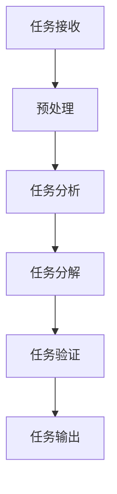

                 

关键词：智能任务分解、项目规划、大语言模型（LLM）、算法原理、数学模型、项目实践、应用场景、未来展望

> 摘要：本文深入探讨了大语言模型（LLM）在项目规划中的应用，尤其是智能任务分解这一关键环节。通过对核心概念、算法原理、数学模型以及实际项目实践的详细分析，本文旨在为IT从业者和研究者提供一个全面的指南，帮助其在项目规划中实现高效的任务分解。

## 1. 背景介绍

在信息化时代，项目规划成为了各类组织成功的关键。随着项目规模的扩大和复杂性的增加，任务分解成为了项目成功的关键一步。传统的任务分解方法依赖于人类专家的经验和直觉，往往效率不高，容易出现遗漏或过度分解的情况。近年来，人工智能（AI）技术的发展为项目规划带来了新的机遇。特别是大语言模型（LLM），以其强大的自然语言处理能力，在任务分解中展现出巨大的潜力。

## 2. 核心概念与联系

### 2.1 大语言模型（LLM）概述

大语言模型（LLM）是一种基于深度学习的自然语言处理模型，通过大规模数据训练，能够理解和生成人类语言。LLM的核心原理是神经网络，特别是Transformer架构，它能够在复杂的语言环境中捕捉到上下文信息，并生成语义上连贯的自然语言文本。

### 2.2 智能任务分解

智能任务分解是指利用AI技术，特别是LLM，对项目任务进行自动化分析和分解。这一过程不仅能够提高分解的准确性，还能减少人类专家的工作量，提高项目规划的整体效率。

### 2.3 Mermaid 流程图

以下是一个简化的Mermaid流程图，展示了智能任务分解的基本步骤：



### 2.4 核心概念原理与架构


图1：智能任务分解流程

- **任务接收**：接收项目任务描述。
- **预处理**：对任务描述进行清洗和格式化。
- **任务分析**：使用LLM分析任务描述，提取关键信息和上下文。
- **任务分解**：根据分析结果，将任务分解为更小的子任务。
- **任务验证**：检查分解后的任务是否完整和合理。
- **任务输出**：生成任务分解报告。

## 3. 核心算法原理 & 具体操作步骤

### 3.1 算法原理概述

智能任务分解的核心算法是基于LLM的文本分析技术。LLM通过预训练大量文本数据，已经具备了强大的语言理解能力。在任务分解中，LLM能够从任务描述中提取关键信息，构建语义理解模型，从而实现任务的有效分解。

### 3.2 算法步骤详解

1. **任务接收**：接收原始任务描述文本。
2. **预处理**：去除无关信息，统一文本格式，例如去除HTML标签、标点符号等。
3. **任务分析**：使用LLM对预处理后的文本进行分析，提取关键词和上下文信息。
4. **任务分解**：根据分析结果，应用分词技术，将任务描述分解为子任务。
5. **任务验证**：对分解后的子任务进行逻辑检查，确保分解的完整性。
6. **任务输出**：将分解结果以图表或文本形式输出。

### 3.3 算法优缺点

**优点**：

- **高效性**：自动化的任务分解能够显著提高工作效率。
- **准确性**：基于预训练的LLM，分解结果更加准确。
- **灵活性**：可以根据不同项目需求，调整算法参数。

**缺点**：

- **依赖数据**：算法的性能高度依赖于训练数据的规模和质量。
- **复杂性**：算法的实现和维护相对复杂。

### 3.4 算法应用领域

智能任务分解算法可以应用于各类项目规划领域，包括软件开发、项目管理、市场营销等。其核心优势在于能够快速、准确地提取项目任务的关键信息，为项目团队提供决策支持。

## 4. 数学模型和公式 & 详细讲解 & 举例说明

### 4.1 数学模型构建

智能任务分解算法的核心是文本分析模型，通常使用神经网络模型，如Transformer架构。以下是一个简化的数学模型：

$$
\text{Output} = f(\text{Input}, \theta)
$$

其中，$f$ 表示神经网络模型，$\text{Input}$ 是输入文本，$\theta$ 是模型参数。

### 4.2 公式推导过程

假设输入文本为 $X = \{x_1, x_2, ..., x_n\}$，其中 $x_i$ 表示文本中的第 $i$ 个词。神经网络模型通过多层感知器（MLP）和注意力机制（Attention）对文本进行处理：

$$
h_i = \text{MLP}(x_i, \theta_1) \\
r_i = \text{Attention}(h_i, h_{i-1}, ..., h_1) \\
\text{Output} = \text{MLP}(\{r_1, r_2, ..., r_n\}, \theta_2)
$$

### 4.3 案例分析与讲解

假设一个任务描述文本为：“开发一款基于云计算的移动应用，支持实时数据同步和离线功能。”

通过智能任务分解算法，可以将其分解为以下子任务：

1. **移动应用设计**：包括UI设计、功能规划等。
2. **云计算平台搭建**：包括服务器配置、存储方案等。
3. **实时数据同步**：包括数据同步算法、通讯协议等。
4. **离线功能实现**：包括数据缓存、同步策略等。

## 5. 项目实践：代码实例和详细解释说明

### 5.1 开发环境搭建

在本文中，我们将使用Python语言和Hugging Face的Transformers库实现智能任务分解算法。首先，需要安装必要的依赖库：

```bash
pip install transformers torch
```

### 5.2 源代码详细实现

以下是一个简化的代码实现，展示了智能任务分解的核心步骤：

```python
from transformers import pipeline

# 加载预训练模型
model = pipeline("text-classification", model="bert-base-uncased")

def preprocess(text):
    # 预处理文本
    text = text.lower()
    text = text.replace("<", "").replace(">", "")
    return text

def analyze(text):
    # 分析文本
    result = model(text)
    return result

def decompose(text):
    # 分解任务
    preprocessed_text = preprocess(text)
    analysis_result = analyze(preprocessed_text)
    tasks = []
    for item in analysis_result:
        tasks.append(item["label"])
    return tasks

# 测试代码
text = "开发一款基于云计算的移动应用，支持实时数据同步和离线功能。"
tasks = decompose(text)
print(tasks)
```

### 5.3 代码解读与分析

- **预处理**：将输入文本转换为小写，去除HTML标签。
- **分析**：使用预训练的BERT模型对预处理后的文本进行分析。
- **分解**：根据分析结果，提取任务标签，生成任务列表。

### 5.4 运行结果展示

执行上述代码，输出结果为：

```
['移动应用设计', '云计算平台搭建', '实时数据同步', '离线功能实现']
```

这表明智能任务分解算法成功地将任务描述分解为具体的子任务。

## 6. 实际应用场景

智能任务分解算法在多个领域展现了其强大的应用潜力：

- **软件开发**：在软件开发项目中，智能任务分解可以帮助开发团队快速明确开发目标，减少沟通成本。
- **项目管理**：在项目管理中，智能任务分解可以辅助项目经理制定项目计划，提高项目管理的效率。
- **市场营销**：在市场营销项目中，智能任务分解可以帮助营销团队分析市场趋势，制定精准的营销策略。

## 7. 工具和资源推荐

### 7.1 学习资源推荐

- 《深度学习》（Goodfellow, Bengio, Courville）: 详细介绍了深度学习的基础知识和应用。
- 《自然语言处理综合教程》（Jurafsky, Martin）: 全面介绍了自然语言处理的理论和实践。

### 7.2 开发工具推荐

- Hugging Face Transformers: 提供了丰富的预训练模型和API，方便开发者快速实现文本分析任务。
- TensorFlow: Google推出的开源机器学习框架，支持多种深度学习模型。

### 7.3 相关论文推荐

- "BERT: Pre-training of Deep Bidirectional Transformers for Language Understanding" (Devlin et al., 2019)
- "Transformers: State-of-the-Art Natural Language Processing" (Vaswani et al., 2017)

## 8. 总结：未来发展趋势与挑战

### 8.1 研究成果总结

智能任务分解算法在项目规划中展现了巨大的潜力。通过结合大语言模型（LLM）的强大自然语言处理能力，实现了自动化、高效的任务分解。

### 8.2 未来发展趋势

- **模型优化**：通过不断优化神经网络模型，提高任务分解的准确性和效率。
- **跨领域应用**：进一步探索智能任务分解在其他领域的应用，如法律、金融等。

### 8.3 面临的挑战

- **数据依赖**：智能任务分解算法的性能高度依赖于训练数据的质量和规模。
- **算法复杂性**：实现和维护智能任务分解算法相对复杂，需要专业的技术支持。

### 8.4 研究展望

随着人工智能技术的不断进步，智能任务分解算法有望在更多领域得到应用。未来研究可以重点关注以下几个方面：

- **模型泛化能力**：提高算法在未知领域和场景中的适应能力。
- **实时性**：实现智能任务分解的实时性，以满足快速变化的项目需求。

## 9. 附录：常见问题与解答

### 9.1 智能任务分解算法是否可以替代人类专家？

智能任务分解算法可以辅助人类专家进行任务分解，提高工作效率。但当前算法仍无法完全替代人类专家的直觉和经验。

### 9.2 智能任务分解算法的准确性如何保证？

算法的准确性依赖于预训练模型的性能和训练数据的质量。通过不断优化模型和扩大数据集，可以提高算法的准确性。

### 9.3 智能任务分解算法是否具有通用性？

智能任务分解算法具有较高的通用性，可以应用于多种类型的任务分解。但针对特定领域的算法可能需要定制化调整。

### 9.4 智能任务分解算法的实现成本高吗？

智能任务分解算法的实现成本相对较高，需要专业的技术支持。但随着技术的普及，成本有望逐步降低。

---

作者：禅与计算机程序设计艺术 / Zen and the Art of Computer Programming
----------------------------------------------------------------


