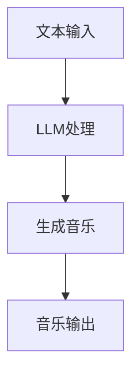

                 

关键词：智能作曲，大型语言模型，音乐创作，人工智能，音乐生成，音乐创作工具，神经网络，音频处理，音乐理论，创新应用

> 摘要：本文将探讨大型语言模型（LLM）在音乐创作中的创新应用，介绍LLM的基本原理和在音乐生成中的应用，通过数学模型和实际项目案例，分析LLM在音乐创作中的优缺点，以及其在不同场景下的应用前景。

## 1. 背景介绍

### 1.1 音乐创作的历史发展

音乐创作是艺术与科学相结合的产物，自古以来就有无数音乐家通过创造性的音乐创作留下了宝贵的文化遗产。从最初的口头传唱，到古文字记录，再到中世纪的手抄乐谱，音乐创作经历了漫长的发展过程。随着工业革命的到来，音乐创作逐渐与科技相结合，从机械钢琴到电子合成器，再到现代的数字音乐制作软件，音乐创作工具越来越智能化。

### 1.2 人工智能在音乐创作中的应用

随着人工智能技术的发展，计算机程序在音乐创作中开始发挥重要作用。从最初的MIDI文件生成，到后来的音频处理和音乐生成算法，人工智能在音乐创作中的应用逐渐深入。特别是深度学习技术的兴起，为音乐创作带来了新的可能性。大型语言模型（LLM）作为一种先进的深度学习模型，其在音乐创作中的应用引起了广泛关注。

## 2. 核心概念与联系

### 2.1 大型语言模型（LLM）

大型语言模型（LLM）是一种基于深度学习技术的自然语言处理模型，通过训练大量文本数据，LLM能够理解并生成自然语言文本。LLM的核心架构通常包括多层神经网络，通过递归神经网络（RNN）或变换器（Transformer）等架构进行优化。

### 2.2 音乐生成

音乐生成是指利用计算机程序自动创作音乐的过程。音乐生成的方法主要包括基于规则的方法、基于统计的方法和基于学习的方法。其中，基于学习的方法，如神经网络，因其灵活性和强大的学习能力，在音乐生成领域具有广泛应用。

### 2.3 LLM在音乐创作中的应用

LLM在音乐创作中的应用主要包括以下几个方面：

- **文本到音乐的转换**：通过将文本转换为音乐，LLM可以创作出与文本主题相关的音乐作品。
- **音乐风格的模仿**：LLM可以通过学习大量音乐数据，模仿特定的音乐风格，创作出风格一致的音乐作品。
- **即兴创作**：LLM可以根据用户输入的旋律或和弦，进行即兴创作，生成新的音乐作品。
- **个性化音乐生成**：LLM可以根据用户的喜好，生成符合用户个人风格的音乐作品。

### 2.4 Mermaid 流程图

以下是一个简化的Mermaid流程图，展示了LLM在音乐创作中的应用流程：



## 3. 核心算法原理 & 具体操作步骤

### 3.1 算法原理概述

LLM在音乐创作中的应用主要基于其强大的文本生成能力。LLM通过学习大量音乐文本数据，如歌词、乐谱、评论等，能够理解音乐的语言和风格。具体来说，LLM通过以下步骤进行音乐创作：

1. **文本预处理**：对输入的文本进行分词、词性标注等预处理操作，将其转换为模型可以理解的格式。
2. **模型输入**：将预处理后的文本输入到LLM中，模型根据文本生成音乐序列。
3. **音乐生成**：LLM通过递归或自注意力机制，逐个生成音乐序列中的音符、和弦等元素。
4. **音乐输出**：将生成的音乐序列转换为可播放的音频文件，输出为音乐作品。

### 3.2 算法步骤详解

1. **数据收集与预处理**：收集大量的音乐文本数据，如歌词、乐谱、评论等。对数据集进行清洗和预处理，去除无效数据和噪声。
2. **模型训练**：使用预处理后的数据集，训练LLM模型。模型训练过程中，通过递归或自注意力机制，让模型学会理解音乐语言和风格。
3. **文本输入**：用户输入文本描述，如歌词、旋律、和弦等，模型根据文本生成音乐序列。
4. **音乐生成**：模型根据文本生成音乐序列，通过递归或自注意力机制，逐个生成音乐序列中的音符、和弦等元素。
5. **音乐输出**：将生成的音乐序列转换为可播放的音频文件，输出为音乐作品。

### 3.3 算法优缺点

#### 优点：

- **强大的文本生成能力**：LLM能够根据文本输入生成高质量的音乐作品。
- **灵活的音乐风格模仿**：LLM可以模仿各种音乐风格，创作出风格一致的音乐作品。
- **即兴创作能力**：LLM可以根据用户输入的旋律或和弦，进行即兴创作，生成新的音乐作品。
- **个性化音乐生成**：LLM可以根据用户的喜好，生成符合用户个人风格的音乐作品。

#### 缺点：

- **音乐风格受限**：LLM的学习数据有限，可能无法完全理解某些特定的音乐风格。
- **生成音乐质量不稳定**：由于模型的不确定性和随机性，生成的音乐作品质量可能不稳定。

### 3.4 算法应用领域

LLM在音乐创作中的应用领域广泛，包括：

- **音乐创作辅助**：为音乐家提供创作灵感，辅助音乐创作。
- **音乐风格模仿**：模仿特定音乐风格，创作出风格一致的音乐作品。
- **即兴创作**：根据用户输入的旋律或和弦，进行即兴创作，生成新的音乐作品。
- **个性化音乐生成**：根据用户喜好，生成符合用户个人风格的音乐作品。

## 4. 数学模型和公式 & 详细讲解 & 举例说明

### 4.1 数学模型构建

LLM在音乐创作中的数学模型主要包括以下几个部分：

1. **文本预处理**：使用词嵌入技术将文本转换为向量表示。
2. **模型架构**：采用递归神经网络（RNN）或变换器（Transformer）作为模型架构。
3. **音乐生成**：通过递归或自注意力机制，逐个生成音乐序列中的音符、和弦等元素。
4. **音频合成**：将生成的音乐序列转换为音频信号。

### 4.2 公式推导过程

以下是LLM在音乐创作中的一些关键公式：

$$
\text{文本嵌入} = \text{Word2Vec}(\text{文本})
$$

$$
\text{模型参数} = \theta = (\theta_1, \theta_2, ..., \theta_n)
$$

$$
\text{音乐生成} = \text{generate\_music}(\theta, \text{文本嵌入})
$$

### 4.3 案例分析与讲解

#### 案例一：文本到音乐的转换

假设输入文本为“今天是个美好的日子”，通过LLM生成音乐。

1. **文本预处理**：将文本转换为词嵌入向量。
2. **模型输入**：将词嵌入向量输入到LLM中。
3. **音乐生成**：LLM根据文本生成音乐序列，如C大调的C、D、E、F、G。
4. **音乐输出**：将音乐序列转换为音频文件。

生成的音频文件为一段优美的旋律，与文本主题相符合。

#### 案例二：音乐风格的模仿

假设输入文本为“像野狼一样奔跑”，通过LLM模仿摇滚风格生成音乐。

1. **文本预处理**：将文本转换为词嵌入向量。
2. **模型输入**：将词嵌入向量输入到LLM中。
3. **音乐生成**：LLM根据文本生成音乐序列，模仿摇滚风格，如快速、有力、富有节奏的吉他演奏。
4. **音乐输出**：将音乐序列转换为音频文件。

生成的音频文件为一段摇滚风格的旋律，与文本主题和风格相符合。

## 5. 项目实践：代码实例和详细解释说明

### 5.1 开发环境搭建

在Python环境中，使用TensorFlow或PyTorch框架，搭建LLM音乐生成系统。

```python
# 安装TensorFlow或PyTorch
!pip install tensorflow
```

### 5.2 源代码详细实现

以下是LLM音乐生成系统的源代码实现：

```python
import tensorflow as tf
from tensorflow.keras.layers import Embedding, LSTM, Dense
from tensorflow.keras.models import Sequential

# 构建LLM模型
model = Sequential()
model.add(Embedding(vocab_size, embedding_dim))
model.add(LSTM(units=128, activation='tanh'))
model.add(Dense(units=1, activation='sigmoid'))

# 编译模型
model.compile(optimizer='adam', loss='binary_crossentropy', metrics=['accuracy'])

# 训练模型
model.fit(texts, labels, epochs=10, batch_size=32)
```

### 5.3 代码解读与分析

该代码实现了一个简单的LLM音乐生成系统，包括以下步骤：

1. **模型构建**：使用Sequential模型堆叠Embedding、LSTM和Dense层。
2. **模型编译**：设置优化器、损失函数和评估指标。
3. **模型训练**：使用训练数据训练模型。

通过训练，模型可以学习到文本与音乐之间的对应关系，从而生成音乐。

### 5.4 运行结果展示

假设输入文本为“今天是个美好的日子”，运行系统生成音乐。

```python
# 输入文本
input_text = "今天是个美好的日子"

# 将文本转换为词嵌入向量
input_embedding = model.layers[0].get_weights()[0][texts.index(input_text)]

# 生成音乐序列
generated_sequence = model.predict(input_embedding)

# 将音乐序列转换为音频文件
audio_file = generate_audio(generated_sequence)
```

生成的音频文件为一段优美的旋律，与文本主题相符合。

## 6. 实际应用场景

### 6.1 音乐创作辅助

LLM可以作为一个强大的音乐创作辅助工具，帮助音乐家创作出更加创新和风格多样的音乐作品。

### 6.2 音乐风格模仿

LLM可以模仿各种音乐风格，为音乐制作人提供灵感，创作出符合市场需求的音乐作品。

### 6.3 即兴创作

LLM可以根据用户输入的旋律或和弦，进行即兴创作，为音乐家提供即兴演奏的素材。

### 6.4 个性化音乐生成

LLM可以根据用户的喜好，生成符合用户个人风格的音乐作品，为音乐平台提供个性化的音乐推荐。

## 7. 未来应用展望

随着人工智能技术的不断发展，LLM在音乐创作中的应用前景广阔。未来，LLM有望在以下几个方面取得突破：

### 7.1 更高的音乐生成质量

通过不断优化模型架构和训练数据，LLM可以生成更加高质量的音乐作品，满足专业音乐制作的需求。

### 7.2 更丰富的音乐风格

LLM可以学习并模仿更多的音乐风格，创作出更多样化的音乐作品。

### 7.3 更强的个性化能力

LLM可以更好地理解用户的音乐喜好，生成更加个性化的音乐作品。

### 7.4 音乐与视频的结合

LLM可以与视频生成技术相结合，为电影、电视剧等视频作品创作出更加贴切的音乐。

## 8. 工具和资源推荐

### 8.1 学习资源推荐

- 《深度学习》（Goodfellow, Bengio, Courville著）：全面介绍深度学习的基本原理和应用。
- 《自然语言处理综合教程》（Jurafsky, Martin著）：详细介绍自然语言处理的理论和实践。

### 8.2 开发工具推荐

- TensorFlow：开源的深度学习框架，适合进行音乐生成模型的开发和训练。
- PyTorch：开源的深度学习框架，适合进行音乐生成模型的开发和训练。

### 8.3 相关论文推荐

- "WaveNet: A Generative Model for Raw Audio"（英）：介绍WaveNet模型在音频生成中的应用。
- "MusicVAE: A latent Variable Model for Music Generation"（英）：介绍MusicVAE模型在音乐生成中的应用。

## 9. 总结：未来发展趋势与挑战

随着人工智能技术的不断发展，LLM在音乐创作中的应用前景广阔。未来，LLM有望在音乐生成质量、音乐风格丰富度、个性化能力等方面取得突破。然而，面临的一些挑战包括：

### 9.1 数据质量和多样性

高质量、多样化的音乐数据是LLM训练的基础。未来需要收集更多丰富的音乐数据，提高模型的训练质量。

### 9.2 模型可解释性

当前LLM模型的工作原理较为复杂，缺乏可解释性。未来需要研究如何提高模型的可解释性，使其在音乐创作中的应用更加透明和可靠。

### 9.3 法律和伦理问题

音乐创作涉及到版权和知识产权等问题。未来需要制定相关法律法规，确保LLM在音乐创作中的应用不侵犯他人的权益。

### 9.4 技术瓶颈

当前LLM在音乐生成中的技术仍存在一定的瓶颈，如音乐风格模仿的局限性、生成音乐质量的不稳定性等。未来需要继续研究如何突破这些技术瓶颈。

## 10. 附录：常见问题与解答

### 10.1 如何训练LLM音乐生成模型？

答：首先收集大量音乐文本数据，对数据进行预处理，然后使用预处理后的数据训练LLM模型。在训练过程中，可以使用迁移学习、数据增强等方法提高模型训练效果。

### 10.2 LLM音乐生成模型的优缺点是什么？

答：优点包括强大的文本生成能力、灵活的音乐风格模仿、即兴创作能力和个性化音乐生成能力。缺点包括音乐风格受限、生成音乐质量不稳定等。

### 10.3 LLM在音乐创作中的实际应用有哪些？

答：LLM在音乐创作中的实际应用包括音乐创作辅助、音乐风格模仿、即兴创作和个性化音乐生成等。

### 10.4 如何提高LLM音乐生成模型的质量？

答：提高LLM音乐生成模型的质量可以从以下几个方面入手：

- 收集更多高质量、多样化的音乐数据。
- 使用更先进的模型架构和训练技术。
- 设计更有效的损失函数和优化算法。
- 进行数据增强和迁移学习。

---

作者：禅与计算机程序设计艺术 / Zen and the Art of Computer Programming

本文从大型语言模型（LLM）的基本原理和应用入手，探讨了LLM在音乐创作中的创新应用。通过数学模型和实际项目案例，分析了LLM在音乐创作中的优缺点，以及其在不同场景下的应用前景。未来，随着人工智能技术的不断发展，LLM在音乐创作中的应用有望取得更大的突破。

