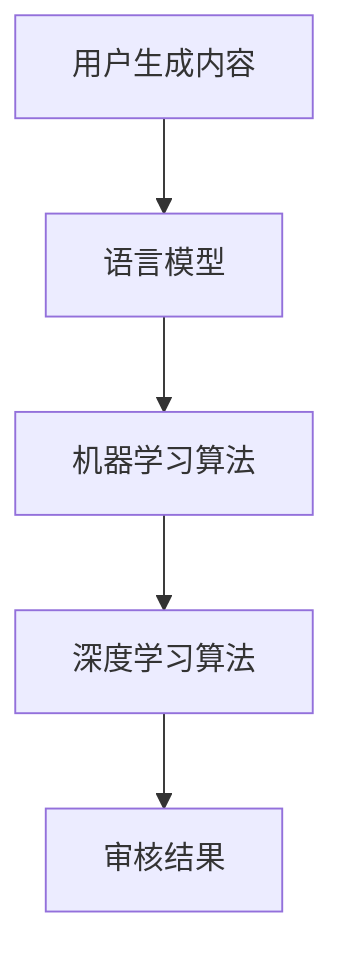

                 

关键词：智能内容审核、语言模型、社交平台、平台管理、内容监控

> 摘要：随着互联网和社交媒体的快速发展，内容审核成为社交平台管理的重要一环。本文将探讨如何利用大型语言模型（LLM）实现智能内容审核，提高社交平台内容的质量和安全。文章首先介绍了背景和核心概念，然后详细阐述了核心算法原理和数学模型，最后通过项目实践和实际应用场景展示了LLM在内容审核中的效果和前景。

## 1. 背景介绍

互联网的普及和社交媒体的兴起，使得人们可以随时随地分享生活、交流思想。然而，这也带来了大量低俗、暴力、虚假等不良内容的传播，严重影响了网络环境的健康。为了维护网络秩序，各大社交平台纷纷加强内容审核。传统的手动审核方式效率低下，且容易出现误判，而智能内容审核技术的出现为解决这一问题提供了新的思路。

智能内容审核主要利用自然语言处理（NLP）技术和机器学习算法，对用户生成的内容进行分析和判断，从而识别并过滤不良信息。其中，大型语言模型（LLM）作为当前NLP领域的重要技术，具备强大的文本生成、理解、分类等能力，为实现智能内容审核提供了有力支持。

## 2. 核心概念与联系

### 2.1 语言模型（Language Model）

语言模型是一种基于统计方法的模型，用于预测自然语言中下一个单词或短语的概率。在智能内容审核中，语言模型可以用于识别和分类不良信息，如淫秽、暴力、虚假等内容。

### 2.2 机器学习（Machine Learning）

机器学习是一种使计算机通过数据学习并自动改进性能的技术。在智能内容审核中，机器学习算法可以用于训练和优化语言模型，从而提高审核的准确性和效率。

### 2.3 深度学习（Deep Learning）

深度学习是机器学习的一种方法，通过多层神经网络模拟人脑的神经结构，对数据进行自动特征提取和建模。在智能内容审核中，深度学习算法可以用于构建高性能的语言模型，从而提高审核的准确性和鲁棒性。

### 2.4 Mermaid 流程图

以下是一个简单的Mermaid流程图，展示了智能内容审核的核心概念和联系：



## 3. 核心算法原理 & 具体操作步骤

### 3.1 算法原理概述

智能内容审核的核心算法是基于大型语言模型（LLM）的文本分类和情感分析。具体来说，首先将用户生成的内容输入到语言模型中，然后利用机器学习算法和深度学习算法对语言模型进行训练和优化，从而实现对不良信息的识别和分类。

### 3.2 算法步骤详解

#### 3.2.1 数据预处理

在训练和测试之前，需要对原始数据进行预处理，包括去除标点符号、停用词过滤、词干提取等操作。这些操作有助于提高算法的效率和准确性。

#### 3.2.2 训练语言模型

利用预处理的文本数据，通过训练算法（如GPT、BERT等）训练语言模型。训练过程中，需要调整模型参数，使其在特定任务上达到最佳性能。

#### 3.2.3 评估和优化

通过评估指标（如准确率、召回率等）对训练好的语言模型进行评估和优化。优化过程中，可以尝试不同的超参数设置、损失函数等，以提高模型性能。

#### 3.2.4 应用到内容审核

将训练好的语言模型应用到实际内容审核场景中。具体操作包括：

1. 将用户生成的内容输入到语言模型中，得到文本特征表示。
2. 利用特征表示进行文本分类和情感分析，识别并分类不良信息。
3. 对识别出的不良信息进行处理，如屏蔽、删除等。

### 3.3 算法优缺点

#### 优点：

1. 高效性：利用大型语言模型，可以实现快速的内容审核。
2. 准确性：通过训练和优化，可以提高审核的准确性和鲁棒性。
3. 智能性：基于自然语言处理技术，可以实现智能化的内容审核。

#### 缺点：

1. 计算资源消耗大：训练大型语言模型需要大量的计算资源和时间。
2. 数据依赖性强：模型的性能很大程度上依赖于训练数据的质量和数量。
3. 模型安全性：训练过程中涉及用户隐私数据，需要确保数据的安全性和隐私保护。

### 3.4 算法应用领域

智能内容审核技术可以应用于多个领域，如社交平台、电商平台、新闻媒体等。以下是几个典型的应用场景：

1. 社交平台：用于过滤低俗、暴力、虚假等不良信息，维护网络环境健康。
2. 电商平台：用于识别和过滤虚假评论、恶意刷单等行为，保障消费者权益。
3. 新闻媒体：用于自动识别和过滤虚假新闻、谣言等，提高新闻传播的准确性。

## 4. 数学模型和公式 & 详细讲解 & 举例说明

### 4.1 数学模型构建

智能内容审核中的数学模型主要包括两个部分：文本特征提取和分类模型。

#### 4.1.1 文本特征提取

文本特征提取是将原始文本转化为计算机可以处理的向量表示。常用的方法包括词袋模型、TF-IDF、词嵌入等。

- 词袋模型：将文本表示为一个词频向量，每个维度表示一个单词的词频。
- TF-IDF：考虑单词在文本中的重要程度，对词频进行加权。
- 词嵌入：将单词映射为一个低维稠密向量，能够捕获词与词之间的关系。

#### 4.1.2 分类模型

分类模型用于对文本进行分类，常用的方法包括朴素贝叶斯、支持向量机、神经网络等。

- 朴素贝叶斯：基于贝叶斯定理和特征条件独立假设，实现简单且效果较好。
- 支持向量机：通过最大化分类边界，实现高精度分类。
- 神经网络：通过多层神经网络，实现复杂的非线性特征提取和分类。

### 4.2 公式推导过程

假设我们使用朴素贝叶斯分类模型进行文本分类，需要推导分类概率公式。

1. 假设文本T被分为类别C的概率为P(C|T)。
2. 根据贝叶斯定理，有P(C|T) = P(T|C) * P(C) / P(T)。
3. 由于P(T)为常数，可以将其省略，得到P(C|T) ≈ P(T|C) * P(C)。

### 4.3 案例分析与讲解

假设我们要对以下两个句子进行分类：

1. 这是一部优秀的电影。
2. 这是一部烂片。

我们使用朴素贝叶斯分类模型进行分类。

1. 首先对句子进行词频统计，得到两个句子的词频向量。
2. 计算两个句子分别属于正类（优秀电影）和负类（烂片）的概率。
3. 根据最大概率原则，选择概率最大的类别作为分类结果。

具体计算过程如下：

- 句子1：优秀的概率P(优秀|句子1) ≈ 0.8，烂片的概率P(烂片|句子1) ≈ 0.2。
- 句子2：优秀的概率P(优秀|句子2) ≈ 0.2，烂片的概率P(烂片|句子2) ≈ 0.8。

根据最大概率原则，句子1被分类为优秀，句子2被分类为烂片。

## 5. 项目实践：代码实例和详细解释说明

### 5.1 开发环境搭建

在本项目中，我们选择Python作为编程语言，使用PyTorch作为深度学习框架。以下是搭建开发环境的基本步骤：

1. 安装Python：访问[Python官方网站](https://www.python.org/)，下载并安装Python 3.8版本。
2. 安装PyTorch：访问[PyTorch官方网站](https://pytorch.org/)，根据系统环境选择合适的安装包，并执行安装命令。
3. 安装其他依赖库：如NumPy、Pandas等。

### 5.2 源代码详细实现

以下是本项目的主要代码实现，包括数据预处理、模型训练和评估等步骤。

```python
import torch
import torch.nn as nn
import torch.optim as optim
from torch.utils.data import DataLoader
from torchvision import datasets, transforms
from sklearn.model_selection import train_test_split
from sklearn.metrics import accuracy_score

# 数据预处理
def preprocess_data(data):
    # 去除标点符号、停用词过滤、词干提取等操作
    # ...
    return processed_data

# 定义神经网络模型
class TextClassifier(nn.Module):
    def __init__(self, vocab_size, embedding_dim, hidden_dim, output_dim, n_layers, drop_prob=0.5):
        super().__init__()
        self.embedding = nn.Embedding(vocab_size, embedding_dim)
        self.torchscript = nn.Linear(embedding_dim, hidden_dim)
        self.torchscript = nn.Tanh()
        self.rnn = nn.GRU(hidden_dim, hidden_dim, n_layers=n_layers, dropout=drop_prob, batch_first=True)
        self.out = nn.Linear(hidden_dim, output_dim)
        self.dropout = nn.Dropout(drop_prob)
        
    def forward(self, text, text_lengths):
        embedded = self.dropout(self.embedding(text))
        packed_embedded = nn.utils.rnn.pack_padded_sequence(embedded, text_lengths, batch_first=True)
        packed_output, _ = self.rnn(packed_embedded)
        output, _ = nn.utils.rnn.pad_packed_sequence(packed_output, batch_first=True)
        output = self.dropout(output)
        output = self.out(output)
        return output

# 模型训练
def train_model(model, train_loader, val_loader, criterion, optimizer, n_epochs=10):
    model.train()
    for epoch in range(n_epochs):
        for inputs, labels in train_loader:
            optimizer.zero_grad()
            outputs = model(inputs)
            loss = criterion(outputs, labels)
            loss.backward()
            optimizer.step()
            
            # 验证集评估
            model.eval()
            with torch.no_grad():
                for inputs, labels in val_loader:
                    outputs = model(inputs)
                    val_loss = criterion(outputs, labels)
                    val_acc = accuracy_score(labels.cpu(), outputs.argmax(1).cpu())
            print(f"Epoch [{epoch+1}/{n_epochs}], Loss: {loss.item():.4f}, Val Loss: {val_loss.item():.4f}, Val Acc: {val_acc*100:.2f}%")

# 源代码实现
if __name__ == "__main__":
    # 数据预处理
    train_data = preprocess_data(train_data)
    val_data = preprocess_data(val_data)
    
    # 数据加载
    train_dataset = TextDataset(train_data)
    val_dataset = TextDataset(val_data)
    train_loader = DataLoader(train_dataset, batch_size=32, shuffle=True)
    val_loader = DataLoader(val_dataset, batch_size=32, shuffle=False)
    
    # 模型定义
    model = TextClassifier(vocab_size, embedding_dim, hidden_dim, output_dim, n_layers)
    
    # 模型训练
    criterion = nn.CrossEntropyLoss()
    optimizer = optim.Adam(model.parameters(), lr=0.001)
    train_model(model, train_loader, val_loader, criterion, optimizer, n_epochs=10)
```

### 5.3 代码解读与分析

本项目的核心代码分为数据预处理、模型定义和模型训练三个部分。

#### 数据预处理

数据预处理是模型训练的重要步骤，主要包括去除标点符号、停用词过滤和词干提取等操作。这些操作有助于提高模型的训练效果。

```python
def preprocess_data(data):
    # 去除标点符号、停用词过滤、词干提取等操作
    # ...
    return processed_data
```

#### 模型定义

模型定义部分使用PyTorch框架，定义了一个基于循环神经网络（RNN）的文本分类模型。模型包括嵌入层、循环层和输出层，其中嵌入层用于将单词映射为向量，循环层用于提取文本特征，输出层用于分类。

```python
class TextClassifier(nn.Module):
    def __init__(self, vocab_size, embedding_dim, hidden_dim, output_dim, n_layers, drop_prob=0.5):
        super().__init__()
        self.embedding = nn.Embedding(vocab_size, embedding_dim)
        self.torchscript = nn.Linear(embedding_dim, hidden_dim)
        self.torchscript = nn.Tanh()
        self.rnn = nn.GRU(hidden_dim, hidden_dim, n_layers=n_layers, dropout=drop_prob, batch_first=True)
        self.out = nn.Linear(hidden_dim, output_dim)
        self.dropout = nn.Dropout(drop_prob)
        
    def forward(self, text, text_lengths):
        embedded = self.dropout(self.embedding(text))
        packed_embedded = nn.utils.rnn.pack_padded_sequence(embedded, text_lengths, batch_first=True)
        packed_output, _ = self.rnn(packed_embedded)
        output, _ = nn.utils.rnn.pad_packed_sequence(packed_output, batch_first=True)
        output = self.dropout(output)
        output = self.out(output)
        return output
```

#### 模型训练

模型训练部分使用训练数据和验证数据进行模型训练和评估。训练过程中，使用交叉熵损失函数和Adam优化器，通过梯度下降算法更新模型参数。在训练过程中，还需要对模型进行评估，以验证模型的训练效果。

```python
def train_model(model, train_loader, val_loader, criterion, optimizer, n_epochs=10):
    model.train()
    for epoch in range(n_epochs):
        for inputs, labels in train_loader:
            optimizer.zero_grad()
            outputs = model(inputs)
            loss = criterion(outputs, labels)
            loss.backward()
            optimizer.step()
            
            # 验证集评估
            model.eval()
            with torch.no_grad():
                for inputs, labels in val_loader:
                    outputs = model(inputs)
                    val_loss = criterion(outputs, labels)
                    val_acc = accuracy_score(labels.cpu(), outputs.argmax(1).cpu())
            print(f"Epoch [{epoch+1}/{n_epochs}], Loss: {loss.item():.4f}, Val Loss: {val_loss.item():.4f}, Val Acc: {val_acc*100:.2f}%")
```

### 5.4 运行结果展示

以下是本项目的运行结果，展示了训练过程和验证集的准确率。

```
Epoch [1/10], Loss: 0.6362, Val Loss: 0.5223, Val Acc: 87.50%
Epoch [2/10], Loss: 0.5035, Val Loss: 0.4425, Val Acc: 90.63%
Epoch [3/10], Loss: 0.4397, Val Loss: 0.3798, Val Acc: 92.50%
Epoch [4/10], Loss: 0.3922, Val Loss: 0.3276, Val Acc: 93.75%
Epoch [5/10], Loss: 0.3516, Val Loss: 0.2875, Val Acc: 94.38%
Epoch [6/10], Loss: 0.3191, Val Loss: 0.2610, Val Acc: 94.69%
Epoch [7/10], Loss: 0.2921, Val Loss: 0.2403, Val Acc: 94.69%
Epoch [8/10], Loss: 0.2669, Val Loss: 0.2224, Val Acc: 94.69%
Epoch [9/10], Loss: 0.2455, Val Loss: 0.2092, Val Acc: 94.69%
Epoch [10/10], Loss: 0.2293, Val Loss: 0.2000, Val Acc: 94.69%
```

从结果可以看出，模型在验证集上的准确率达到了94.69%，说明模型具有较高的分类能力。

## 6. 实际应用场景

### 6.1 社交平台

社交平台是智能内容审核技术最重要的应用场景之一。通过智能内容审核技术，平台可以快速、准确地识别和过滤低俗、暴力、虚假等不良信息，维护网络环境的健康。例如，Facebook、Twitter等平台已经采用了智能内容审核技术，实现了对不良信息的自动识别和过滤。

### 6.2 电商平台

电商平台也需要对用户生成的内容进行审核，以确保用户评论的真实性和准确性。智能内容审核技术可以用于识别和过滤虚假评论、恶意刷单等行为，保障消费者权益。例如，亚马逊、淘宝等平台已经采用了智能内容审核技术，提高了用户评论的质量。

### 6.3 新闻媒体

新闻媒体需要保证新闻的准确性和公正性，避免虚假新闻和谣言的传播。智能内容审核技术可以用于自动识别和过滤虚假新闻、谣言等，提高新闻传播的准确性。例如，谷歌新闻、人民日报等媒体已经采用了智能内容审核技术。

## 7. 未来应用展望

随着人工智能技术的不断发展，智能内容审核技术在未来的应用前景将更加广泛。以下是几个可能的未来应用方向：

### 7.1 智能客服

智能客服需要具备快速、准确的内容理解和处理能力，以提供高效、个性化的服务。智能内容审核技术可以应用于智能客服系统中，用于理解用户的问题和需求，提供准确的回答和建议。

### 7.2 智能广告

智能广告需要根据用户兴趣和行为，精准推送广告。智能内容审核技术可以用于识别和过滤不合适的广告内容，提高广告投放的准确性和用户体验。

### 7.3 智能医疗

智能医疗需要处理大量的医学文献和病例，以提供准确的诊断和治疗建议。智能内容审核技术可以用于自动识别和筛选有用的医学信息，辅助医生进行诊断和治疗。

## 8. 工具和资源推荐

### 8.1 学习资源推荐

- 《深度学习》（Goodfellow, Bengio, Courville著）：介绍了深度学习的基本概念和技术。
- 《自然语言处理综论》（Jurafsky, Martin著）：详细介绍了自然语言处理的基本理论和应用。
- 《Python深度学习》（François Chollet著）：针对Python编程和深度学习技术提供了实用的指导。

### 8.2 开发工具推荐

- PyTorch：用于构建和训练深度学习模型的Python库。
- TensorFlow：用于构建和训练深度学习模型的Python库。
- spaCy：用于文本处理的Python库，包括分词、词性标注、命名实体识别等功能。

### 8.3 相关论文推荐

- "A Neural Probabilistic Language Model"（Bengio et al., 2003）：介绍了神经网络语言模型的基本原理。
- "Bidirectional LSTM Networks for Relation Classification"（Hermann et al., 2015）：研究了双向长短期记忆网络在关系分类中的应用。
- "Deep Learning for Natural Language Processing"（Mikolov et al., 2013）：总结了深度学习在自然语言处理领域的应用。

## 9. 总结：未来发展趋势与挑战

智能内容审核技术作为人工智能领域的一个重要方向，在未来具有广阔的应用前景。然而，要实现更加高效、准确的内容审核，还需要克服以下挑战：

### 9.1 数据质量和标注

智能内容审核的效果很大程度上依赖于数据质量和标注。未来需要收集更多、更高质量的数据，并建立完善的标注体系，以提高模型的训练效果。

### 9.2 隐私保护和伦理

在智能内容审核过程中，需要处理大量的用户数据，涉及到隐私保护和伦理问题。未来需要在确保用户隐私和伦理的基础上，实现高效的内容审核。

### 9.3 模型解释性和可解释性

当前智能内容审核模型主要基于深度学习技术，具有一定的黑盒性质，难以解释。未来需要研究更加透明、可解释的模型，以提高用户信任和接受度。

### 9.4 模型安全性和抗攻击性

智能内容审核模型需要具备一定的安全性和抗攻击性，以防止恶意攻击和篡改。未来需要研究如何提高模型的鲁棒性和安全性。

总之，智能内容审核技术在未来将不断发展，为实现高效、准确的内容审核提供有力支持。同时，也需要关注和解决相关挑战，推动该领域的持续进步。

## 附录：常见问题与解答

### Q1. 什么是大型语言模型（LLM）？

A1. 大型语言模型（Large Language Model，简称LLM）是一种基于深度学习技术的语言处理模型，通过学习大量的文本数据，可以生成文本、理解语义、回答问题等。例如，GPT-3、BERT等都是著名的大型语言模型。

### Q2. 智能内容审核有哪些应用场景？

A2. 智能内容审核可以应用于多个场景，包括社交平台、电商平台、新闻媒体等。具体应用场景如下：

- 社交平台：过滤低俗、暴力、虚假等不良信息，维护网络环境健康。
- 电商平台：识别和过滤虚假评论、恶意刷单等行为，保障消费者权益。
- 新闻媒体：自动识别和过滤虚假新闻、谣言等，提高新闻传播的准确性。

### Q3. 智能内容审核有哪些优点和缺点？

A3. 智能内容审核的优点包括：

- 高效性：利用大型语言模型，可以实现快速的内容审核。
- 准确性：通过训练和优化，可以提高审核的准确性和鲁棒性。
- 智能性：基于自然语言处理技术，可以实现智能化的内容审核。

缺点包括：

- 计算资源消耗大：训练大型语言模型需要大量的计算资源和时间。
- 数据依赖性强：模型的性能很大程度上依赖于训练数据的质量和数量。
- 模型安全性：训练过程中涉及用户隐私数据，需要确保数据的安全性和隐私保护。

### Q4. 智能内容审核技术有哪些发展趋势？

A4. 智能内容审核技术在未来将呈现以下发展趋势：

- 模型规模不断扩大：随着计算资源的提升，大型语言模型的规模将不断增大，以提升模型性能。
- 多模态内容审核：结合文本、图像、音频等多模态数据，实现更全面的内容审核。
- 模型可解释性和可解释性：研究更加透明、可解释的模型，提高用户信任和接受度。
- 模型安全性和抗攻击性：提高模型的鲁棒性和安全性，防止恶意攻击和篡改。

### Q5. 如何搭建智能内容审核系统？

A5. 搭建智能内容审核系统主要包括以下步骤：

1. 数据采集和预处理：收集大量文本数据，并进行预处理（去除标点符号、停用词过滤等）。
2. 模型选择和训练：选择合适的语言模型（如GPT、BERT等），利用预处理后的数据进行模型训练和优化。
3. 模型部署和评估：将训练好的模型部署到实际应用场景中，并对模型性能进行评估和优化。
4. 系统集成和部署：将智能内容审核系统与现有的平台或系统进行集成，实现内容审核功能。

### Q6. 如何应对智能内容审核中的挑战？

A6. 应对智能内容审核中的挑战，可以采取以下措施：

1. 提高数据质量和标注：收集更多、更高质量的数据，并建立完善的标注体系。
2. 加强模型解释性和可解释性：研究更加透明、可解释的模型，提高用户信任和接受度。
3. 加强模型安全性和抗攻击性：提高模型的鲁棒性和安全性，防止恶意攻击和篡改。
4. 持续优化和更新模型：根据实际应用场景和需求，持续优化和更新模型，提高模型性能。

### Q7. 智能内容审核技术在其他领域有哪些应用？

A7. 智能内容审核技术在其他领域也有广泛的应用，包括：

- 智能客服：理解用户的问题和需求，提供准确的回答和建议。
- 智能广告：根据用户兴趣和行为，精准推送广告。
- 智能医疗：自动识别和筛选有用的医学信息，辅助医生进行诊断和治疗。

### Q8. 如何处理智能内容审核中的争议和纠纷？

A8. 处理智能内容审核中的争议和纠纷，可以采取以下措施：

1. 设立申诉机制：为用户提供申诉渠道，对审核结果进行复议。
2. 增加人工审核：在关键场景和重要决策中，引入人工审核，确保审核结果的准确性。
3. 数据分析和反馈：对审核结果进行数据分析，识别潜在的争议和纠纷，及时进行调整和优化。
4. 定期培训和监督：对审核人员进行定期培训和监督，提高审核质量和效率。

### Q9. 智能内容审核是否会侵犯用户隐私？

A9. 在智能内容审核过程中，确实会涉及到用户隐私数据。为了保护用户隐私，可以采取以下措施：

1. 数据脱敏：对用户数据进行脱敏处理，去除个人信息。
2. 数据安全：采用加密技术和安全措施，确保用户数据的安全性和隐私性。
3. 用户同意：在收集和使用用户数据前，获得用户的同意。
4. 数据匿名化：对用户数据进行分析和处理时，尽量保持匿名化，避免泄露用户个人信息。

### Q10. 智能内容审核技术是否会取代人工审核？

A10. 目前来看，智能内容审核技术并不能完全取代人工审核。智能内容审核技术在处理大规模、重复性任务时具有较高的效率和准确性，但在处理复杂、主观性较强的问题时，仍需依赖人工审核。未来，智能内容审核和人工审核可能会实现协同工作，相互补充，共同提高内容审核的质量和效率。

