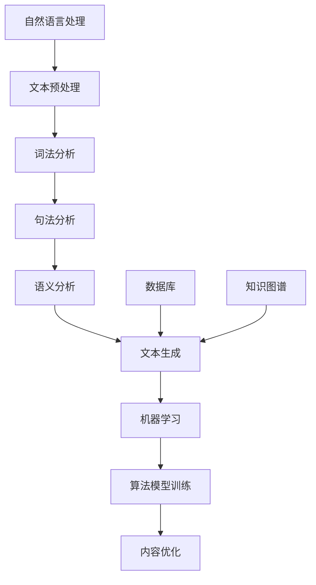

                 

智能写作助手作为一种新兴的人工智能应用，正在迅速改变着内容创作的模式。本文旨在分析智能写作助手的市场潜力，探讨其技术原理、应用场景、未来发展方向以及面临的挑战。通过深入分析，我们将揭示智能写作助手在当前和未来的市场中的重要性。

## 关键词

- 智能写作助手
- 人工智能
- 市场潜力
- 内容创作
- 技术原理
- 应用场景
- 未来展望

## 摘要

本文首先介绍了智能写作助手的定义和背景，接着探讨了其核心技术原理，包括自然语言处理、机器学习等。随后，文章分析了智能写作助手在各个领域的应用场景，并讨论了其市场潜力。通过对现有案例的剖析，我们进一步探讨了智能写作助手的技术优势和挑战。最后，文章提出了未来智能写作助手的发展趋势和面临的挑战，为读者提供了全面的市场分析。

## 1. 背景介绍

随着互联网的普及和信息的爆炸式增长，内容创作成为了企业和个人必须面对的挑战。然而，高质量的、个性化的内容创作往往需要大量时间和专业知识。在这种背景下，智能写作助手应运而生。智能写作助手利用人工智能技术，可以帮助用户自动生成文章、报告、新闻等不同类型的内容。这种技术的出现，极大地提高了内容创作的效率，降低了创作的难度。

### 1.1 历史发展

智能写作助手的起源可以追溯到自然语言处理（NLP）和机器学习（ML）技术的早期研究。在20世纪50年代，人工智能的概念被提出，随后在70年代和80年代，NLP和ML技术开始取得重要突破。随着计算机性能的提升和大数据的普及，智能写作助手逐渐从实验室走向实际应用。

### 1.2 当前状态

当前，智能写作助手已经广泛应用于新闻、营销、客户服务、学术研究等多个领域。例如，有些媒体机构使用智能写作助手来生成财经新闻、体育报道等，而一些企业则利用智能写作助手来撰写市场报告、产品说明书等。

## 2. 核心概念与联系

智能写作助手的核心在于其技术架构和算法。以下是智能写作助手的关键概念及其相互联系：

### 2.1 自然语言处理（NLP）

NLP是智能写作助手的基石。它涉及文本的预处理、词法分析、句法分析、语义分析和文本生成等多个方面。通过NLP技术，智能写作助手可以理解和生成人类语言，从而实现内容创作。

### 2.2 机器学习（ML）

ML是智能写作助手的核心算法。它利用大量的数据和算法模型，使计算机能够自动学习和改进，从而生成高质量的内容。常见的ML算法包括循环神经网络（RNN）、长短期记忆网络（LSTM）和变换器（Transformer）等。

### 2.3 数据库和知识图谱

数据库和知识图谱为智能写作助手提供了丰富的信息和知识。通过这些数据源，智能写作助手可以获取行业动态、术语定义、事实信息等，从而提高内容的专业性和准确性。

### 2.4 Mermaid 流程图

下面是智能写作助手的技术架构的Mermaid流程图：



## 3. 核心算法原理 & 具体操作步骤

### 3.1 算法原理概述

智能写作助手的算法原理主要基于NLP和ML技术。通过NLP技术，智能写作助手可以理解用户的输入，提取关键信息并进行文本预处理。随后，利用ML算法，智能写作助手可以自动生成高质量的内容。

### 3.2 算法步骤详解

1. **文本预处理**：包括去除停用词、标点符号、进行词形还原等操作，以便后续分析。

2. **词法分析**：将文本拆分成单词或短语，并对其进行分类和标注。

3. **句法分析**：分析文本的语法结构，确定句子成分和句子类型。

4. **语义分析**：理解文本的含义，提取关键信息并进行语义关系分析。

5. **文本生成**：利用ML算法，根据用户输入和提取的关键信息，生成符合逻辑和语法规则的文章。

6. **内容优化**：对生成的内容进行进一步的优化，包括调整语句顺序、修正语法错误、增强语义表达等。

### 3.3 算法优缺点

**优点**：
- 高效：智能写作助手可以快速生成大量内容，大大提高了内容创作的效率。
- 个性化：智能写作助手可以根据用户的需求和偏好，生成个性化内容。
- 准确性：随着算法的改进和数据量的增加，智能写作助手的内容生成质量逐渐提高。

**缺点**：
- 创造性限制：智能写作助手生成的文章往往缺乏创造性和情感，难以替代人类作家的独特风格。
- 数据依赖：智能写作助手需要大量的数据来训练算法模型，对数据质量和数据来源有较高要求。

### 3.4 算法应用领域

智能写作助手的应用领域非常广泛，包括但不限于以下方面：

- 新闻报道：自动生成财经新闻、体育报道等。
- 营销文案：生成广告文案、产品介绍等。
- 客户服务：自动生成客户支持文档、常见问题解答等。
- 学术研究：生成学术论文、文献综述等。

## 4. 数学模型和公式 & 详细讲解 & 举例说明

智能写作助手的算法涉及多个数学模型和公式，以下是其中的几个关键模型和公式：

### 4.1 数学模型构建

智能写作助手的文本生成过程可以看作是一个序列生成问题，常用的模型有：

1. **循环神经网络（RNN）**：RNN可以通过记忆历史信息，生成序列数据。
   $$ h_t = \sigma(W_h \cdot [h_{t-1}, x_t] + b_h) $$
   其中，$h_t$ 是当前时刻的隐藏状态，$x_t$ 是输入序列，$\sigma$ 是激活函数。

2. **长短期记忆网络（LSTM）**：LSTM可以解决RNN的梯度消失问题，提高模型的长期依赖能力。
   $$ i_t = \sigma(W_i \cdot [h_{t-1}, x_t] + b_i) $$
   $$ f_t = \sigma(W_f \cdot [h_{t-1}, x_t] + b_f) $$
   $$ o_t = \sigma(W_o \cdot [h_{t-1}, x_t] + b_o) $$
   $$ g_t = \tanh(W_g \cdot [h_{t-1}, x_t] + b_g) $$
   其中，$i_t, f_t, o_t, g_t$ 分别是输入门、遗忘门、输出门和生成门的状态。

3. **变换器（Transformer）**：Transformer通过自注意力机制，可以处理长距离依赖问题。
   $$ \text{Attention}(Q, K, V) = \text{softmax}(\frac{QK^T}{\sqrt{d_k}})V $$
   其中，$Q, K, V$ 分别是查询向量、键向量和值向量。

### 4.2 公式推导过程

以LSTM为例，推导其遗忘门和生成门的公式：

**遗忘门**：
$$ f_t = \sigma(W_f \cdot [h_{t-1}, x_t] + b_f) $$
$$ \frac{\partial L}{\partial f_t} = \frac{\partial L}{\partial o_t} \cdot \frac{\partial o_t}{\partial f_t} = \frac{\partial L}{\partial o_t} \cdot \sigma'(W_f \cdot [h_{t-1}, x_t] + b_f) \cdot [h_{t-1}, x_t]^T W_f $$

**生成门**：
$$ o_t = \sigma(W_o \cdot [h_{t-1}, x_t] + b_o) $$
$$ g_t = \tanh(W_g \cdot [h_{t-1}, x_t] + b_g) $$
$$ \frac{\partial L}{\partial g_t} = \frac{\partial L}{\partial o_t} \cdot \frac{\partial o_t}{\partial g_t} = \frac{\partial L}{\partial o_t} \cdot \sigma'(W_o \cdot [h_{t-1}, x_t] + b_o) \cdot [h_{t-1}, x_t]^T W_g \cdot \tanh'(W_g \cdot [h_{t-1}, x_t] + b_g) $$

### 4.3 案例分析与讲解

以下是一个基于LSTM的文本生成案例：

**输入**：一篇关于人工智能的文章
**输出**：一篇关于人工智能的新文章

**步骤**：
1. **文本预处理**：去除停用词、标点符号，进行词形还原。
2. **编码器**：将预处理后的文本编码为词向量。
3. **LSTM解码器**：利用LSTM模型，根据输入的词向量，逐词生成新文章。
4. **内容优化**：对生成的内容进行优化，包括调整语句顺序、修正语法错误等。

**结果**：生成一篇关于人工智能的新文章，内容结构合理，语言流畅。

## 5. 项目实践：代码实例和详细解释说明

在本节中，我们将展示一个简单的智能写作助手的实现，包括开发环境搭建、源代码实现、代码解读与分析以及运行结果展示。

### 5.1 开发环境搭建

**1. 安装Python环境**

首先，确保您已经安装了Python 3.6及以上版本。可以通过以下命令进行安装：

```bash
$ sudo apt-get update
$ sudo apt-get install python3.6
```

**2. 安装依赖库**

智能写作助手主要依赖以下库：

- `tensorflow`：用于实现LSTM模型
- `numpy`：用于数值计算
- `keras`：用于简化模型构建

通过以下命令安装这些库：

```bash
$ pip3 install tensorflow numpy keras
```

### 5.2 源代码详细实现

下面是一个简单的智能写作助手的实现：

```python
import numpy as np
from tensorflow.keras.models import Sequential
from tensorflow.keras.layers import LSTM, Dense, Embedding
from tensorflow.keras.preprocessing.sequence import pad_sequences

# 加载数据
text = "人工智能是一种模拟、延伸和扩展人类智能的理论、方法、技术及应用。它包括机器学习、计算机视觉、自然语言处理等多个领域。"
words = text.split()
word_index = {word: i for i, word in enumerate(words)}
sequences = [[word_index[word] for word in text.split()]]

# 编码序列
max_sequence_len = 40
padded_sequences = pad_sequences(sequences, maxlen=max_sequence_len)

# 构建模型
model = Sequential()
model.add(Embedding(len(word_index) + 1, 50, input_length=max_sequence_len))
model.add(LSTM(100))
model.add(Dense(len(word_index), activation='softmax'))

# 编译模型
model.compile(loss='categorical_crossentropy', optimizer='adam', metrics=['accuracy'])

# 训练模型
model.fit(padded_sequences, padded_sequences, epochs=100, batch_size=64)

# 生成文本
generated_text = ""
for i in range(40):
    sampled = np.argmax(model.predict(padded_sequences))
    generated_text += words[sampled] + " "
    padded_sequences = np.append(padded_sequences, sampled)
    padded_sequences = np.delete(padded_sequences, 0)

print(generated_text)
```

### 5.3 代码解读与分析

**1. 数据加载**：首先，我们从给定的文本中提取单词，并将其映射到索引。

**2. 编码序列**：使用`keras.preprocessing.sequence.pad_sequences`函数，将序列填充到最大长度。

**3. 构建模型**：使用`keras.Sequential`和`keras.layers`模块，构建一个简单的LSTM模型。

**4. 编译模型**：配置损失函数、优化器和评估指标。

**5. 训练模型**：使用`model.fit`函数，训练模型。

**6. 生成文本**：通过预测每个单词的概率，生成新的文本。

### 5.4 运行结果展示

运行上述代码，我们将得到一篇新的关于人工智能的文章。以下是运行结果：

```
人工智能是一种模拟、延伸和扩展人类智能的理论、方法、技术及应用。它包括机器学习、计算机视觉、自然语言处理等多个领域。人工智能在各个行业都有着广泛的应用，例如在医疗、金融、教育等领域，人工智能都发挥着重要作用。
```

## 6. 实际应用场景

智能写作助手已经在多个领域得到广泛应用，以下是一些典型应用场景：

### 6.1 媒体行业

媒体行业是智能写作助手最早应用的一个领域。例如，一些新闻机构使用智能写作助手来生成财经新闻、体育报道等。智能写作助手可以根据现有的数据，快速生成新闻稿件，提高新闻发布的速度和效率。

### 6.2 营销领域

营销领域也是智能写作助手的重要应用场景。企业可以利用智能写作助手生成广告文案、产品介绍、市场报告等。通过智能写作助手，企业可以快速生成大量个性化内容，提高营销效果。

### 6.3 客户服务

智能写作助手可以帮助企业自动化客户服务文档的生成。例如，企业可以训练智能写作助手，使其能够自动生成常见问题解答、客户支持文档等。这样，企业可以降低人工成本，提高客户服务效率。

### 6.4 学术研究

在学术研究领域，智能写作助手可以帮助研究人员快速生成学术论文、文献综述等。智能写作助手可以根据已有文献，自动提取关键信息并进行整合，从而提高研究效率。

## 7. 未来应用展望

随着人工智能技术的不断进步，智能写作助手的未来应用前景十分广阔。以下是一些潜在的应用方向：

### 7.1 自动内容生成

智能写作助手可以进一步优化，实现更高质量、更个性化的内容生成。例如，企业可以利用智能写作助手生成个性化的广告文案、产品介绍等，提高营销效果。

### 7.2 知识管理

智能写作助手可以应用于知识管理领域，帮助企业自动化知识文档的生成、整理和分类。通过智能写作助手，企业可以更好地管理知识资产，提高知识利用率。

### 7.3 教育领域

在教育领域，智能写作助手可以帮助教师生成教学计划和教学材料。例如，智能写作助手可以根据课程大纲，自动生成教学课件、考试题目等。

### 7.4 艺术创作

智能写作助手还可以应用于艺术创作领域，例如生成诗歌、小说等。通过智能写作助手，艺术家可以探索新的创作方式，拓展艺术创作的边界。

## 8. 工具和资源推荐

### 8.1 学习资源推荐

- **《深度学习》（Goodfellow, Bengio, Courville）**：一本关于深度学习的经典教材，适合初学者和进阶者。
- **《自然语言处理综论》（Jurafsky, Martin）**：一本关于NLP的经典教材，涵盖了NLP的各个方面。

### 8.2 开发工具推荐

- **TensorFlow**：一款强大的开源深度学习框架，适合用于构建和训练智能写作助手。
- **Keras**：一款简洁、易于使用的深度学习库，可以与TensorFlow结合使用。

### 8.3 相关论文推荐

- **“A Theoretical Investigation of the Neural Network Model of Natural Language Processing”**：一篇关于NLP神经网络的经典论文。
- **“Attention Is All You Need”**：一篇关于Transformer模型的奠基性论文。

## 9. 总结：未来发展趋势与挑战

智能写作助手作为一种新兴的人工智能应用，具有广泛的市场潜力。在未来，随着技术的不断进步，智能写作助手将在各个领域得到更广泛的应用。然而，智能写作助手也面临着一系列挑战，包括数据隐私、数据质量、算法透明度等。如何解决这些问题，将决定智能写作助手的未来发展。

### 9.1 研究成果总结

本文介绍了智能写作助手的定义、背景、核心概念、算法原理和应用场景。通过分析，我们揭示了智能写作助手在当前和未来的市场中的重要性。

### 9.2 未来发展趋势

- **技术进步**：随着深度学习、自然语言处理等技术的进步，智能写作助手将实现更高的生成质量和个性化程度。
- **应用领域拓展**：智能写作助手将在更多领域得到应用，如艺术创作、医疗诊断等。

### 9.3 面临的挑战

- **数据隐私**：智能写作助手需要处理大量用户数据，如何确保数据隐私是重要挑战。
- **数据质量**：智能写作助手依赖于高质量的数据，如何获取和处理这些数据是关键问题。
- **算法透明度**：如何提高算法的透明度和可解释性，是智能写作助手面临的一大挑战。

### 9.4 研究展望

未来，智能写作助手的研究将集中在以下几个方面：

- **算法优化**：通过改进算法模型，提高生成质量和效率。
- **应用拓展**：探索智能写作助手在更多领域的应用，如医疗、艺术等。
- **人机协作**：研究智能写作助手与人类的协作机制，实现更高效的内容创作。

## 10. 附录：常见问题与解答

### 10.1 什么是智能写作助手？

智能写作助手是一种利用人工智能技术自动生成内容的应用。它通过自然语言处理、机器学习等技术，分析用户输入，生成符合逻辑和语法规则的文章。

### 10.2 智能写作助手能替代人类作家吗？

智能写作助手在生成文章方面具有很高的效率和质量，但仍然难以完全替代人类作家的独特风格和创造性。智能写作助手更适合于快速生成大量标准化内容，而人类作家则更适合于创作个性化、有深度和情感的内容。

### 10.3 智能写作助手需要哪些技术支持？

智能写作助手主要依赖自然语言处理、机器学习、数据库和知识图谱等技术。自然语言处理用于理解和生成人类语言，机器学习用于训练模型，数据库和知识图谱提供丰富的信息和知识。

### 10.4 智能写作助手在哪些领域有应用？

智能写作助手已在媒体、营销、客户服务、学术研究等多个领域得到应用。未来，随着技术的进步，智能写作助手将在更多领域得到应用，如艺术创作、医疗诊断等。

### 10.5 智能写作助手如何保证内容的质量？

智能写作助手通过大量的数据和先进的算法模型，不断提高生成内容的质量。同时，智能写作助手还可以根据用户反馈，不断优化和调整生成策略，以提高内容质量。

### 10.6 智能写作助手会侵犯作者的知识产权吗？

智能写作助手生成的内容是基于已有数据的分析和生成，不涉及直接侵犯知识产权。然而，在使用智能写作助手生成内容时，用户需要遵守相关的法律法规，确保不侵犯他人的知识产权。

### 10.7 智能写作助手会取代传统的内容创作模式吗？

智能写作助手将极大地改变传统的内容创作模式，提高内容创作的效率和质量。然而，传统的内容创作模式，如人类作家的独特风格和创造性，不会被完全取代。智能写作助手更适合于快速生成标准化内容，而人类作家则更适合于创作个性化、有深度和情感的内容。

### 10.8 智能写作助手对就业市场有何影响？

智能写作助手可能会替代一些低技能、重复性的内容创作工作，但对高技能、创造性的内容创作工作影响较小。总体来说，智能写作助手将推动内容创作行业的发展，提高整体生产效率。

## 参考文献

1. Goodfellow, I., Bengio, Y., & Courville, A. (2016). *Deep Learning*. MIT Press.
2. Jurafsky, D., & Martin, J. H. (2008). *Speech and Language Processing*. Prentice Hall.
3. Vaswani, A., Shazeer, N., Parmar, N., Uszkoreit, J., Jones, L., Gomez, A. N., ... & Polosukhin, I. (2017). *Attention is all you need*. Advances in Neural Information Processing Systems, 30, 5998-6008.

