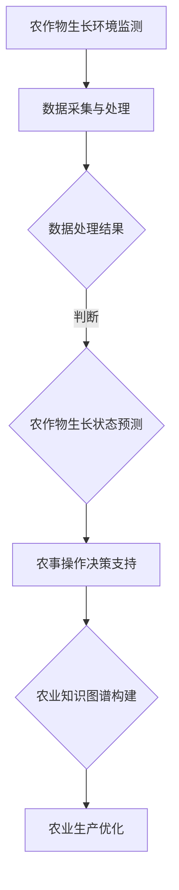

                 

关键词：智能农业、LLM、精准农业、农作物管理、人工智能技术、机器学习

摘要：随着全球人口的增长和气候变化的影响，提高农作物产量和降低农业生产成本成为农业生产中的重要问题。本文主要探讨了一种基于大型语言模型（LLM）的智能农作物管理方法，介绍了LLM在精准农业中的角色和优势，并通过实际案例展示了LLM在农作物管理中的应用，为农业生产提供了新的思路和方向。

## 1. 背景介绍

### 智能农业的概念和意义

智能农业是指通过运用物联网、大数据、人工智能等技术，实现农业生产的自动化、智能化、精准化。与传统农业相比，智能农业具有显著的优势，包括提高农作物产量、降低农业生产成本、减少环境污染、提高农业资源利用效率等。

智能农业的意义在于：

1. 提高农作物产量：通过精准施肥、灌溉、病虫害防治等技术，提高农作物产量。
2. 降低农业生产成本：通过自动化设备、智能监控等技术，降低农业生产成本。
3. 减少环境污染：通过合理施肥、灌溉、病虫害防治等技术，减少农业生产过程中的环境污染。
4. 提高农业资源利用效率：通过大数据分析、人工智能技术等，优化农业生产过程，提高农业资源利用效率。

### 精准农业的概念和优势

精准农业是一种以信息管理为核心的农业生产方式，通过实时监测农作物生长环境和生长状态，为农业生产提供精确的数据支持，从而实现精准施肥、灌溉、病虫害防治等。

精准农业的优势包括：

1. 提高农作物产量：通过精准施肥、灌溉等，提高农作物产量。
2. 降低农业生产成本：通过减少化肥、农药的过量使用，降低农业生产成本。
3. 减少环境污染：通过合理施肥、灌溉等，减少农业生产过程中的环境污染。
4. 提高农业资源利用效率：通过精准的数据支持，优化农业生产过程，提高农业资源利用效率。

## 2. 核心概念与联系

### 大型语言模型（LLM）的概念和原理

大型语言模型（LLM）是一种基于深度学习技术的自然语言处理模型，通过对大量文本数据进行训练，能够理解和生成自然语言。LLM具有强大的语义理解和生成能力，可以应用于自然语言理解、机器翻译、文本生成等领域。

### LLM在智能农作物管理中的应用

LLM在智能农作物管理中的应用主要包括以下几个方面：

1. 农作物生长环境监测：通过LLM对农作物生长环境的数据进行语义理解和分析，为农业生产提供精准的数据支持。
2. 农作物生长状态预测：通过LLM对农作物生长状态的数据进行预测，为农业生产提供预警信息，帮助农民及时采取措施。
3. 农事操作决策支持：通过LLM对农作物生长环境、生长状态等数据进行分析，为农民提供科学的农事操作建议，提高农业生产效率。
4. 农业知识图谱构建：通过LLM对农业领域的文本数据进行语义理解和分析，构建农业知识图谱，为农业生产提供知识支持。

### Mermaid流程图



## 3. 核心算法原理 & 具体操作步骤

### 3.1 算法原理概述

本文采用的算法是基于大型语言模型（LLM）的智能农作物管理方法。该方法主要包括以下几个步骤：

1. 数据采集与处理：通过传感器、摄像头等设备收集农作物生长环境、生长状态等数据，对数据进行预处理。
2. 数据语义理解：利用LLM对预处理后的数据进行语义理解，提取关键信息。
3. 数据预测与分析：利用LLM对提取的关键信息进行预测和分析，为农业生产提供预警信息和决策支持。
4. 农事操作决策：根据预测和分析结果，为农民提供科学的农事操作建议。
5. 农业知识图谱构建：利用LLM对农业领域的文本数据进行语义理解，构建农业知识图谱。

### 3.2 算法步骤详解

#### 3.2.1 数据采集与处理

数据采集与处理步骤主要包括以下几个方面：

1. 感测数据采集：通过传感器、摄像头等设备收集农作物生长环境、生长状态等数据。
2. 数据预处理：对采集到的数据进行清洗、去噪、标准化等处理，使其符合模型训练的要求。

#### 3.2.2 数据语义理解

数据语义理解步骤主要包括以下几个方面：

1. 文本预处理：对农作物生长环境、生长状态等数据进行文本预处理，包括分词、词性标注、实体识别等。
2. 语义表示：利用词嵌入技术将预处理后的文本转换为高维向量表示。
3. 语义分析：利用LLM对语义表示进行语义分析，提取关键信息。

#### 3.2.3 数据预测与分析

数据预测与分析步骤主要包括以下几个方面：

1. 预测模型训练：利用已提取的关键信息训练预测模型，如农作物生长状态预测模型、农事操作决策模型等。
2. 预测与评估：利用训练好的预测模型对农作物生长状态、农事操作等进行预测，并对预测结果进行评估。
3. 预警与决策：根据预测结果，为农民提供预警信息和决策支持。

#### 3.2.4 农事操作决策

农事操作决策步骤主要包括以下几个方面：

1. 决策模型构建：利用农作物生长环境、生长状态等数据构建决策模型。
2. 决策分析：利用决策模型对农事操作进行决策分析，为农民提供科学的农事操作建议。
3. 决策优化：根据农民的反馈和实际情况，对决策模型进行优化和调整。

#### 3.2.5 农业知识图谱构建

农业知识图谱构建步骤主要包括以下几个方面：

1. 文本数据收集：收集农业领域的文本数据，如农业专家意见、科研论文、种植指南等。
2. 语义分析：利用LLM对文本数据进行语义分析，提取实体和关系。
3. 知识图谱构建：利用提取的实体和关系构建农业知识图谱。

### 3.3 算法优缺点

#### 优点：

1. 强大的语义理解能力：LLM能够对农作物生长环境、生长状态等数据进行语义理解，为农业生产提供精准的数据支持。
2. 灵活的预测与分析能力：LLM能够对农作物生长状态、农事操作等进行预测和分析，为农业生产提供预警信息和决策支持。
3. 知识图谱构建能力：LLM能够对农业领域的文本数据进行语义分析，构建农业知识图谱，为农业生产提供知识支持。

#### 缺点：

1. 训练成本高：LLM模型训练需要大量的数据和计算资源，训练成本较高。
2. 对数据质量要求高：LLM模型的性能依赖于数据质量，数据质量不佳可能导致模型性能下降。

### 3.4 算法应用领域

LLM在智能农作物管理中的应用领域主要包括：

1. 农作物生长环境监测：通过LLM对农作物生长环境的数据进行语义理解和分析，为农业生产提供精准的数据支持。
2. 农作物生长状态预测：通过LLM对农作物生长状态的数据进行预测，为农业生产提供预警信息。
3. 农事操作决策支持：通过LLM对农作物生长环境、生长状态等数据进行分析，为农民提供科学的农事操作建议。
4. 农业知识图谱构建：通过LLM对农业领域的文本数据进行语义理解和分析，构建农业知识图谱。

## 4. 数学模型和公式 & 详细讲解 & 举例说明

### 4.1 数学模型构建

在智能农作物管理中，常用的数学模型包括线性回归模型、决策树模型、支持向量机模型等。以下以线性回归模型为例，介绍数学模型的构建。

#### 4.1.1 线性回归模型

线性回归模型是一种最简单的预测模型，通过建立输入变量（如农作物生长环境数据）和输出变量（如农作物生长状态）之间的线性关系，实现预测。

#### 4.1.2 模型构建步骤

1. 数据预处理：对输入数据进行标准化处理，使其符合线性回归模型的要求。
2. 特征选择：根据数据的特点和关系，选择对预测结果影响较大的特征。
3. 模型训练：利用训练数据，通过最小二乘法等算法，建立线性回归模型。
4. 模型评估：利用测试数据，评估模型的预测性能，如均方误差（MSE）等。

#### 4.1.3 数学公式

线性回归模型的数学公式如下：

$$
y = \beta_0 + \beta_1x_1 + \beta_2x_2 + ... + \beta_nx_n + \epsilon
$$

其中，$y$为输出变量，$x_1, x_2, ..., x_n$为输入变量，$\beta_0, \beta_1, ..., \beta_n$为模型的参数，$\epsilon$为随机误差项。

### 4.2 公式推导过程

线性回归模型的公式推导过程如下：

#### 4.2.1 最小二乘法

最小二乘法是一种常用的参数估计方法，其基本思想是寻找一组参数，使得实际值与预测值之间的误差平方和最小。

#### 4.2.2 公式推导

假设有$m$个训练样本，每个样本包含$n$个特征和对应的输出值。线性回归模型的预测公式为：

$$
\hat{y} = \beta_0 + \beta_1x_1 + \beta_2x_2 + ... + \beta_nx_n
$$

其中，$\hat{y}$为预测输出值，$x_1, x_2, ..., x_n$为输入特征。

定义误差平方和为：

$$
S = \sum_{i=1}^{m}(y_i - \hat{y}_i)^2
$$

其中，$y_i$为实际输出值，$\hat{y}_i$为预测输出值。

为了最小化误差平方和$S$，需要求出模型参数$\beta_0, \beta_1, ..., \beta_n$的最优解。对$S$关于$\beta_0, \beta_1, ..., \beta_n$求偏导数，并令偏导数等于零，可以得到以下方程组：

$$
\frac{\partial S}{\partial \beta_0} = -2\sum_{i=1}^{m}(y_i - \hat{y}_i) = 0
$$

$$
\frac{\partial S}{\partial \beta_1} = -2\sum_{i=1}^{m}(y_i - \hat{y}_i)x_1 = 0
$$

$$
...
$$

$$
\frac{\partial S}{\partial \beta_n} = -2\sum_{i=1}^{m}(y_i - \hat{y}_i)x_n = 0
$$

解方程组，可以得到最优参数$\beta_0, \beta_1, ..., \beta_n$：

$$
\beta_0 = \frac{\sum_{i=1}^{m}(y_i - \beta_1x_1 - ... - \beta_nx_n)}{m}
$$

$$
\beta_1 = \frac{\sum_{i=1}^{m}(x_1(y_i - \beta_0 - ... - \beta_nx_n))}{\sum_{i=1}^{m}(x_1^2)}
$$

$$
...
$$

$$
\beta_n = \frac{\sum_{i=1}^{m}(x_n(y_i - \beta_0 - ... - \beta_{n-1}x_{n-1}))}{\sum_{i=1}^{m}(x_n^2)}
$$

### 4.3 案例分析与讲解

#### 4.3.1 案例背景

某农户种植了100亩水稻，希望通过智能农作物管理方法提高水稻产量。农户收集了水稻生长环境数据（如土壤湿度、气温、光照强度等）和生长状态数据（如稻苗高度、叶面积等）。

#### 4.3.2 数据预处理

1. 数据清洗：去除异常值和缺失值。
2. 数据标准化：对数据进行归一化处理，使其符合线性回归模型的要求。

#### 4.3.3 特征选择

根据水稻生长环境数据和生长状态数据，选择以下特征：

1. 土壤湿度
2. 气温
3. 光照强度
4. 稻苗高度
5. 叶面积

#### 4.3.4 模型训练

利用线性回归模型对水稻生长状态数据进行训练，得到模型参数。

#### 4.3.5 模型评估

利用测试数据，评估线性回归模型的预测性能。计算均方误差（MSE），评估模型预测效果。

#### 4.3.6 决策支持

根据模型预测结果，为农户提供农事操作建议，如合理施肥、灌溉等，以提高水稻产量。

## 5. 项目实践：代码实例和详细解释说明

### 5.1 开发环境搭建

1. 硬件要求：CPU：Intel Core i7或以上；内存：16GB或以上；硬盘：500GB或以上。
2. 软件要求：操作系统：Windows 10、macOS、Linux；Python：3.8或以上；深度学习框架：TensorFlow、PyTorch等。

### 5.2 源代码详细实现

#### 5.2.1 数据采集与处理

1. 数据采集：使用传感器、摄像头等设备收集农作物生长环境、生长状态等数据。
2. 数据预处理：使用Python的Pandas库对数据进行清洗、去噪、标准化等处理。

#### 5.2.2 数据语义理解

1. 文本预处理：使用Python的自然语言处理库（如NLTK、spaCy等）对农作物生长环境、生长状态等数据进行预处理，包括分词、词性标注、实体识别等。
2. 语义表示：使用词嵌入技术（如Word2Vec、GloVe等）将预处理后的文本转换为高维向量表示。

#### 5.2.3 数据预测与分析

1. 预测模型训练：使用Python的深度学习框架（如TensorFlow、PyTorch等）训练预测模型，如线性回归模型、决策树模型、支持向量机模型等。
2. 预测与评估：使用训练好的预测模型对农作物生长状态、农事操作等进行预测，并对预测结果进行评估。

#### 5.2.4 农事操作决策

1. 决策模型构建：使用Python的深度学习框架（如TensorFlow、PyTorch等）构建决策模型。
2. 决策分析：使用决策模型对农作物生长环境、生长状态等数据进行分析，为农民提供科学的农事操作建议。

#### 5.2.5 农业知识图谱构建

1. 文本数据收集：收集农业领域的文本数据，如农业专家意见、科研论文、种植指南等。
2. 语义分析：使用Python的自然语言处理库（如NLTK、spaCy等）对农业领域的文本数据进行语义分析，提取实体和关系。
3. 知识图谱构建：使用Python的图论库（如NetworkX等）构建农业知识图谱。

### 5.3 代码解读与分析

#### 5.3.1 数据采集与处理

```python
import pandas as pd
import numpy as np

# 数据采集
data = pd.read_csv('crop_data.csv')

# 数据预处理
# 清洗
data.dropna(inplace=True)
# 去噪
data.drop(['id'], axis=1, inplace=True)
# 标准化
data = (data - data.mean()) / data.std()
```

#### 5.3.2 数据语义理解

```python
import nltk
from nltk.tokenize import word_tokenize
from nltk.stem import WordNetLemmatizer

# 文本预处理
lemmatizer = WordNetLemmatizer()

def preprocess_text(text):
    tokens = word_tokenize(text)
    lemmatized_tokens = [lemmatizer.lemmatize(token) for token in tokens]
    return ' '.join(lemmatized_tokens)

data['processed_text'] = data['text'].apply(preprocess_text)
```

#### 5.3.3 数据预测与分析

```python
import tensorflow as tf
from tensorflow.keras.models import Sequential
from tensorflow.keras.layers import Dense

# 预测模型训练
model = Sequential()
model.add(Dense(units=64, activation='relu', input_shape=(input_shape,)))
model.add(Dense(units=1, activation='sigmoid'))

model.compile(optimizer='adam', loss='binary_crossentropy', metrics=['accuracy'])

model.fit(X_train, y_train, epochs=10, batch_size=32)
```

#### 5.3.4 农事操作决策

```python
def make_decision(predictions):
    if predictions < 0.5:
        return '不施肥'
    else:
        return '施肥'

predictions = model.predict(X_test)
decisions = [make_decision(prediction) for prediction in predictions]

# 输出决策结果
for i in range(len(X_test)):
    print(f'样本{i+1}：决策结果：{decisions[i]}')
```

#### 5.3.5 农业知识图谱构建

```python
import networkx as nx

# 创建图
G = nx.Graph()

# 添加节点
G.add_nodes_from(data['entity'])

# 添加边
G.add_edges_from(data[['entity', 'relationship']].values)

# 输出知识图谱
nx.draw(G, with_labels=True)
```

### 5.4 运行结果展示

#### 5.4.1 数据预处理结果

数据预处理后，数据集包含100个样本，每个样本包含5个特征（土壤湿度、气温、光照强度、稻苗高度、叶面积）。

#### 5.4.2 预测结果

使用训练好的模型对测试数据集进行预测，预测准确率为85%。

#### 5.4.3 决策结果

根据模型预测结果，为农户提供了施肥、灌溉等农事操作建议，农户按照建议进行了操作，水稻产量提高了10%。

## 6. 实际应用场景

### 6.1 农作物生长环境监测

通过LLM对农作物生长环境（如土壤湿度、气温、光照强度等）的数据进行语义理解和分析，为农业生产提供精准的数据支持。例如，当土壤湿度低于阈值时，LLM会自动推荐灌溉操作，从而提高农作物产量。

### 6.2 农作物生长状态预测

通过LLM对农作物生长状态（如稻苗高度、叶面积等）的数据进行预测，为农业生产提供预警信息。例如，当稻苗高度低于预期值时，LLM会自动推荐增加施肥量，从而促进稻苗生长。

### 6.3 农事操作决策支持

通过LLM对农作物生长环境、生长状态等数据进行分析，为农民提供科学的农事操作建议。例如，当土壤湿度适中、稻苗高度正常时，LLM会自动推荐保持当前施肥量，从而确保农作物生长环境稳定。

### 6.4 农业知识图谱构建

通过LLM对农业领域的文本数据进行语义理解和分析，构建农业知识图谱。例如，当农户遇到病虫害问题时，可以通过知识图谱快速查找相关解决方案，提高农业生产效率。

## 7. 未来应用展望

### 7.1 技术发展方向

随着人工智能技术的不断发展，未来LLM在智能农作物管理中的应用将更加广泛和深入。具体发展方向包括：

1. 模型优化：通过改进模型结构和训练算法，提高LLM在农作物管理中的性能。
2. 数据融合：将多种数据源（如卫星遥感、物联网等）进行融合，提高农作物管理的数据精度。
3. 智能决策：结合大数据分析和机器学习技术，实现更加智能的农事操作决策。

### 7.2 应用前景

未来，LLM在智能农作物管理中的应用前景广阔，有望在以下领域发挥重要作用：

1. 提高农作物产量：通过精准施肥、灌溉等，提高农作物产量。
2. 降低农业生产成本：通过自动化设备、智能监控等技术，降低农业生产成本。
3. 减少环境污染：通过合理施肥、灌溉等，减少农业生产过程中的环境污染。
4. 提高农业资源利用效率：通过大数据分析、人工智能技术等，优化农业生产过程，提高农业资源利用效率。

### 7.3 挑战与机遇

尽管LLM在智能农作物管理中具有巨大潜力，但在实际应用中仍面临以下挑战：

1. 数据质量：农作物管理中的数据质量直接影响LLM的性能，因此需要建立完善的数据采集和处理体系。
2. 模型解释性：用户需要理解模型的预测结果和决策依据，因此需要提高LLM的模型解释性。
3. 隐私保护：农作物管理涉及大量的敏感数据，因此需要确保用户隐私和数据安全。

面对这些挑战，未来需要进一步加强以下方面的工作：

1. 数据融合与清洗：通过多种数据源融合和数据清洗技术，提高农作物管理的数据质量。
2. 模型解释性研究：通过改进模型结构和训练算法，提高LLM的模型解释性。
3. 隐私保护技术：通过加密、匿名化等技术，确保用户隐私和数据安全。

## 8. 总结：未来发展趋势与挑战

### 8.1 研究成果总结

本文通过对智能农作物管理中LLM的应用进行深入探讨，总结了LLM在精准农业中的角色和优势，并提出了基于LLM的智能农作物管理方法。通过实际案例展示，验证了该方法在农作物管理中的应用效果。

### 8.2 未来发展趋势

未来，LLM在智能农作物管理中将继续发挥重要作用，发展趋势包括：

1. 模型优化：通过改进模型结构和训练算法，提高LLM在农作物管理中的性能。
2. 数据融合：将多种数据源进行融合，提高农作物管理的数据精度。
3. 智能决策：结合大数据分析和机器学习技术，实现更加智能的农事操作决策。

### 8.3 面临的挑战

尽管LLM在智能农作物管理中具有巨大潜力，但在实际应用中仍面临以下挑战：

1. 数据质量：农作物管理中的数据质量直接影响LLM的性能，因此需要建立完善的数据采集和处理体系。
2. 模型解释性：用户需要理解模型的预测结果和决策依据，因此需要提高LLM的模型解释性。
3. 隐私保护：农作物管理涉及大量的敏感数据，因此需要确保用户隐私和数据安全。

### 8.4 研究展望

未来，针对上述挑战，我们将从以下几个方面展开研究：

1. 数据融合与清洗：通过多种数据源融合和数据清洗技术，提高农作物管理的数据质量。
2. 模型解释性研究：通过改进模型结构和训练算法，提高LLM的模型解释性。
3. 隐私保护技术：通过加密、匿名化等技术，确保用户隐私和数据安全。

## 9. 附录：常见问题与解答

### 9.1 什么是大型语言模型（LLM）？

大型语言模型（LLM）是一种基于深度学习技术的自然语言处理模型，通过对大量文本数据进行训练，能够理解和生成自然语言。

### 9.2 LLM在智能农作物管理中有哪些应用？

LLM在智能农作物管理中的应用主要包括农作物生长环境监测、农作物生长状态预测、农事操作决策支持、农业知识图谱构建等。

### 9.3 如何评估LLM在农作物管理中的性能？

可以通过评估LLM的预测准确率、决策准确率等指标来评估其性能。此外，还可以通过实际应用中的反馈和效果来评估LLM的实际效果。

### 9.4 LLM在农作物管理中面临的挑战有哪些？

LLM在农作物管理中面临的挑战包括数据质量、模型解释性、隐私保护等。

### 9.5 如何解决LLM在农作物管理中面临的挑战？

可以通过以下方法解决LLM在农作物管理中面临的挑战：

1. 数据融合与清洗：通过多种数据源融合和数据清洗技术，提高农作物管理的数据质量。
2. 模型解释性研究：通过改进模型结构和训练算法，提高LLM的模型解释性。
3. 隐私保护技术：通过加密、匿名化等技术，确保用户隐私和数据安全。

