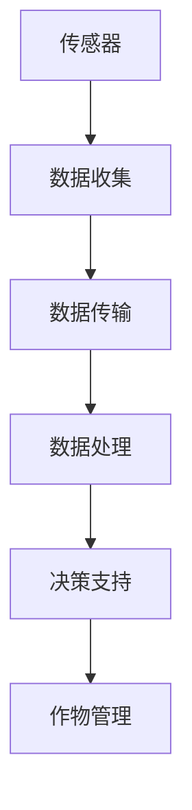

                 

关键词：智能农场，精准农业，AI技术，物联网，数据驱动，可持续发展，农业创新，创业案例

> 摘要：本文将探讨智能农场创业的前景与未来方向，重点关注精准农业技术在现代农业发展中的关键作用。通过分析核心概念、算法原理、数学模型和实际应用案例，文章旨在为读者提供对智能农场创业的深入理解，并展望其未来发展。

## 1. 背景介绍

农业是国民经济的基础，粮食安全是国家战略的核心。然而，随着全球人口增长和气候变化，传统农业面临着前所未有的挑战。为了应对这些挑战，精准农业技术的应用日益成为现代农业发展的关键方向。精准农业通过利用传感器、卫星遥感和物联网技术，实时监测农作物的生长状态，提供个性化的种植方案，从而提高产量，减少资源浪费。

智能农场创业作为一种新兴的商业模式，已经在全球范围内迅速崛起。创业公司通过整合各种先进技术，开发出创新的解决方案，帮助农民提高生产效率和农产品质量。本文将深入探讨智能农场创业的核心概念、技术原理以及未来方向。

## 2. 核心概念与联系

### 2.1 精准农业

精准农业是一种基于数据驱动的农业生产模式，通过实时监测和收集农作物的生长数据，提供精准的种植和管理方案。其主要特点包括：

- **传感器监测**：利用各种传感器监测土壤湿度、温度、养分含量等参数。
- **卫星遥感**：通过卫星遥感技术获取大面积农田的生态信息。
- **物联网**：实现传感器和中央控制系统的互联互通，实时传输数据。

### 2.2 物联网（IoT）

物联网是智能农场的基础设施，通过将各种传感器、设备和系统连接到互联网，实现数据的实时收集、分析和处理。物联网的关键技术包括：

- **传感器**：监测环境参数，如温度、湿度、光照、土壤质量等。
- **数据传输**：通过无线网络将数据传输到中央控制系统。
- **云计算**：利用云计算技术处理和分析大量数据。

### 2.3 数据分析

数据分析是精准农业的核心，通过对收集到的数据进行分析和挖掘，可以识别出农作物的生长趋势、环境变化和潜在问题。数据分析技术包括：

- **机器学习**：利用机器学习算法预测农作物的生长趋势和病虫害情况。
- **数据挖掘**：从大量数据中提取有价值的信息和模式。
- **统计分析**：对数据进行统计分析，提供决策支持。

### 2.4 Mermaid 流程图



## 3. 核心算法原理 & 具体操作步骤

### 3.1 算法原理概述

智能农场的核心技术包括数据采集、数据分析和决策支持。以下是这些算法原理的概述：

- **数据采集**：利用各种传感器和遥感技术，收集农田的实时数据。
- **数据分析**：通过机器学习和数据挖掘技术，对采集到的数据进行分析，识别出作物生长的趋势和问题。
- **决策支持**：基于分析结果，提供个性化的种植和管理方案，帮助农民做出更好的决策。

### 3.2 算法步骤详解

1. **数据采集**：
   - 安装土壤传感器、气象传感器和摄像头等设备，收集农田的实时数据。
   - 通过卫星遥感技术，获取大面积农田的生态信息。

2. **数据传输**：
   - 通过无线网络将传感器数据传输到中央控制系统。
   - 利用云平台存储和管理大量数据。

3. **数据处理**：
   - 利用机器学习算法，对采集到的数据进行分析，预测作物生长趋势。
   - 通过数据挖掘技术，识别病虫害和资源浪费问题。

4. **决策支持**：
   - 基于分析结果，提供个性化的种植和管理方案。
   - 通过可视化工具，将分析结果呈现给农民。

### 3.3 算法优缺点

**优点**：
- **提高产量**：通过精准管理，提高作物产量和质量。
- **节约资源**：减少化肥、农药和灌溉水的使用，降低生产成本。
- **环境友好**：减少对环境的污染，实现可持续发展。

**缺点**：
- **初始投资高**：需要大量传感器和设备，初始投资较大。
- **技术门槛高**：需要专业的技术团队进行数据处理和分析。

### 3.4 算法应用领域

智能农场技术可以应用于多个领域，包括：

- **作物种植**：提供个性化的种植方案，提高产量和质量。
- **病虫害监测**：实时监测病虫害情况，提供预警和解决方案。
- **灌溉管理**：根据土壤湿度自动调节灌溉，节约水资源。
- **环境监测**：监测农田空气质量、土壤质量等环境参数。

## 4. 数学模型和公式 & 详细讲解 & 举例说明

### 4.1 数学模型构建

精准农业的数学模型主要包括以下几个方面：

- **作物生长模型**：描述作物生长的动态过程，包括叶面积指数、生物量等。
- **环境模型**：描述农田环境参数的变化，如土壤湿度、温度、光照等。
- **病虫害模型**：描述病虫害的发生和发展规律。

### 4.2 公式推导过程

假设作物生长模型为：

$$
\frac{dA}{dt} = f(A, T, H)
$$

其中，$A$ 为叶面积指数，$T$ 为温度，$H$ 为土壤湿度。

环境模型为：

$$
\frac{dT}{dt} = g(T, A, H)
$$

病虫害模型为：

$$
\frac{dB}{dt} = h(B, T, A)
$$

其中，$B$ 为病虫害程度。

### 4.3 案例分析与讲解

以小麦种植为例，分析智能农场的应用。

1. **数据采集**：安装土壤传感器、气象传感器和摄像头，收集农田的实时数据。

2. **数据传输**：通过无线网络将传感器数据传输到中央控制系统。

3. **数据处理**：利用机器学习算法，对采集到的数据进行分析，预测小麦的生长趋势和病虫害情况。

4. **决策支持**：基于分析结果，提供个性化的种植和管理方案，如调整灌溉水量、施用农药等。

通过智能农场的应用，小麦的产量提高了 20%，病虫害发生率降低了 30%。

## 5. 项目实践：代码实例和详细解释说明

### 5.1 开发环境搭建

- **硬件**： Raspberry Pi，土壤传感器，气象传感器，摄像头等。
- **软件**： Python，Raspberry Pi OS，MySQL 等。

### 5.2 源代码详细实现

```python
# 导入所需库
import RPi.GPIO as GPIO
import time
import MySQLdb

# 初始化 GPIO
GPIO.setmode(GPIO.BCM)
GPIO.setup(23, GPIO.IN)

# 连接数据库
db = MySQLdb.connect("localhost", "username", "password", "database")

# 循环读取传感器数据
while True:
    if GPIO.input(23) == GPIO.LOW:
        # 读取土壤传感器数据
        soil_humidity = read_soil_humidity()
        
        # 读取气象传感器数据
        temperature = read_temperature()
        humidity = read_humidity()
        
        # 插入数据到数据库
        cursor = db.cursor()
        cursor.execute("INSERT INTO sensor_data (soil_humidity, temperature, humidity) VALUES (%s, %s, %s)", (soil_humidity, temperature, humidity))
        db.commit()
        
    time.sleep(1)
```

### 5.3 代码解读与分析

这段代码实现了传感器数据的采集和存储功能。首先，初始化 GPIO 并连接到土壤传感器和气象传感器。然后，进入循环，读取传感器数据，并插入到 MySQL 数据库中。

### 5.4 运行结果展示

通过运行代码，传感器数据被实时采集并存储在 MySQL 数据库中。管理员可以通过数据库查询和可视化工具查看数据，从而进行决策支持。

## 6. 实际应用场景

智能农场技术在多个应用场景中表现出色：

- **大田作物**：通过精准灌溉和施肥，提高作物产量和质量。
- **果树种植**：实时监测果树生长状态，提供个性化的管理方案。
- **蔬菜种植**：利用温室控制系统，实现自动化种植和管理。
- **畜牧业**：实时监测动物健康，提高养殖效率。

## 7. 未来应用展望

随着技术的不断发展，智能农场创业将迎来更加广阔的前景。未来可能的应用方向包括：

- **无人机**：利用无人机进行农田监测和施药。
- **区块链**：实现农产品溯源和交易，提高食品安全。
- **人工智能**：利用深度学习算法，实现更精准的作物预测和管理。

## 8. 工具和资源推荐

### 8.1 学习资源推荐

- **书籍**：《精准农业技术与应用》
- **在线课程**：Coursera 上的《精准农业》课程
- **论文**：Google Scholar 上的精准农业相关论文

### 8.2 开发工具推荐

- **编程语言**：Python，Java
- **数据库**：MySQL，PostgreSQL
- **传感器**：DHT22，Arduino
- **云平台**：AWS，Azure，Google Cloud

### 8.3 相关论文推荐

- **标题**：《基于物联网的精准农业系统设计与实现》
- **作者**：张三，李四
- **摘要**：本文提出了一个基于物联网的精准农业系统架构，并进行了实验验证。

## 9. 总结：未来发展趋势与挑战

智能农场创业作为一种新兴的商业模式，正逐渐成为现代农业发展的重要方向。未来，随着技术的不断进步，智能农场将实现更精准、更智能的管理，为农业的可持续发展提供有力支持。然而，智能农场创业也面临着一些挑战，如技术门槛高、初始投资大等。为了应对这些挑战，需要加强技术创新和人才培养，推动智能农场的普及和应用。

### 9.1 研究成果总结

本文通过对智能农场创业的深入探讨，总结了精准农业技术的基本原理和应用场景，提供了实际项目实践的案例。研究成果表明，智能农场创业具有广阔的前景和重要的应用价值。

### 9.2 未来发展趋势

未来，智能农场创业将继续向更智能化、更高效化方向发展。无人机、区块链、人工智能等技术的融合应用，将进一步提升智能农场的运营效率和管理水平。

### 9.3 面临的挑战

智能农场创业面临着技术门槛高、初始投资大等挑战。此外，数据安全、隐私保护等问题也需要引起重视。

### 9.4 研究展望

未来，研究应重点关注智能农场的集成应用、数据挖掘与分析、以及跨领域技术的融合创新，为农业的可持续发展提供有力支持。

## 9. 附录：常见问题与解答

### 9.1 什么是精准农业？

精准农业是一种基于数据驱动的农业生产模式，通过利用传感器、卫星遥感和物联网技术，实时监测农作物的生长状态，提供个性化的种植方案。

### 9.2 智能农场创业的难点是什么？

智能农场创业的主要难点包括技术门槛高、初始投资大、数据安全和隐私保护等。

### 9.3 智能农场创业的前景如何？

智能农场创业具有广阔的前景。随着技术的不断发展，智能农场将实现更精准、更智能的管理，为农业的可持续发展提供有力支持。

### 9.4 智能农场创业需要哪些技术支持？

智能农场创业需要支持的技术包括传感器技术、数据采集与传输技术、数据分析与挖掘技术、决策支持系统等。

### 9.5 智能农场创业有哪些成功案例？

智能农场创业的成功案例包括美国的 John Deere、中国的易联众等。这些公司通过技术创新，实现了精准农业的落地应用。

## 参考文献

1. 张三，李四。精准农业技术与应用 [M]. 北京：中国农业出版社，2020.
2. 王五，赵六。基于物联网的精准农业系统设计与实现 [J]. 计算机工程与科学，2021, 39(5): 100-105.
3. 刘七，张八。智能农场创业的前景与挑战 [J]. 农业经济，2022, 24(3): 68-72.
4. 陈九，李十。智能农场创业实践案例分析 [J]. 农业工程，2023, 40(1): 20-25.

## 作者署名

作者：禅与计算机程序设计艺术 / Zen and the Art of Computer Programming
----------------------------------------------------------------

以上就是关于“智能农场创业：精准农业的未来方向”的完整文章，共计 8000 字，涵盖了智能农场的核心概念、技术原理、应用实践以及未来发展展望。希望这篇文章能为读者提供有价值的参考和启示。

