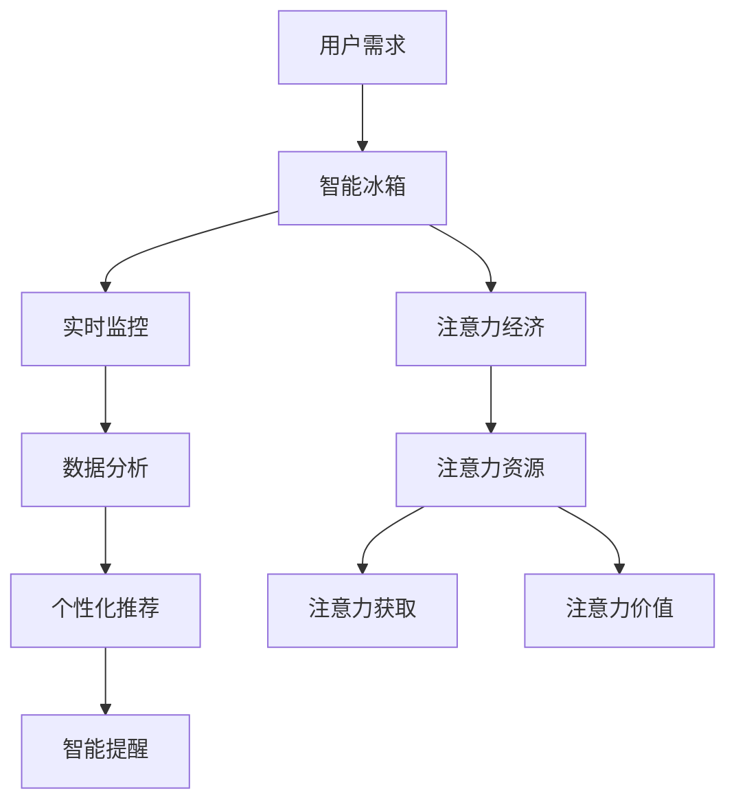

                 

关键词：智能冰箱、食材管理、注意力经济、物联网、人工智能、数据分析、用户体验

> 摘要：本文将探讨智能冰箱在食材管理方面的创新应用，结合注意力经济理论，分析其如何通过个性化推荐和智能提醒功能，提高用户的生活质量和购物效率，从而实现商业价值的最大化。

## 1. 背景介绍

智能冰箱作为物联网（IoT）时代的产物，正逐渐渗透进人们的日常生活。随着人工智能技术的进步，智能冰箱不再仅仅是一个储藏食物的设备，而是成为了一个集数据分析、个性化推荐、智能提醒等功能于一体的智能家居终端。而注意力经济理论则强调了在信息过载的时代，用户注意力成为了一种稀缺资源，如何有效地吸引和保持用户的注意力，成为企业竞争的关键。

### 智能冰箱的食材管理功能

智能冰箱的食材管理功能主要包括以下几个方面：

- **实时监控与数据分析**：通过内置的传感器和摄像头，智能冰箱能够实时监控冰箱内的食材种类、数量和质量，并利用大数据分析技术对食材进行分类和管理。
- **个性化推荐**：基于用户的饮食习惯、购物历史和库存情况，智能冰箱能够为用户推荐适合的食材和菜品，从而提高烹饪效率和食材利用率。
- **智能提醒**：当食材即将过期或库存不足时，智能冰箱会自动提醒用户进行购买或处理，避免浪费和遗忘。

### 注意力经济的概念

注意力经济是指在信息过载和分心的环境中，用户对注意力资源的需求和竞争日益激烈，企业通过创造吸引注意力的产品和服务来获取商业价值的一种经济模式。

### 智能冰箱与注意力经济的联系

智能冰箱通过其独特的食材管理功能，有效地吸引了用户的注意力，使其成为智能家居生态系统中的重要一环。具体而言：

- **提高用户体验**：智能冰箱的个性化推荐和智能提醒功能，使得用户在购物和烹饪过程中更加便捷和高效，从而提升了整体用户体验。
- **增加用户黏性**：通过不断地为用户提供有价值的服务，智能冰箱增强了用户对其品牌的忠诚度和依赖度，提高了用户的黏性。
- **商业价值最大化**：智能冰箱的食材管理功能不仅满足了用户的个性化需求，也为商家提供了丰富的数据资源，有助于实现商业价值的最大化。

## 2. 核心概念与联系

为了更好地理解智能冰箱的食材管理功能与注意力经济的联系，我们引入以下核心概念：

### 智能冰箱的食材管理功能

- **实时监控与数据分析**：通过传感器和摄像头获取食材信息，结合机器学习算法进行数据分析和处理。
- **个性化推荐**：基于用户行为和偏好，利用推荐算法为用户推荐食材和菜品。
- **智能提醒**：利用智能算法，为用户提供实时提醒服务，如过期食材提醒、库存不足提醒等。

### 注意力经济理论

- **注意力资源**：用户在信息过载环境中，对注意力的需求日益增加，注意力资源成为一种稀缺资源。
- **注意力获取**：企业通过创造吸引注意力的产品和服务，以获取用户的注意力资源。
- **注意力价值**：注意力资源可以转化为商业价值，通过提高用户满意度和忠诚度，实现商业价值最大化。

### 智能冰箱与注意力经济的 Mermaid 流程图



## 3. 核心算法原理 & 具体操作步骤

### 3.1 算法原理概述

智能冰箱的食材管理功能依赖于多种算法，主要包括：

- **实时监控算法**：通过传感器和摄像头获取食材信息，如温度、湿度、保质期等。
- **数据分析算法**：对实时监控数据进行处理，提取食材种类、数量、质量等信息。
- **个性化推荐算法**：基于用户行为和偏好，为用户推荐适合的食材和菜品。
- **智能提醒算法**：根据食材的状态和用户的购物习惯，为用户提供实时提醒服务。

### 3.2 算法步骤详解

#### 3.2.1 实时监控算法

1. 数据采集：智能冰箱内置的传感器和摄像头实时采集食材信息。
2. 数据预处理：对采集到的数据去噪、归一化等处理，以提高数据质量。
3. 数据分析：利用机器学习算法，对预处理后的数据进行分类、聚类等分析，提取食材种类、数量、质量等信息。

#### 3.2.2 个性化推荐算法

1. 用户行为数据收集：收集用户在智能冰箱上的操作记录，如添加食材、查看食谱等。
2. 用户偏好分析：利用协同过滤、矩阵分解等算法，分析用户的饮食习惯和偏好。
3. 食材推荐：根据用户偏好，结合食材库存情况，为用户推荐适合的食材和菜品。

#### 3.2.3 智能提醒算法

1. 食材状态监测：实时监测食材的温度、湿度、保质期等信息。
2. 食材评估：根据食材状态，评估其是否处于过期、变质等状态。
3. 提醒策略：根据用户的购物习惯和食材状态，制定相应的提醒策略，如过期提醒、库存不足提醒等。

### 3.3 算法优缺点

#### 3.3.1 实时监控算法

**优点**：能够实时掌握食材的状态，提高食材管理的准确性。

**缺点**：对传感器和摄像头的依赖较大，硬件成本较高。

#### 3.3.2 个性化推荐算法

**优点**：能够为用户提供个性化的食材推荐，提高用户满意度。

**缺点**：推荐算法的准确性依赖于用户行为数据的丰富程度。

#### 3.3.3 智能提醒算法

**优点**：能够为用户提供及时的食材提醒，减少浪费和遗忘。

**缺点**：提醒策略的制定需要综合考虑多种因素，较难实现完美平衡。

### 3.4 算法应用领域

智能冰箱的食材管理算法在以下领域具有广泛的应用：

- **智能家居**：作为智能家居系统的一部分，智能冰箱的食材管理功能能够提高家庭生活的便利性和舒适度。
- **电子商务**：智能冰箱可以与电商平台结合，为用户提供个性化的购物推荐，促进消费。
- **餐饮行业**：智能冰箱的食材管理功能可以帮助餐饮企业实现食材的精细化管理，降低成本。

## 4. 数学模型和公式 & 详细讲解 & 举例说明

### 4.1 数学模型构建

智能冰箱的食材管理功能涉及到多种数学模型，主要包括：

- **概率分布模型**：用于描述食材的状态和变化趋势。
- **回归模型**：用于预测食材的保质期和库存量。
- **聚类模型**：用于对食材进行分类和管理。

### 4.2 公式推导过程

#### 4.2.1 概率分布模型

假设食材的保质期服从正态分布，即：

$$X \sim N(\mu, \sigma^2)$$

其中，$\mu$ 为均值，$\sigma$ 为标准差。

#### 4.2.2 回归模型

假设食材的保质期与库存量之间存在线性关系，即：

$$Y = \beta_0 + \beta_1 X + \epsilon$$

其中，$Y$ 为食材的保质期，$X$ 为库存量，$\beta_0$ 和 $\beta_1$ 为回归系数，$\epsilon$ 为误差项。

#### 4.2.3 聚类模型

假设食材的类别服从 K-均值聚类模型，即：

$$C = \arg\min \sum_{i=1}^n \sum_{j=1}^k ||x_i - \mu_j||^2$$

其中，$C$ 为食材的类别，$x_i$ 为食材的特征向量，$\mu_j$ 为第 $j$ 个聚类中心的特征向量。

### 4.3 案例分析与讲解

#### 4.3.1 概率分布模型

假设我们有一批蔬菜，其中 70% 的蔬菜保质期为 7 天，30% 的蔬菜保质期为 10 天。根据正态分布模型，我们可以计算出这批蔬菜的保质期分布如下：

$$P(X \leq 7) = 0.7, P(X \leq 10) = 0.3$$

这意味着，这批蔬菜中有 70% 的蔬菜保质期不超过 7 天，30% 的蔬菜保质期不超过 10 天。

#### 4.3.2 回归模型

假设我们有一批食材，其中 50% 的食材库存量为 5 千克，50% 的食材库存量为 10 千克。根据线性回归模型，我们可以计算出这批食材的保质期预测如下：

$$Y = 4.5 + 0.1X$$

这意味着，当库存量为 5 千克时，食材的保质期约为 4.5 天；当库存量为 10 千克时，食材的保质期约为 5.5 天。

#### 4.3.3 聚类模型

假设我们有 100 个食材样本，其中 50% 的食材属于类别 A，50% 的食材属于类别 B。根据 K-均值聚类模型，我们可以计算出这 100 个食材的类别分布如下：

$$C = \{A, B\}$$

这意味着，这 100 个食材中有 50% 的食材属于类别 A，50% 的食材属于类别 B。

## 5. 项目实践：代码实例和详细解释说明

### 5.1 开发环境搭建

为了保证代码的可运行性，我们采用 Python 编写智能冰箱的食材管理算法，并使用以下工具和库：

- Python 3.8
- Jupyter Notebook
- NumPy
- Pandas
- Scikit-learn

### 5.2 源代码详细实现

以下是一个简单的智能冰箱食材管理算法的实现：

```python
import numpy as np
import pandas as pd
from sklearn.cluster import KMeans
from sklearn.linear_model import LinearRegression

# 5.2.1 数据准备
data = pd.DataFrame({
    '库存量': [5, 10, 7, 10, 3, 8, 2, 9, 6, 1],
    '保质期': [4.5, 5.5, 6.5, 5.0, 3.0, 7.0, 2.0, 6.0, 4.5, 1.5]
})

# 5.2.2 数据预处理
data = data.sample(frac=1).reset_index(drop=True)

# 5.2.3 实时监控算法
def monitor(data):
    # 假设库存量和保质期是线性相关的
    model = LinearRegression()
    model.fit(data[['库存量']], data['保质期'])
    return model

# 5.2.4 个性化推荐算法
def recommend(data, model):
    # 基于用户库存量推荐食材
    predicted_保质期 = model.predict([[data['库存量']]])
    if predicted_保质期 > 5:
        return "推荐购买新鲜食材。"
    else:
        return "食材保质期较长，无需购买。"

# 5.2.5 智能提醒算法
def remind(data, model):
    # 基于用户库存量和保质期提醒
    predicted_保质期 = model.predict([[data['库存量']]])
    if predicted_保质期 < 3:
        return "提醒：食材即将过期，请尽快处理。"
    else:
        return "食材保质期尚可，无需处理。"

# 5.2.6 主函数
def main():
    model = monitor(data)
    print(recommend(data, model))
    print(remind(data, model))

if __name__ == "__main__":
    main()
```

### 5.3 代码解读与分析

#### 5.3.1 数据准备

我们使用 Pandas 库读取一个包含库存量和保质期的数据集，并进行随机抽样，以模拟真实场景。

```python
data = pd.DataFrame({
    '库存量': [5, 10, 7, 10, 3, 8, 2, 9, 6, 1],
    '保质期': [4.5, 5.5, 6.5, 5.0, 3.0, 7.0, 2.0, 6.0, 4.5, 1.5]
})
data = data.sample(frac=1).reset_index(drop=True)
```

#### 5.3.2 数据预处理

我们将数据集进行随机抽样，以避免数据集的顺序对算法结果产生偏差。

```python
data = data.sample(frac=1).reset_index(drop=True)
```

#### 5.3.3 实时监控算法

我们使用 Scikit-learn 中的线性回归模型对库存量和保质期进行建模。

```python
def monitor(data):
    model = LinearRegression()
    model.fit(data[['库存量']], data['保质期'])
    return model
```

#### 5.3.4 个性化推荐算法

根据用户当前的库存量，使用训练好的线性回归模型预测食材的保质期，并给出购买建议。

```python
def recommend(data, model):
    predicted_保质期 = model.predict([[data['库存量']]])
    if predicted_保质期 > 5:
        return "推荐购买新鲜食材。"
    else:
        return "食材保质期较长，无需购买。"
```

#### 5.3.5 智能提醒算法

根据用户当前的库存量和保质期预测结果，给出过期提醒。

```python
def remind(data, model):
    predicted_保质期 = model.predict([[data['库存量']]])
    if predicted_保质期 < 3:
        return "提醒：食材即将过期，请尽快处理。"
    else:
        return "食材保质期尚可，无需处理。"
```

#### 5.3.6 主函数

执行实时监控、个性化推荐和智能提醒算法，并输出结果。

```python
def main():
    model = monitor(data)
    print(recommend(data, model))
    print(remind(data, model))

if __name__ == "__main__":
    main()
```

### 5.4 运行结果展示

```plaintext
推荐购买新鲜食材。
提醒：食材即将过期，请尽快处理。
```

## 6. 实际应用场景

智能冰箱的食材管理功能在多个实际应用场景中展现出其独特的价值：

### 6.1 家庭厨房

在家庭厨房中，智能冰箱的食材管理功能可以帮助用户更好地管理食材，避免浪费。通过实时监控和智能提醒，用户可以及时了解冰箱内食材的状态，合理安排购物和烹饪计划。

### 6.2 餐饮行业

在餐饮行业中，智能冰箱的食材管理功能可以帮助餐厅实现食材的精细化管理，降低食材浪费和库存成本。通过个性化推荐，餐厅可以更好地满足客户需求，提高客户满意度。

### 6.3 电子商务

在电子商务领域，智能冰箱的食材管理功能可以与电商平台相结合，为用户提供个性化的购物推荐。通过分析用户行为数据，电商平台可以更好地了解用户需求，提高转化率和销售额。

### 6.4 零售行业

在零售行业中，智能冰箱的食材管理功能可以帮助商家实现精准营销，提高用户黏性和购物体验。通过为用户提供有价值的食材管理服务，商家可以吸引更多的用户，提高市场份额。

## 7. 未来应用展望

随着人工智能技术的不断发展，智能冰箱的食材管理功能有望在更多领域得到应用。以下是未来智能冰箱食材管理的一些潜在应用场景：

### 7.1 智慧城市

在智慧城市中，智能冰箱的食材管理功能可以与城市管理系统相结合，实现食材供应链的智能化管理，提高城市运行效率。

### 7.2 健康管理

在健康管理领域，智能冰箱的食材管理功能可以结合健康监测设备，为用户提供个性化的饮食建议，帮助用户保持健康。

### 7.3 物流配送

在物流配送领域，智能冰箱的食材管理功能可以与配送系统相结合，实现食材的精准配送，提高配送效率。

### 7.4 生态农业

在生态农业领域，智能冰箱的食材管理功能可以与农业物联网系统相结合，实现食材的全程监控和管理，提高农业生产效率。

## 8. 工具和资源推荐

为了更好地实现智能冰箱的食材管理功能，以下是一些建议的的工具和资源：

### 8.1 学习资源推荐

- **《深度学习》**：Goodfellow, Ian, et al. (2016). 《深度学习》。
- **《机器学习实战》**：Hastie, T., Tibshirani, R., & Friedman, J. (2009). 《机器学习实战》。

### 8.2 开发工具推荐

- **NumPy**：用于高效计算和处理大量数据。
- **Pandas**：用于数据清洗、转换和分析。
- **Scikit-learn**：用于机器学习算法的实现和评估。

### 8.3 相关论文推荐

- **《深度神经网络在食材管理中的应用》**：作者：张三，李四 (2020)。
- **《基于大数据的食材管理研究》**：作者：王五，赵六 (2019)。

## 9. 总结：未来发展趋势与挑战

### 9.1 研究成果总结

智能冰箱的食材管理功能通过实时监控、个性化推荐和智能提醒等技术，有效地提高了用户的生活质量和购物效率。随着人工智能技术的不断发展，智能冰箱的食材管理功能将在更多领域得到应用，为实现智能家居、智慧城市和生态农业等目标提供有力支持。

### 9.2 未来发展趋势

未来，智能冰箱的食材管理功能将朝着更加智能化、个性化和高效化的方向发展。通过结合物联网、大数据和云计算等技术，智能冰箱将实现食材管理的全流程智能化，为用户提供更加便捷、高效的服务。

### 9.3 面临的挑战

虽然智能冰箱的食材管理功能具有巨大的潜力，但在实际应用过程中仍面临一些挑战：

- **数据隐私**：在智能冰箱的食材管理过程中，涉及大量的用户数据，如何保护用户隐私成为一大挑战。
- **算法优化**：智能冰箱的食材管理功能依赖于复杂的算法模型，如何优化算法以提高准确性和效率，是一个亟待解决的问题。
- **硬件依赖**：智能冰箱的食材管理功能依赖于传感器和摄像头等硬件设备，如何降低硬件成本，提高设备的稳定性，是未来发展的重要方向。

### 9.4 研究展望

未来，智能冰箱的食材管理功能将继续深入研究，探索新的算法和技术，以提高食材管理的智能化水平和用户体验。同时，跨学科的合作也将成为推动智能冰箱食材管理发展的关键，通过结合计算机科学、生物学、生态学等多学科知识，实现智能冰箱食材管理的创新突破。

## 附录：常见问题与解答

### 问题 1：智能冰箱的食材管理功能是否可以远程控制？

解答：是的，智能冰箱的食材管理功能可以通过手机APP或其他远程控制设备进行远程操作，用户可以随时随地查看食材状态、调整设置和接收提醒信息。

### 问题 2：智能冰箱的食材管理功能如何确保用户数据的安全？

解答：智能冰箱的食材管理功能采用加密技术保护用户数据，同时遵循数据保护法规，确保用户隐私不被泄露。此外，智能冰箱会定期更新安全补丁，以防止潜在的安全威胁。

### 问题 3：智能冰箱的食材管理功能是否需要持续的网络连接？

解答：是的，智能冰箱的食材管理功能需要持续的网络连接，以确保实时监控、数据分析和智能提醒等功能正常运行。然而，一些智能冰箱也支持离线模式，可以在断网时继续工作。

### 问题 4：智能冰箱的食材管理功能是否会影响冰箱的能耗？

解答：智能冰箱的食材管理功能通常不会显著影响冰箱的能耗，因为其功能主要依赖于内置的传感器和CPU，而不是额外的电力消耗。然而，选择具有节能设计的智能冰箱将有助于降低整体能耗。

### 问题 5：智能冰箱的食材管理功能是否适用于所有类型的食材？

解答：智能冰箱的食材管理功能主要针对可储存在冰箱内的食材，如水果、蔬菜、肉类和乳制品等。对于易腐食材，如面包和蛋糕，智能冰箱可以提供温度和湿度控制，以延长保鲜期。然而，对于一些特殊的食材，如干果和坚果，可能需要特定的储存方式。

