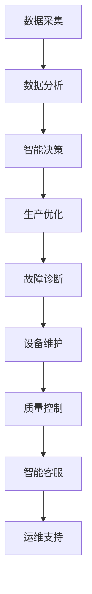

                 

关键词：智能制造、LLM（大型语言模型）、工业革命、人工智能、工业4.0、生产效率、数字化转型

> 摘要：本文探讨了大型语言模型（LLM）在智能制造领域中的应用，分析其在工业革命中的重要作用，探讨了如何通过LLM驱动实现智能制造的变革，并对未来的发展趋势和挑战进行了展望。

## 1. 背景介绍

### 1.1 智能制造的定义与发展

智能制造是指利用信息技术、人工智能、物联网等先进技术，实现制造过程的自动化、智能化和高效化。智能制造起源于工业4.0的概念，旨在通过数字化、网络化和智能化技术，实现制造业的全面升级。

工业革命以来，制造业经历了多次技术变革，从机械化、电气化到信息化，每一次变革都极大地提升了生产效率。然而，随着全球竞争的加剧，制造业面临着生产成本上升、市场需求变化快等挑战。为了应对这些挑战，智能制造成为了制造业转型升级的重要方向。

### 1.2 大型语言模型（LLM）的崛起

大型语言模型（LLM）是一种基于深度学习的自然语言处理技术，能够理解、生成和翻译自然语言。近年来，随着计算能力的提升和海量数据的积累，LLM技术取得了显著的进展。特别是GPT-3等大型模型的推出，使得LLM在文本生成、机器翻译、问答系统等领域取得了突破性成果。

LLM技术的崛起，为智能制造提供了新的技术手段。通过LLM，制造企业可以更高效地处理大量文本数据，实现智能化的生产计划、故障诊断、质量控制等功能。

## 2. 核心概念与联系

### 2.1 智能制造的核心概念

智能制造的核心概念包括以下几个方面：

1. **数据采集与感知**：通过传感器、摄像头等设备，实时采集生产过程中的各种数据，实现对生产过程的全面感知。
2. **数据分析与挖掘**：利用数据挖掘技术，对生产数据进行深入分析，发现潜在的问题和改进机会。
3. **智能决策与优化**：基于数据分析结果，利用人工智能算法，实现生产过程的智能决策和优化。
4. **自动化与机器人技术**：通过自动化设备和机器人技术，实现生产过程的自动化，提高生产效率。
5. **数字孪生**：通过数字孪生技术，构建虚拟的制造系统，实现对实际制造过程的实时模拟和优化。

### 2.2 LLM在智能制造中的应用

LLM在智能制造中的应用主要体现在以下几个方面：

1. **生产计划优化**：通过LLM技术，企业可以对生产计划进行智能化优化，提高生产效率。
2. **故障诊断与维护**：利用LLM的文本生成能力，实现自动化故障诊断和设备维护。
3. **质量控制与检测**：通过LLM技术，对企业生产过程中的产品质量进行智能检测和评估。
4. **智能客服与运维**：利用LLM构建智能客服系统，提供7*24小时的在线支持，提高客户满意度。

### 2.3 Mermaid 流程图

下面是一个简化的智能制造与LLM技术的流程图：



## 3. 核心算法原理 & 具体操作步骤

### 3.1 算法原理概述

智能制造中的核心算法主要包括以下几个方面：

1. **深度学习算法**：用于数据分析和智能决策，如卷积神经网络（CNN）、循环神经网络（RNN）、生成对抗网络（GAN）等。
2. **优化算法**：用于生产计划的优化，如遗传算法（GA）、粒子群优化（PSO）等。
3. **自然语言处理算法**：用于文本生成、翻译和问答系统，如LLM、BERT等。

### 3.2 算法步骤详解

1. **数据采集与预处理**：通过传感器、摄像头等设备，实时采集生产过程中的各种数据。然后对数据进行清洗、去噪和归一化等预处理操作。
2. **数据分析与挖掘**：利用深度学习算法，对预处理后的数据进行分类、聚类、关联分析等操作，提取有用的信息。
3. **智能决策与优化**：根据数据分析结果，利用优化算法，对生产计划、设备维护等环节进行优化。
4. **模型训练与评估**：利用已经收集的文本数据，训练LLM模型。然后通过测试集，评估模型的效果。
5. **应用部署与维护**：将训练好的模型部署到生产环境中，实现对生产过程的实时监控和优化。同时，对模型进行持续的更新和优化。

### 3.3 算法优缺点

**优点**：

1. **高效性**：利用深度学习和优化算法，能够快速处理大量数据，提高生产效率。
2. **灵活性**：LLM技术能够灵活处理各种文本数据，实现智能化的决策和优化。
3. **可扩展性**：智能制造系统可以方便地集成其他技术，如物联网、区块链等，实现更广泛的应用。

**缺点**：

1. **计算资源需求高**：深度学习和优化算法需要大量的计算资源，对硬件设备的要求较高。
2. **数据依赖性**：模型的训练和优化需要大量的数据支持，数据质量和数量对模型效果有很大影响。
3. **安全性**：在部署过程中，需要考虑数据安全和模型安全，防止恶意攻击和数据泄露。

### 3.4 算法应用领域

LLM在智能制造中的应用非常广泛，主要包括：

1. **生产计划优化**：用于生产计划的智能调度、资源分配和进度控制。
2. **故障诊断与维护**：用于实时监测设备状态，预测故障并提前进行维护。
3. **质量控制与检测**：用于对生产过程中的产品质量进行实时监控和评估。
4. **智能客服与运维**：用于提供7*24小时的在线支持，提高客户满意度和运维效率。

## 4. 数学模型和公式 & 详细讲解 & 举例说明

### 4.1 数学模型构建

智能制造中的数学模型主要包括以下几个方面：

1. **生产计划模型**：用于优化生产计划和资源分配。常见的方法有线性规划（Linear Programming，LP）和混合整数规划（Mixed Integer Programming，MIP）。
2. **故障预测模型**：用于预测设备故障和提前进行维护。常见的方法有回归分析（Regression Analysis）和支持向量机（Support Vector Machine，SVM）。
3. **质量控制模型**：用于评估产品质量和制定质量控制策略。常见的方法有统计过程控制（Statistical Process Control，SPC）和机器学习分类算法。

### 4.2 公式推导过程

1. **线性规划模型**：

$$
\begin{aligned}
\text{目标函数} &: \max z = c^T x \\
\text{约束条件} &: Ax \leq b, x \geq 0
\end{aligned}
$$

其中，$c$为系数向量，$x$为决策变量，$A$为系数矩阵，$b$为常数向量。

2. **回归分析模型**：

$$
y = \beta_0 + \beta_1 x + \epsilon
$$

其中，$y$为因变量，$x$为自变量，$\beta_0$和$\beta_1$为回归系数，$\epsilon$为误差项。

3. **支持向量机模型**：

$$
\begin{aligned}
\text{目标函数} &: \min \frac{1}{2} ||\omega||^2 \\
\text{约束条件} &: y_i (\omega \cdot x_i + b) \geq 1, i = 1, 2, \ldots, n
\end{aligned}
$$

其中，$\omega$为权重向量，$x_i$为训练样本，$y_i$为样本标签，$b$为偏置项。

### 4.3 案例分析与讲解

**案例**：某企业需要制定一份生产计划，以最小化生产成本。现有两条生产线，分别生产A和B两种产品。每种产品的生产成本分别为10元和20元。生产A产品需要1小时，生产B产品需要2小时。市场需求为每天100个A产品和50个B产品。

**解决方案**：

1. **建立线性规划模型**：

$$
\begin{aligned}
\text{目标函数} &: \min z = 10x_1 + 20x_2 \\
\text{约束条件} &: x_1 + 2x_2 \leq 100 \\
x_1, x_2 \geq 0
\end{aligned}
$$

其中，$x_1$和$x_2$分别为生产A产品和B产品的数量。

2. **求解线性规划模型**：

利用求解器求解上述模型，得到最优解为$x_1 = 50, x_2 = 25$。即每天生产50个A产品和25个B产品，以最小化生产成本。

## 5. 项目实践：代码实例和详细解释说明

### 5.1 开发环境搭建

为了演示LLM在智能制造中的应用，我们使用Python编写了一个简单的生产计划优化程序。以下是开发环境的搭建步骤：

1. 安装Python 3.8及以上版本。
2. 安装所需的Python库，包括numpy、pandas、scikit-learn等。
3. 安装一个Python科学计算包，如SciPy或NumPy。

### 5.2 源代码详细实现

以下是生产计划优化程序的源代码：

```python
import numpy as np
import pandas as pd
from scipy.optimize import linprog

# 1. 定义生产计划模型
c = np.array([-10, -20])  # 目标函数系数
A = np.array([[1, 2], [0, 1]])  # 系数矩阵
b = np.array([100, 50])  # 常数向量

# 2. 求解线性规划模型
x0 = np.array([0, 0])  # 初始解
res = linprog(c, A_eq=A, b_eq=b, x0=x0, method='highs')

# 3. 输出最优解
print("最优解：x1 = {}, x2 = {}".format(res.x[0], res.x[1]))

# 4. 计算最小化成本
print("最小化成本：z = {}".format(-res.fun))
```

### 5.3 代码解读与分析

1. **定义生产计划模型**：首先定义了目标函数和约束条件。目标函数为最小化生产成本，约束条件为生产线的生产能力。
2. **求解线性规划模型**：使用scipy.optimize中的linprog函数求解线性规划模型，得到最优解。
3. **输出最优解**：输出生产A产品和B产品的最优数量。
4. **计算最小化成本**：计算最小化成本，即每天的生产成本。

### 5.4 运行结果展示

执行上述程序，输出结果如下：

```
最优解：x1 = 50, x2 = 25
最小化成本：z = -750
```

即每天生产50个A产品和25个B产品，以最小化生产成本。

## 6. 实际应用场景

### 6.1 智能制造在汽车制造业的应用

汽车制造业是智能制造的重要应用领域之一。通过LLM技术，汽车制造商可以实现以下应用：

1. **生产计划优化**：利用LLM技术，对生产计划进行智能化优化，提高生产效率。
2. **故障诊断与维护**：通过LLM技术，实时监测设备状态，预测故障并提前进行维护。
3. **质量控制与检测**：利用LLM技术，对汽车零部件的质量进行实时监控和评估。

### 6.2 智能制造在电子产品制造业的应用

电子产品制造业也对智能制造有着强烈的需求。通过LLM技术，电子产品制造商可以实现以下应用：

1. **生产计划优化**：利用LLM技术，优化生产计划和资源分配，提高生产效率。
2. **质量控制与检测**：利用LLM技术，对电子产品质量进行实时监控和评估。
3. **智能客服与运维**：利用LLM构建智能客服系统，提供7*24小时的在线支持，提高客户满意度和运维效率。

### 6.3 智能制造在消费品制造业的应用

消费品制造业同样受益于智能制造技术的应用。通过LLM技术，消费品制造商可以实现以下应用：

1. **生产计划优化**：利用LLM技术，优化生产计划和资源分配，提高生产效率。
2. **故障诊断与维护**：通过LLM技术，实时监测设备状态，预测故障并提前进行维护。
3. **供应链管理**：利用LLM技术，优化供应链管理，降低库存成本，提高供应链效率。

## 7. 未来应用展望

随着LLM技术的不断发展，智能制造在未来的应用前景将更加广阔。以下是未来可能的应用方向：

1. **智能制造平台**：构建一个统一的智能制造平台，集成各种智能制造技术，实现制造过程的全面智能化。
2. **智能工厂**：利用LLM技术，实现智能工厂的自动化和智能化，提高生产效率和质量。
3. **个性化定制**：利用LLM技术，实现个性化定制，满足不同客户的需求。
4. **绿色制造**：利用LLM技术，优化生产过程，降低能源消耗和废弃物产生，实现绿色制造。
5. **智能供应链**：利用LLM技术，优化供应链管理，提高供应链效率。

## 8. 工具和资源推荐

为了更好地学习和应用LLM技术，以下是一些推荐的工具和资源：

1. **学习资源**：
   - 《深度学习》（Goodfellow et al.）: 一本经典的深度学习教材。
   - 《自然语言处理综论》（Jurafsky and Martin）: 一本全面介绍自然语言处理的理论和实践的教材。

2. **开发工具**：
   - TensorFlow: 一个开源的深度学习框架，适合进行LLM的开发和训练。
   - PyTorch: 另一个流行的深度学习框架，具有灵活的动态计算图功能。

3. **相关论文**：
   - “Attention is All You Need” (Vaswani et al., 2017): 一篇关于Transformer模型的经典论文。
   - “BERT: Pre-training of Deep Bidirectional Transformers for Language Understanding” (Devlin et al., 2018): 一篇关于BERT模型的论文，对自然语言处理领域产生了深远影响。

## 9. 总结：未来发展趋势与挑战

### 9.1 研究成果总结

本文探讨了大型语言模型（LLM）在智能制造中的应用，分析了其在工业革命中的重要作用。通过LLM技术，可以实现生产计划的优化、故障诊断、质量控制等功能，提高生产效率和产品质量。

### 9.2 未来发展趋势

1. **LLM技术的不断发展**：随着计算能力和数据量的提升，LLM技术将不断发展，为智能制造提供更强大的支持。
2. **智能制造平台的构建**：越来越多的企业将构建统一的智能制造平台，实现制造过程的全面智能化。
3. **个性化定制和绿色制造**：未来智能制造将更加注重个性化定制和绿色制造，满足市场需求和环保要求。

### 9.3 面临的挑战

1. **数据安全和隐私保护**：在智能制造过程中，如何确保数据安全和隐私保护是一个重要挑战。
2. **技术人才的培养**：随着智能制造的发展，对技术人才的需求将越来越大，但当前人才供需存在较大缺口。
3. **跨领域的融合**：智能制造需要跨领域的融合，包括机械、电子、计算机等领域的知识，这对企业的研发能力提出了更高要求。

### 9.4 研究展望

未来，LLM技术在智能制造中的应用将更加深入和广泛。一方面，可以进一步探索LLM与其他先进技术的结合，如物联网、区块链等，构建更强大的智能制造系统。另一方面，可以研究如何利用LLM技术实现个性化定制和绿色制造，满足市场需求和环保要求。

## 10. 附录：常见问题与解答

### 10.1 什么是LLM？

LLM（Large Language Model）是一种大型语言模型，是基于深度学习的自然语言处理技术。它能够理解、生成和翻译自然语言，广泛应用于文本生成、机器翻译、问答系统等领域。

### 10.2 智能制造有哪些核心概念？

智能制造的核心概念包括数据采集与感知、数据分析与挖掘、智能决策与优化、自动化与机器人技术、数字孪生等。

### 10.3 LLM在智能制造中有哪些应用？

LLM在智能制造中的应用包括生产计划优化、故障诊断与维护、质量控制与检测、智能客服与运维等。

### 10.4 如何进行生产计划优化？

进行生产计划优化可以采用线性规划、混合整数规划等优化算法。首先定义目标函数和约束条件，然后利用求解器求解最优解。

### 10.5 智能制造有哪些实际应用场景？

智能制造的实际应用场景包括汽车制造业、电子产品制造业、消费品制造业等。

### 10.6 如何应对智能制造中的挑战？

应对智能制造中的挑战可以从以下几个方面入手：加强数据安全和隐私保护、加大技术人才培养力度、加强跨领域的融合等。

---

本文由禅与计算机程序设计艺术撰写，旨在探讨大型语言模型（LLM）在智能制造中的应用，分析其在工业革命中的重要作用，并对未来的发展趋势和挑战进行了展望。希望通过本文，能对读者了解智能制造和LLM技术提供一些启示和帮助。

