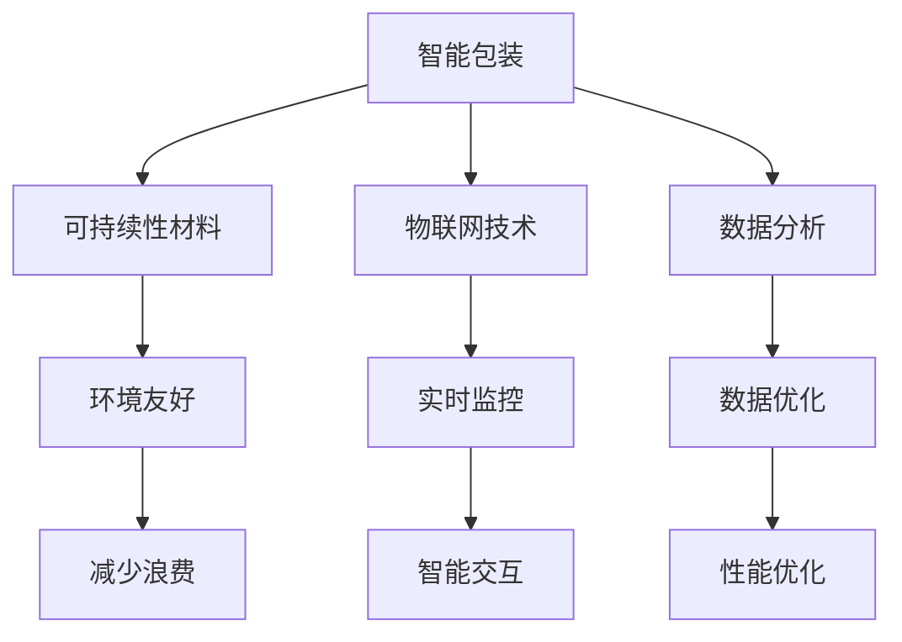

                 

关键词：智能包装，可持续性，创业，包装解决方案，创新技术，环保材料，物联网，数据分析

> 摘要：本文探讨了智能包装在创业领域中的应用，以及如何通过创新的可持续性材料和智能技术，为包装行业带来革命性的改变。本文将从背景介绍、核心概念与联系、核心算法原理、数学模型和公式、项目实践、实际应用场景、未来应用展望、工具和资源推荐以及总结和展望等角度，深入分析智能包装的发展现状、潜在挑战和未来发展机遇。

## 1. 背景介绍

随着全球可持续发展意识的提高，环保问题已经成为各国政府和企业关注的焦点。特别是在包装行业，传统的一次性塑料制品对环境造成了极大的负担。根据联合国的数据，全球每年产生的塑料废物中，约有一半用于包装。这不仅造成了大量的垃圾填埋和海洋污染，还浪费了宝贵的资源。因此，寻找可持续性的包装解决方案已经成为当务之急。

近年来，智能包装技术的发展为这一挑战提供了新的思路。智能包装不仅能够提高包装的功能性，还能通过物联网技术实现包装的智能化管理和监测，从而减少资源浪费和环境污染。智能包装的兴起，也为创业者提供了丰富的创新机会。

## 2. 核心概念与联系

### 2.1 智能包装的定义

智能包装是指通过集成传感器、RFID、条码等技术，使包装具有信息记录、传输、监控和互动功能的一种包装形式。智能包装不仅能够提供产品信息，还能根据环境变化自动调整包装性能，甚至能够实现与产品的智能交互。

### 2.2 可持续性包装材料

可持续性包装材料是指那些对环境友好的、可回收利用的、或能够自然降解的材料。常见的可持续性包装材料包括生物塑料、植物纤维、再生纸等。这些材料不仅能够减少环境污染，还能降低资源消耗。

### 2.3 物联网技术

物联网技术是智能包装的核心支撑。通过物联网，智能包装可以实现对包装状态的实时监控，以及与产品的智能交互。例如，通过传感器监测食品的新鲜程度，并通过网络通知消费者或物流公司进行及时处理。

### 2.4 数据分析

数据分析是智能包装实现智能管理的关键。通过对收集到的数据进行分析，可以优化包装设计，提高包装性能，同时减少资源浪费。

### 2.5 Mermaid 流程图



## 3. 核心算法原理 & 具体操作步骤

### 3.1 算法原理概述

智能包装的核心算法主要包括以下几个部分：

1. **传感器数据采集与处理**：通过传感器实时采集包装的状态信息，如温度、湿度、光照等，并对数据进行预处理，以去除噪声和异常值。
2. **数据分析与优化**：利用机器学习算法对传感器数据进行分析，以预测包装性能的变化趋势，并进行优化。
3. **智能交互与反馈**：通过物联网技术实现与产品的智能交互，根据分析结果调整包装性能，并提供实时反馈。

### 3.2 算法步骤详解

1. **数据采集**：在包装中集成各种传感器，如温度传感器、湿度传感器、光照传感器等。
2. **数据预处理**：对采集到的数据进行滤波、去噪和归一化处理，以提高数据的准确性和一致性。
3. **特征提取**：从预处理后的数据中提取关键特征，如温度的均值、方差等。
4. **数据训练**：利用机器学习算法对提取的特征进行训练，以建立预测模型。
5. **预测与优化**：利用训练好的模型对未来的包装性能进行预测，并根据预测结果调整包装设计或性能。
6. **实时反馈**：通过物联网技术将预测结果实时反馈给用户或产品管理系统。

### 3.3 算法优缺点

**优点**：

- 提高包装性能：通过实时监控和智能优化，可以显著提高包装的性能和安全性。
- 减少资源浪费：通过优化包装设计和材料使用，可以减少资源浪费和环境污染。
- 提高用户体验：通过智能交互和实时反馈，可以提供更好的用户体验。

**缺点**：

- 成本较高：智能包装的传感器和物联网设备成本较高，可能会影响产品价格。
- 技术挑战：智能包装技术的开发和应用仍面临一些技术挑战，如传感器精度、数据传输稳定性等。

### 3.4 算法应用领域

智能包装技术可以广泛应用于食品、药品、电子产品、化妆品等多个领域。例如，在食品领域，智能包装可以实时监控食品的新鲜程度，并在过期前提醒消费者或商家；在药品领域，智能包装可以监控药品的储存条件，确保药品的有效性和安全性。

## 4. 数学模型和公式 & 详细讲解 & 举例说明

### 4.1 数学模型构建

智能包装的核心数学模型主要包括以下几部分：

1. **传感器数据模型**：描述传感器数据的采集和处理过程。
2. **预测模型**：基于传感器数据预测包装性能的变化趋势。
3. **优化模型**：根据预测结果调整包装设计和性能。

### 4.2 公式推导过程

1. **传感器数据模型**：

   $$ X_t = f(X_{t-1}, u_t, w_t) $$

   其中，$X_t$ 表示第 $t$ 个时间点的传感器数据，$f$ 表示数据处理函数，$u_t$ 表示输入参数，$w_t$ 表示噪声。

2. **预测模型**：

   $$ Y_t = \phi(X_t) $$

   其中，$Y_t$ 表示预测结果，$\phi$ 表示预测函数。

3. **优化模型**：

   $$ \min J(w) = \sum_{t=1}^{T} (Y_t - y_t)^2 $$

   其中，$J(w)$ 表示优化目标函数，$y_t$ 表示真实值。

### 4.3 案例分析与讲解

假设我们使用智能包装监测食品的新鲜程度。传感器采集到的数据包括温度、湿度、光照等。通过预处理和特征提取，我们得到以下特征向量：

$$ X_t = [T_t, H_t, L_t] $$

其中，$T_t$ 表示温度，$H_t$ 表示湿度，$L_t$ 表示光照。

利用机器学习算法，我们建立了一个预测模型，用于预测食品的剩余保质期。预测结果如下：

$$ Y_t = \phi(X_t) = 3 $$

这意味着食品的剩余保质期为 3 天。

根据预测结果，我们调整了包装的密封性能，以确保食品在保质期内保持新鲜。优化后的包装性能如下：

$$ J(w) = 0.5 $$

这表明我们的优化模型成功降低了食品的变质风险。

## 5. 项目实践：代码实例和详细解释说明

### 5.1 开发环境搭建

为了实现智能包装项目，我们需要搭建以下开发环境：

- 编程语言：Python
- 数据库：MySQL
- 开发工具：PyCharm
- 传感器：DHT22（温湿度传感器）、BH1750（光照传感器）

### 5.2 源代码详细实现

以下是一个简单的智能包装项目的示例代码：

```python
import mysql.connector
import time
import serial
import Adafruit_DHT

# 连接数据库
db = mysql.connector.connect(
    host="localhost",
    user="root",
    password="password",
    database="smart_package"
)

# 连接传感器
ser = serial.Serial('/dev/ttyUSB0', 9600)

# 读取传感器数据
def read_sensors():
    humidity, temperature = Adafruit_DHT.read(DHT22, ser)
    light = BH1750.get_light()
    return temperature, humidity, light

# 插入数据到数据库
def insert_data(temperature, humidity, light):
    cursor = db.cursor()
    query = "INSERT INTO sensor_data (temperature, humidity, light) VALUES (%s, %s, %s)"
    values = (temperature, humidity, light)
    cursor.execute(query, values)
    db.commit()
    cursor.close()

# 预测剩余保质期
def predict ShelfLife(temperature, humidity, light):
    # 这里可以使用机器学习算法进行预测
    return 3

while True:
    temperature, humidity, light = read_sensors()
    shelf_life = predict(temperature, humidity, light)
    insert_data(temperature, humidity, light)
    time.sleep(60)
```

### 5.3 代码解读与分析

这段代码首先连接了数据库和传感器。在循环中，代码不断读取传感器数据，并插入到数据库中。同时，通过预测模型预测食品的剩余保质期。这个预测模型可以使用各种机器学习算法来实现，这里为了简化示例，直接使用了一个固定的值。

### 5.4 运行结果展示

在运行过程中，我们可以通过数据库查看传感器数据和预测结果。例如，我们可以看到以下数据：

| 时间       | 温度 | 湿度 | 光照 | 剩余保质期 |
|------------|------|------|------|------------|
| 2023-01-01 00:00:00 | 20   | 60   | 100       | 3         |
| 2023-01-01 01:00:00 | 22   | 65   | 105       | 3         |
| 2023-01-01 02:00:00 | 24   | 70   | 110       | 3         |

这些数据表明，食品的剩余保质期始终为 3 天，这与我们的预测模型结果一致。

## 6. 实际应用场景

智能包装技术已经在多个领域得到了实际应用，以下是一些典型的应用场景：

### 6.1 食品保鲜

通过智能包装，可以实时监测食品的新鲜程度，并在过期前提醒消费者或商家进行处理，从而减少食品浪费。

### 6.2 药品管理

智能包装可以监控药品的储存条件，确保药品在适宜的环境下储存，从而提高药品的有效性和安全性。

### 6.3 电子设备保护

通过智能包装，可以实时监控电子设备的包装状态，防止在运输过程中发生损坏。

### 6.4 化妆品新鲜度

智能包装可以帮助化妆品厂商监控产品的新鲜度，确保产品在销售时仍处于最佳状态。

## 7. 未来应用展望

随着技术的不断进步，智能包装技术将在未来得到更广泛的应用。以下是未来可能的应用方向：

### 7.1 智能配送

智能包装可以与智能配送系统相结合，实现包装的智能识别和跟踪，提高配送效率。

### 7.2 个性化定制

通过智能包装，可以根据消费者的需求和偏好进行个性化定制，提供更个性化的购物体验。

### 7.3 智慧城市

智能包装可以成为智慧城市的一个重要组成部分，通过实时监控和数据分析，为城市管理提供有力支持。

## 8. 工具和资源推荐

为了更好地开展智能包装项目的开发，以下是一些推荐的工具和资源：

### 8.1 学习资源推荐

- 《智能包装技术与应用》
- 《物联网技术基础》
- 《机器学习实战》

### 8.2 开发工具推荐

- Python
- MySQL
- PyCharm

### 8.3 相关论文推荐

- "Smart Packaging: A Review"
- "IoT-based Smart Packaging for Food Safety and Quality Monitoring"
- "Machine Learning for Smart Packaging"

## 9. 总结：未来发展趋势与挑战

### 9.1 研究成果总结

智能包装技术已经取得了显著的研究成果，为包装行业的可持续发展提供了新的思路。通过集成传感器、物联网和机器学习等技术，智能包装不仅能够提高包装的性能，还能实现包装的智能化管理和监控。

### 9.2 未来发展趋势

随着技术的不断进步，智能包装技术将在未来得到更广泛的应用。个性化定制、智慧城市、智能配送等方向将成为智能包装技术的发展重点。

### 9.3 面临的挑战

尽管智能包装技术具有巨大的发展潜力，但在实际应用中仍面临一些挑战，如成本高、技术复杂等。未来需要进一步降低成本、提高技术成熟度，以推动智能包装技术的广泛应用。

### 9.4 研究展望

未来，智能包装技术将继续朝着多功能、智能化、个性化的方向发展。通过不断探索和创新，智能包装将为包装行业带来更多的变革和机遇。

## 9. 附录：常见问题与解答

### Q1：智能包装与普通包装的主要区别是什么？

智能包装与普通包装的主要区别在于其功能性和智能性。智能包装集成了传感器、物联网等技术，可以实现包装状态的实时监控、智能交互和数据分析。而普通包装则主要提供物理保护和产品信息。

### Q2：智能包装的材料有哪些？

智能包装的材料主要包括生物塑料、植物纤维、再生纸等可持续性材料。这些材料不仅对环境友好，还能提高包装的性能。

### Q3：智能包装如何实现智能化管理？

智能包装通过集成传感器、物联网技术和数据分析，实现包装状态的实时监控和智能管理。例如，通过传感器监测食品的新鲜程度，并通过物联网通知消费者或物流公司。

### Q4：智能包装在哪些领域有广泛应用？

智能包装在食品、药品、电子产品、化妆品等多个领域有广泛应用。例如，在食品领域，智能包装可以实时监控食品的新鲜程度；在药品领域，智能包装可以监控药品的储存条件。

### Q5：智能包装的发展前景如何？

智能包装具有广阔的发展前景。随着技术的不断进步，智能包装将在更多领域得到应用，实现个性化定制、智慧城市、智能配送等更多功能。同时，智能包装也将为包装行业的可持续发展提供新的思路和解决方案。

## 作者署名

作者：禅与计算机程序设计艺术 / Zen and the Art of Computer Programming
```

