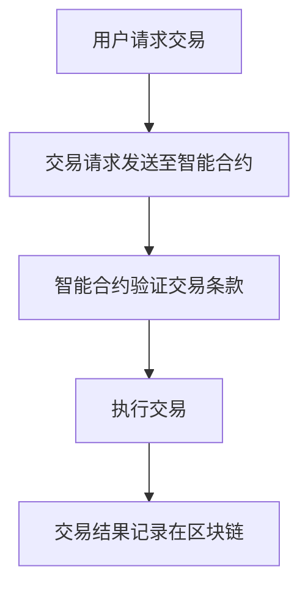

                 

关键词：智能合约，区块链，自动化交易，加密货币，创业，技术趋势。

> 摘要：本文将深入探讨智能合约在自动化交易中的应用，分析其核心技术原理、开发实践，并展望其未来的发展方向和面临的挑战。

## 1. 背景介绍

随着区块链技术的不断发展，智能合约作为一种自动执行的合约，正逐渐成为自动化交易的核心驱动力。智能合约能够通过预先编写的代码，自动执行合同条款，确保交易的安全性和透明性。自动化交易，即利用算法和智能合约实现自动化的金融交易，已经在加密货币市场中初露锋芒。本文将探讨智能合约在自动化交易中的关键作用，分析其核心原理，并探讨其未来发展的可能方向。

## 2. 核心概念与联系

### 2.1 智能合约

智能合约是运行在区块链上的程序，能够自动执行合同条款，确保交易的执行和验证。智能合约的基本原理是利用加密算法和分布式账本技术，实现去中心化的信任机制。

### 2.2 自动化交易

自动化交易是指利用算法和智能合约，自动执行金融交易的过程。自动化交易能够提高交易的效率，减少人为干预，降低交易成本。

### 2.3 区块链

区块链是一种分布式数据库技术，能够确保数据的不可篡改和透明性。区块链的核心技术是加密算法和分布式共识机制。

### 2.4 Mermaid 流程图



## 3. 核心算法原理 & 具体操作步骤

### 3.1 算法原理概述

智能合约的核心算法是 Solidity 编程语言，能够实现合约的编写和执行。Solidity 是一种面向对象的编程语言，具有简单易用的特点。

### 3.2 算法步骤详解

#### 3.2.1 编写智能合约

使用 Solidity 语言编写智能合约，包括定义合约结构、函数和方法。

#### 3.2.2 部署智能合约

将编写好的智能合约部署到区块链上，使其具备执行能力。

#### 3.2.3 执行智能合约

通过调用智能合约的函数，实现自动化交易的执行。

#### 3.2.4 记录交易结果

将交易结果记录在区块链上，确保交易的透明性和不可篡改性。

### 3.3 算法优缺点

#### 优点：

- **去中心化**：智能合约运行在区块链上，去中心化提高了交易的安全性和透明性。
- **自动化执行**：智能合约能够自动执行合同条款，减少人为干预，提高交易效率。

#### 缺点：

- **代码安全性**：智能合约的代码一旦部署，无法更改，存在潜在的安全风险。
- **性能限制**：区块链的网络性能可能无法满足高频交易的实时需求。

### 3.4 算法应用领域

智能合约在加密货币交易、去中心化金融（DeFi）、供应链管理等多个领域具有广泛应用。

## 4. 数学模型和公式 & 详细讲解 & 举例说明

### 4.1 数学模型构建

智能合约的数学模型主要包括密码学算法和博弈论模型。

#### 密码学算法：

- **非对称加密**：用于确保交易数据的机密性和完整性。
- **数字签名**：用于验证交易参与者的身份。

#### 博弈论模型：

- **纳什均衡**：用于分析交易双方在博弈过程中的最优策略。

### 4.2 公式推导过程

假设交易双方为 A 和 B，智能合约为 C。智能合约的执行过程可以表示为以下公式：

\[ C(A, B) = \{ \text{执行结果}, \text{交易金额}, \text{交易时间} \} \]

其中：

- \( A \)：交易请求。
- \( B \)：交易响应。
- \( C \)：智能合约。

### 4.3 案例分析与讲解

以加密货币交易为例，智能合约的执行过程如下：

```latex
C(A, B) = \{ \text{交易成功}, \text{交易金额}, \text{交易时间} \}
```

其中：

- 交易金额：\( A \) 和 \( B \) 的交易金额相等。
- 交易时间：智能合约执行时间不超过预设时间。

## 5. 项目实践：代码实例和详细解释说明

### 5.1 开发环境搭建

1. 安装 Node.js。
2. 安装 Truffle框架。

### 5.2 源代码详细实现

```solidity
pragma solidity ^0.8.0;

contract AutoTrade {
    address public owner;
    mapping(address => uint256) public balances;

    constructor() {
        owner = msg.sender;
    }

    function deposit() public payable {
        balances[msg.sender] += msg.value;
    }

    function withdraw() public {
        require(balances[msg.sender] > 0, "余额不足");
        balances[msg.sender] -= msg.value;
        msg.sender.transfer(msg.value);
    }
}
```

### 5.3 代码解读与分析

1. **合约结构**：定义了合约的 owner 和 balances 变量。
2. **函数**：包括 deposit 和 withdraw 两个函数，用于存储和提取资金。

### 5.4 运行结果展示

通过 Truffle 框架部署合约，并执行 deposit 和 withdraw 函数，验证合约的功能。

## 6. 实际应用场景

### 6.1 加密货币交易

智能合约在加密货币交易中具有广泛的应用，能够实现自动化的交易执行和资金流转。

### 6.2 去中心化金融（DeFi）

智能合约在 DeFi 领域发挥着关键作用，能够实现自动化的金融合约和交易。

### 6.3 供应链管理

智能合约在供应链管理中可以用于自动化的资金流转和物流跟踪。

## 7. 工具和资源推荐

### 7.1 学习资源推荐

- 《区块链技术指南》
- 《智能合约：从入门到精通》

### 7.2 开发工具推荐

- Truffle
- Remix

### 7.3 相关论文推荐

- "Blockchain Technology: A Comprehensive Survey"
- "Smart Contracts: Security and Privacy Analysis"

## 8. 总结：未来发展趋势与挑战

### 8.1 研究成果总结

智能合约在自动化交易中的应用已经取得显著成果，但仍需进一步优化和改进。

### 8.2 未来发展趋势

智能合约有望在更多领域得到应用，推动金融科技的发展。

### 8.3 面临的挑战

智能合约的安全性和性能仍需提升，以适应更广泛的应用需求。

### 8.4 研究展望

未来的研究将重点关注智能合约的安全性和性能优化，以及其在更多领域中的应用探索。

## 9. 附录：常见问题与解答

### 9.1 智能合约安全风险有哪些？

- 漏洞攻击：智能合约代码存在漏洞，可能导致资金损失。
- 恶意合约：攻击者利用恶意合约窃取资金。
- 代码审计：智能合约在部署前需要进行严格的代码审计，以确保安全性。

### 9.2 智能合约如何提升性能？

- 优化合约代码：减少不必要的计算和存储占用。
- 并行执行：优化智能合约的执行流程，实现并行处理。
- 分层架构：采用分层架构，将计算密集型任务迁移至链下执行。

### 9.3 智能合约在哪个领域最具潜力？

智能合约在去中心化金融（DeFi）领域具有巨大的发展潜力，有望成为未来金融科技的基石。

### 9.4 智能合约的监管问题如何解决？

- 制定法规：各国政府和监管机构应制定相关法规，规范智能合约的应用。
- 透明监管：确保智能合约的执行过程透明，便于监管和审计。

---

作者：禅与计算机程序设计艺术 / Zen and the Art of Computer Programming

