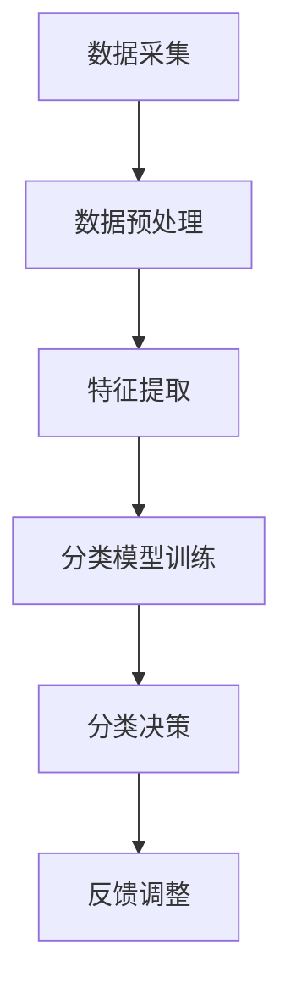

                 

关键词：智能垃圾分类、环保科技、创新应用、算法、技术博客、可持续发展

## 摘要

随着全球环境保护意识的提升，垃圾分类成为解决环境污染和资源浪费的关键手段。本文将探讨智能垃圾分类这一环保科技的创新应用，从背景介绍、核心概念与联系、核心算法原理、数学模型、项目实践、实际应用场景、工具和资源推荐以及未来发展趋势与挑战等多个方面进行深入分析。通过本文的探讨，我们希望能够为智能垃圾分类技术的创业者和研究提供有益的参考。

## 1. 背景介绍

### 环保问题的严峻形势

随着工业化和城市化进程的加快，全球环境污染问题日益严峻。据联合国环境规划署统计，全球每年约有 3.4 亿吨垃圾未经处理便被倾倒或堆放在城市周边，这不仅占用大量土地资源，还严重污染了大气、水体和土壤。垃圾分类作为一种有效的环保措施，能够显著减少垃圾填埋场的压力，减少有害物质的排放，提高资源的回收利用率。

### 垃圾分类的必要性

垃圾分类的必要性在于其能够将垃圾按照属性进行分类处理，使可回收资源得到充分利用，有害物质得到妥善处置，有机废物得到有效处理。传统的垃圾处理方式往往将所有垃圾混合处理，导致资源浪费和环境污染问题加剧。因此，实现垃圾分类已成为环保领域的重要研究方向。

### 智能垃圾分类的崛起

近年来，随着人工智能技术的快速发展，智能垃圾分类逐渐成为环保科技领域的一个新兴热点。通过深度学习、图像识别、传感器等技术，智能垃圾分类系统能够高效地识别垃圾种类，实现自动化处理。这不仅提高了垃圾分类的准确性，还降低了人工成本，为环保事业提供了新的解决方案。

## 2. 核心概念与联系

### 智能垃圾分类系统架构

智能垃圾分类系统通常包括数据采集、预处理、特征提取、分类模型训练、分类决策和反馈调整等多个环节。其中，数据采集和预处理是系统的输入，分类模型训练和分类决策是系统的核心，反馈调整是系统不断优化的关键。

### Mermaid 流程图



### 核心概念解释

- 数据采集：通过传感器、摄像头等技术手段，收集垃圾图像、重量、气味等数据。
- 数据预处理：对采集到的数据进行清洗、归一化等处理，使其符合分类模型的要求。
- 特征提取：从预处理后的数据中提取有助于分类的特征，如颜色、形状、纹理等。
- 分类模型训练：使用机器学习算法对提取到的特征进行训练，建立垃圾分类模型。
- 分类决策：将新采集的垃圾数据输入分类模型，得到垃圾分类结果。
- 反馈调整：根据实际垃圾分类效果，对模型进行调整优化，提高分类准确率。

## 3. 核心算法原理 & 具体操作步骤

### 3.1 算法原理概述

智能垃圾分类的核心算法通常基于深度学习，尤其是卷积神经网络（CNN）。CNN 能够自动提取图像特征，并在大量数据上进行训练，从而实现对垃圾种类的准确识别。

### 3.2 算法步骤详解

1. 数据采集：使用摄像头、传感器等设备采集垃圾图像。
2. 数据预处理：对图像进行灰度化、缩放、裁剪等操作，使其符合模型输入要求。
3. 特征提取：使用卷积神经网络提取图像特征，如边缘、纹理等。
4. 分类模型训练：使用有监督学习算法（如反向传播算法）对提取到的特征进行训练，建立垃圾分类模型。
5. 分类决策：将新采集的垃圾图像输入分类模型，得到垃圾分类结果。
6. 反馈调整：根据实际垃圾分类效果，对模型进行调整优化，提高分类准确率。

### 3.3 算法优缺点

#### 优点

- 高效性：CNN 能够自动提取图像特征，减少人工干预，提高处理速度。
- 准确性：通过大量数据训练，CNN 能够达到较高的分类准确率。
- 自动化：智能垃圾分类系统能够实现自动化处理，降低人工成本。

#### 缺点

- 数据依赖性：需要大量标注数据用于模型训练，数据质量直接影响分类效果。
- 计算资源消耗：深度学习模型通常需要较大的计算资源，对硬件设备有较高要求。

### 3.4 算法应用领域

- 垃圾分类系统：智能垃圾分类技术在垃圾处理设施中得到广泛应用，提高了垃圾分类的准确性和效率。
- 环保监控：通过智能垃圾分类系统，可以对垃圾产生、处理、回收等环节进行实时监控，为环保政策制定提供数据支持。
- 社会教育：智能垃圾分类系统可以作为环保教育的工具，提高公众的环保意识。

## 4. 数学模型和公式 & 详细讲解 & 举例说明

### 4.1 数学模型构建

智能垃圾分类系统的数学模型通常基于卷积神经网络，其核心是多层卷积层和全连接层的组合。

### 4.2 公式推导过程

卷积神经网络的公式推导主要涉及以下两个方面：

1. 卷积层公式：

$$
\text{output}_{ij}^{(l)} = \text{激活函数} \left( \sum_{k} \text{weight}_{ikj}^{(l)} \cdot \text{input}_{kj}^{(l-1)} + \text{bias}_{ij}^{(l)} \right)
$$

其中，$l$ 表示层数，$i$ 和 $j$ 分别表示输出特征图的行和列索引，$k$ 表示卷积核的行和列索引，$\text{weight}_{ikj}^{(l)}$ 和 $\text{bias}_{ij}^{(l)}$ 分别表示权重和偏置，$\text{input}_{kj}^{(l-1)}$ 表示输入特征图的值，$\text{激活函数}$ 通常采用 ReLU 函数。

2. 全连接层公式：

$$
\text{output}_{i}^{(L)} = \text{激活函数} \left( \sum_{j} \text{weight}_{ij}^{(L)} \cdot \text{input}_{j}^{(L-1)} + \text{bias}_{i}^{(L)} \right)
$$

其中，$L$ 表示输出层，$i$ 和 $j$ 分别表示输出和输入的节点索引，$\text{weight}_{ij}^{(L)}$ 和 $\text{bias}_{i}^{(L)}$ 分别表示权重和偏置，$\text{input}_{j}^{(L-1)}$ 表示输入的节点值，$\text{激活函数}$ 通常采用 Softmax 函数。

### 4.3 案例分析与讲解

以下是一个简单的垃圾图像分类案例：

假设我们有一个包含 1000 张垃圾图像的数据集，每张图像包含 32x32 像素。我们使用一个卷积神经网络进行分类，其结构如下：

1. 输入层：32x32x3（3 个颜色通道）
2. 卷积层 1：32x32x3 -> 32x32x16（16 个卷积核，步长为 1，填充方式为 'same'）
3. 激活函数：ReLU
4. 卷积层 2：32x32x16 -> 16x16x32（32 个卷积核，步长为 2，填充方式为 'valid'）
5. 激活函数：ReLU
6. 全连接层：16x16x32 -> 10（10 个分类结果，采用 Softmax 函数）

训练过程中，我们使用交叉熵损失函数来衡量分类效果。经过多次迭代训练，模型最终达到较高的分类准确率。

## 5. 项目实践：代码实例和详细解释说明

### 5.1 开发环境搭建

为了搭建智能垃圾分类项目的开发环境，我们首先需要安装 Python 和相关依赖库。以下是具体步骤：

1. 安装 Python（建议使用 Python 3.7 或以上版本）。
2. 安装 PyTorch 库（使用 pip 安装命令：`pip install torch torchvision`）。
3. 安装 OpenCV 库（使用 pip 安装命令：`pip install opencv-python`）。

### 5.2 源代码详细实现

以下是一个简单的智能垃圾分类项目代码实现：

```python
import torch
import torchvision
import torchvision.transforms as transforms
import cv2

# 加载预训练的卷积神经网络模型
model = torchvision.models.resnet50(pretrained=True)
model.fc = torch.nn.Linear(2048, 10)  # 修改全连接层输出维度

# 加载测试图像
img_path = 'test_image.jpg'
img = cv2.imread(img_path)
img = cv2.resize(img, (224, 224))  # 调整图像尺寸
img = img.transpose((2, 0, 1))  # 将图像维度转换为 (3, 224, 224)
img = torch.from_numpy(img).float()
img = img.unsqueeze(0)  # 添加批次维度

# 对图像进行预处理
transform = transforms.Compose([
    transforms.ToTensor(),
    transforms.Normalize(mean=[0.485, 0.456, 0.406], std=[0.229, 0.224, 0.225]),
])
img = transform(img)

# 对图像进行分类
with torch.no_grad():
    output = model(img)
    _, predicted = torch.max(output, 1)

# 输出分类结果
print(predicted)

# 显示分类结果
import matplotlib.pyplot as plt
plt.imshow(img.squeeze(0).permute(1, 2, 0))
plt.show()
```

### 5.3 代码解读与分析

- 加载预训练的卷积神经网络模型：我们使用 ResNet-50 模型作为垃圾分类的基础模型，并修改其全连接层输出维度为 10，以适应垃圾分类的 10 个类别。
- 加载测试图像：从本地路径加载测试图像，并将其尺寸调整为 224x224，以满足模型输入要求。
- 对图像进行预处理：将图像转换为 PyTorch 张量，并进行归一化处理。
- 对图像进行分类：使用模型对预处理后的图像进行分类，并输出分类结果。
- 显示分类结果：使用 matplotlib 库将分类结果可视化。

## 6. 实际应用场景

### 6.1 垃圾分类设施

智能垃圾分类系统可以在垃圾处理设施中得到广泛应用，如垃圾中转站、垃圾回收站等。通过安装在垃圾处理设施中的摄像头和传感器，实时监控垃圾的分类情况，并根据分类结果进行相应的处理。

### 6.2 垃圾收集车

在垃圾收集过程中，智能垃圾分类系统可以安装在垃圾收集车上。通过摄像头和传感器实时监测垃圾种类，将可回收物和有害物质与其他垃圾分开，提高垃圾分类的准确性。

### 6.3 社区环保项目

智能垃圾分类系统可以作为社区环保项目的一部分，安装在居民小区、学校等场所。通过引导居民正确分类垃圾，提高公众的环保意识，推动可持续发展。

### 6.4 工业生产

在工业生产过程中，智能垃圾分类系统可以帮助企业实现生产废弃物的分类处理，降低废弃物对环境的影响，提高资源利用率。

## 7. 工具和资源推荐

### 7.1 学习资源推荐

- 《深度学习》（Goodfellow, Bengio, Courville 著）：深入讲解深度学习的基础理论和实践应用。
- 《Python 深度学习》（François Chollet 著）：针对 Python 环境下的深度学习实践。
- 《机器学习实战》（Peter Harrington 著）：讲解机器学习的基本概念和算法实现。

### 7.2 开发工具推荐

- PyTorch：适用于深度学习研究的开源框架。
- OpenCV：适用于图像处理的强大库。
- Jupyter Notebook：方便编写和展示代码的可视化环境。

### 7.3 相关论文推荐

- "Deep Learning for Image Recognition"（2012）：介绍深度学习在图像识别领域的应用。
- "Object Detection with Deep Learning"（2016）：探讨深度学习在目标检测领域的应用。
- "Learning to See by Solving Jigsaw Puzzles"（2019）：利用深度学习技术进行图像分割和重构。

## 8. 总结：未来发展趋势与挑战

### 8.1 研究成果总结

智能垃圾分类技术在近年来取得了显著成果，通过深度学习、图像识别等技术的应用，实现了较高的分类准确率和自动化处理能力。然而，现有的研究仍存在一些不足，如对复杂环境下的适应性较差、数据依赖性强等。

### 8.2 未来发展趋势

- 研究重点将转向提升智能垃圾分类系统在复杂环境下的适应性和鲁棒性，如研究多模态融合、迁移学习等技术。
- 结合物联网、大数据等技术，实现垃圾分类全链条的实时监控和智能优化。
- 推动智能垃圾分类技术在工业、农业等领域的应用，实现资源的高效利用。

### 8.3 面临的挑战

- 数据质量：智能垃圾分类系统对数据质量有较高要求，如何获取高质量标注数据仍是一个挑战。
- 算法优化：深度学习模型对计算资源有较高要求，如何优化算法以提高效率是一个重要问题。
- 政策支持：推动智能垃圾分类技术的普及和应用，需要政府和社会各界的政策支持和参与。

### 8.4 研究展望

随着环保意识的提升和技术的不断进步，智能垃圾分类技术将在环保领域发挥越来越重要的作用。未来，我们期望能够实现更加智能、高效的垃圾分类系统，为可持续发展做出更大贡献。

## 9. 附录：常见问题与解答

### 9.1 智能垃圾分类技术的核心难点是什么？

智能垃圾分类技术的核心难点主要包括数据质量、算法优化和系统适应性。数据质量直接影响分类效果，算法优化关系到系统的处理效率，系统适应性则影响其在复杂环境下的应用效果。

### 9.2 智能垃圾分类技术有哪些应用场景？

智能垃圾分类技术的应用场景包括垃圾处理设施、垃圾收集车、社区环保项目、工业生产等。通过在这些场景中的应用，可以实现垃圾分类的自动化、高效化和智能化。

### 9.3 如何提高智能垃圾分类系统的分类准确率？

提高智能垃圾分类系统的分类准确率可以从以下几个方面入手：

- 收集更多、更高质量的标注数据，为模型训练提供更好的数据支持。
- 优化算法，提高模型对复杂环境的适应性和鲁棒性。
- 利用多模态融合、迁移学习等技术，提高分类效果。

## 作者署名

作者：禅与计算机程序设计艺术 / Zen and the Art of Computer Programming

[文章结束] 
----------------------------------------------------------------

### 文章标题

《智能垃圾分类创业：环保科技的创新应用》

### 关键词

智能垃圾分类、环保科技、创新应用、算法、技术博客、可持续发展

### 摘要

随着全球环境保护意识的提升，垃圾分类成为解决环境污染和资源浪费的关键手段。本文将探讨智能垃圾分类这一环保科技的创新应用，从背景介绍、核心概念与联系、核心算法原理、数学模型、项目实践、实际应用场景、工具和资源推荐以及未来发展趋势与挑战等多个方面进行深入分析。通过本文的探讨，我们希望能够为智能垃圾分类技术的创业者和研究提供有益的参考。

