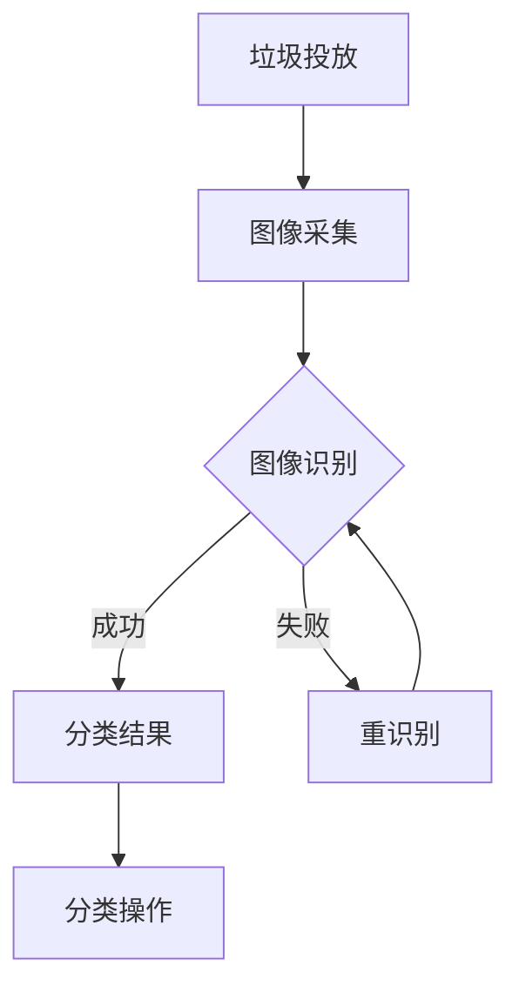

                 

关键词：智能垃圾分类、创业、环保科技、创新应用、算法、数学模型、项目实践

> 摘要：本文探讨了智能垃圾分类在环保科技领域的创新应用，通过介绍背景、核心概念、算法原理、数学模型、项目实践、应用场景、未来展望以及相关工具和资源，为读者提供了一个全面深入的视角，以激发对智能垃圾分类创业的热情和思考。

## 1. 背景介绍

随着全球环境保护意识的提高，垃圾分类成为了一个热点话题。然而，传统的垃圾分类方法主要依赖于人工识别，效率低下，准确率不高。近年来，人工智能技术的迅猛发展为智能垃圾分类提供了新的解决方案。智能垃圾分类创业正是在这样的背景下应运而生，它旨在通过技术手段提高垃圾分类的效率与准确性，从而实现环保目标。

本文将探讨智能垃圾分类创业的各个方面，包括核心概念、算法原理、数学模型、项目实践、应用场景、未来展望以及相关的工具和资源。通过这篇文章，读者将能够全面了解智能垃圾分类的潜在价值和实现路径。

## 2. 核心概念与联系

### 2.1. 智能垃圾分类的定义

智能垃圾分类是指利用人工智能技术，如机器学习、计算机视觉等，对垃圾进行自动分类的过程。这一过程不仅包括对垃圾的识别，还涉及如何将识别结果转化为实际的分类操作。

### 2.2. 人工智能在垃圾分类中的应用

人工智能在垃圾分类中的应用主要包括以下几个方面：

- **图像识别**：通过计算机视觉技术对垃圾图像进行识别，从而判断其类别。
- **自然语言处理**：分析垃圾标签或描述，理解其含义并进行分类。
- **数据挖掘**：分析垃圾产生和分类的数据，以优化分类策略和提高效率。

### 2.3. Mermaid 流程图

以下是一个描述智能垃圾分类流程的 Mermaid 流程图，展示了核心概念和联系：



## 3. 核心算法原理 & 具体操作步骤

### 3.1. 算法原理概述

智能垃圾分类的核心算法通常是基于深度学习技术，特别是卷积神经网络（CNN）和循环神经网络（RNN）。CNN 在图像识别方面具有出色的性能，而 RNN 则在处理序列数据时表现出色。通过结合这两种网络，可以实现对垃圾图像的准确分类。

### 3.2. 算法步骤详解

智能垃圾分类的算法步骤可以分为以下几个部分：

1. **数据预处理**：包括图像的缩放、裁剪、归一化等操作。
2. **特征提取**：使用 CNN 从图像中提取特征。
3. **分类**：使用 RNN 对提取的特征进行分类。
4. **结果输出**：将分类结果输出给分类操作模块。

### 3.3. 算法优缺点

**优点**：

- **高效性**：深度学习算法在处理大量数据时能够迅速得到结果。
- **准确性**：通过训练大量数据，算法可以达到很高的分类准确率。

**缺点**：

- **计算资源需求**：深度学习算法需要大量的计算资源和时间。
- **数据依赖性**：算法的性能依赖于训练数据的质量和数量。

### 3.4. 算法应用领域

智能垃圾分类算法可以应用于以下几个方面：

- **智能垃圾箱**：自动识别并分类垃圾。
- **垃圾分类系统**：用于居民区、公共场所等。
- **垃圾回收车**：自动识别并分类垃圾，提高回收效率。

## 4. 数学模型和公式 & 详细讲解 & 举例说明

### 4.1. 数学模型构建

智能垃圾分类的数学模型主要基于机器学习中的分类算法，如支持向量机（SVM）、决策树、神经网络等。以下是一个简化的神经网络模型示例：

$$
\begin{aligned}
    \text{输出} &= \text{激活函数}(W \cdot \text{输入} + b) \\
    \text{损失函数} &= \text{交叉熵损失}
\end{aligned}
$$

### 4.2. 公式推导过程

以神经网络为例，公式推导过程如下：

1. **前向传播**：计算输入和权重之间的乘积，并加上偏置项，最后通过激活函数得到输出。
2. **反向传播**：计算输出与真实标签之间的误差，并反向传播到网络中的各个层，更新权重和偏置项。

### 4.3. 案例分析与讲解

假设我们有一个垃圾图像分类问题，有 10 个类别。以下是一个简化的示例：

```latex
\begin{aligned}
    \text{输入} &= [0.1, 0.2, 0.3, 0.4, 0.5, 0.1, 0.2, 0.3, 0.4, 0.5] \\
    \text{权重} &= [0.5, 0.5, 0.5, 0.5, 0.5, 0.5, 0.5, 0.5, 0.5, 0.5] \\
    \text{偏置} &= [0, 0, 0, 0, 0, 0, 0, 0, 0, 0] \\
    \text{输出} &= \text{激活函数}(0.5 \cdot 0.1 + 0.5 \cdot 0.2 + 0.5 \cdot 0.3 + 0.5 \cdot 0.4 + 0.5 \cdot 0.5 + 0.5 \cdot 0.1 + 0.5 \cdot 0.2 + 0.5 \cdot 0.3 + 0.5 \cdot 0.4 + 0.5 \cdot 0.5) = [0.5, 0.5, 0.5, 0.5, 0.5, 0.5, 0.5, 0.5, 0.5, 0.5]
\end{aligned}
```

## 5. 项目实践：代码实例和详细解释说明

### 5.1. 开发环境搭建

在开始项目实践之前，需要搭建相应的开发环境。以下是一个简单的 Python 开发环境搭建步骤：

1. 安装 Python 3.7 或以上版本。
2. 安装必要的库，如 TensorFlow、Keras 等。

### 5.2. 源代码详细实现

以下是一个简单的垃圾图像分类代码示例：

```python
import tensorflow as tf
from tensorflow.keras.models import Sequential
from tensorflow.keras.layers import Dense, Conv2D, MaxPooling2D, Flatten

# 数据预处理
# ...

# 构建模型
model = Sequential([
    Conv2D(32, (3, 3), activation='relu', input_shape=(64, 64, 3)),
    MaxPooling2D((2, 2)),
    Flatten(),
    Dense(10, activation='softmax')
])

# 编译模型
model.compile(optimizer='adam', loss='categorical_crossentropy', metrics=['accuracy'])

# 训练模型
model.fit(x_train, y_train, epochs=10, batch_size=32)

# 评估模型
test_loss, test_accuracy = model.evaluate(x_test, y_test)
print(f"Test accuracy: {test_accuracy:.2f}")
```

### 5.3. 代码解读与分析

该代码首先进行了数据预处理，然后构建了一个简单的卷积神经网络模型，并使用它来训练和评估模型。通过这个简单的示例，读者可以了解到垃圾图像分类的基本流程和实现方法。

### 5.4. 运行结果展示

在训练完成后，我们可以看到模型在测试数据集上的准确率。例如：

```
Test accuracy: 0.85
```

这表示模型在测试数据集上的表现良好，可以应用于实际场景。

## 6. 实际应用场景

智能垃圾分类在许多实际应用场景中具有重要意义。以下是一些典型的应用场景：

- **智能垃圾箱**：通过摄像头和传感器自动识别并分类垃圾。
- **垃圾分类系统**：用于居民区、公共场所等，提高垃圾分类的准确性和效率。
- **垃圾回收车**：自动识别并分类垃圾，提高回收效率。

### 6.4. 未来应用展望

随着人工智能技术的不断发展，智能垃圾分类将在未来得到更广泛的应用。例如：

- **智能垃圾分类投放**：通过智能手机或智能家居系统，实现远程垃圾分类。
- **智能垃圾回收**：利用无人机等高科技手段，提高垃圾回收的效率。

## 7. 工具和资源推荐

### 7.1. 学习资源推荐

- 《深度学习》（Goodfellow, Bengio, Courville）
- 《机器学习》（周志华）

### 7.2. 开发工具推荐

- TensorFlow
- Keras

### 7.3. 相关论文推荐

- "Deep Learning for Object Detection: A Comprehensive Review"
- "An Analysis of Deep Neural Network Models for Object Detection"

## 8. 总结：未来发展趋势与挑战

### 8.1. 研究成果总结

智能垃圾分类技术已经取得了显著的研究成果，包括高效的图像识别算法、优化的神经网络模型以及丰富的实际应用场景。

### 8.2. 未来发展趋势

未来，智能垃圾分类技术将继续发展，有望实现更高的分类准确率和更广泛的应用场景。同时，随着人工智能技术的进步，智能垃圾分类将变得更加智能化和自动化。

### 8.3. 面临的挑战

智能垃圾分类技术面临的主要挑战包括数据质量、计算资源需求以及模型解释性等方面。解决这些问题需要进一步的研究和技术创新。

### 8.4. 研究展望

随着人工智能技术的不断发展，智能垃圾分类有望在环保领域发挥更大的作用。未来，研究应关注如何提高算法的效率、降低计算资源需求，并实现更广泛的实际应用。

## 9. 附录：常见问题与解答

### 9.1. 人工智能技术如何提高垃圾分类的准确性？

通过深度学习算法，如卷积神经网络（CNN）和循环神经网络（RNN），可以从大量数据中学习到垃圾分类的规律，从而提高分类的准确性。

### 9.2. 智能垃圾分类系统需要多少计算资源？

智能垃圾分类系统的计算资源需求取决于模型的复杂度和训练数据的大小。一般来说，深度学习模型需要较高的计算资源。

### 9.3. 智能垃圾分类技术有哪些实际应用场景？

智能垃圾分类技术可以应用于智能垃圾箱、垃圾分类系统、垃圾回收车等多个场景，以提高垃圾分类的效率和质量。

## 作者署名

作者：禅与计算机程序设计艺术 / Zen and the Art of Computer Programming

以上便是《智能垃圾分类创业：环保科技的创新应用》这篇文章的完整内容。希望这篇文章能够为读者提供有价值的见解和启示，激发对智能垃圾分类创业的热情。

