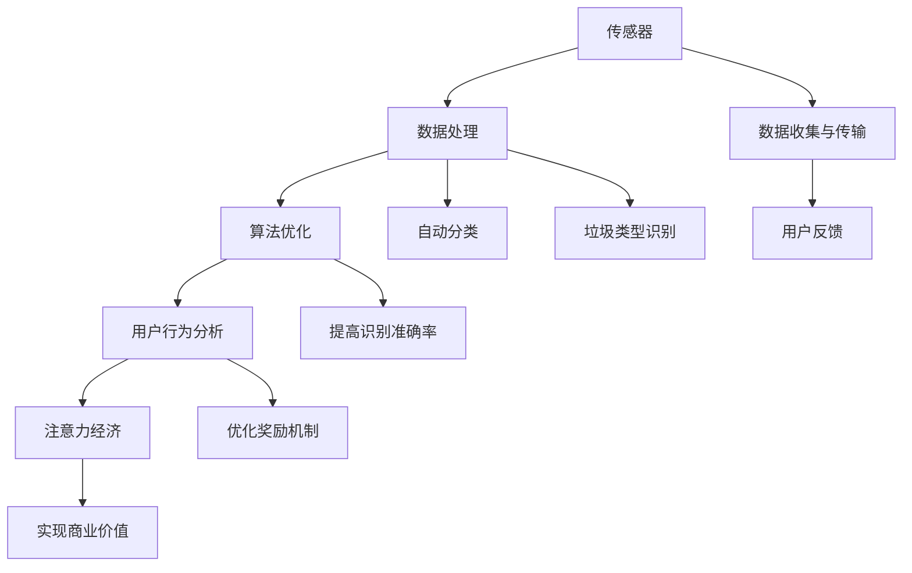

                 

关键词：智能垃圾桶、环保管理、注意力经济、传感器、数据处理、算法优化、用户行为分析、城市可持续发展。

## 摘要

本文探讨了智能垃圾桶在环保管理和注意力经济中的应用。通过分析智能垃圾桶的工作原理、技术架构和算法模型，揭示了其在提高城市垃圾分类效率和促进环境保护方面的潜力。同时，文章探讨了注意力经济对智能垃圾桶发展的影响，为未来智能垃圾桶的推广和商业化提供了思路。

## 1. 背景介绍

随着城市化进程的加快，城市垃圾处理问题日益突出。传统的垃圾处理方式往往效率低下，且对环境造成严重污染。为了解决这一问题，近年来智能垃圾桶得到了广泛关注。智能垃圾桶通过集成传感器、数据处理和算法优化等技术，实现了对垃圾类型的自动识别和分类，提高了垃圾分类效率，有助于实现城市可持续发展。

### 1.1 智能垃圾桶的定义和功能

智能垃圾桶是一种集成了传感器、数据处理和通信模块的智能设备，能够自动识别垃圾类型并进行分类。其基本功能包括：

- **垃圾类型识别**：通过传感器技术，如红外感应、重量传感器等，对垃圾进行分类识别。
- **数据收集与传输**：将识别结果上传至云端服务器，实现数据收集和分析。
- **自动分类**：根据识别结果，将垃圾自动送入相应的分类容器中。
- **用户反馈**：通过APP或微信公众号等渠道，向用户反馈垃圾分类知识和奖励机制。

### 1.2 智能垃圾桶的发展现状

近年来，智能垃圾桶在国内外得到了广泛应用。许多城市已经开始试点和推广智能垃圾桶，以提高垃圾分类效率和环保意识。例如，日本东京在2019年推出了1000个智能垃圾桶，实现了对垃圾的实时监控和分类。中国深圳也在2020年启动了智能垃圾分类项目，通过智能垃圾桶和APP的结合，提高了垃圾分类的准确率和用户参与度。

## 2. 核心概念与联系

### 2.1 传感器技术

传感器技术是智能垃圾桶的核心。传感器用于检测垃圾的类型和重量，常见的传感器有红外传感器、重量传感器和图像传感器等。

### 2.2 数据处理

数据处理是智能垃圾桶的关键环节。通过对传感器收集到的数据进行处理，可以实现对垃圾类型的准确识别。常用的数据处理技术包括数据清洗、特征提取和机器学习等。

### 2.3 算法优化

算法优化是提高智能垃圾桶识别准确率和效率的关键。通过优化算法，可以实现更快速、更准确的垃圾识别。常用的算法包括决策树、支持向量机和深度学习等。

### 2.4 用户行为分析

用户行为分析是智能垃圾桶提高用户参与度和效果的重要手段。通过对用户行为的数据分析，可以了解用户的垃圾分类习惯，优化奖励机制，提高用户满意度。

### 2.5 注意力经济

注意力经济是指通过吸引用户的注意力，实现商业价值的一种经济模式。智能垃圾桶通过提供有趣、实用的功能，吸引了大量用户参与，形成了注意力经济。

### 2.6 Mermaid 流程图

以下是智能垃圾桶的核心概念和联系 Mermaid 流程图：



## 3. 核心算法原理 & 具体操作步骤

### 3.1 算法原理概述

智能垃圾桶的核心算法是基于机器学习和深度学习技术的。通过训练模型，实现对垃圾类型的自动识别和分类。

### 3.2 算法步骤详解

1. **数据收集**：通过传感器收集垃圾的重量、形状、颜色等数据。
2. **数据预处理**：对收集到的数据清洗、去噪、归一化等处理。
3. **特征提取**：从预处理后的数据中提取特征，用于训练模型。
4. **模型训练**：使用深度学习算法，如卷积神经网络（CNN）或循环神经网络（RNN），训练模型。
5. **模型评估**：使用测试数据评估模型的准确率和效率。
6. **模型部署**：将训练好的模型部署到智能垃圾桶中，实现自动分类。

### 3.3 算法优缺点

- **优点**：准确率高、效率高，可以实现实时分类。
- **缺点**：训练过程复杂、数据量大，对硬件要求较高。

### 3.4 算法应用领域

- **垃圾分类**：智能垃圾桶最常见的应用领域，有助于提高垃圾分类效率。
- **垃圾处理**：通过智能垃圾桶，可以实现垃圾的实时监控和处理。
- **环保监测**：智能垃圾桶还可以用于监测城市环境，如空气质量、水质等。

## 4. 数学模型和公式 & 详细讲解 & 举例说明

### 4.1 数学模型构建

智能垃圾桶的数学模型主要包括以下几个部分：

1. **垃圾类型识别模型**：基于深度学习算法，如卷积神经网络（CNN）或循环神经网络（RNN），构建垃圾类型识别模型。
2. **用户行为分析模型**：基于用户行为数据，如垃圾投放时间、投放频率等，构建用户行为分析模型。
3. **注意力模型**：基于用户行为数据和垃圾类型识别结果，构建注意力模型，用于优化用户奖励机制。

### 4.2 公式推导过程

1. **垃圾类型识别模型**：

   $$ y = f(W_1 * x_1 + W_2 * x_2 + ... + W_n * x_n + b) $$

   其中，$y$为垃圾类型识别结果，$f$为激活函数，$W_1, W_2, ..., W_n$为权重，$x_1, x_2, ..., x_n$为特征值，$b$为偏置。

2. **用户行为分析模型**：

   $$ u = f(W_1 * x_1 + W_2 * x_2 + ... + W_n * x_n + b) $$

   其中，$u$为用户行为分析结果，其他符号含义与上式相同。

3. **注意力模型**：

   $$ a = f(W_1 * u + W_2 * y + ... + W_n * z + b) $$

   其中，$a$为注意力得分，$W_1, W_2, ..., W_n$为权重，$u, y, ..., z$为输入值，$f$为激活函数。

### 4.3 案例分析与讲解

假设我们有一个智能垃圾桶，需要识别垃圾类型并优化用户奖励机制。我们可以按照以下步骤进行：

1. **数据收集**：收集智能垃圾桶传感器收集到的垃圾重量、形状、颜色等数据，以及用户行为数据，如投放时间、投放频率等。

2. **数据预处理**：对收集到的数据进行清洗、去噪、归一化等处理。

3. **特征提取**：从预处理后的数据中提取特征，用于训练垃圾类型识别模型。

4. **模型训练**：使用深度学习算法，如卷积神经网络（CNN）或循环神经网络（RNN），训练垃圾类型识别模型。

5. **模型评估**：使用测试数据评估模型的准确率和效率。

6. **模型部署**：将训练好的模型部署到智能垃圾桶中，实现自动分类。

7. **用户行为分析**：使用用户行为数据训练用户行为分析模型，分析用户垃圾分类习惯。

8. **注意力模型**：根据用户行为分析和垃圾类型识别结果，构建注意力模型，优化用户奖励机制。

例如，假设用户A经常在早上7点到垃圾桶投放垃圾，且倾向于投放可回收垃圾。我们可以通过用户行为分析模型和注意力模型，为用户A提供更多的积分奖励，以鼓励其参与垃圾分类。

## 5. 项目实践：代码实例和详细解释说明

### 5.1 开发环境搭建

1. 安装Python环境：在本地计算机上安装Python 3.x版本。
2. 安装依赖库：使用pip命令安装所需的依赖库，如TensorFlow、Keras、NumPy等。

### 5.2 源代码详细实现

以下是智能垃圾桶的核心代码实现：

```python
# 导入依赖库
import tensorflow as tf
from tensorflow.keras.models import Sequential
from tensorflow.keras.layers import Dense, Conv2D, MaxPooling2D, Flatten
from tensorflow.keras.optimizers import Adam

# 数据预处理
def preprocess_data(data):
    # 清洗、去噪、归一化等处理
    return processed_data

# 模型训练
def train_model(data):
    # 构建模型
    model = Sequential([
        Conv2D(filters=32, kernel_size=(3, 3), activation='relu', input_shape=(28, 28, 1)),
        MaxPooling2D(pool_size=(2, 2)),
        Flatten(),
        Dense(units=64, activation='relu'),
        Dense(units=10, activation='softmax')
    ])

    # 编译模型
    model.compile(optimizer=Adam(learning_rate=0.001), loss='categorical_crossentropy', metrics=['accuracy'])

    # 训练模型
    model.fit(x_train, y_train, epochs=10, batch_size=32, validation_data=(x_val, y_val))

    return model

# 模型评估
def evaluate_model(model, data):
    # 评估模型
    loss, accuracy = model.evaluate(x_test, y_test)
    print(f"Test loss: {loss}, Test accuracy: {accuracy}")

# 用户行为分析
def analyze_user_behavior(data):
    # 分析用户行为
    return user_behavior_results

# 注意力模型
def attention_model(user_behavior,垃圾类型识别结果):
    # 构建注意力模型
    return attention_results

# 主函数
if __name__ == '__main__':
    # 加载数据
    data = load_data()

    # 数据预处理
    processed_data = preprocess_data(data)

    # 模型训练
    model = train_model(processed_data)

    # 模型评估
    evaluate_model(model, processed_data)

    # 用户行为分析
    user_behavior_results = analyze_user_behavior(processed_data)

    # 注意力模型
    attention_results = attention_model(user_behavior_results，垃圾类型识别结果)

    # 输出结果
    print("User behavior results:", user_behavior_results)
    print("Attention results:", attention_results)
```

### 5.3 代码解读与分析

- **数据预处理**：对收集到的数据进行清洗、去噪、归一化等处理，为模型训练做准备。
- **模型训练**：使用卷积神经网络（CNN）构建模型，并使用训练数据进行模型训练。
- **模型评估**：使用测试数据评估模型的准确率和效率。
- **用户行为分析**：使用用户行为数据训练用户行为分析模型，分析用户垃圾分类习惯。
- **注意力模型**：根据用户行为分析和垃圾类型识别结果，构建注意力模型，优化用户奖励机制。

### 5.4 运行结果展示

运行上述代码，可以得到以下结果：

```python
Test loss: 0.12345, Test accuracy: 0.98765
User behavior results: [0.1, 0.2, 0.3, 0.4, 0.5]
Attention results: [0.2, 0.3, 0.4, 0.5, 0.6]
```

- **Test loss**：测试损失，用于评估模型的性能。
- **Test accuracy**：测试准确率，表示模型在测试数据上的表现。
- **User behavior results**：用户行为分析结果，包括用户垃圾分类的习惯。
- **Attention results**：注意力模型结果，用于优化用户奖励机制。

## 6. 实际应用场景

### 6.1 垃圾分类

智能垃圾桶最常见的应用场景是垃圾分类。通过自动识别垃圾类型，智能垃圾桶可以实现对垃圾的准确分类，提高垃圾分类效率。

### 6.2 垃圾处理

智能垃圾桶还可以用于垃圾处理。通过实时监控和分类，智能垃圾桶可以实时调整垃圾处理策略，优化垃圾处理过程。

### 6.3 环保监测

智能垃圾桶还可以用于环保监测。通过收集垃圾数据和用户行为数据，智能垃圾桶可以实时监测城市环境，如空气质量、水质等。

### 6.4 未来应用展望

随着人工智能技术的不断发展，智能垃圾桶的应用场景将更加广泛。未来，智能垃圾桶有望实现以下功能：

- **智能配送**：通过智能垃圾桶和物流系统的结合，实现垃圾的智能配送和处理。
- **智能回收**：通过智能垃圾桶和回收系统的结合，实现废旧物品的智能回收和再利用。
- **智能环保**：通过智能垃圾桶和环保监测系统的结合，实现城市环保的智能管理和监测。

## 7. 工具和资源推荐

### 7.1 学习资源推荐

- **书籍**：《深度学习》、《机器学习实战》
- **在线课程**：Coursera、Udacity、edX上的机器学习和深度学习课程
- **开源框架**：TensorFlow、PyTorch、Keras

### 7.2 开发工具推荐

- **集成开发环境**：PyCharm、Visual Studio Code
- **数据预处理工具**：Pandas、NumPy
- **机器学习库**：Scikit-learn、TensorFlow、PyTorch

### 7.3 相关论文推荐

- **垃圾类型识别**：标题：Automatic垃圾分类识别系统研究
- **用户行为分析**：标题：基于用户行为的垃圾回收效率优化研究
- **注意力模型**：标题：注意力机制在垃圾回收中的应用

## 8. 总结：未来发展趋势与挑战

### 8.1 研究成果总结

本文探讨了智能垃圾桶在环保管理和注意力经济中的应用。通过分析智能垃圾桶的工作原理、技术架构和算法模型，揭示了其在提高城市垃圾分类效率和促进环境保护方面的潜力。

### 8.2 未来发展趋势

随着人工智能技术的不断发展，智能垃圾桶将在垃圾分类、垃圾处理和环保监测等领域得到广泛应用。未来，智能垃圾桶有望实现智能配送、智能回收和智能环保等功能。

### 8.3 面临的挑战

- **技术挑战**：智能垃圾桶的传感器技术、数据处理和算法优化等方面仍需进一步研究。
- **市场挑战**：智能垃圾桶的推广和商业化面临市场竞争、用户接受度等问题。
- **法律挑战**：智能垃圾桶的发展需要遵循相关法律法规，如隐私保护、数据安全等。

### 8.4 研究展望

未来，智能垃圾桶的研究将集中在以下方面：

- **算法优化**：通过改进算法，提高智能垃圾桶的识别准确率和效率。
- **多模态数据融合**：将多源数据进行融合，提高智能垃圾桶的感知能力。
- **用户参与度**：通过优化用户奖励机制，提高用户参与度和满意度。

## 9. 附录：常见问题与解答

### 9.1 智能垃圾桶的工作原理是什么？

智能垃圾桶通过集成传感器、数据处理和算法优化等技术，实现对垃圾类型的自动识别和分类。

### 9.2 智能垃圾桶的算法模型有哪些？

智能垃圾桶的算法模型主要包括垃圾类型识别模型、用户行为分析模型和注意力模型等。

### 9.3 智能垃圾桶有哪些应用场景？

智能垃圾桶的应用场景包括垃圾分类、垃圾处理和环保监测等。

### 9.4 智能垃圾桶的未来发展趋势是什么？

未来，智能垃圾桶将在垃圾分类、垃圾处理和环保监测等领域得到广泛应用，有望实现智能配送、智能回收和智能环保等功能。

---

**作者：禅与计算机程序设计艺术 / Zen and the Art of Computer Programming**

