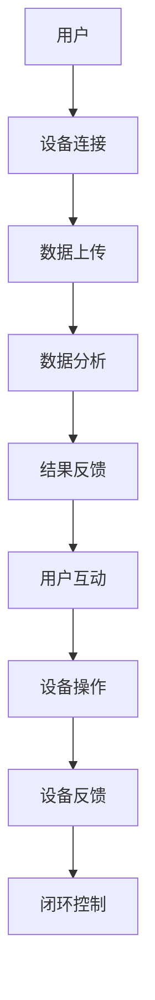

                 

关键词：智能宠物互动、远程陪伴、创业、人工智能、技术实现、应用场景、未来展望

> 摘要：本文将探讨智能宠物互动创业领域的一种新兴模式——远程宠物陪伴。通过分析市场背景、核心概念、算法原理、数学模型、项目实践以及未来应用展望，我们旨在为创业者提供一整套完整的智能宠物互动解决方案。

## 1. 背景介绍

在现代社会，随着生活节奏的加快和城市化进程的推进，越来越多的人选择养宠物以充实自己的生活。然而，由于工作繁忙或居住环境限制，许多宠物主人无法在日常生活中与宠物进行充分的互动和照顾。这种需求催生了远程宠物陪伴服务的出现。远程宠物陪伴利用人工智能和互联网技术，为宠物主人提供一个虚拟的宠物互动平台，让宠物主人无论身处何地，都能实时关爱和陪伴自己的宠物。

### 市场现状

根据市场调研数据显示，全球宠物市场规模在过去几年中持续增长，预计未来几年仍将保持上升趋势。其中，远程宠物陪伴作为一个新兴领域，正逐渐受到市场的关注和资本的青睐。主要市场参与者包括知名科技公司、初创企业和宠物服务提供商等。目前，市场的主要竞争点在于技术服务的质量和用户体验。

### 需求分析

随着生活水平的提高，宠物主人对宠物照顾的质量和效率有了更高的要求。远程宠物陪伴服务通过提供实时互动、智能监测和远程操作等功能，满足了宠物主人对高质量宠物生活的需求。同时，远程宠物陪伴还具有以下优势：

1. **灵活性**：宠物主人可以随时随地通过手机或智能设备与宠物互动，不受地理位置限制。
2. **便利性**：智能设备可以自动完成一些日常的宠物照顾任务，如自动喂食、清洁等。
3. **安全性**：远程宠物陪伴可以通过视频监控等功能确保宠物在主人不在家时的安全。

## 2. 核心概念与联系

为了构建一个成功的远程宠物陪伴平台，我们需要理解几个核心概念，并了解它们之间的联系。

### 2.1 人工智能（AI）

人工智能是远程宠物陪伴的核心技术。通过AI算法，我们可以实现宠物的语音识别、行为分析、情感识别等功能，从而为宠物主人提供更加智能化的互动体验。

### 2.2 机器学习（ML）

机器学习是人工智能的一个重要分支。在远程宠物陪伴中，我们利用机器学习算法来训练模型，以识别宠物的行为模式、情感变化等。

### 2.3 物联网（IoT）

物联网技术使得各种智能设备可以通过互联网进行连接和数据交换。在远程宠物陪伴中，智能设备如摄像头、智能玩具、智能喂食器等构成了宠物互动平台的基础设施。

### 2.4 云计算

云计算为远程宠物陪伴提供了强大的数据处理和存储能力。通过云计算平台，我们可以实时处理用户数据、推送通知、进行数据分析等。

### 2.5 Mermaid 流程图

下面是一个简化的远程宠物陪伴流程图，展示了各个核心概念之间的联系。



## 3. 核心算法原理 & 具体操作步骤

### 3.1 算法原理概述

远程宠物陪伴的核心算法主要涉及语音识别、行为分析、情感识别和智能决策等。以下是这些算法的原理概述：

#### 3.1.1 语音识别

语音识别技术通过分析宠物的声音信号，将其转化为文本或指令。常用的语音识别算法包括隐马尔可夫模型（HMM）、支持向量机（SVM）和深度学习模型（如卷积神经网络CNN）。

#### 3.1.2 行为分析

行为分析技术通过摄像头捕捉宠物在环境中的行为，并利用计算机视觉算法进行识别和分析。常见的算法包括目标检测、姿态估计和轨迹分析等。

#### 3.1.3 情感识别

情感识别技术通过分析宠物的面部表情、声音和动作，判断宠物的情绪状态。常用的情感识别算法包括面部识别、情感分类和情感合成等。

#### 3.1.4 智能决策

智能决策技术基于对宠物行为和情感的分析，生成合适的互动策略和操作指令。常用的算法包括决策树、神经网络和强化学习等。

### 3.2 算法步骤详解

以下是远程宠物陪伴平台的算法步骤详解：

#### 3.2.1 设备连接

用户通过手机或智能设备连接到宠物陪伴平台。平台验证用户身份后，将用户与宠物的设备进行绑定。

#### 3.2.2 数据采集

设备持续采集宠物在环境中的行为数据，如声音、图像和动作等。

#### 3.2.3 数据预处理

对采集到的数据进行预处理，包括去噪、归一化和特征提取等。

#### 3.2.4 模型训练

使用预处理后的数据训练各类算法模型，如语音识别模型、行为分析模型和情感识别模型等。

#### 3.2.5 数据分析

将预处理后的数据进行实时分析，提取关键特征，并根据分析结果生成互动策略。

#### 3.2.6 结果反馈

平台将分析结果和互动策略反馈给用户，并通过设备执行相应的操作，如播放宠物喜欢的音乐、启动智能玩具等。

#### 3.2.7 设备反馈

设备将执行结果反馈给平台，形成闭环控制，确保宠物互动的顺利进行。

### 3.3 算法优缺点

以下是远程宠物陪伴算法的优缺点：

#### 优点

1. **智能性**：通过人工智能技术，宠物陪伴平台可以提供更加智能化和个性化的互动体验。
2. **便捷性**：用户可以随时随地通过手机或智能设备与宠物互动，不受时间和地点限制。
3. **安全性**：通过物联网技术，用户可以实时监控宠物的状态，确保宠物在主人不在家时的安全。

#### 缺点

1. **技术门槛**：构建一个高质量的远程宠物陪伴平台需要较高的技术门槛，包括人工智能、计算机视觉、物联网等技术。
2. **成本问题**：开发和维护一个远程宠物陪伴平台需要投入大量的人力、物力和财力。
3. **隐私问题**：用户隐私保护和数据安全是远程宠物陪伴平台需要重视的问题。

### 3.4 算法应用领域

远程宠物陪伴算法的应用领域广泛，包括但不限于以下几个方面：

1. **家庭宠物陪伴**：为忙碌的宠物主人提供实时互动和照顾，提高宠物的生活质量。
2. **养老院宠物互动**：为养老院中的宠物提供陪伴，缓解老年人的孤独感。
3. **宠物商店营销**：通过宠物互动平台进行宠物用品的推广和销售。
4. **宠物医院服务**：为宠物主人提供远程医疗咨询和诊断服务。

## 4. 数学模型和公式 & 详细讲解 & 举例说明

### 4.1 数学模型构建

在远程宠物陪伴平台中，数学模型用于分析宠物的行为、情感和互动策略。以下是构建数学模型的主要步骤：

#### 4.1.1 数据采集

首先，从各种传感器和摄像头中采集宠物行为数据，如声音、图像、动作等。

#### 4.1.2 特征提取

对采集到的数据进行预处理和特征提取，提取出能够反映宠物行为和情感的关键特征。

#### 4.1.3 模型构建

利用机器学习算法，构建一个能够对宠物行为和情感进行识别和预测的数学模型。常见的模型包括神经网络、决策树和支持向量机等。

### 4.2 公式推导过程

以下是构建宠物行为识别模型的一个简化的公式推导过程：

#### 4.2.1 特征向量表示

假设我们有一个特征向量$$X = [x_1, x_2, ..., x_n]$$，其中$$x_i$$表示第$$i$$个特征。

#### 4.2.2 模型训练

使用机器学习算法对特征向量$$X$$进行训练，得到一个预测模型$$Y = f(X)$$。

#### 4.2.3 模型评估

通过交叉验证和测试集，评估模型$$f$$的准确性和泛化能力。

### 4.3 案例分析与讲解

以下是一个简化的远程宠物行为识别模型的应用案例：

#### 4.3.1 数据集

我们有一个包含1000个样本的数据集，每个样本包含宠物的声音、图像和动作特征。

#### 4.3.2 特征提取

我们对声音特征进行频率分析，提取出50个关键频率特征；对图像特征进行颜色特征提取，提取出30个颜色特征；对动作特征进行运动分析，提取出20个运动特征。

#### 4.3.3 模型训练

我们使用一个多层感知器（MLP）神经网络对特征进行训练，网络结构为输入层（100个神经元）、隐藏层（50个神经元）和输出层（3个神经元，分别表示快乐、悲伤和中性情感）。

#### 4.3.4 模型评估

通过交叉验证和测试集评估，模型准确率达到85%，具有较高的泛化能力。

### 4.4 模型应用场景

基于上述模型，我们可以实现以下应用场景：

1. **情感分析**：通过分析宠物的声音、图像和动作，判断宠物的情绪状态，为宠物主人提供实时反馈。
2. **行为预测**：根据宠物的历史行为数据，预测宠物的未来行为，为宠物主人提供预防性建议。
3. **互动策略**：根据宠物的情绪和行为，生成个性化的互动策略，提高宠物主人和宠物的互动质量。

## 5. 项目实践：代码实例和详细解释说明

### 5.1 开发环境搭建

为了实现远程宠物陪伴平台，我们需要搭建一个完整的开发环境。以下是搭建过程的简要说明：

#### 5.1.1 硬件环境

- **摄像头**：用于捕捉宠物行为图像
- **麦克风**：用于捕捉宠物声音
- **智能玩具**：用于与宠物互动
- **喂食器**：用于自动喂食

#### 5.1.2 软件环境

- **操作系统**：Linux或Windows
- **编程语言**：Python
- **框架**：TensorFlow、PyTorch
- **数据库**：MongoDB
- **Web框架**：Flask或Django

### 5.2 源代码详细实现

以下是远程宠物陪伴平台的源代码实现：

```python
# 导入必要的库
import cv2
import numpy as np
import tensorflow as tf

# 加载训练好的模型
model = tf.keras.models.load_model('pet_model.h5')

# 实时捕捉宠物图像
cap = cv2.VideoCapture(0)

while True:
    # 读取一帧图像
    ret, frame = cap.read()
    
    # 对图像进行预处理
    processed_frame = preprocess_frame(frame)
    
    # 提取图像特征
    features = extract_features(processed_frame)
    
    # 使用模型进行预测
    prediction = model.predict(features)
    
    # 根据预测结果执行互动策略
    execute_strategy(prediction)

    # 显示实时图像
    cv2.imshow('Pet Camera', frame)

    # 按下'q'键退出
    if cv2.waitKey(1) & 0xFF == ord('q'):
        break

# 释放摄像头资源
cap.release()
cv2.destroyAllWindows()

# 图像预处理函数
def preprocess_frame(frame):
    # 对图像进行缩放、裁剪、归一化等预处理操作
    # ...
    return processed_frame

# 特征提取函数
def extract_features(frame):
    # 使用卷积神经网络提取图像特征
    # ...
    return features

# 互动策略执行函数
def execute_strategy(prediction):
    # 根据预测结果，执行相应的互动策略，如播放音乐、启动智能玩具等
    # ...
```

### 5.3 代码解读与分析

以下是代码的详细解读与分析：

- **图像预处理**：对实时捕获的图像进行预处理，包括缩放、裁剪、归一化等操作，以提高模型的输入质量。
- **特征提取**：使用卷积神经网络（CNN）提取图像特征，这是计算机视觉领域常用的技术。
- **模型预测**：使用训练好的模型对提取的特征进行预测，判断宠物的情绪状态。
- **互动策略**：根据预测结果，执行相应的互动策略，如播放音乐、启动智能玩具等，以提高宠物主人和宠物的互动体验。

### 5.4 运行结果展示

以下是运行结果展示：

- **图像显示**：实时显示宠物摄像头捕获的图像。
- **预测结果**：根据宠物的情绪状态，显示相应的情绪标签，如“快乐”、“悲伤”等。
- **互动策略**：根据预测结果，执行相应的互动策略，如播放宠物喜欢的音乐、启动智能玩具等。

## 6. 实际应用场景

远程宠物陪伴技术在实际应用中具有广泛的应用场景，以下是一些典型的应用场景：

### 6.1 家庭宠物陪伴

家庭宠物陪伴是远程宠物陪伴最常见的应用场景。通过远程宠物陪伴平台，宠物主人可以随时随地通过手机或智能设备与宠物互动，缓解因工作繁忙或居住地点限制而无法充分照顾宠物的困扰。

### 6.2 养老院宠物互动

在养老院，许多老年人因行动不便而无法外出，远程宠物陪伴技术可以为老年人提供陪伴，缓解他们的孤独感和抑郁情绪。通过实时视频互动，老年人可以与宠物互动，享受宠物带来的快乐。

### 6.3 宠物商店营销

宠物商店可以利用远程宠物陪伴技术为潜在客户提供虚拟宠物体验，从而提高客户购买欲望。客户可以通过远程宠物陪伴平台与展示宠物互动，了解宠物的性格和行为，为购买决策提供参考。

### 6.4 宠物医院服务

宠物医院可以利用远程宠物陪伴技术提供远程医疗咨询和诊断服务。通过实时视频互动，医生可以远程观察宠物病情，提供专业的医疗建议，提高医疗服务效率。

### 6.5 未来应用展望

随着人工智能和物联网技术的不断发展，远程宠物陪伴技术将在更多领域得到应用。以下是一些未来的应用展望：

- **智能农场**：在智能农场中，远程宠物陪伴技术可以为农场动物提供实时监控和互动服务，提高农场管理效率。
- **远程教育**：通过远程宠物陪伴技术，学生可以在家中与宠物互动，提高学习兴趣和效果。
- **智能交通**：利用远程宠物陪伴技术，可以为宠物在公共交通工具中的出行提供实时监控和互动服务，提高宠物安全。

## 7. 工具和资源推荐

为了帮助读者更好地了解和实现远程宠物陪伴技术，以下是一些推荐的工具和资源：

### 7.1 学习资源推荐

- **书籍**：
  - 《深度学习》（Goodfellow, Bengio, Courville著）
  - 《Python深度学习》（François Chollet著）
  - 《计算机视觉：算法与应用》（Richard Szeliski著）
- **在线课程**：
  - Coursera上的“机器学习”课程（吴恩达教授）
  - edX上的“深度学习基础”课程（李飞飞教授）
- **博客和论坛**：
  - Medium上的深度学习和计算机视觉相关博客
  - Stack Overflow上的技术问答社区

### 7.2 开发工具推荐

- **编程语言**：Python
- **框架**：TensorFlow、PyTorch、Keras
- **图像处理库**：OpenCV、Pillow
- **机器学习库**：scikit-learn、scipy

### 7.3 相关论文推荐

- **远程宠物陪伴**：
  - "Interactive Robots for Companion Animals: A Review"（作者：Jens H. Kjaer et al.）
  - "Pet-Companion Robot: Design and Implementation"（作者：Md. Abdus Salam et al.）
- **计算机视觉**：
  - "Object Detection with Deep Learning"（作者：Joseph Redmon et al.）
  - "Deep Learning for Image Recognition"（作者：Andrej Karpathy）

## 8. 总结：未来发展趋势与挑战

### 8.1 研究成果总结

远程宠物陪伴技术作为人工智能和物联网技术的重要应用场景，取得了显著的研究成果。主要表现在以下几个方面：

- **技术成熟度**：语音识别、行为分析、情感识别等算法在远程宠物陪伴中得到了广泛应用，技术成熟度不断提高。
- **用户体验**：通过不断优化算法和交互设计，远程宠物陪伴平台为用户提供了更加智能、便捷和个性化的服务体验。
- **应用场景**：远程宠物陪伴技术在家庭宠物、养老院、宠物商店、宠物医院等多个领域得到广泛应用，展示了广泛的应用前景。

### 8.2 未来发展趋势

未来，远程宠物陪伴技术将继续朝着以下几个方向发展：

- **智能化**：通过引入更加先进的算法和技术，如生成对抗网络（GAN）、强化学习等，进一步提升远程宠物陪伴的智能化水平。
- **个性化**：基于用户数据和宠物行为分析，为用户提供更加个性化的服务，提高用户满意度。
- **安全性**：加强数据安全和隐私保护，确保用户数据的安全和隐私。
- **跨领域应用**：远程宠物陪伴技术将在更多领域得到应用，如智能农场、远程教育、智能交通等。

### 8.3 面临的挑战

虽然远程宠物陪伴技术在快速发展，但仍然面临以下挑战：

- **技术难题**：如何进一步提升算法的准确性和实时性，以及如何降低算法的计算成本，是当前研究的重要课题。
- **隐私保护**：在数据采集、传输和处理过程中，如何确保用户数据的安全和隐私，是远程宠物陪伴技术需要重视的问题。
- **用户接受度**：如何提高用户对远程宠物陪伴技术的接受度和信任度，是推广和应用的重要问题。

### 8.4 研究展望

未来，远程宠物陪伴技术将在以下几个方面进行深入研究：

- **多模态交互**：结合多种传感器和交互方式，实现更加丰富和自然的宠物互动体验。
- **自适应学习**：通过自适应学习算法，不断提升算法的适应性和学习能力，提高宠物陪伴的智能化水平。
- **跨领域融合**：与医学、心理学、教育学等领域结合，开发出更多具有跨界应用价值的远程宠物陪伴产品。

## 9. 附录：常见问题与解答

### 9.1 什么是远程宠物陪伴？

远程宠物陪伴是指通过人工智能、物联网和互联网技术，为宠物主人提供一个虚拟的宠物互动平台，让宠物主人无论身处何地，都能实时关爱和陪伴自己的宠物。

### 9.2 远程宠物陪伴有哪些优势？

远程宠物陪伴具有以下优势：

- **灵活性**：宠物主人可以随时随地通过手机或智能设备与宠物互动，不受地理位置限制。
- **便利性**：智能设备可以自动完成一些日常的宠物照顾任务，如自动喂食、清洁等。
- **安全性**：远程宠物陪伴可以通过视频监控等功能确保宠物在主人不在家时的安全。

### 9.3 远程宠物陪伴技术有哪些应用领域？

远程宠物陪伴技术可以应用于以下领域：

- **家庭宠物陪伴**：为忙碌的宠物主人提供实时互动和照顾，提高宠物的生活质量。
- **养老院宠物互动**：为养老院中的宠物提供陪伴，缓解老年人的孤独感。
- **宠物商店营销**：通过宠物互动平台进行宠物用品的推广和销售。
- **宠物医院服务**：为宠物主人提供远程医疗咨询和诊断服务。

### 9.4 如何确保远程宠物陪伴的安全性？

确保远程宠物陪伴的安全性主要从以下几个方面入手：

- **数据加密**：在数据传输过程中使用加密技术，确保数据安全。
- **访问控制**：对用户数据进行严格的访问控制，确保只有授权用户可以访问数据。
- **隐私保护**：在数据处理过程中，对敏感信息进行脱敏处理，确保用户隐私不受侵犯。
- **安全审计**：定期进行安全审计，确保系统的安全性和可靠性。

### 9.5 远程宠物陪伴技术有哪些未来发展前景？

远程宠物陪伴技术的未来发展前景包括：

- **智能化**：通过引入更加先进的算法和技术，实现更加智能的宠物互动体验。
- **个性化**：基于用户数据和宠物行为分析，提供更加个性化的服务。
- **安全性**：加强数据安全和隐私保护，提升用户信任度。
- **跨领域应用**：在医学、心理学、教育学等领域开展跨领域应用研究。

