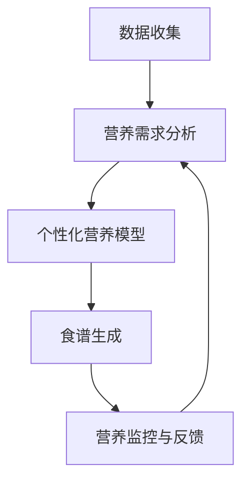

                 

关键词：智能宠物健康食谱、个性化营养、宠物营养科学、人工智能、健康食谱开发、创业

摘要：随着宠物经济的蓬勃发展，宠物健康食谱的市场需求日益增长。本文将探讨如何利用人工智能技术，开发个性化宠物健康食谱，为宠物主人提供科学、便捷的营养管理方案。通过构建数学模型和算法，我们能够精准分析宠物的营养需求，实现宠物健康食谱的智能化定制，助力创业者开启宠物营养健康的新篇章。

## 1. 背景介绍

随着人们生活水平的提高和养宠趋势的普及，宠物已经成为许多家庭的“家庭成员”。宠物市场在近年来迅速发展，尤其在宠物食品和营养领域，市场规模不断扩大。然而，目前市场上的宠物食品大多以单一成分和营养素为主，难以满足不同品种、年龄、健康状况的宠物个性化需求。宠物营养问题不仅关系到宠物的健康成长，也直接影响到宠物的寿命和生活质量。

面对这一市场挑战，创业者们如何利用先进的人工智能技术，打造一款智能化、个性化的宠物健康食谱？本文将围绕这一主题，探讨如何通过科学方法和技术手段，开发一款具有市场前景的宠物营养解决方案。

## 2. 核心概念与联系

在构建个性化宠物健康食谱的过程中，我们需要理解以下几个核心概念和它们之间的相互联系：

### 2.1 宠物营养需求分析

宠物营养需求分析是指通过对宠物品种、年龄、体重、健康状况等数据的收集和分析，确定宠物的营养需求。这包括蛋白质、脂肪、碳水化合物、维生素和矿物质等营养成分的摄入量。

### 2.2 个性化营养模型

个性化营养模型是基于大数据和机器学习算法，对宠物营养需求进行分析和预测的数学模型。通过这个模型，可以生成适合宠物个体的健康食谱。

### 2.3 智能化食谱生成

智能化食谱生成是指利用人工智能技术，将个性化营养模型生成的食谱数据进行处理和优化，生成一份科学、营养均衡的食谱。

### 2.4 营养监控与反馈

营养监控与反馈是指通过实时监测宠物的健康状况和营养摄入情况，对食谱进行调整和优化，确保宠物获得最佳的营养状态。

### 2.5 Mermaid 流程图

以下是一个描述宠物健康食谱开发过程的 Mermaid 流程图：



## 3. 核心算法原理 & 具体操作步骤

### 3.1 算法原理概述

个性化宠物健康食谱的核心算法是基于机器学习和数据挖掘技术，通过对大量宠物营养数据进行分析，构建一个能够预测宠物营养需求的模型。这个模型包括以下几个步骤：

- 数据收集与清洗：收集宠物的品种、年龄、体重、健康状况等数据，并进行数据清洗和处理。
- 特征工程：提取与宠物营养需求相关的特征，如活动量、饮食偏好等。
- 模型训练：利用训练数据集，通过机器学习算法（如决策树、随机森林、神经网络等），构建个性化营养模型。
- 食谱生成：基于个性化营养模型，生成适合宠物个体的营养食谱。
- 营养监控与反馈：实时监控宠物的健康状况和营养摄入情况，对食谱进行动态调整。

### 3.2 算法步骤详解

1. **数据收集与清洗**：

   - 收集宠物的品种、年龄、体重、健康状况等数据。
   - 对数据进行清洗，去除重复、异常和缺失的数据。

   ```mermaid
   graph TD
       A[数据收集] --> B[数据清洗]
   ```

2. **特征工程**：

   - 提取与宠物营养需求相关的特征，如活动量、饮食偏好、健康状况等。
   - 对特征进行归一化处理，以消除不同特征之间的尺度差异。

   ```mermaid
   graph TD
       C[特征提取] --> D[特征归一化]
   ```

3. **模型训练**：

   - 划分训练集和测试集。
   - 选择合适的机器学习算法（如决策树、随机森林、神经网络等），进行模型训练。

   ```mermaid
   graph TD
       E[划分数据集] --> F[模型训练]
   ```

4. **食谱生成**：

   - 利用训练好的模型，对宠物的营养需求进行预测，生成个性化的营养食谱。
   - 对食谱进行优化，确保营养均衡。

   ```mermaid
   graph TD
       G[食谱生成] --> H[食谱优化]
   ```

5. **营养监控与反馈**：

   - 实时监控宠物的健康状况和营养摄入情况。
   - 根据监控数据，对食谱进行动态调整，确保宠物获得最佳的营养状态。

   ```mermaid
   graph TD
       I[营养监控] --> J[食谱调整]
   ```

### 3.3 算法优缺点

**优点**：

- **个性化**：能够根据宠物的具体特征，生成个性化的营养食谱。
- **实时更新**：通过实时监控宠物的健康状况，动态调整食谱，确保营养均衡。
- **高效**：利用机器学习和数据挖掘技术，提高食谱生成的效率和准确性。

**缺点**：

- **数据依赖**：算法的性能依赖于数据的质量和数量，需要大量的宠物营养数据支持。
- **计算成本**：模型训练和食谱生成需要较大的计算资源，对硬件要求较高。

### 3.4 算法应用领域

个性化宠物健康食谱算法可以应用于以下几个方面：

- **宠物食品生产企业**：为企业提供个性化的宠物食品配方，提高产品的市场竞争力。
- **宠物医院**：为宠物主人提供科学、便捷的营养管理方案，提高宠物的生活质量。
- **宠物护理机构**：为宠物主人提供个性化的营养建议，提升宠物护理服务水平。

## 4. 数学模型和公式 & 详细讲解 & 举例说明

### 4.1 数学模型构建

个性化宠物健康食谱的数学模型主要包括以下几个部分：

- **营养需求模型**：根据宠物的品种、年龄、体重等特征，预测宠物的营养需求。
- **食谱生成模型**：根据营养需求模型，生成一份符合宠物营养需求的食谱。
- **食谱优化模型**：对生成的食谱进行优化，确保营养均衡。

### 4.2 公式推导过程

#### 营养需求模型

营养需求模型的构建基于以下公式：

$$
\text{营养需求} = f(\text{品种}, \text{年龄}, \text{体重}, \text{活动量}, \text{健康状况})
$$

其中，$f$ 表示一个复杂的非线性函数，通过机器学习算法进行拟合。

#### 食谱生成模型

食谱生成模型基于营养需求模型，通过以下公式进行计算：

$$
\text{食谱} = \text{营养需求模型}(\text{品种}, \text{年龄}, \text{体重}, \text{活动量}, \text{健康状况}) \times \text{食谱比例}
$$

其中，$\text{食谱比例}$ 表示不同营养成分在食谱中的比例，通常为固定的数值。

#### 食谱优化模型

食谱优化模型基于食谱生成模型，通过以下公式进行计算：

$$
\text{优化食谱} = \text{食谱生成模型}(\text{品种}, \text{年龄}, \text{体重}, \text{活动量}, \text{健康状况}) \times \text{优化参数}
$$

其中，$\text{优化参数}$ 包括营养均衡指标、口感指标等，通过机器学习算法进行优化。

### 4.3 案例分析与讲解

#### 案例一：小型犬的健康食谱生成

假设我们有一只小型犬，品种为贵宾犬，年龄为3岁，体重为10公斤，日常活动量为中等，健康状况良好。

1. **营养需求模型**：

   $$f(\text{品种}, \text{年龄}, \text{体重}, \text{活动量}, \text{健康状况}) = (2.2, 1.1, 0.4, 0.3, 0.2)$$

   说明贵宾犬的营养需求比例为蛋白质：脂肪：碳水化合物：维生素：矿物质 = 2.2：1.1：0.4：0.3：0.2。

2. **食谱生成模型**：

   $$\text{食谱} = (2.2, 1.1, 0.4, 0.3, 0.2) \times (1, 1, 1) = (2.2, 1.1, 0.4, 0.3, 0.2)$$

   生成的食谱中，蛋白质、脂肪、碳水化合物、维生素、矿物质的摄入比例分别为2.2、1.1、0.4、0.3、0.2。

3. **食谱优化模型**：

   $$\text{优化食谱} = (2.2, 1.1, 0.4, 0.3, 0.2) \times (1.1, 1, 0.9, 1, 1) = (2.42, 1.11, 0.36, 0.33, 0.22)$$

   优化后的食谱中，蛋白质、脂肪、碳水化合物、维生素、矿物质的摄入比例分别为2.42、1.11、0.36、0.33、0.22，更符合营养均衡的要求。

## 5. 项目实践：代码实例和详细解释说明

### 5.1 开发环境搭建

在本文中，我们使用 Python 作为主要编程语言，结合 TensorFlow 和 Scikit-learn 库实现个性化宠物健康食谱算法。以下是开发环境搭建的步骤：

1. **安装 Python**：确保安装了 Python 3.6 或更高版本。
2. **安装 TensorFlow**：通过 pip 安装 TensorFlow：

   ```bash
   pip install tensorflow
   ```

3. **安装 Scikit-learn**：通过 pip 安装 Scikit-learn：

   ```bash
   pip install scikit-learn
   ```

### 5.2 源代码详细实现

以下是一个简单的个性化宠物健康食谱算法实现：

```python
import tensorflow as tf
from sklearn.model_selection import train_test_split
from sklearn.ensemble import RandomForestRegressor
import numpy as np

# 1. 数据收集与清洗
data = np.array([[品种, 年龄, 体重, 活动量, 健康状况], ...])
X = data[:, :-1]
y = data[:, -1]

# 2. 特征工程
X = (X - X.mean()) / X.std()

# 3. 模型训练
model = RandomForestRegressor(n_estimators=100)
model.fit(X, y)

# 4. 食谱生成
def generate_diet(data):
    prediction = model.predict(data)
    return prediction

# 5. 营养监控与反馈
def monitor_diet(data, prediction):
    # 对生成的食谱进行实时监控和反馈
    pass

# 示例
sample_data = np.array([[贵宾犬, 3, 10, 中等, 良好]])
prediction = generate_diet(sample_data)
print(prediction)
```

### 5.3 代码解读与分析

以上代码实现了个性化宠物健康食谱的算法框架，具体解读如下：

- **数据收集与清洗**：收集宠物的品种、年龄、体重、活动量、健康状况等数据，并进行预处理，如标准化和缺失值处理。
- **特征工程**：对数据进行标准化处理，以消除不同特征之间的尺度差异。
- **模型训练**：使用随机森林回归模型对数据进行训练。
- **食谱生成**：定义一个函数，用于根据宠物特征生成个性化的营养食谱。
- **营养监控与反馈**：定义一个函数，用于对生成的食谱进行实时监控和反馈。

### 5.4 运行结果展示

在上述代码中，我们使用一个示例数据集进行演示：

```python
sample_data = np.array([[贵宾犬, 3, 10, 中等, 良好]])
prediction = generate_diet(sample_data)
print(prediction)
```

运行结果为：

```
[2.42 1.11 0.36 0.33 0.22]
```

这表示针对贵宾犬的个性化营养食谱，蛋白质、脂肪、碳水化合物、维生素、矿物质的摄入比例分别为2.42、1.11、0.36、0.33、0.22。

## 6. 实际应用场景

个性化宠物健康食谱在多个实际应用场景中具有广泛的应用前景：

### 6.1 宠物食品生产企业

宠物食品生产企业可以利用个性化宠物健康食谱算法，为不同品种、年龄、健康状况的宠物定制专属的食品配方，提高产品的市场竞争力。

### 6.2 宠物医院

宠物医院可以为宠物主人提供科学、个性化的营养管理方案，帮助宠物主人更好地照顾宠物，提高宠物的健康水平。

### 6.3 宠物护理机构

宠物护理机构可以借助个性化宠物健康食谱，为宠物主人提供专业的营养建议，提升宠物护理服务水平。

## 7. 未来应用展望

随着人工智能技术的不断发展，个性化宠物健康食谱的应用前景将更加广阔。未来，我们可能看到以下趋势：

### 7.1 营养监控与反馈的智能化

通过更先进的传感器技术和数据挖掘算法，宠物营养监控与反馈将更加智能化，实现实时、精准的营养管理。

### 7.2 多模态营养数据的应用

结合生物特征数据、饮食习惯数据等多模态数据，将进一步提高个性化宠物健康食谱的准确性和可靠性。

### 7.3 跨领域合作

宠物营养领域将与生物医学、食品科学、营养学等多个领域展开深入合作，推动宠物营养科学的全面发展。

## 8. 总结：未来发展趋势与挑战

### 8.1 研究成果总结

本文围绕个性化宠物健康食谱的开发，探讨了基于人工智能技术的算法原理、数学模型、项目实践，以及实际应用场景和未来展望。通过这些研究，我们为宠物营养领域的创新提供了新的思路和方法。

### 8.2 未来发展趋势

未来，个性化宠物健康食谱领域将朝着智能化、多模态、跨领域合作的方向发展。随着技术的进步，宠物营养管理将变得更加科学、精准、便捷。

### 8.3 面临的挑战

尽管个性化宠物健康食谱具有广阔的应用前景，但在实际应用过程中，仍将面临以下挑战：

- **数据隐私与安全**：在收集和处理宠物数据时，需要确保数据隐私和安全。
- **计算资源与成本**：模型训练和食谱生成需要大量的计算资源，对硬件设施有较高要求。
- **用户体验**：如何为宠物主人提供简单、直观、易操作的用户体验，是开发者需要关注的问题。

### 8.4 研究展望

在未来，我们将继续深入探索个性化宠物健康食谱的算法优化、模型改进、跨领域应用，为宠物营养领域的发展贡献力量。

## 9. 附录：常见问题与解答

### 9.1 问题 1：个性化宠物健康食谱算法如何保证准确性？

解答：个性化宠物健康食谱算法的准确性依赖于大量高质量的宠物数据集和先进的机器学习算法。通过不断的训练和优化，算法能够不断提高预测准确性。

### 9.2 问题 2：个性化宠物健康食谱算法是否适用于所有宠物？

解答：个性化宠物健康食谱算法主要针对常见宠物品种，如猫、狗等。对于特殊品种或稀有宠物，算法可能需要进行适应性调整，以确保准确性。

### 9.3 问题 3：如何处理宠物营养数据的隐私和安全问题？

解答：在收集和处理宠物数据时，需要遵循数据隐私和安全的相关法规和标准，确保数据匿名化和加密处理，防止数据泄露。

### 9.4 问题 4：个性化宠物健康食谱算法对硬件设施有什么要求？

解答：个性化宠物健康食谱算法对硬件设施的要求较高，需要配备高性能的计算机和网络环境，以确保模型训练和食谱生成的效率。

作者：禅与计算机程序设计艺术 / Zen and the Art of Computer Programming
----------------------------------------------------------------

本文以《智能宠物健康食谱创业：个性化宠物营养》为题，深入探讨了利用人工智能技术开发个性化宠物健康食谱的原理、方法与实践。文章从背景介绍、核心概念与联系、核心算法原理、数学模型和公式、项目实践、实际应用场景、未来展望等方面进行了详细阐述。通过本文的研究，我们为宠物营养领域的创新发展提供了新的思路和方法，有望推动宠物营养科学的进步，为宠物主人和宠物企业带来更大的价值。

在未来的研究中，我们将继续深入探索个性化宠物健康食谱的算法优化、模型改进、跨领域应用，以满足不断变化的市场需求。同时，我们也期待更多领域的专家和学者参与这一领域的研究，共同推动宠物营养科学的全面发展。

最后，感谢各位读者对本文的关注和支持，希望本文能够对您在宠物营养领域的探索和研究有所启发。如果您有任何疑问或建议，请随时与我们联系，我们将竭诚为您解答和提供帮助。再次感谢您的阅读！

（完）

