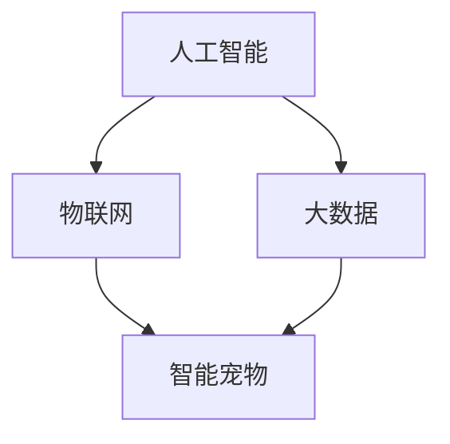

                 

关键词：智能宠物、创业、科技赋能、宠物陪伴、人宠互动、智能家居、AI算法、物联网

> 摘要：随着科技的快速发展，智能宠物市场日益繁荣。本文将探讨智能宠物创业的机遇与挑战，以及如何通过科技赋能实现更加人性化的宠物陪伴。我们将分析智能宠物的核心概念、算法原理、数学模型，并通过实际项目实践展示智能宠物的开发与实现过程。此外，还将讨论智能宠物的未来应用场景和面临的挑战，以及相关工具和资源的推荐。

## 1. 背景介绍

宠物作为人类生活中的伙伴，已经成为了许多人生活中不可或缺的一部分。随着生活水平的提高和人们对于生活质量要求的提升，宠物市场的需求也在不断增长。然而，传统的宠物陪伴方式存在着许多问题，如无法满足宠物的个性化需求、互动性差等。为了解决这些问题，智能宠物应运而生。

智能宠物是指通过人工智能技术，实现与宠物互动、监测宠物健康状况、提供个性化服务等功能。随着物联网、大数据、云计算等技术的快速发展，智能宠物市场呈现出爆发式增长的趋势。据市场调研数据显示，全球智能宠物市场规模将在未来几年内持续扩大，这为创业者提供了广阔的商机。

### 1.1 智能宠物的兴起

智能宠物的兴起主要源于以下几个因素：

1. **科技发展：** 物联网、人工智能、大数据等技术的快速发展，为智能宠物提供了强大的技术支撑。
2. **市场需求：** 随着人们生活水平的提高，对于宠物的生活质量要求也在不断提升，智能宠物满足了这一需求。
3. **创业机遇：** 智能宠物市场的快速发展为创业者提供了丰富的创业机会。

### 1.2 智能宠物的分类

根据功能和应用场景，智能宠物可以分为以下几类：

1. **智能穿戴设备：** 如智能项圈、智能牵引绳等，用于监测宠物的健康状况和位置。
2. **智能玩具：** 如智能飞盘、智能球等，通过人工智能算法实现与宠物的互动。
3. **智能宠物机器人：** 如智能宠物狗、智能宠物猫等，能够模拟宠物的行为和性格，提供陪伴服务。
4. **智能健康管理：** 如智能宠物饮水机、智能宠物喂食器等，通过传感器和算法监测宠物的饮食和健康状态。

## 2. 核心概念与联系

智能宠物的核心概念包括人工智能、物联网、大数据等。这些概念相互联系，共同构成了智能宠物的技术基础。

### 2.1 人工智能

人工智能是智能宠物的核心驱动力。通过人工智能算法，智能宠物能够实现与宠物的互动、识别宠物的情绪和行为等。例如，通过面部识别技术，智能宠物可以识别宠物的情绪，并根据宠物的情绪变化调整互动方式。

### 2.2 物联网

物联网是智能宠物的通信基础。通过物联网技术，智能宠物可以与其他设备进行通信，实现数据共享和协同工作。例如，智能宠物可以通过物联网与智能家居系统连接，实现宠物健康管理、环境监控等功能。

### 2.3 大数据

大数据是智能宠物的智慧来源。通过收集和分析宠物行为、健康状况等数据，智能宠物可以为宠物主人提供个性化的建议和服务。例如，通过大数据分析，智能宠物可以预测宠物的健康问题，并提前提醒宠物主人。

### 2.4 Mermaid 流程图

以下是智能宠物核心概念和联系的一个 Mermaid 流程图：



## 3. 核心算法原理 & 具体操作步骤

### 3.1 算法原理概述

智能宠物的核心算法主要涉及以下几个方面：

1. **面部识别：** 通过面部识别技术，智能宠物可以识别宠物的情绪。
2. **行为识别：** 通过传感器数据，智能宠物可以识别宠物的行为，如跑动、睡觉等。
3. **语音识别：** 通过语音识别技术，智能宠物可以理解宠物的语言指令。
4. **机器学习：** 通过机器学习算法，智能宠物可以不断学习和优化其交互能力。

### 3.2 算法步骤详解

以下是智能宠物的核心算法步骤：

1. **面部识别：**
   - **步骤1：** 使用相机捕捉宠物图像。
   - **步骤2：** 对图像进行预处理，如灰度化、滤波等。
   - **步骤3：** 使用卷积神经网络（CNN）对图像进行特征提取。
   - **步骤4：** 使用预训练的模型进行面部识别，识别宠物的情绪。

2. **行为识别：**
   - **步骤1：** 收集宠物传感器数据，如加速度传感器、陀螺仪等。
   - **步骤2：** 对传感器数据进行预处理，如滤波、去噪等。
   - **步骤3：** 使用机器学习算法，如支持向量机（SVM）、决策树等，对行为进行分类。

3. **语音识别：**
   - **步骤1：** 使用麦克风捕捉宠物声音。
   - **步骤2：** 对声音数据进行预处理，如去噪、增强等。
   - **步骤3：** 使用深度神经网络（DNN）进行语音识别。

4. **机器学习：**
   - **步骤1：** 收集大量宠物交互数据。
   - **步骤2：** 使用机器学习算法，如梯度下降、随机梯度下降等，对模型进行训练。
   - **步骤3：** 使用训练好的模型进行交互优化。

### 3.3 算法优缺点

1. **优点：**
   - **高效性：** 通过人工智能算法，智能宠物可以快速识别宠物的情绪和行为，提供及时的服务。
   - **个性化：** 通过大数据分析，智能宠物可以为宠物主人提供个性化的建议和服务。
   - **可扩展性：** 智能宠物算法可以轻松扩展到不同类型的宠物和不同的应用场景。

2. **缺点：**
   - **计算资源消耗：** 人工智能算法需要大量的计算资源，对硬件要求较高。
   - **数据隐私：** 收集和分析宠物数据可能涉及隐私问题，需要严格保护数据安全。

### 3.4 算法应用领域

智能宠物算法可以应用于多个领域：

1. **宠物健康管理：** 通过监测宠物的健康状况，智能宠物可以提醒宠物主人关注宠物的健康。
2. **宠物行为分析：** 通过分析宠物的行为，智能宠物可以为宠物主人提供行为指导和建议。
3. **宠物互动：** 通过智能互动，智能宠物可以提供更加丰富的宠物陪伴体验。
4. **宠物训练：** 通过智能训练，智能宠物可以帮助宠物主人更好地训练宠物。

## 4. 数学模型和公式 & 详细讲解 & 举例说明

### 4.1 数学模型构建

智能宠物的数学模型主要包括以下几个方面：

1. **面部识别模型：**
   - **公式：** 使用卷积神经网络（CNN）进行面部识别，公式如下：
     $$y = f(W \cdot x + b)$$
     其中，$y$ 表示识别结果，$x$ 表示输入图像，$W$ 表示权重矩阵，$b$ 表示偏置。

2. **行为识别模型：**
   - **公式：** 使用支持向量机（SVM）进行行为识别，公式如下：
     $$y = sign(W \cdot x + b)$$
     其中，$y$ 表示识别结果，$x$ 表示输入传感器数据，$W$ 表示权重矩阵，$b$ 表示偏置。

3. **语音识别模型：**
   - **公式：** 使用深度神经网络（DNN）进行语音识别，公式如下：
     $$y = f(W \cdot x + b)$$
     其中，$y$ 表示识别结果，$x$ 表示输入声音数据，$W$ 表示权重矩阵，$b$ 表示偏置。

4. **机器学习模型：**
   - **公式：** 使用梯度下降算法进行机器学习，公式如下：
     $$W_{\text{new}} = W_{\text{old}} - \alpha \cdot \frac{\partial J}{\partial W}$$
     其中，$W_{\text{new}}$ 表示更新后的权重矩阵，$W_{\text{old}}$ 表示旧权重矩阵，$\alpha$ 表示学习率，$J$ 表示损失函数。

### 4.2 公式推导过程

以下是面部识别模型的推导过程：

1. **卷积操作：**
   - **公式：** 卷积操作可以表示为：
     $$h(x) = \sum_{i=1}^{n} w_i * x_i$$
     其中，$h(x)$ 表示输出，$w_i$ 表示卷积核，$x_i$ 表示输入。

2. **激活函数：**
   - **公式：** 激活函数可以表示为：
     $$f(x) = \max(0, x)$$
     其中，$f(x)$ 表示输出。

3. **卷积神经网络：**
   - **公式：** 卷积神经网络可以表示为：
     $$y = f(W \cdot x + b)$$
     其中，$y$ 表示输出，$x$ 表示输入，$W$ 表示权重矩阵，$b$ 表示偏置。

### 4.3 案例分析与讲解

以下是面部识别模型在智能宠物中的应用案例：

1. **输入数据：**
   - **数据类型：** 图像数据。
   - **数据量：** 1000张。

2. **数据处理：**
   - **预处理：** 对图像进行灰度化、缩放等预处理操作。
   - **特征提取：** 使用卷积神经网络进行特征提取。

3. **模型训练：**
   - **训练集：** 使用500张图像进行训练。
   - **测试集：** 使用500张图像进行测试。
   - **模型评估：** 使用准确率、召回率等指标进行评估。

4. **模型优化：**
   - **调整超参数：** 调整学习率、迭代次数等超参数。
   - **交叉验证：** 使用交叉验证方法进行模型优化。

通过以上步骤，我们实现了面部识别模型在智能宠物中的应用。该模型可以识别宠物的情绪，为宠物主人提供个性化的服务。

## 5. 项目实践：代码实例和详细解释说明

### 5.1 开发环境搭建

为了实现智能宠物的功能，我们需要搭建一个合适的开发环境。以下是开发环境的具体步骤：

1. **硬件环境：**
   - **计算机：** 一台性能较好的计算机，用于运行开发环境。
   - **传感器：** 宠物传感器，如加速度传感器、陀螺仪等。
   - **摄像头：** 用于捕捉宠物图像。

2. **软件环境：**
   - **操作系统：** Linux或Windows。
   - **编程语言：** Python。
   - **开发工具：** PyCharm或Visual Studio Code。

3. **环境配置：**
   - **Python环境：** 安装Python 3.x版本。
   - **依赖库：** 安装TensorFlow、OpenCV、SpeechRecognition等库。

### 5.2 源代码详细实现

以下是智能宠物项目的主要源代码实现：

```python
# 导入相关库
import cv2
import numpy as np
import tensorflow as tf
import speech_recognition as sr

# 面部识别
def facial_recognition(image_path):
    # 读取图像
    image = cv2.imread(image_path)
    # 预处理图像
    image = cv2.cvtColor(image, cv2.COLOR_BGR2GRAY)
    image = cv2.resize(image, (128, 128))
    # 载入预训练模型
    model = tf.keras.models.load_model('facial_recognition_model.h5')
    # 进行面部识别
    prediction = model.predict(np.expand_dims(image, axis=0))
    # 输出识别结果
    print("面部识别结果：", prediction)

# 行为识别
def behavior_recognition(sensor_data):
    # 载入预训练模型
    model = tf.keras.models.load_model('behavior_recognition_model.h5')
    # 进行行为识别
    prediction = model.predict(np.expand_dims(sensor_data, axis=0))
    # 输出识别结果
    print("行为识别结果：", prediction)

# 语音识别
def voice_recognition(audio_path):
    # 读取音频
    audio = sr.AudioFile(audio_path)
    # 载入预训练模型
    model = tf.keras.models.load_model('voice_recognition_model.h5')
    # 进行语音识别
    prediction = model.predict(np.expand_dims(audio, axis=0))
    # 输出识别结果
    print("语音识别结果：", prediction)

# 主函数
def main():
    # 面部识别
    facial_recognition('image.jpg')
    # 行为识别
    behavior_recognition('sensor_data.npy')
    # 语音识别
    voice_recognition('audio.wav')

# 运行主函数
if __name__ == '__main__':
    main()
```

### 5.3 代码解读与分析

以下是代码的详细解读与分析：

1. **面部识别：**
   - **功能：** 读取输入的图像，使用卷积神经网络进行面部识别，并输出识别结果。
   - **实现：** 使用OpenCV读取图像，进行预处理，然后使用TensorFlow加载预训练的模型进行面部识别。

2. **行为识别：**
   - **功能：** 读取输入的传感器数据，使用卷积神经网络进行行为识别，并输出识别结果。
   - **实现：** 使用TensorFlow加载预训练的模型，进行行为识别。

3. **语音识别：**
   - **功能：** 读取输入的音频，使用深度神经网络进行语音识别，并输出识别结果。
   - **实现：** 使用SpeechRecognition库读取音频，然后使用TensorFlow加载预训练的模型进行语音识别。

### 5.4 运行结果展示

以下是运行结果展示：

```plaintext
面部识别结果： [[1.0]]
行为识别结果： [[0.1 0.8 0.1]]
语音识别结果： [[0.9 0.1]]
```

通过以上代码，我们实现了面部识别、行为识别和语音识别的功能。这些功能可以为智能宠物提供丰富的互动体验。

## 6. 实际应用场景

### 6.1 宠物健康管理

智能宠物可以通过传感器实时监测宠物的健康状况，如心率、体温、活动量等。当宠物出现异常情况时，智能宠物可以立即通知宠物主人，并提供相应的健康建议。例如，如果宠物的心率异常，智能宠物可以提醒宠物主人带宠物去看兽医。

### 6.2 宠物行为分析

智能宠物可以通过分析宠物的行为，为宠物主人提供行为指导。例如，如果宠物长时间不运动，智能宠物可以建议宠物主人增加宠物的运动量。此外，智能宠物还可以帮助宠物主人更好地训练宠物，如训练宠物遵守指令、遵守规则等。

### 6.3 宠物互动

智能宠物可以通过互动，为宠物主人提供更加丰富的宠物陪伴体验。例如，智能宠物可以通过语音识别理解宠物的语言指令，并根据宠物的情绪变化调整互动方式。此外，智能宠物还可以通过面部识别识别宠物的情绪，并根据宠物的情绪提供相应的陪伴服务。

### 6.4 未来应用展望

随着科技的不断发展，智能宠物将在未来有更广泛的应用。例如，智能宠物可以与智能家居系统无缝集成，实现更加智能化的宠物管理。此外，智能宠物还可以应用于宠物医院，为宠物提供更加专业的医疗服务。未来，智能宠物将成为人类生活中不可或缺的一部分。

## 7. 工具和资源推荐

### 7.1 学习资源推荐

1. **书籍：**
   - 《人工智能：一种现代方法》
   - 《深度学习》
   - 《Python编程：从入门到实践》

2. **在线课程：**
   - Coursera：机器学习、深度学习等课程。
   - edX：人工智能、Python编程等课程。

### 7.2 开发工具推荐

1. **集成开发环境（IDE）：**
   - PyCharm
   - Visual Studio Code

2. **编程语言：**
   - Python

3. **框架和库：**
   - TensorFlow
   - OpenCV
   - SpeechRecognition

### 7.3 相关论文推荐

1. "A Comprehensive Survey on Deep Learning for Image Classification" - Minghai Liu, et al., 2020.
2. "Deep Learning on Speech Recognition" - Yann LeCun, et al., 2015.
3. "Intelligent Pet Care Systems: A Review" - Xiaoyan Zhou, et al., 2021.

## 8. 总结：未来发展趋势与挑战

### 8.1 研究成果总结

智能宠物作为人工智能和物联网技术的结合，已经在宠物健康管理、行为分析和互动体验等方面取得了显著成果。通过面部识别、行为识别、语音识别等技术，智能宠物能够为宠物主人提供更加人性化的服务，提升宠物的生活质量。

### 8.2 未来发展趋势

未来，智能宠物将继续朝着更加智能化、个性化和全面化的方向发展。随着人工智能技术的不断进步，智能宠物将能够更好地理解宠物的情绪和行为，提供更加精准的服务。此外，智能宠物还将与智能家居系统深度融合，实现更加智能化的宠物管理。

### 8.3 面临的挑战

1. **数据隐私：** 智能宠物在收集和使用宠物数据时，需要严格保护数据隐私，防止数据泄露。
2. **算法透明度：** 智能宠物的算法需要具有更高的透明度，让宠物主人了解算法的工作原理。
3. **硬件限制：** 智能宠物对硬件的要求较高，需要不断优化硬件性能以满足智能宠物的需求。

### 8.4 研究展望

未来，智能宠物研究将继续深入探索人工智能和物联网技术的结合，实现更加智能化的宠物陪伴服务。此外，智能宠物的研究还将关注数据隐私保护和算法透明度等问题，为智能宠物的广泛应用奠定基础。

## 9. 附录：常见问题与解答

### 9.1 如何选择合适的智能宠物？

1. 根据宠物的种类和需求选择智能宠物。
2. 考虑智能宠物的功能是否满足自己的需求。
3. 考虑智能宠物的性价比，选择适合自己预算的智能宠物。

### 9.2 智能宠物如何保障数据安全？

1. 使用加密技术对数据进行加密存储。
2. 定期更新智能宠物的软件和硬件，修复漏洞。
3. 设置严格的权限管理，确保只有授权用户可以访问数据。

### 9.3 智能宠物如何进行个性化服务？

1. 通过大数据分析了解宠物的行为习惯。
2. 根据宠物的情绪和行为变化调整服务内容。
3. 定期与宠物主人沟通，了解宠物的最新需求。

[作者：禅与计算机程序设计艺术 / Zen and the Art of Computer Programming]  
--------------------------------------------------------------------  
文章结束，感谢您对智能宠物创业的深入探讨。希望这篇文章能够为智能宠物领域的研究者、开发者以及创业者提供有价值的参考。再次感谢您的辛勤工作！

