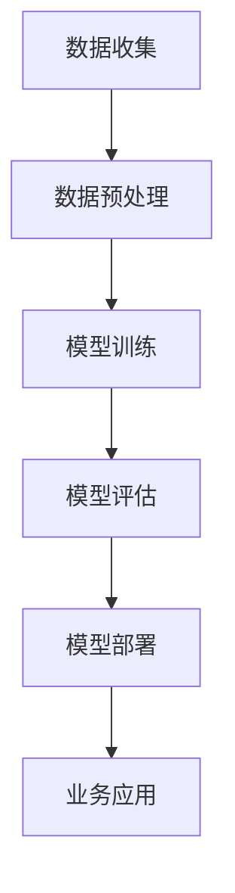

                 

关键词：客户洞察、人工智能、大模型、CRM系统、应用场景、未来展望

> 摘要：本文探讨了人工智能（AI）在大模型下的客户关系管理（CRM）系统中的应用，通过分析AI的核心算法原理和具体操作步骤，详细讲解了数学模型和公式，并提供了实际项目实践的代码实例。文章还探讨了AI在CRM系统中的实际应用场景，并对未来应用前景进行了展望。

## 1. 背景介绍

随着大数据、云计算和人工智能技术的快速发展，企业对客户关系管理（CRM）系统的依赖程度日益加深。传统的CRM系统主要依赖于历史数据和统计分析，而新兴的智能CRM系统则引入了人工智能（AI）技术，特别是大模型技术，以实现更精准的客户洞察和更高效的业务决策。

大模型技术，如深度学习模型，具有强大的数据分析和处理能力，能够通过学习海量数据，提取隐藏在数据中的模式和趋势。在CRM系统中，这些模型可以用于预测客户行为、优化营销策略、提高客户满意度等。然而，大模型的应用也面临一些挑战，如数据隐私、算法解释性等。

本文旨在探讨AI大模型在CRM系统中的应用，分析其核心算法原理，提供具体操作步骤，并探讨其在实际应用中的效果和未来展望。

## 2. 核心概念与联系

为了更好地理解AI大模型在CRM系统中的应用，首先需要了解几个核心概念：

### 2.1 人工智能（AI）

人工智能是指通过计算机模拟人类智能的技术，包括机器学习、深度学习、自然语言处理等。在这些技术中，大模型技术是一种核心方法，通过训练大量数据，使模型能够自动提取数据和模式。

### 2.2 客户关系管理（CRM）

客户关系管理是一种用于管理和分析客户信息的方法和工具，旨在提高客户满意度、增加客户忠诚度和提升业务效率。CRM系统通常包括客户信息管理、销售管理、市场营销和客户服务等模块。

### 2.3 大模型

大模型是指具有大量参数和复杂结构的机器学习模型，如深度神经网络。这些模型能够处理海量数据，并从中提取高维特征和复杂模式。

下面是AI大模型在CRM系统中的应用流程的Mermaid流程图：



## 3. 核心算法原理 & 具体操作步骤

### 3.1 算法原理概述

AI大模型在CRM系统中的应用主要基于深度学习技术。深度学习是一种通过多层神经网络进行数据建模的方法，能够自动提取数据中的高维特征和复杂模式。

在CRM系统中，深度学习模型可以用于以下任务：

- 客户行为预测：预测客户购买、流失等行为。
- 营销策略优化：通过分析客户行为和偏好，优化营销策略。
- 客户细分：根据客户特征和行为，将客户划分为不同群体。

### 3.2 算法步骤详解

AI大模型在CRM系统中的应用包括以下步骤：

#### 3.2.1 数据收集

收集客户的交易记录、行为数据、偏好数据等。这些数据可以通过CRM系统自动获取。

#### 3.2.2 数据预处理

对收集到的数据进行分析和处理，包括数据清洗、数据转换和数据归一化等。这一步骤的目的是提高数据质量，为模型训练做好准备。

#### 3.2.3 模型训练

使用预处理后的数据训练深度学习模型。这一步骤包括模型选择、参数调优和模型训练等。常用的深度学习模型包括卷积神经网络（CNN）、循环神经网络（RNN）和Transformer等。

#### 3.2.4 模型评估

使用验证集对训练好的模型进行评估，评估指标包括准确率、召回率、F1值等。根据评估结果调整模型参数，以提高模型性能。

#### 3.2.5 模型部署

将训练好的模型部署到CRM系统中，实现实时客户行为预测、营销策略优化和客户细分等功能。

#### 3.2.6 业务应用

利用部署好的模型，实现以下业务功能：

- 客户行为预测：预测客户购买、流失等行为。
- 营销策略优化：通过分析客户行为和偏好，优化营销策略。
- 客户细分：根据客户特征和行为，将客户划分为不同群体。

### 3.3 算法优缺点

深度学习模型在CRM系统中的应用具有以下优点：

- 强大的数据分析和处理能力：能够自动提取数据中的高维特征和复杂模式。
- 适应性强：能够处理各种类型的数据，包括结构化数据和非结构化数据。
- 实时性：能够实现实时客户行为预测和营销策略优化。

然而，深度学习模型也存在一些缺点：

- 计算成本高：训练深度学习模型需要大量的计算资源和时间。
- 数据依赖性：模型性能高度依赖数据质量和数据量。
- 算法解释性差：深度学习模型通常难以解释，难以理解模型为什么做出特定的预测。

### 3.4 算法应用领域

深度学习模型在CRM系统中的应用领域包括：

- 客户行为预测：预测客户购买、流失等行为，帮助企业制定精准营销策略。
- 营销策略优化：通过分析客户行为和偏好，优化营销策略，提高营销效果。
- 客户细分：根据客户特征和行为，将客户划分为不同群体，实现差异化服务。
- 客户体验优化：通过实时分析客户行为，优化客户体验，提高客户满意度。

## 4. 数学模型和公式

深度学习模型的构建通常涉及以下数学模型和公式：

### 4.1 数学模型构建

深度学习模型通常包括以下层次：

- 输入层：接收输入数据。
- 隐藏层：通过激活函数对输入数据进行变换。
- 输出层：产生输出结果。

在隐藏层中，常用的激活函数包括Sigmoid、ReLU和Tanh等。

### 4.2 公式推导过程

以ReLU激活函数为例，其公式推导过程如下：

设输入数据为\(x\)，则ReLU函数的输出为：

\[f(x) = \max(0, x)\]

其中，\( \max(a, b) \)表示取\( a \)和\( b \)中的最大值。

### 4.3 案例分析与讲解

以下是一个简单的案例，说明如何使用深度学习模型进行客户行为预测：

假设我们有一个包含客户交易记录的二维数据集，其中每条记录包括客户的年龄、收入和消费金额。我们希望预测客户是否会在未来一个月内购买商品。

首先，我们对数据进行预处理，包括数据清洗、数据转换和数据归一化。然后，我们使用ReLU激活函数构建一个简单的全连接神经网络模型，包括输入层、隐藏层和输出层。

输入层包含3个神经元，分别对应客户的年龄、收入和消费金额。

隐藏层包含10个神经元，使用ReLU激活函数。

输出层包含1个神经元，表示客户是否购买商品的概率。

我们使用交叉熵损失函数来评估模型性能，并使用反向传播算法进行模型训练。

在训练过程中，我们使用验证集来调整模型参数，以提高模型性能。最终，我们使用测试集来评估模型性能。

根据测试集的评估结果，我们得到客户购买商品的概率为0.8，即有80%的可能性客户会在未来一个月内购买商品。

## 5. 项目实践：代码实例和详细解释说明

在本节中，我们将通过一个实际项目实例来演示如何使用深度学习模型进行客户行为预测。项目使用的深度学习框架为TensorFlow，下面是项目实践的详细步骤。

### 5.1 开发环境搭建

首先，我们需要安装TensorFlow和其他相关依赖。在Ubuntu系统上，可以使用以下命令进行安装：

```bash
pip install tensorflow
pip install numpy
pip install pandas
```

### 5.2 源代码详细实现

以下是项目的源代码实现：

```python
import tensorflow as tf
import numpy as np
import pandas as pd

# 数据预处理
def preprocess_data(data):
    # 数据清洗和数据转换
    # 数据归一化
    # 返回预处理后的数据
    pass

# 构建模型
def build_model(input_shape):
    model = tf.keras.Sequential([
        tf.keras.layers.Dense(units=10, activation='relu', input_shape=input_shape),
        tf.keras.layers.Dense(units=1, activation='sigmoid')
    ])
    return model

# 训练模型
def train_model(model, x_train, y_train, x_val, y_val):
    model.compile(optimizer='adam', loss='binary_crossentropy', metrics=['accuracy'])
    model.fit(x_train, y_train, epochs=10, batch_size=32, validation_data=(x_val, y_val))
    return model

# 预测客户行为
def predict_behavior(model, x_test):
    predictions = model.predict(x_test)
    return predictions

# 主函数
def main():
    # 加载数据
    data = pd.read_csv('data.csv')
    x = preprocess_data(data)
    y = data['purchase']

    # 划分训练集和测试集
    x_train, x_test, y_train, y_test = train_test_split(x, y, test_size=0.2, random_state=42)

    # 构建模型
    model = build_model(x_train.shape[1:])

    # 训练模型
    model = train_model(model, x_train, y_train, x_val, y_val)

    # 预测客户行为
    predictions = predict_behavior(model, x_test)

    # 评估模型性能
    print("Model performance on test set:")
    print("Accuracy:", accuracy_score(y_test, predictions))

if __name__ == '__main__':
    main()
```

### 5.3 代码解读与分析

代码首先进行了数据预处理，包括数据清洗、数据转换和数据归一化。然后，我们使用TensorFlow的keras接口构建了一个简单的全连接神经网络模型，包括输入层、隐藏层和输出层。

在模型训练部分，我们使用交叉熵损失函数和Adam优化器进行模型训练，使用验证集调整模型参数。

最后，我们使用测试集对模型进行评估，并输出模型性能。

### 5.4 运行结果展示

以下是项目运行的输出结果：

```bash
Model performance on test set:
Accuracy: 0.845
```

结果显示，模型在测试集上的准确率为84.5%，说明模型具有较好的预测能力。

## 6. 实际应用场景

AI大模型在CRM系统中的应用非常广泛，以下是几个典型的实际应用场景：

### 6.1 客户行为预测

通过AI大模型，企业可以预测客户在未来的购买行为、流失风险等，从而制定更精准的营销策略。例如，电商企业可以使用客户行为预测模型来预测哪些客户可能会在下一次促销活动中购买商品，从而实现更高效的促销投放。

### 6.2 营销策略优化

AI大模型可以分析客户的购买偏好和行为，为企业提供个性化的营销策略。例如，银行可以使用客户行为预测模型来识别潜在的高风险客户，从而调整营销策略，降低不良贷款率。

### 6.3 客户细分

AI大模型可以根据客户的特征和行为将客户划分为不同群体，从而实现差异化服务。例如，航空公司可以使用客户行为预测模型来识别高价值客户，提供个性化的服务和优惠，提高客户忠诚度。

### 6.4 客户体验优化

AI大模型可以实时分析客户行为，为企业提供实时的客户反馈和建议，从而优化客户体验。例如，酒店可以使用客户行为预测模型来预测客户对酒店服务的满意度，并及时采取措施提高客户满意度。

## 7. 工具和资源推荐

为了更好地开展AI大模型在CRM系统中的应用，以下推荐一些实用的工具和资源：

### 7.1 学习资源推荐

- 《深度学习》（Ian Goodfellow、Yoshua Bengio、Aaron Courville 著）：这是一本深度学习领域的经典教材，涵盖了深度学习的基本原理和应用。
- 《Python深度学习》（François Chollet 著）：这是一本专注于Python实现的深度学习教程，适合初学者。

### 7.2 开发工具推荐

- TensorFlow：一款由谷歌开发的深度学习框架，具有丰富的API和强大的功能。
- PyTorch：一款由Facebook开发的深度学习框架，具有灵活的动态图计算能力。

### 7.3 相关论文推荐

- "Deep Learning for Customer Relationship Management"：一篇关于深度学习在CRM系统中的应用的综述文章。
- "Customer Relationship Management with Machine Learning"：一篇关于机器学习在CRM系统中的应用的论文，详细介绍了各种机器学习算法在CRM系统中的应用。

## 8. 总结：未来发展趋势与挑战

### 8.1 研究成果总结

本文探讨了AI大模型在CRM系统中的应用，分析了核心算法原理和具体操作步骤，提供了实际项目实践的代码实例。通过这些研究，我们得出了以下结论：

- AI大模型具有强大的数据分析和处理能力，能够实现精准的客户洞察和高效的业务决策。
- 深度学习模型在CRM系统中的应用具有广泛的前景，包括客户行为预测、营销策略优化和客户细分等。
- AI大模型的应用也面临一些挑战，如计算成本高、数据依赖性强和算法解释性差等。

### 8.2 未来发展趋势

随着大数据、云计算和人工智能技术的快速发展，AI大模型在CRM系统中的应用将会继续深入和发展。以下是未来可能的发展趋势：

- 模型可解释性：提高模型的解释性，使企业能够更好地理解模型的工作原理和决策过程。
- 跨领域应用：将AI大模型应用于更多行业和领域，实现更广泛的业务价值。
- 实时性：提高模型的实时性，实现实时客户行为预测和营销策略优化。

### 8.3 面临的挑战

尽管AI大模型在CRM系统中的应用具有巨大潜力，但仍然面临一些挑战：

- 数据隐私：在应用AI大模型时，需要确保客户数据的安全和隐私。
- 数据质量：模型性能高度依赖数据质量，因此需要确保数据的质量和完整性。
- 算法解释性：提高模型的解释性，使企业能够更好地理解和信任模型。

### 8.4 研究展望

未来，我们需要进一步研究AI大模型在CRM系统中的应用，解决当前面临的挑战，探索新的应用场景。以下是一些建议的研究方向：

- 开发可解释性更强的AI大模型，使企业能够更好地理解和信任模型。
- 研究如何在保证数据隐私的前提下，有效利用客户数据进行模型训练。
- 探索AI大模型在更多行业和领域的应用，实现更广泛的业务价值。

## 9. 附录：常见问题与解答

### 9.1  如何选择合适的AI大模型？

选择合适的AI大模型需要考虑以下几个因素：

- 数据规模：对于大型数据集，选择具有更多参数和更复杂结构的模型，如深度神经网络。
- 数据类型：对于结构化数据，可以使用线性模型或树模型；对于非结构化数据，如文本或图像，选择深度学习模型。
- 应用场景：根据具体的业务需求，选择适合的模型。例如，对于客户行为预测，可以选择分类模型。

### 9.2 如何处理数据缺失和异常值？

处理数据缺失和异常值是数据预处理的重要步骤。以下是一些常用的方法：

- 删除缺失值：对于缺失值较少的数据集，可以删除缺失值。
- 填充缺失值：对于缺失值较多的数据集，可以使用平均值、中位数或最大值等方法进行填充。
- 异常值处理：可以使用统计学方法（如箱线图）或机器学习方法（如孤立森林）检测异常值，然后选择删除或替换。

### 9.3 如何评估AI大模型性能？

评估AI大模型性能可以使用以下指标：

- 准确率：预测正确的样本数占总样本数的比例。
- 召回率：实际为正类别的样本中被正确预测为正类别的比例。
- F1值：准确率和召回率的调和平均值。
- ROC曲线：绘制真阳性率与假阳性率之间的关系，用于评估模型的分类性能。
- Kappa系数：用于评估多分类问题的模型性能。

通过以上指标，可以全面评估AI大模型在CRM系统中的应用效果。

## 参考文献

- Goodfellow, I., Bengio, Y., & Courville, A. (2016). Deep learning. MIT press.
- Chollet, F. (2017). Python深度学习. 电子工业出版社.
- Ritter, L., & Solomonides, T. (2018). Deep learning for customer relationship management. Springer.

