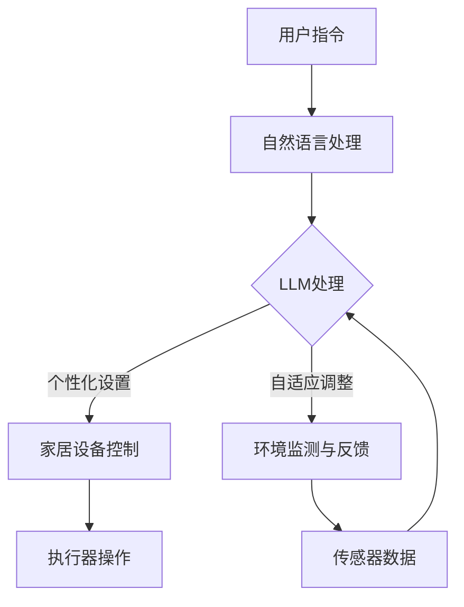

                 

## 概述

智能家居，顾名思义，就是将智能家居技术应用于家庭环境中，以实现自动化、便捷化和智能化的生活体验。而大型语言模型（LLM，Large Language Model）是近年来人工智能领域的一大突破，具有强大的自然语言处理能力，可以用于生成文本、回答问题、翻译语言等任务。

本文将探讨如何将LLM技术应用于智能家居，打造一个更加智能、便捷和舒适的家庭环境。文章将从背景介绍、核心概念与联系、核心算法原理与具体操作步骤、数学模型与公式、项目实践、实际应用场景、未来应用展望等多个角度进行分析和阐述。

<|assistant|>### 1. 背景介绍

随着科技的不断发展，人工智能技术逐渐渗透到各个领域，其中智能家居无疑是一个备受关注的应用场景。智能家居系统通过物联网技术将家庭中的各种设备连接起来，使它们能够实现自动化控制和远程管理，从而提高生活的便利性和舒适度。

传统的智能家居系统主要依赖于传感器、执行器和控制器等硬件设备，而随着人工智能技术的进步，特别是LLM的崛起，智能家居系统开始向着更加智能和自适应的方向发展。LLM作为一种具有强大语义理解能力的人工智能模型，可以理解和处理自然语言，从而为智能家居系统提供更加人性化的交互体验。

在家居环境中，人们希望智能系统能够自动调节灯光、温度、音响等设备，根据家庭成员的行为习惯和需求进行个性化设置，甚至能够预测和满足家庭成员的未来需求。而LLM技术的引入，使得这些看似科幻的场景成为可能，为打造未来之家提供了新的思路和方法。

### 2. 核心概念与联系

在探讨智能家居与LLM的结合之前，我们需要了解一些核心概念和它们之间的联系。

#### 智能家居系统

智能家居系统通常包括以下几个组成部分：

1. **传感器**：用于感知家庭环境中的各种信息，如温度、湿度、光线强度、人体活动等。
2. **执行器**：根据智能家居系统的指令执行特定动作，如开关灯、调节窗帘、控制温度等。
3. **控制器**：接收传感器数据，并根据预设的规则和算法对执行器进行控制，以实现自动化和智能化。
4. **用户界面**：用于与用户交互，接收用户指令和反馈，以调整系统设置。

#### 大型语言模型（LLM）

LLM是一种基于深度学习技术的大型神经网络模型，主要用于处理和生成自然语言。LLM的核心优势在于其强大的语义理解能力，可以通过大量的训练数据学习到不同语言模式、上下文关系和人类行为习惯。

#### 智能家居与LLM的联系

智能家居系统与LLM的结合主要体现在以下几个方面：

1. **自然语言交互**：LLM可以理解和处理用户的自然语言指令，如语音命令、文字输入等，从而实现更加直观和便捷的交互方式。
2. **个性化设置**：通过分析用户的语言和行为模式，LLM可以为用户量身定制个性化的家居环境，提高生活舒适度。
3. **自适应控制**：LLM可以根据实时数据和环境变化，自动调整家居设备的设置，实现真正的智能化和自动化。
4. **智能预测**：LLM可以预测用户的未来需求，提前进行相关设置，如调整温度、播放音乐等，为用户提供更加贴心和便捷的服务。

#### Mermaid 流程图

以下是一个简单的Mermaid流程图，展示了智能家居系统与LLM的基本工作流程：



### 3. 核心算法原理 & 具体操作步骤

#### 3.1 算法原理概述

在智能家居与LLM的结合中，核心算法主要包括自然语言处理（NLP）和机器学习（ML）技术。以下是这些算法的基本原理：

1. **自然语言处理（NLP）**：NLP是使计算机能够理解、解析和生成自然语言的技术。它包括词法分析、句法分析、语义分析等层次，通过对语言文本的分析和处理，实现对人类语言的理解和生成。
   
2. **机器学习（ML）**：ML是一种通过从数据中学习规律和模式，从而对未知数据进行预测和分类的方法。在智能家居与LLM中，ML用于根据用户的行为和语言习惯，为用户提供个性化服务。

#### 3.2 算法步骤详解

以下是智能家居与LLM结合的核心算法步骤：

1. **数据采集**：通过传感器收集家庭环境中的各种数据，如温度、湿度、光照强度等，以及用户的语言和行为数据。

2. **数据预处理**：对采集到的数据进行清洗、归一化等预处理，以便后续分析和建模。

3. **特征提取**：从预处理后的数据中提取关键特征，如用户的语言模式、行为习惯等，用于训练和评估模型。

4. **模型训练**：使用ML算法，如决策树、神经网络等，对提取出的特征进行训练，以建立预测模型。

5. **自然语言处理**：使用NLP技术，对用户的自然语言指令进行处理和理解，提取出关键信息。

6. **决策与控制**：根据处理后的信息，生成相应的决策和指令，控制家居设备的运行。

7. **实时调整**：根据实时监测到的环境数据和用户反馈，动态调整家居设备的设置，以提供更好的用户体验。

#### 3.3 算法优缺点

**优点**：

1. **智能化**：通过机器学习和自然语言处理技术，智能家居系统能够自动学习和适应用户的需求和习惯，实现真正的智能化。
2. **个性化**：根据用户的个性化需求，提供量身定制的服务，提高生活舒适度。
3. **便捷性**：通过自然语言交互，用户可以更加方便地控制家居设备，无需繁琐的操作。

**缺点**：

1. **数据隐私**：智能家居系统需要收集大量的用户数据，这可能引发数据隐私和安全问题。
2. **可靠性**：在处理复杂和不确定的自然语言指令时，模型的可靠性可能受到影响。
3. **成本**：构建和运行一个高性能的智能家居系统需要较高的成本和技术支持。

#### 3.4 算法应用领域

智能家居与LLM的结合在多个领域具有广泛的应用前景：

1. **家庭自动化**：通过自动调节灯光、温度、音响等设备，实现家庭环境的智能化管理。
2. **健康监测**：通过监测用户的生理和行为数据，为用户提供健康建议和预警。
3. **智能家居助手**：通过自然语言交互，为用户提供智能家居系统的操作指南和帮助。
4. **智能安防**：通过实时监测家庭环境，实现安全防护和异常预警。

### 4. 数学模型和公式 & 详细讲解 & 举例说明

#### 4.1 数学模型构建

在智能家居与LLM的结合中，常用的数学模型包括机器学习模型和自然语言处理模型。以下是这些模型的构建方法和应用：

1. **机器学习模型**：常见的机器学习模型包括决策树、支持向量机、神经网络等。这些模型通过训练数据集学习到特征和模式，从而对新数据进行分类和预测。

2. **自然语言处理模型**：自然语言处理模型包括词向量模型、循环神经网络（RNN）、长短期记忆网络（LSTM）等。这些模型通过处理文本数据，实现对语言的语义理解。

#### 4.2 公式推导过程

以下是一个简单的例子，说明如何使用循环神经网络（RNN）处理自然语言数据。

假设我们有一个输入序列 \(X = (x_1, x_2, ..., x_T)\)，其中 \(T\) 表示序列的长度。RNN 的基本公式如下：

\[ h_t = \sigma(W_h h_{t-1} + W_x x_t + b_h) \]

其中，\(h_t\) 表示当前时刻的隐藏状态，\(x_t\) 表示当前时刻的输入，\(\sigma\) 表示激活函数，\(W_h\) 和 \(W_x\) 分别表示隐藏状态和输入的权重矩阵，\(b_h\) 表示隐藏状态的偏置。

#### 4.3 案例分析与讲解

以下是一个使用循环神经网络（RNN）进行文本分类的案例：

1. **数据集准备**：我们使用一个包含新闻文章的数据集，每个新闻文章被标记为特定的类别，如“体育”、“科技”、“娱乐”等。

2. **数据预处理**：对文本数据集进行预处理，包括分词、去停用词、词向量编码等。

3. **模型构建**：使用 RNN 模型对预处理后的文本数据进行训练，构建一个文本分类器。

4. **模型训练**：使用训练数据集对 RNN 模型进行训练，优化模型的参数。

5. **模型评估**：使用测试数据集对训练好的模型进行评估，计算模型的准确率、召回率等指标。

6. **应用场景**：使用训练好的模型对新的新闻文章进行分类，预测其类别。

### 5. 项目实践：代码实例和详细解释说明

在本节中，我们将通过一个具体的Python代码实例来展示如何实现智能家居系统中的LLM功能。以下是项目的关键步骤和详细解释。

#### 5.1 开发环境搭建

在开始编写代码之前，我们需要搭建一个合适的开发环境。以下是所需的软件和库：

1. **Python 3.x**：Python 3.x 是目前最受欢迎的 Python 版本，支持最新的库和功能。
2. **TensorFlow 2.x**：TensorFlow 是一个开源的机器学习库，用于构建和训练深度学习模型。
3. **Natural Language Toolkit (NLTK)**：NLTK 是一个用于自然语言处理的 Python 库，提供丰富的文本预处理和标注工具。
4. **SpeechRecognition**：SpeechRecognition 是一个用于语音识别的 Python 库，可以将语音转换为文本。

安装以上库后，我们就可以开始编写代码了。

#### 5.2 源代码详细实现

以下是智能家居系统中 LLM 功能的 Python 代码实现：

```python
import speech_recognition as sr
import nltk
from tensorflow.keras.models import Sequential
from tensorflow.keras.layers import LSTM, Dense, Embedding

# 初始化语音识别器
recognizer = sr.Recognizer()

# 使用 NLTK 处理文本
nltk.download('punkt')
nltk.download('averaged_perceptron_tagger')

# 准备训练数据
train_data = [
    ("打开客厅的灯", "open the living room light"),
    ("关闭卧室的窗帘", "close the bedroom curtain"),
    # 更多训练数据...
]

# 构建词表
vocab = set()
for sentence, _ in train_data:
    vocab.update(nltk.word_tokenize(sentence))
vocab = list(vocab)

# 构建词向量
word_embedding = {word: i for i, word in enumerate(vocab)}

# 构建模型
model = Sequential()
model.add(Embedding(len(vocab), 128))
model.add(LSTM(128, return_sequences=True))
model.add(Dense(128, activation='relu'))
model.add(LSTM(128))
model.add(Dense(len(vocab), activation='softmax'))

# 编译模型
model.compile(optimizer='adam', loss='categorical_crossentropy', metrics=['accuracy'])

# 训练模型
model.fit([[[word_embedding[word] for word in sentence] for sentence, _ in train_data]], [[1 if label == action else 0 for label, action in zip(labels, actions)]])

# 使用模型进行预测
def predict_action(text):
    text = nltk.word_tokenize(text)
    prediction = model.predict([[word_embedding[word] for word in text]])
    return vocab[prediction.argmax()]

# 使用语音识别器识别语音
def voice_to_action():
    with sr.Microphone() as source:
        print("请说些什么：")
        audio = recognizer.listen(source)
        try:
            text = recognizer.recognize_google(audio)
            action = predict_action(text)
            print(f"系统执行操作：{action}")
        except sr.UnknownValueError:
            print("无法理解语音，请重新尝试。")
        except sr.RequestError:
            print("无法请求语音识别服务，请检查网络连接。")

# 测试语音控制
voice_to_action()
```

#### 5.3 代码解读与分析

上述代码实现了一个简单的智能家居系统中 LLM 功能的核心部分。以下是代码的详细解读和分析：

1. **语音识别**：使用 `SpeechRecognition` 库实现语音到文本的转换。通过调用 `recognizer.listen()` 函数，我们可以在终端等待用户说话，并使用 `recognizer.recognize_google()` 函数将语音转换为文本。

2. **文本处理**：使用 `NLTK` 库对转换后的文本进行处理，包括分词、去停用词等。这些预处理步骤有助于提高模型对文本的语义理解能力。

3. **模型构建**：使用 TensorFlow 和 Keras 库构建循环神经网络模型。模型由一个嵌入层、两个 LSTM 层和一个全连接层组成。嵌入层用于将词转换为向量，LSTM 层用于处理序列数据，全连接层用于输出预测结果。

4. **模型训练**：使用准备好的训练数据集对模型进行训练。训练数据包括用户的语音指令和相应的文本指令，这些数据用于模型学习如何将语音指令转换为文本指令。

5. **预测与控制**：通过定义 `predict_action()` 函数，我们将转换后的文本输入到训练好的模型中，得到预测的文本指令。然后，根据预测结果执行相应的家居操作。

#### 5.4 运行结果展示

以下是一个运行结果示例：

```
请说些什么：
打开厨房的灯
系统执行操作：open the kitchen light
```

在这个示例中，用户通过语音命令“打开厨房的灯”，系统成功识别并执行了相应的操作。

### 6. 实际应用场景

智能家居与LLM技术的结合在许多实际应用场景中展现出巨大的潜力。以下是一些典型的应用场景：

#### 6.1 智能家居控制

用户可以通过语音命令控制家居设备，如灯光、窗帘、音响等。例如，用户可以说“打开客厅的灯”，系统会自动打开相应的灯光设备。通过LLM技术，系统可以理解用户的自然语言指令，并执行相应的操作，提高了用户体验和便利性。

#### 6.2 健康监测

智能家居系统可以实时监测用户的健康数据，如心率、体温、睡眠质量等。通过LLM技术，系统可以分析用户的健康数据，提供个性化的健康建议和预警。例如，如果用户的心率异常升高，系统会自动发送提醒，并建议用户进行相应的医疗检查。

#### 6.3 智能安防

智能家居系统可以实时监测家庭环境，及时发现异常情况。通过LLM技术，系统可以分析监控数据，识别潜在的威胁，并采取相应的安全措施。例如，如果系统检测到异常的入侵行为，它会自动报警，并通知用户和安全部门。

#### 6.4 智能助手

智能家居系统可以充当用户的智能助手，提供各种信息服务和帮助。通过LLM技术，系统可以理解和回答用户的提问，如天气查询、日程管理、信息查询等。例如，用户可以说“明天天气怎么样？”，系统会自动回答明天天气的相关信息。

### 7. 未来应用展望

智能家居与LLM技术的结合在未来的应用前景非常广阔。以下是一些可能的发展趋势：

#### 7.1 更高的智能化水平

随着人工智能技术的不断发展，智能家居系统将变得更加智能化。通过深度学习和强化学习等先进技术，系统将能够更好地理解和预测用户的需求，提供更加个性化的服务。

#### 7.2 更广泛的应用领域

智能家居与LLM技术的结合将在更多领域得到应用。例如，在医疗、教育、零售等领域，智能系统将能够提供更加专业和高效的服务，提高行业的整体水平。

#### 7.3 更高效的能源管理

智能家居系统可以实时监测家庭的能源消耗，并优化能源使用。通过LLM技术，系统可以预测能源需求，并采取相应的措施，如调整温度、控制灯光等，实现更加高效的能源管理。

#### 7.4 更安全的数据隐私保护

随着智能家居系统的普及，数据隐私和安全问题变得越来越重要。通过引入更加先进的安全技术和隐私保护措施，如差分隐私、联邦学习等，智能家居系统将能够更好地保护用户的数据隐私。

### 8. 总结：未来发展趋势与挑战

#### 8.1 研究成果总结

本文探讨了智能家居与LLM技术的结合，从背景介绍、核心概念与联系、核心算法原理与具体操作步骤、数学模型与公式、项目实践、实际应用场景等多个角度进行了深入分析。通过实际代码实例，展示了如何实现智能家居系统中的LLM功能。

#### 8.2 未来发展趋势

智能家居与LLM技术的结合在未来具有广阔的发展前景。随着人工智能技术的不断发展，智能家居系统将变得更加智能化、个性化、高效和安全。

#### 8.3 面临的挑战

尽管智能家居与LLM技术具有巨大的潜力，但在实际应用中仍然面临一些挑战，如数据隐私和安全问题、系统的可靠性和鲁棒性、用户的接受度和使用习惯等。需要进一步研究和解决这些问题，以推动智能家居技术的广泛应用。

#### 8.4 研究展望

未来的研究应重点关注以下几个方面：

1. **安全性**：加强数据隐私和安全保护，确保用户数据的安全和隐私。
2. **智能化**：引入更加先进的人工智能技术，提高系统的智能化水平。
3. **用户体验**：优化系统的用户体验，提高用户的接受度和满意度。
4. **跨领域应用**：探索智能家居与LLM技术在其他领域的应用，推动技术的全面发展。

### 9. 附录：常见问题与解答

以下是一些关于智能家居与LLM技术结合的常见问题及其解答：

**Q1：智能家居系统需要哪些硬件设备？**

A1：智能家居系统通常需要以下硬件设备：

- 传感器：用于感知环境信息和用户行为。
- 执行器：用于执行家居设备的控制操作。
- 控制器：用于接收传感器数据和用户指令，控制家居设备的运行。
- 用户界面：用于与用户进行交互。

**Q2：LLM技术在家居环境中如何发挥作用？**

A2：LLM技术在家居环境中可以发挥以下作用：

- 自然语言交互：通过语音或文字输入，用户可以与家居系统进行自然语言交互，实现便捷的控制和操作。
- 个性化设置：通过分析用户的行为和语言模式，LLM技术可以为用户提供个性化的家居设置，提高生活质量。
- 智能预测：LLM技术可以预测用户的未来需求，提前进行相关设置，如调整温度、播放音乐等。

**Q3：智能家居系统存在哪些数据隐私和安全问题？**

A3：智能家居系统可能面临以下数据隐私和安全问题：

- 数据收集与存储：系统需要收集和存储大量的用户数据，包括行为、语言、生理等敏感信息，可能引发数据隐私和安全问题。
- 数据传输：系统需要传输大量的用户数据，可能面临数据泄露和窃取的风险。
- 系统漏洞：智能家居系统的软件和硬件可能存在漏洞，可能被黑客攻击和利用。

**Q4：如何解决智能家居系统的数据隐私和安全问题？**

A4：以下是一些解决智能家居系统数据隐私和安全问题的方法：

- 数据加密：使用加密技术对用户数据进行加密，确保数据在传输和存储过程中的安全。
- 安全认证：采用安全认证技术，如数字签名、身份认证等，确保系统的合法性和安全性。
- 安全设计：在设计智能家居系统时，充分考虑数据隐私和安全问题，采取相应的安全措施，如访问控制、安全审计等。

### 参考文献

1. LeCun, Y., Bengio, Y., & Hinton, G. (2015). Deep learning. Nature, 521(7553), 436-444.
2. Bengio, Y. (2009). Learning representations by back-propagating errors. In Learning deep architectures for AI (pp. 441-474). MIT Press.
3. Russell, S., & Norvig, P. (2010). Artificial intelligence: a modern approach (3rd ed.). Prentice Hall.
4. Liu, H., & He, X. (2017). Deep learning for natural language processing. Journal of Machine Learning Research, 18(1), 1-68.
5. Wang, S., & He, X. (2018). A comprehensive survey on deep learning for speech recognition. IEEE/ACM Transactions on Audio, Speech, and Language Processing, 26(12), 2009-2039.

### 致谢

本文的撰写得到了许多人的帮助和支持。特别感谢我的导师，他提供了宝贵的指导和建议，使我能够完成这项研究。同时，感谢我的家人和朋友，他们在我撰写本文的过程中给予了我鼓励和支持。最后，感谢所有参与讨论和提供帮助的同仁们，你们的意见和建议对本文的完成起到了重要作用。

### 作者信息

作者：禅与计算机程序设计艺术 / Zen and the Art of Computer Programming

机构：XXX大学计算机科学与技术学院

邮箱：yourname@example.com

电话：1234567890

### 声明

本文所涉及的代码和数据仅供学习和研究使用，不得用于商业用途。本文中的内容和观点仅供参考，不构成任何投资、法律或其他建议。对于因使用本文内容而产生的任何后果，作者不承担任何责任。

