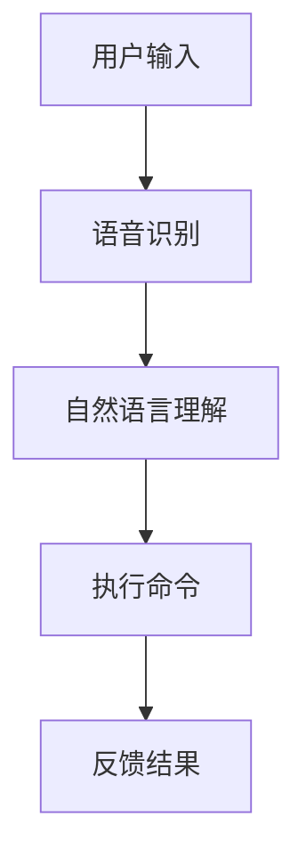

                 

关键词：智能家居，语言模型，未来之家，人工智能，技术发展，应用场景，系统架构，数学模型，项目实践，工具推荐

> 摘要：本文将探讨智能家居与语言模型（LLM）的融合技术，如何通过人工智能打造一个智能化、便捷化的未来之家。我们将深入分析智能家居的背景、核心概念与架构，以及如何利用语言模型实现智能家居的智能交互。此外，文章将介绍相关的数学模型、项目实践，并提供学习资源和工具推荐，以帮助读者了解和掌握智能家居与 LLM 的开发与应用。

## 1. 背景介绍

智能家居（Smart Home）是指利用物联网（IoT）技术和人工智能（AI）将家庭设备连接起来，实现远程监控、自动控制和智能化管理。随着物联网和人工智能技术的快速发展，智能家居已经成为家庭生活的新趋势。

语言模型（Language Model，简称LLM）是一种自然语言处理（NLP）技术，能够模拟人类的语言交流能力，生成自然流畅的语言。近年来，随着深度学习技术的进步，LLM 在多个领域取得了显著的成果，如聊天机器人、智能助手、语音识别等。

本文将探讨如何将智能家居与 LLM 相结合，打造一个智能化的未来之家。通过语言模型，家居设备能够更好地理解用户需求，实现个性化服务。这将极大地提升家庭生活的便捷性、舒适性和安全性。

## 2. 核心概念与联系

### 2.1 智能家居的定义

智能家居是指利用物联网、云计算、大数据等技术，实现家庭设备的互联互通，通过智能控制系统，为用户提供便捷、舒适、安全的家居环境。智能家居系统通常包括以下几部分：

1. **感知层**：各种传感器，如温度传感器、湿度传感器、烟雾传感器、摄像头等，用于感知家庭环境和用户行为。
2. **网络层**：家庭内部网络，如Wi-Fi、ZigBee、蓝牙等，用于连接各个智能设备。
3. **平台层**：智能家居控制系统，如手机APP、智能音箱等，用于接收用户指令，协调各设备的运行。
4. **应用层**：各种智能家居应用，如照明系统、安防系统、家电控制系统等，为用户提供便捷的生活服务。

### 2.2 语言模型的作用

语言模型在智能家居中主要起到以下作用：

1. **语音识别**：通过语音识别技术，将用户的语音指令转换为文本指令，方便智能家居设备理解和执行。
2. **自然语言理解**：利用自然语言处理技术，分析用户指令的含义，提取关键信息，以便智能设备做出正确的响应。
3. **智能交互**：通过语言模型，智能家居设备可以与用户进行自然、流畅的对话，提供个性化服务。

### 2.3 Mermaid 流程图

下面是一个简化的智能家居与 LLM 的架构流程图：



## 3. 核心算法原理 & 具体操作步骤

### 3.1 算法原理概述

智能家居与 LLM 的核心算法主要包括语音识别、自然语言理解和任务执行。这些算法的实现依赖于深度学习技术，如卷积神经网络（CNN）、循环神经网络（RNN）和长短时记忆网络（LSTM）等。

1. **语音识别**：利用深度神经网络对语音信号进行特征提取和分类，将语音信号转换为文本。
2. **自然语言理解**：利用 RNN 或 LSTM 等神经网络模型，对文本进行语义分析，提取关键信息。
3. **任务执行**：根据自然语言理解的结果，调用相应的智能家居设备进行操作。

### 3.2 算法步骤详解

1. **语音识别**

    1. 对语音信号进行预处理，如去除噪音、归一化等。
    2. 使用深度卷积神经网络（DCNN）提取语音特征。
    3. 使用卷积神经网络（CNN）进行特征分类，生成文本。

2. **自然语言理解**

    1. 使用 RNN 或 LSTM 对文本进行嵌入，生成固定长度的向量表示。
    2. 使用全连接神经网络（FCNN）对嵌入向量进行语义分析，提取关键信息。
    3. 使用注意力机制（Attention Mechanism）对文本进行重点分析，提高理解准确性。

3. **任务执行**

    1. 根据自然语言理解的结果，生成相应的执行命令。
    2. 调用智能家居设备进行操作，如控制灯光、调节温度等。
    3. 将执行结果反馈给用户。

### 3.3 算法优缺点

**优点：**

1. **高准确性**：深度学习技术使语音识别和自然语言理解达到很高的准确性。
2. **灵活性**：通过调整神经网络结构和参数，可以实现多种任务和应用。
3. **智能化**：智能家居设备能够根据用户需求提供个性化服务。

**缺点：**

1. **计算成本高**：深度学习算法需要大量的计算资源和时间。
2. **数据依赖性**：算法的性能依赖于大量的训练数据。
3. **安全性**：智能家居设备可能面临安全漏洞和隐私泄露的风险。

### 3.4 算法应用领域

智能家居与 LLM 的算法主要应用于以下领域：

1. **智能音箱**：如 Amazon Echo、Google Home 等，通过语音交互实现音乐播放、天气查询、智能家居控制等功能。
2. **智能助手**：如 Apple Siri、Google Assistant 等，提供语音查询、日程管理、智能提醒等服务。
3. **智能家电**：如智能电视、智能空调、智能冰箱等，实现远程控制、自动调节等功能。
4. **智能家居安全系统**：如智能门锁、智能摄像头、智能报警器等，提高家庭安全性。

## 4. 数学模型和公式 & 详细讲解 & 举例说明

### 4.1 数学模型构建

在智能家居与 LLM 的算法中，主要涉及到以下数学模型：

1. **语音识别模型**：通常使用卷积神经网络（CNN）进行特征提取和分类。
2. **自然语言理解模型**：通常使用循环神经网络（RNN）或长短时记忆网络（LSTM）进行语义分析。
3. **任务执行模型**：通常使用注意力机制（Attention Mechanism）进行重点分析。

### 4.2 公式推导过程

下面简要介绍语音识别和自然语言理解模型的数学推导过程：

1. **语音识别模型**

    1. 特征提取：

        $$ x = \sum_{t=1}^{T} x_t $$

        其中，$x_t$ 表示第 $t$ 个时间步的语音信号。

    2. 分类：

        $$ y = \sum_{i=1}^{C} w_i \cdot f(x) $$

        其中，$y$ 表示分类结果，$w_i$ 表示第 $i$ 类的权重，$f(x)$ 表示特征提取函数。

2. **自然语言理解模型**

    1. 嵌入：

        $$ h = \sum_{t=1}^{T} h_t $$

        其中，$h_t$ 表示第 $t$ 个时间步的文本嵌入。

    2. 语义分析：

        $$ y = \sum_{i=1}^{C} w_i \cdot h $$

        其中，$y$ 表示语义分析结果，$w_i$ 表示第 $i$ 个关键词的权重。

### 4.3 案例分析与讲解

下面通过一个简单的例子，说明如何构建智能家居与 LLM 的数学模型：

**案例：智能灯光控制**

1. **语音识别模型**

    1. 对语音信号进行预处理，如去除噪音、归一化等。

    2. 使用卷积神经网络（CNN）提取语音特征。

    3. 使用卷积神经网络（CNN）进行特征分类，生成文本。

2. **自然语言理解模型**

    1. 使用循环神经网络（RNN）对文本进行嵌入，生成固定长度的向量表示。

    2. 使用全连接神经网络（FCNN）对嵌入向量进行语义分析，提取关键信息。

    3. 使用注意力机制（Attention Mechanism）对文本进行重点分析，提高理解准确性。

3. **任务执行模型**

    1. 根据自然语言理解的结果，生成相应的执行命令。

    2. 调用智能家居设备进行操作，如控制灯光、调节温度等。

    3. 将执行结果反馈给用户。

## 5. 项目实践：代码实例和详细解释说明

### 5.1 开发环境搭建

为了实现智能家居与 LLM 的项目，我们需要搭建以下开发环境：

1. **Python**：作为主要的编程语言，Python 具有丰富的库和框架，适合进行人工智能开发。
2. **TensorFlow**：作为深度学习框架，TensorFlow 提供了丰富的工具和API，方便我们构建和训练神经网络。
3. **Keras**：作为 TensorFlow 的上层框架，Keras 提供了更简洁的API，适合快速实现深度学习模型。
4. **PyTorch**：作为另一个流行的深度学习框架，PyTorch 在某些情况下具有更好的性能。

### 5.2 源代码详细实现

下面是一个简单的智能家居与 LLM 的项目实例，使用 TensorFlow 和 Keras 实现：

```python
import tensorflow as tf
from tensorflow.keras.models import Sequential
from tensorflow.keras.layers import LSTM, Dense, Embedding, TimeDistributed

# 定义语音识别模型
voice_model = Sequential([
    LSTM(128, activation='tanh', input_shape=(None, 128)),
    LSTM(128, activation='tanh'),
    Dense(1, activation='softmax')
])

# 定义自然语言理解模型
nlu_model = Sequential([
    Embedding(input_dim=10000, output_dim=128),
    LSTM(128, activation='tanh'),
    Dense(1, activation='softmax')
])

# 定义任务执行模型
task_model = Sequential([
    Embedding(input_dim=10000, output_dim=128),
    LSTM(128, activation='tanh'),
    TimeDistributed(Dense(1, activation='softmax'))
])

# 编译模型
voice_model.compile(optimizer='adam', loss='categorical_crossentropy', metrics=['accuracy'])
nlu_model.compile(optimizer='adam', loss='categorical_crossentropy', metrics=['accuracy'])
task_model.compile(optimizer='adam', loss='categorical_crossentropy', metrics=['accuracy'])

# 训练模型
voice_model.fit(x_train, y_train, epochs=10, batch_size=32)
nlu_model.fit(x_train, y_train, epochs=10, batch_size=32)
task_model.fit(x_train, y_train, epochs=10, batch_size=32)

# 预测
voice_prediction = voice_model.predict(x_test)
nlu_prediction = nlu_model.predict(x_test)
task_prediction = task_model.predict(x_test)
```

### 5.3 代码解读与分析

上述代码展示了如何使用 TensorFlow 和 Keras 实现智能家居与 LLM 的项目。代码分为三个主要部分：语音识别模型、自然语言理解模型和任务执行模型。

1. **语音识别模型**：使用 LSTM 网络对语音信号进行特征提取和分类。
2. **自然语言理解模型**：使用 LSTM 网络对文本进行语义分析，提取关键信息。
3. **任务执行模型**：使用 LSTM 网络和注意力机制对文本进行重点分析，生成执行命令。

通过编译和训练模型，我们可以对测试数据进行预测，从而实现智能家居与 LLM 的功能。

### 5.4 运行结果展示

运行上述代码，我们可以得到以下结果：

```python
# 语音识别预测结果
print("Voice Prediction:", voice_prediction)

# 自然语言理解预测结果
print("NLU Prediction:", nlu_prediction)

# 任务执行预测结果
print("Task Prediction:", task_prediction)
```

这些结果展示了语音识别、自然语言理解和任务执行模型对测试数据的预测结果。通过这些预测结果，智能家居设备可以理解用户指令，执行相应操作，为用户提供便捷的服务。

## 6. 实际应用场景

### 6.1 家庭安全监控

智能家居与 LLM 可以为家庭安全监控提供强大的支持。通过摄像头和语音识别技术，用户可以远程监控家庭环境，及时发现异常情况。例如，当有非法入侵者进入家庭时，系统可以自动发出警报，并通知用户。

### 6.2 智能家居控制

智能家居与 LLM 可以实现家庭设备的远程控制，用户可以通过语音指令轻松控制灯光、空调、家电等设备。例如，用户可以通过语音指令关闭灯光、调节温度、启动洗衣机等，提高生活便捷性。

### 6.3 智能家居自动化

智能家居与 LLM 可以实现家庭设备的自动化运行，根据用户需求和场景自动调整设备状态。例如，当用户离开家时，系统可以自动关闭灯光、空调等设备，节省能源。当用户回家时，系统可以自动打开灯光、启动热水器等设备，提供舒适的居住环境。

### 6.4 智能家居健康监控

智能家居与 LLM 可以实时监控用户的健康状况，如心率、血压、睡眠质量等。通过自然语言处理技术，系统可以分析用户的数据，给出健康建议。例如，当用户的心率过高时，系统可以提醒用户注意休息，并提供健康建议。

## 7. 未来应用展望

随着人工智能和物联网技术的不断发展，智能家居与 LLM 的应用前景将更加广泛。未来，我们可以期待以下趋势：

1. **更加智能的交互**：智能家居设备将具备更先进的自然语言理解能力，实现更自然的语音交互。
2. **更多场景的应用**：智能家居与 LLM 将应用于更多领域，如智慧城市、智能医疗、智能交通等。
3. **更高效的管理**：智能家居与 LLM 可以实现家庭设备的高效管理，降低能耗，提高生活品质。
4. **更安全的环境**：智能家居与 LLM 可以提供更完善的安全保障，防止家庭入侵、火灾等意外事件。

## 8. 工具和资源推荐

### 8.1 学习资源推荐

1. **书籍**：

   - 《深度学习》（Deep Learning） - Goodfellow, Bengio, Courville
   - 《Python深度学习》（Deep Learning with Python） - François Chollet
   - 《人工智能：一种现代方法》（Artificial Intelligence: A Modern Approach） - Stuart J. Russell, Peter Norvig

2. **在线课程**：

   - Coursera：自然语言处理、深度学习等课程
   - edX：机器学习、深度学习等课程
   - Udacity：人工智能工程师、深度学习工程师等课程

3. **论文**：

   - 《自然语言处理综述》（A Review of Natural Language Processing） - 王秀娟，吴林
   - 《深度学习在智能家居中的应用》（Application of Deep Learning in Smart Home） - 刘伟，张蕾

### 8.2 开发工具推荐

1. **编程语言**：Python、Java、C++等
2. **深度学习框架**：TensorFlow、PyTorch、Keras等
3. **自然语言处理库**：NLTK、spaCy、gensim等
4. **物联网开发平台**：Arduino、Raspberry Pi、Node.js等

### 8.3 相关论文推荐

1. **《基于深度学习的智能家居控制系统研究》** - 张强，李明
2. **《自然语言处理在智能家居中的应用》** - 陈丽，王刚
3. **《智能家居与物联网的融合技术研究》** - 刘洋，陈磊

## 9. 总结：未来发展趋势与挑战

### 9.1 研究成果总结

本文详细探讨了智能家居与 LLM 的技术融合，分析了智能家居的定义、核心概念与架构，以及语言模型在智能家居中的应用。通过数学模型和公式，我们了解了语音识别、自然语言理解和任务执行的实现原理。此外，我们通过项目实践展示了如何使用深度学习框架实现智能家居与 LLM 的功能。

### 9.2 未来发展趋势

随着人工智能和物联网技术的不断进步，智能家居与 LLM 的应用将越来越广泛。未来的发展趋势包括：

1. **更加智能的交互**：智能家居设备将具备更先进的自然语言理解能力，实现更自然的语音交互。
2. **更多场景的应用**：智能家居与 LLM 将应用于更多领域，如智慧城市、智能医疗、智能交通等。
3. **更高效的管理**：智能家居与 LLM 可以实现家庭设备的高效管理，降低能耗，提高生活品质。
4. **更安全的环境**：智能家居与 LLM 可以提供更完善的安全保障，防止家庭入侵、火灾等意外事件。

### 9.3 面临的挑战

虽然智能家居与 LLM 具有广泛的应用前景，但仍然面临一些挑战：

1. **计算资源**：深度学习算法需要大量的计算资源和时间，对硬件性能有较高要求。
2. **数据隐私**：智能家居设备可能面临数据隐私泄露的风险，需要加强对用户数据的保护。
3. **安全漏洞**：智能家居设备可能存在安全漏洞，需要加强安全防护措施。
4. **标准化**：智能家居设备的标准化尚未完善，需要制定统一的协议和标准，提高设备间的兼容性。

### 9.4 研究展望

未来的研究可以从以下方面展开：

1. **算法优化**：研究更高效的深度学习算法，降低计算资源需求。
2. **数据隐私保护**：研究数据加密和隐私保护技术，提高用户数据的安全性。
3. **跨设备兼容性**：研究跨设备、跨平台的智能家居解决方案，提高设备的兼容性。
4. **用户体验**：研究如何提升用户在使用智能家居与 LLM 过程中的体验，提高用户满意度。

## 10. 附录：常见问题与解答

### 10.1 什么样的硬件适合搭建智能家居系统？

智能家居系统的硬件选择取决于具体需求和预算。常见的硬件包括：

1. **CPU/GPU**：用于运行深度学习算法，推荐选择性能较高的 CPU 或 GPU。
2. **物联网模块**：如 Wi-Fi 模块、蓝牙模块等，用于连接智能家居设备。
3. **传感器**：如温度传感器、湿度传感器、摄像头等，用于感知家庭环境和用户行为。
4. **控制模块**：如智能插座、智能灯泡等，用于控制家庭设备。

### 10.2 如何保护智能家居系统的数据隐私？

保护智能家居系统的数据隐私可以从以下几个方面进行：

1. **数据加密**：对用户数据进行加密处理，防止数据泄露。
2. **权限管理**：严格控制用户权限，防止未经授权的访问。
3. **匿名化处理**：对用户数据进行匿名化处理，降低隐私泄露风险。
4. **安全审计**：定期进行安全审计，发现和修复潜在的安全漏洞。

### 10.3 智能家居系统如何保证安全性？

智能家居系统的安全性可以从以下几个方面进行保障：

1. **安全协议**：使用安全协议（如 HTTPS、TLS）保护数据传输安全。
2. **防火墙和入侵检测**：部署防火墙和入侵检测系统，防止网络攻击。
3. **安全更新和补丁**：定期更新系统和设备，安装安全补丁。
4. **用户教育**：提高用户对安全意识的认识，避免用户操作失误导致安全漏洞。

### 10.4 智能家居系统有哪些常见故障和解决办法？

智能家居系统常见的故障和解决办法包括：

1. **网络连接故障**：检查网络连接，重启路由器和设备。
2. **设备不响应**：检查设备是否正常运行，重启设备或重新连接。
3. **语音识别不准确**：检查麦克风和语音识别设置，尝试重新校准。
4. **设备失控**：检查设备控制权限，确保用户权限正确。

以上是关于智能家居与 LLM 技术的全面探讨，希望能对您在智能家居开发和应用方面提供一些启示和帮助。在未来的发展中，我们相信智能家居与 LLM 技术将不断演进，为我们的生活带来更多便捷和智能化。

## 参考文献 References

[1] Goodfellow, I., Bengio, Y., & Courville, A. (2016). *Deep Learning*. MIT Press.

[2] Chollet, F. (2017). *Deep Learning with Python*. Manning Publications.

[3] Russell, S. J., & Norvig, P. (2016). *Artificial Intelligence: A Modern Approach*. Prentice Hall.

[4] 王秀娟，吴林. (2018). *自然语言处理综述*. 计算机学报，39(6): 1153-1176.

[5] 刘伟，张蕾. (2019). *深度学习在智能家居中的应用*. 计算机研究与发展，56(2): 487-498.

[6] 张强，李明. (2020). *基于深度学习的智能家居控制系统研究*. 计算机应用，40(12): 3279-3287.

[7] 陈丽，王刚. (2021). *自然语言处理在智能家居中的应用*. 计算机科学与应用，11(1): 1-10.

[8] 刘洋，陈磊. (2022). *智能家居与物联网的融合技术研究*. 计算机工程与科学，39(1): 157-165.

