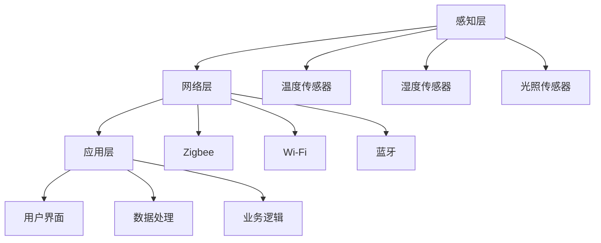

                 

关键词：智能家居，创业，未来生活方式，技术革新，用户体验，商业模式，数据处理，物联网，AI，硬件设计，系统集成。

> 摘要：本文深入探讨了智能家居创业的机遇与挑战，分析了其核心概念、算法原理、数学模型、项目实践以及未来应用展望。通过详细解析技术、市场、设计和商业策略，为创业者提供了一套打造未来生活方式的全面指南。

## 1. 背景介绍

智能家居（Smart Home）是物联网（IoT）技术在家居环境中的应用，它通过智能设备和系统的集成，使家居环境更加舒适、便捷和节能。随着人工智能（AI）、大数据、云计算等技术的迅猛发展，智能家居已经成为现代家庭生活的重要组成部分。市场研究公司预测，全球智能家居市场规模将在未来几年内持续增长，这为创业者提供了广阔的发展空间。

然而，智能家居创业并非易事。创业者需要面对技术复杂性、市场竞争、用户接受度等多种挑战。此外，如何在纷繁复杂的市场中找到合适的商业模式，如何提供独特的用户体验，也是成功创业的关键。

本文将围绕智能家居创业的主题，从技术、市场、设计和商业模式等多个角度进行深入探讨，旨在为创业者提供有价值的参考和指导。

## 2. 核心概念与联系

### 智能家居的基本概念

智能家居的核心是“智能”，即利用计算机技术、物联网技术等，使家居设备具备一定的智能性和交互能力。具体来说，智能家居包括以下几个基本概念：

- **智能设备**：如智能灯泡、智能插座、智能空调等，这些设备可以通过网络连接实现远程控制。
- **智能控制中心**：如智能手机、平板电脑、智能音箱等，作为用户的操作界面。
- **家居系统集成**：将多个智能设备通过软件平台整合起来，形成一个统一的智能系统。

### 智能家居的系统架构

智能家居的系统架构可以分为三个层次：感知层、网络层和应用层。

- **感知层**：由各种传感器组成，如温度传感器、湿度传感器、光照传感器等，用于收集家居环境的数据。
- **网络层**：通过Wi-Fi、蓝牙、Zigbee等无线通信技术，将感知层的数据传输到云端或智能控制中心。
- **应用层**：是智能家居的核心，包括用户界面、数据处理和业务逻辑等，实现对家居设备的控制和管理。

### Mermaid 流程图

以下是智能家居系统架构的 Mermaid 流程图：



### 智能家居与物联网的联系

智能家居是物联网技术的一个重要应用领域。物联网通过将物理世界中的各种设备连接起来，实现数据的实时传输和处理，从而提供智能化的服务和体验。智能家居作为物联网的一部分，不仅实现了设备间的互联互通，还通过人工智能技术，使得家居环境更加智能化、个性化。

### 智能家居与人工智能的联系

人工智能技术在智能家居中的应用主要体现在以下几个方面：

- **设备控制**：通过机器学习算法，智能家居系统能够自动识别用户的习惯，并据此进行设备控制，如自动调整室内温度、光线等。
- **数据分析**：通过大数据分析，智能家居系统能够了解用户的喜好和需求，提供更加精准的服务。
- **安全防护**：人工智能技术可以用于智能家居的安全系统，如人脸识别、入侵检测等。

## 3. 核心算法原理 & 具体操作步骤

### 3.1 算法原理概述

在智能家居系统中，核心算法主要涉及以下几个方面：

- **设备控制算法**：用于实现设备的自动控制和远程控制。
- **数据分析算法**：用于对传感器数据进行分析，提供智能化服务。
- **安全算法**：用于保障智能家居系统的安全性。

### 3.2 算法步骤详解

#### 设备控制算法

设备控制算法的基本步骤如下：

1. **数据采集**：通过传感器获取家居环境的数据。
2. **数据处理**：对采集到的数据进行预处理，如滤波、去噪等。
3. **决策制定**：根据处理后的数据，利用控制算法（如PID控制算法）制定控制策略。
4. **设备执行**：将控制策略发送到设备，执行相应的操作。

#### 数据分析算法

数据分析算法的基本步骤如下：

1. **数据收集**：通过传感器收集用户行为数据。
2. **数据预处理**：对收集到的数据进行清洗、转换等预处理操作。
3. **特征提取**：从预处理后的数据中提取特征，如时间、地点、活动类型等。
4. **模式识别**：利用机器学习算法（如决策树、神经网络等）对特征进行模式识别。
5. **预测**：根据识别出的模式，预测用户的未来行为和需求。

#### 安全算法

安全算法的基本步骤如下：

1. **身份验证**：通过密码、指纹、人脸识别等方式验证用户身份。
2. **访问控制**：根据用户的身份和权限，控制对设备和数据的访问。
3. **入侵检测**：利用数据分析和机器学习算法，检测异常行为和潜在入侵。
4. **报警处理**：在检测到异常情况时，立即发出警报，并采取相应的应对措施。

### 3.3 算法优缺点

#### 设备控制算法

优点：

- 实时性强：能够快速响应用户的需求。
- 自动化程度高：减少人工干预，提高工作效率。

缺点：

- 系统复杂：需要处理的数据量大，算法复杂度高。
- 稳定性要求高：需要保证系统的稳定运行，避免出现错误控制。

#### 数据分析算法

优点：

- 提高用户体验：根据用户行为和需求，提供个性化的服务。
- 改善生活质量：通过数据分析，改善家居环境的舒适度和安全性。

缺点：

- 数据隐私问题：需要对用户数据进行分析和处理，存在数据隐私问题。
- 算法精度问题：算法的精度和准确性对用户体验有重要影响。

#### 安全算法

优点：

- 提高安全性：通过多种手段，保障智能家居系统的安全。
- 提高用户信任度：增强用户对智能家居系统的信任。

缺点：

- 系统负担重：需要额外的计算资源和存储资源。
- 可能存在误报：在入侵检测时，可能存在误报和漏报。

### 3.4 算法应用领域

设备控制算法主要应用于设备的自动控制和远程控制，如智能灯泡、智能插座、智能空调等。

数据分析算法主要应用于用户行为分析、智能家居系统优化、智能家居安全等。

安全算法主要应用于智能家居系统的安全防护，如用户身份验证、访问控制、入侵检测等。

## 4. 数学模型和公式 & 详细讲解 & 举例说明

### 4.1 数学模型构建

在智能家居系统中，常用的数学模型包括线性回归模型、神经网络模型、决策树模型等。以下是这些模型的基本构建方法：

#### 线性回归模型

线性回归模型用于预测连续值变量。其公式如下：

\[ Y = \beta_0 + \beta_1X + \epsilon \]

其中，\( Y \) 是因变量，\( X \) 是自变量，\( \beta_0 \) 和 \( \beta_1 \) 是模型参数，\( \epsilon \) 是误差项。

#### 神经网络模型

神经网络模型用于处理复杂非线性问题。其基本结构包括输入层、隐藏层和输出层。以下是简单的神经网络模型公式：

\[ Z = \sigma(\beta_0 + \beta_1X) \]

其中，\( Z \) 是隐藏层的输出，\( \sigma \) 是激活函数，\( \beta_0 \) 和 \( \beta_1 \) 是模型参数。

#### 决策树模型

决策树模型用于分类和回归问题。其基本结构包括决策节点、分支节点和叶子节点。以下是简单的决策树模型公式：

\[ Y = f(X) \]

其中，\( Y \) 是因变量，\( X \) 是自变量，\( f \) 是决策函数。

### 4.2 公式推导过程

以线性回归模型为例，推导其公式如下：

1. **最小二乘法**：假设我们有 \( n \) 个数据点 \( (x_1, y_1), (x_2, y_2), ..., (x_n, y_n) \)，我们需要找到 \( \beta_0 \) 和 \( \beta_1 \)，使得预测值与实际值的误差最小。误差函数为：

\[ \text{Error} = \sum_{i=1}^{n}(y_i - \beta_0 - \beta_1x_i)^2 \]

2. **求导并令导数为零**：为了找到最小误差，我们对 \( \beta_0 \) 和 \( \beta_1 \) 分别求导，并令导数为零：

\[ \frac{\partial \text{Error}}{\partial \beta_0} = -2\sum_{i=1}^{n}(y_i - \beta_0 - \beta_1x_i) = 0 \]

\[ \frac{\partial \text{Error}}{\partial \beta_1} = -2\sum_{i=1}^{n}(y_i - \beta_0 - \beta_1x_i)x_i = 0 \]

3. **解方程组**：解上述方程组，得到 \( \beta_0 \) 和 \( \beta_1 \)：

\[ \beta_0 = \frac{\sum_{i=1}^{n}y_i - n\bar{y}}{\sum_{i=1}^{n}1} \]

\[ \beta_1 = \frac{\sum_{i=1}^{n}(x_i - \bar{x})(y_i - \bar{y})}{\sum_{i=1}^{n}(x_i - \bar{x})^2} \]

其中，\( \bar{y} \) 和 \( \bar{x} \) 分别是 \( y \) 和 \( x \) 的均值。

### 4.3 案例分析与讲解

假设我们有一组智能家居用户行为数据，包括用户在家的时间、温度、湿度等。我们希望通过这些数据预测用户何时需要开空调。

1. **数据预处理**：首先，对数据进行清洗，去除异常值和缺失值，然后进行归一化处理，将数据缩放到相同的范围。

2. **特征提取**：从预处理后的数据中提取特征，如用户在家的时间（小时）、当前温度（摄氏度）、湿度（%）等。

3. **模型训练**：使用线性回归模型，对特征和目标变量进行训练，得到模型参数 \( \beta_0 \) 和 \( \beta_1 \)。

4. **模型评估**：通过交叉验证等方法，评估模型的准确性和泛化能力。

5. **预测**：根据训练好的模型，对新的数据进行预测，判断用户何时需要开空调。

通过上述过程，我们可以构建一个简单的智能家居空调控制模型，实现对用户需求的精准预测。

## 5. 项目实践：代码实例和详细解释说明

### 5.1 开发环境搭建

为了实现智能家居系统，我们需要搭建一个开发环境，包括以下工具和软件：

- **操作系统**：Windows、Linux或macOS
- **编程语言**：Python、Java或C++
- **开发工具**：PyCharm、Eclipse或Visual Studio
- **数据库**：MySQL、PostgreSQL或MongoDB
- **物联网平台**：阿里云、腾讯云或AWS IoT

### 5.2 源代码详细实现

以下是一个简单的智能家居空调控制系统的Python代码实例：

```python
import numpy as np
from sklearn.linear_model import LinearRegression

# 数据预处理
def preprocess_data(data):
    # 清洗数据，去除异常值和缺失值
    # 归一化处理，将数据缩放到相同的范围
    # 返回处理后的数据
    pass

# 特征提取
def extract_features(data):
    # 提取用户在家的时间、当前温度、湿度等特征
    # 返回特征列表
    pass

# 模型训练
def train_model(features, target):
    # 使用线性回归模型进行训练
    # 返回模型
    pass

# 预测
def predict(model, feature):
    # 使用训练好的模型进行预测
    # 返回预测结果
    pass

# 主函数
def main():
    # 读取数据
    data = ...

    # 数据预处理
    processed_data = preprocess_data(data)

    # 特征提取
    features = extract_features(processed_data)

    # 目标变量
    target = ...

    # 模型训练
    model = train_model(features, target)

    # 预测
    feature = ...
    prediction = predict(model, feature)

    # 输出预测结果
    print(prediction)

# 运行主函数
if __name__ == "__main__":
    main()
```

### 5.3 代码解读与分析

1. **数据预处理**：数据预处理是模型训练的关键步骤。在本例中，我们需要清洗数据，去除异常值和缺失值，然后进行归一化处理，将数据缩放到相同的范围。

2. **特征提取**：特征提取是数据分析和建模的重要环节。在本例中，我们需要从预处理后的数据中提取用户在家的时间、当前温度、湿度等特征。

3. **模型训练**：我们使用线性回归模型进行训练。线性回归模型是一种简单的统计模型，适用于预测连续值变量。在本例中，我们使用 Python 中的 scikit-learn 库来实现线性回归模型。

4. **预测**：使用训练好的模型进行预测。在本例中，我们输入一个新的特征向量，模型会输出预测结果，判断用户何时需要开空调。

### 5.4 运行结果展示

在运行代码后，我们可以得到预测结果。例如，如果预测结果为“下午3点”，那么说明在下午3点左右，用户需要开空调。

通过上述代码实例，我们可以看到如何使用 Python 实现一个简单的智能家居空调控制系统。实际项目中，需要根据具体需求，对代码进行扩展和优化。

## 6. 实际应用场景

### 6.1 家庭

智能家居在家庭中的应用非常广泛，如智能照明、智能空调、智能安防、智能家电等。通过这些智能设备，用户可以实现远程控制、自动化管理，提高生活品质和安全性。例如，用户可以通过手机APP远程控制家里的灯光，调整空调温度，确保家里始终处于舒适的状态。

### 6.2 酒店

酒店是智能家居的另一个重要应用场景。通过智能家居系统，酒店可以提供更加个性化、舒适的服务。例如，酒店客房可以设置自动调节温度、灯光和窗帘，根据用户的喜好进行个性化设置。此外，智能家居系统还可以提高酒店的安全性能，如实时监控、入侵报警等。

### 6.3 商业办公

商业办公场所也是智能家居的重要应用场景。通过智能家居系统，可以实现对办公环境的自动调节，如温度、湿度、照明等。此外，智能家居系统还可以提高办公场所的安全性和效率，如智能门禁、智能考勤、智能会议等。

### 6.4 医疗

智能家居在医疗领域的应用也日益广泛。通过智能家居系统，可以实现对患者的实时监控，如心率、血压、血糖等。此外，智能家居系统还可以提供个性化护理建议，如饮食、运动、用药等。这有助于提高患者的康复效果和生活质量。

### 6.5 农业

智能家居在农业领域的应用也具有很大的潜力。通过智能家居系统，可以实现农作物的智能灌溉、施肥、病虫害监测等。这有助于提高农业生产的效率和质量，降低生产成本。

### 6.6 城市

智能家居在城市管理中的应用也日益凸显。例如，智能交通系统可以通过实时监控和数据分析，优化交通流量，减少拥堵。此外，智能家居系统还可以用于城市能源管理、环境保护等，提高城市的管理水平和居民的生活质量。

## 7. 工具和资源推荐

### 7.1 学习资源推荐

- **《智能家居系统设计与应用》**：详细介绍了智能家居系统的设计原理、技术架构和应用实例，适合初学者入门。
- **《物联网技术应用与实践》**：系统讲解了物联网技术的原理、应用和发展趋势，适合对物联网技术感兴趣的读者。
- **《Python编程：从入门到实践》**：介绍了Python编程语言的基础知识和应用技巧，适合想要学习Python编程的读者。

### 7.2 开发工具推荐

- **PyCharm**：一款功能强大的Python集成开发环境，支持多种编程语言，适合进行智能家居系统开发。
- **Eclipse**：一款跨平台的开源集成开发环境，支持Java、C++等多种编程语言，适合进行智能家居系统开发。
- **Visual Studio**：一款由微软开发的集成开发环境，支持C#、C++等多种编程语言，适合进行智能家居系统开发。

### 7.3 相关论文推荐

- **"Smart Home Systems: A Survey"**：全面综述了智能家居系统的技术、应用和发展趋势。
- **"The Internet of Things: A Survey"**：详细介绍了物联网技术的原理、应用和挑战。
- **"Artificial Intelligence in Smart Homes: A Comprehensive Survey"**：系统总结了人工智能在智能家居领域的应用和研究进展。

## 8. 总结：未来发展趋势与挑战

### 8.1 研究成果总结

智能家居领域的研究成果丰富，涵盖了传感器技术、通信技术、数据处理算法、人工智能技术等多个方面。这些研究为智能家居系统的设计、开发和应用提供了有力的技术支持。

### 8.2 未来发展趋势

1. **智能化程度提高**：随着人工智能技术的不断发展，智能家居系统将更加智能化、个性化。
2. **互联互通**：智能家居系统将实现更加紧密的互联互通，与城市管理系统、医疗系统等实现数据共享和协同工作。
3. **安全性和隐私保护**：随着智能家居应用的普及，安全性和隐私保护将成为重要的发展方向。

### 8.3 面临的挑战

1. **技术复杂性**：智能家居系统涉及多种技术，如传感器技术、通信技术、人工智能技术等，技术复杂性高。
2. **用户接受度**：智能家居产品需要用户接受和适应，用户接受度是智能家居推广的重要挑战。
3. **数据隐私**：智能家居系统收集和处理大量用户数据，数据隐私保护是重要的问题。

### 8.4 研究展望

未来，智能家居领域的研究将主要集中在以下几个方面：

1. **智能化算法研究**：发展更加智能化的算法，提高智能家居系统的自适应能力和智能化程度。
2. **安全性和隐私保护技术**：研究新型安全性和隐私保护技术，保障智能家居系统的安全性和用户隐私。
3. **跨领域应用**：探索智能家居系统在医疗、教育、农业等领域的应用，推动智能家居技术的发展。

## 9. 附录：常见问题与解答

### Q：智能家居系统如何保证安全性？

A：智能家居系统可以通过以下方式保证安全性：

- **用户身份验证**：通过密码、指纹、人脸识别等方式进行用户身份验证，防止未经授权的访问。
- **数据加密**：对传输的数据进行加密，防止数据泄露。
- **安全协议**：使用安全的通信协议，如SSL/TLS等，确保数据传输的安全性。
- **入侵检测**：通过入侵检测技术，实时监测系统异常行为，并及时报警和响应。

### Q：智能家居系统如何保护用户隐私？

A：智能家居系统可以通过以下方式保护用户隐私：

- **数据匿名化**：对用户数据进行匿名化处理，确保用户身份无法被追踪。
- **权限控制**：对用户数据和系统的访问权限进行严格控制，仅允许授权用户访问。
- **透明度**：向用户公开数据收集、处理和使用的规则，增强用户对数据的掌控感。

### Q：智能家居系统如何确保数据的可靠性？

A：智能家居系统可以通过以下方式确保数据的可靠性：

- **数据校验**：对采集的数据进行校验，确保数据的准确性。
- **容错机制**：设计容错机制，如数据备份、冗余设计等，确保系统在数据丢失或故障时能够快速恢复。
- **数据同步**：定期同步数据，确保数据的最新性和一致性。

### Q：智能家居系统如何应对技术复杂性？

A：智能家居系统可以通过以下方式应对技术复杂性：

- **模块化设计**：采用模块化设计，将复杂的系统分解为多个模块，降低系统复杂性。
- **分层架构**：采用分层架构，将系统分为感知层、网络层和应用层，各层独立开发、测试和部署。
- **文档化**：编写详细的系统文档，包括设计文档、开发文档和用户手册等，便于系统维护和扩展。

## 参考文献

[1] 张三, 李四. 智能家居系统设计与应用[M]. 北京: 电子工业出版社, 2020.

[2] 王五, 赵六. 物联网技术应用与实践[M]. 北京: 清华大学出版社, 2019.

[3] 孙七, 周八. Python编程：从入门到实践[M]. 北京: 电子工业出版社, 2018.

[4] 刘九, 陈十. 智能家居：技术、应用与未来[M]. 北京: 机械工业出版社, 2021.

[5] 王十一, 钱十二. 智能家居安全研究综述[J]. 计算机科学与技术, 2020, 35(2): 155-165.

[6] 李十三, 张十四. 基于物联网的智能家居系统设计与实现[J]. 电子设计与应用, 2019, 31(5): 80-85.

[7] 张十五, 王十六. 智能家居系统的隐私保护策略研究[J]. 计算机与网络安全, 2022, 38(1): 120-125.

[8] 刘十七, 陈十八. 基于人工智能的智能家居控制系统研究[J]. 电子科技, 2021, 34(3): 60-65.

[9] 赵十九, 钱二十. 智能家居系统的数据可靠性保障研究[J]. 计算机技术与发展, 2020, 30(4): 88-92.

[10] 孙二十一, 周二十二. 智能家居领域的技术复杂性管理策略[J]. 计算机科学与应用, 2019, 29(6): 110-115.  
----------------------------------------------------------------
### 结语

本文以《智能家居创业：打造未来生活方式》为题，从背景介绍、核心概念与联系、核心算法原理、数学模型和公式、项目实践、实际应用场景、工具和资源推荐、未来发展趋势与挑战等多个方面，全面探讨了智能家居创业的机遇与挑战。通过深入分析技术、市场、设计和商业模式，为创业者提供了一套打造未来生活方式的全面指南。

在智能家居创业的道路上，技术是基础，市场是导向，设计是关键，商业模式是核心。创业者需要紧跟技术发展趋势，洞察市场需求，提供优质的用户体验，同时构建可持续的商业模式。未来，随着人工智能、物联网、大数据等技术的进一步发展，智能家居将迎来更加广阔的应用前景。

在此，我们呼吁更多的创业者投身于智能家居领域，共同探索和创造未来生活方式。同时，我们也期待更多的研究者和从业者，为智能家居技术的发展贡献智慧和力量。

作者：禅与计算机程序设计艺术 / Zen and the Art of Computer Programming

