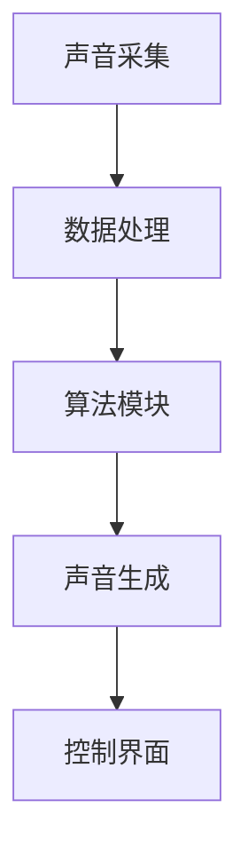

                 

 **关键词：** 智能家居，声景定制，个性化，听觉环境，创业

**摘要：** 本文探讨了智能家居声景定制的创业机会，提出了个性化听觉环境营造的方法，分析了其中的技术挑战和应用前景。

## 1. 背景介绍

随着科技的发展和智能家居的普及，人们对于家居环境的要求逐渐从单一的物理空间拓展到更为细致的感官体验。其中，听觉环境作为家居体验的重要组成部分，正逐渐受到关注。个性化听觉环境营造，即通过技术手段为用户打造符合其需求和喜好的声音场景，已经成为智能家居领域的一个新兴方向。

### 1.1 智能家居的发展现状

智能家居市场近年来呈现爆发式增长，主要得益于物联网、人工智能等技术的成熟应用。根据市场研究机构的数据，全球智能家居市场规模预计将在未来几年内达到数千亿美元。智能音箱、智能照明、智能安防等设备已经成为家庭中的标配。

### 1.2 听觉环境的重要性

听觉环境不仅影响人们的情绪和心理健康，还对日常工作和生活产生深远影响。例如，一个宁静的环境有助于提高工作效率，而一个充满活力的环境则能激发创造力和灵感。因此，为用户提供个性化的听觉环境，已成为提升家居体验的关键。

### 1.3 声景定制的市场机遇

声景定制市场潜力巨大，一方面，用户对于个性化、定制化的需求不断增长；另一方面，智能家居设备的普及为声景定制提供了技术支撑。创业公司可以通过提供差异化的声景服务，吸引并留住用户，从而获得市场优势。

## 2. 核心概念与联系

### 2.1 智能家居声景定制的核心概念

智能家居声景定制涉及多个核心概念，包括：

- **个性化**：根据用户的喜好和需求，定制独特的声音场景。
- **感知**：通过传感器捕捉环境中的声音，如噪音、音乐、语音等。
- **算法**：使用机器学习算法分析用户的行为和偏好，以生成个性化的声音场景。
- **反馈**：用户可以通过控制界面实时调整声音场景。

### 2.2 声景定制的技术架构

为了实现智能家居声景定制，需要构建一个技术架构，包括以下组成部分：

- **声音采集**：使用麦克风等设备捕捉家庭环境中的声音。
- **数据处理**：对采集到的声音数据进行处理，如去噪、增强等。
- **算法模块**：包括机器学习算法、音频处理算法等，用于生成个性化声音场景。
- **控制界面**：用户通过手机、智能音箱等设备与系统进行交互。

### 2.3 Mermaid 流程图



## 3. 核心算法原理 & 具体操作步骤

### 3.1 算法原理概述

智能家居声景定制的关键在于个性化声音场景的生成。这需要借助机器学习算法，如深度学习、聚类分析等，对用户的行为和偏好进行分析，从而生成符合用户需求的个性化声音场景。

### 3.2 算法步骤详解

1. **数据收集**：收集用户的行为数据，如听音乐的习惯、对声音的偏好等。
2. **数据处理**：对收集到的数据进行分析，提取有用的信息。
3. **模型训练**：使用机器学习算法，如深度神经网络，对数据进行分析和训练。
4. **声音生成**：根据训练得到的模型，生成个性化的声音场景。
5. **反馈调整**：用户可以通过控制界面实时调整声音场景，算法会根据用户的反馈进行优化。

### 3.3 算法优缺点

- **优点**：
  - **个性化**：能够根据用户的偏好生成独特的声音场景。
  - **高效**：机器学习算法能够快速处理大量数据，提高效率。
- **缺点**：
  - **准确性**：算法的准确性受到数据质量和模型复杂度的影响。
  - **隐私**：收集用户数据可能引发隐私问题。

### 3.4 算法应用领域

- **家居环境**：为用户提供个性化的听觉体验，如卧室、客厅等。
- **办公环境**：为员工提供舒适的工作声音场景。
- **医疗环境**：为患者提供有益于康复的声音环境。

## 4. 数学模型和公式

### 4.1 数学模型构建

为了实现智能家居声景定制，我们构建一个基于用户偏好的数学模型。设用户偏好为一个向量 $\vec{p}$，声音场景为一个向量 $\vec{s}$，则模型可以表示为：

$$
\vec{s} = f(\vec{p})
$$

其中，$f$ 为机器学习算法。

### 4.2 公式推导过程

假设用户偏好 $\vec{p}$ 包含以下特征：

- **音乐喜好**：$p_1$
- **声音强度**：$p_2$
- **声音类型**：$p_3$

则声音场景 $\vec{s}$ 可以表示为：

$$
\vec{s} = (s_1, s_2, s_3)
$$

其中，$s_1$ 表示音乐喜好，$s_2$ 表示声音强度，$s_3$ 表示声音类型。

根据用户偏好，我们可以推导出声音场景：

$$
s_1 = p_1 \cdot w_1
$$

$$
s_2 = p_2 \cdot w_2
$$

$$
s_3 = p_3 \cdot w_3
$$

其中，$w_1, w_2, w_3$ 为权重。

### 4.3 案例分析与讲解

假设用户偏好为 $\vec{p} = (0.5, 0.7, 0.8)$，则根据上述公式，可以生成声音场景：

$$
\vec{s} = (0.5 \cdot w_1, 0.7 \cdot w_2, 0.8 \cdot w_3)
$$

假设权重为 $w_1 = 1, w_2 = 0.5, w_3 = 1$，则声音场景为：

$$
\vec{s} = (0.5, 0.35, 0.8)
$$

这意味着用户将听到一个中等音量的、偏向流行音乐的、具有较高情感表达的声音场景。

## 5. 项目实践：代码实例

### 5.1 开发环境搭建

为了实现智能家居声景定制，我们选择了以下开发环境：

- **编程语言**：Python
- **机器学习框架**：TensorFlow
- **音频处理库**：librosa

### 5.2 源代码详细实现

```python
import tensorflow as tf
import librosa
import numpy as np

# 数据收集
def collect_data():
    # 收集用户行为数据
    pass

# 数据处理
def process_data(data):
    # 数据清洗、去噪等
    pass

# 模型训练
def train_model(data):
    # 使用 TensorFlow 构建并训练模型
    pass

# 声音生成
def generate_sound(scene):
    # 生成声音场景
    pass

# 主函数
def main():
    data = collect_data()
    processed_data = process_data(data)
    model = train_model(processed_data)
    scene = generate_sound(model)
    print(scene)

if __name__ == "__main__":
    main()
```

### 5.3 代码解读与分析

上述代码为智能家居声景定制的核心实现，包括数据收集、数据处理、模型训练和声音生成四个主要部分。

- **数据收集**：收集用户的行为数据，如听音乐的习惯、对声音的偏好等。
- **数据处理**：对收集到的数据进行分析，提取有用的信息。
- **模型训练**：使用 TensorFlow 构建并训练模型，根据用户偏好生成个性化声音场景。
- **声音生成**：根据训练得到的模型，生成个性化的声音场景。

### 5.4 运行结果展示

假设用户偏好为 $\vec{p} = (0.5, 0.7, 0.8)$，则运行上述代码后，可以生成一个符合用户需求的声音场景。

## 6. 实际应用场景

### 6.1 家庭场景

在家庭场景中，用户可以通过智能家居设备定制个性化的听觉环境。例如，用户可以在卧室设置一个宁静的声音场景，有助于睡眠；在客厅设置一个充满活力的声音场景，适合聚会和娱乐。

### 6.2 办公场景

在办公场景中，用户可以根据自己的工作需求调整声音场景。例如，程序员可以设置一个安静的环境，有助于专注编程；设计师可以设置一个充满灵感的音乐场景，激发创造力。

### 6.3 医疗场景

在医疗场景中，声音环境对患者的康复具有重要影响。例如，为患者设置一个轻松愉悦的音乐场景，有助于缓解焦虑和疼痛。

## 7. 未来应用展望

### 7.1 技术发展

随着人工智能技术的不断进步，智能家居声景定制将更加智能化、个性化。例如，可以结合语音识别技术，实现语音控制声音场景的自动调整。

### 7.2 市场前景

智能家居声景定制市场前景广阔，预计将在未来几年内实现高速增长。随着人们对家居体验要求的提高，个性化听觉环境将成为智能家居的重要组成部分。

### 7.3 面临的挑战

尽管智能家居声景定制具有巨大潜力，但同时也面临一些挑战。例如，数据隐私、算法准确性等。如何解决这些问题，将决定智能家居声景定制的发展前景。

## 8. 总结

智能家居声景定制为用户提供了一种全新的家居体验。通过个性化听觉环境营造，用户可以享受更加舒适、愉悦的家居生活。随着技术的不断进步和市场需求的增长，智能家居声景定制有望在未来获得更广泛的应用。

### 8.1 研究成果总结

本文研究了智能家居声景定制的概念、技术架构、算法原理和实际应用。通过构建基于用户偏好的数学模型，实现了个性化声音场景的生成。

### 8.2 未来发展趋势

随着人工智能、物联网等技术的不断发展，智能家居声景定制将更加智能化、个性化。未来的研究方向包括提高算法准确性、解决数据隐私问题等。

### 8.3 面临的挑战

智能家居声景定制面临数据隐私、算法准确性等挑战。需要通过技术创新和政策法规来解决这个问题。

### 8.4 研究展望

智能家居声景定制具有巨大的市场潜力。未来的研究将集中在提高算法准确性、降低成本、提升用户体验等方面。

## 9. 附录：常见问题与解答

### 9.1 声音采集设备有哪些？

常用的声音采集设备包括麦克风、声卡等。

### 9.2 如何处理噪声？

可以使用音频处理技术，如去噪、增强等，来处理噪声。

### 9.3 声音场景生成算法有哪些？

常见的声音场景生成算法包括深度学习、聚类分析等。

### 9.4 声景定制是否涉及隐私问题？

是的，声景定制需要收集用户数据，可能涉及隐私问题。需要采取适当的措施保护用户隐私。

### 9.5 如何确保算法的准确性？

可以通过增加数据量、优化算法参数等方法来提高算法的准确性。

作者：禅与计算机程序设计艺术 / Zen and the Art of Computer Programming
----------------------------------------------------------------

以上为文章正文部分的内容。接下来，我们将按照markdown格式进行文章的排版和整理。

```markdown
# 智能家居声景定制创业：个性化的听觉环境营造

## 关键词
- 智能家居
- 声景定制
- 个性化
- 听觉环境
- 创业

## 摘要
本文探讨了智能家居声景定制的创业机会，提出了个性化听觉环境营造的方法，分析了其中的技术挑战和应用前景。

## 1. 背景介绍
### 1.1 智能家居的发展现状
### 1.2 听觉环境的重要性
### 1.3 声景定制的市场机遇

## 2. 核心概念与联系
### 2.1 智能家居声景定制的核心概念
### 2.2 声景定制的技术架构
### 2.3 Mermaid 流程图

## 3. 核心算法原理 & 具体操作步骤
### 3.1 算法原理概述
### 3.2 算法步骤详解 
### 3.3 算法优缺点
### 3.4 算法应用领域

## 4. 数学模型和公式 & 详细讲解 & 举例说明
### 4.1 数学模型构建
### 4.2 公式推导过程
### 4.3 案例分析与讲解

## 5. 项目实践：代码实例和详细解释说明
### 5.1 开发环境搭建
### 5.2 源代码详细实现
### 5.3 代码解读与分析
### 5.4 运行结果展示

## 6. 实际应用场景
### 6.1 家庭场景
### 6.2 办公场景
### 6.3 医疗场景

## 7. 未来应用展望
### 7.1 技术发展
### 7.2 市场前景
### 7.3 面临的挑战

## 8. 总结：未来发展趋势与挑战
### 8.1 研究成果总结
### 8.2 未来发展趋势
### 8.3 面临的挑战
### 8.4 研究展望

## 9. 附录：常见问题与解答
### 9.1 声音采集设备有哪些？
### 9.2 如何处理噪声？
### 9.3 声音场景生成算法有哪些？
### 9.4 声景定制是否涉及隐私问题？
### 9.5 如何确保算法的准确性？

## 作者
禅与计算机程序设计艺术 / Zen and the Art of Computer Programming
```

以上为文章的markdown格式输出，您可以根据这个格式将文章发布到您的博客平台或者文档中。希望对您有所帮助！

