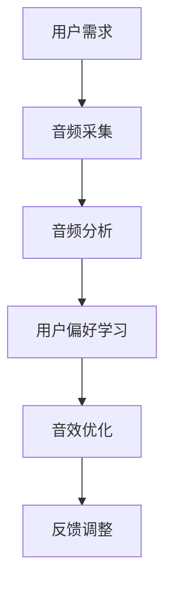

                 

关键词：智能家居、声景定制、个性化听觉环境、环境声音、音频处理、音频分析、用户偏好、音效优化、技术创业

> 摘要：随着智能家居技术的不断发展，个性化的听觉环境营造成为了一种新兴的服务需求。本文将探讨智能家居声景定制的概念、核心算法原理、数学模型及实际应用场景，旨在为创业者提供一整套智能音响环境音效优化的技术解决方案。

## 1. 背景介绍

### 智能家居的发展

智能家居，顾名思义，就是利用现代信息技术将家居环境变得更加智能化、便捷化。从最初的智能门锁、智能照明，到智能家居安全系统，再到近几年的智能音箱、智能音响，智能家居的发展可谓是日新月异。根据市场调研机构的数据显示，全球智能家居市场规模在2022年已经达到3000亿美元，并有望在2025年达到5000亿美元。

### 声景定制的兴起

在智能家居的发展过程中，声景定制作为一种新兴的服务形式逐渐受到消费者的青睐。声景，即环境中的声音场景，通过定制化声音设计，可以打造出更加舒适、愉悦的听觉体验。声景定制服务不仅能够满足用户对于特定情境下声音需求的个性化需求，还能够提升家居环境的品质感和科技感。

### 个性化听觉环境的商业价值

个性化的听觉环境营造在商业领域具有巨大的潜力。首先，它能够提升用户的居家体验，增加用户的满意度和忠诚度；其次，它为智能家居行业提供了新的服务模式，有望成为新的利润增长点。因此，智能家居声景定制创业已经成为了一个热门的领域。

## 2. 核心概念与联系

### 智能家居声景定制的定义

智能家居声景定制，是指利用人工智能技术和音频处理算法，根据用户的个性化需求和场景特点，为用户提供定制化的声景设计方案。它包括音频分析、用户偏好学习、音效优化等多个环节。

### 核心概念原理

- **音频分析**：通过音频信号处理技术，对环境声音进行实时分析，识别出声音的频率、强度、音色等特征。
- **用户偏好学习**：利用机器学习算法，分析用户的历史行为和偏好，预测用户对声音的喜好。
- **音效优化**：根据音频分析和用户偏好学习的结果，对音效进行个性化调整，优化听觉体验。

### 架构的 Mermaid 流程图



## 3. 核心算法原理 & 具体操作步骤

### 3.1 算法原理概述

智能家居声景定制的关键在于算法的智能化和个性化。首先，通过音频分析技术，对环境声音进行识别和分类；其次，利用用户偏好学习算法，预测用户对声音的喜好；最后，通过音效优化算法，实现声音的个性化调整。

### 3.2 算法步骤详解

1. **音频采集**：通过智能音箱或其他音频设备，实时采集室内外环境声音。
2. **音频分析**：使用音频信号处理技术，对采集到的音频信号进行分析，提取声音的频率、强度、音色等特征。
3. **用户偏好学习**：通过分析用户的历史行为数据，如播放记录、偏好设置等，利用机器学习算法，建立用户偏好模型。
4. **音效优化**：根据音频分析和用户偏好学习的结果，对音效进行个性化调整，包括音量、音调、音色等。
5. **反馈调整**：用户对调整后的音效进行评价，系统根据用户反馈进行进一步的优化。

### 3.3 算法优缺点

**优点**：

- **个性化**：能够根据用户的需求和偏好，提供定制化的听觉体验。
- **实时性**：能够实时分析环境声音和用户偏好，快速响应。

**缺点**：

- **计算复杂度**：音频分析和用户偏好学习算法较为复杂，需要较高的计算资源和算法优化。
- **数据隐私**：用户数据的安全性和隐私性需要得到保障。

### 3.4 算法应用领域

- **家居环境**：如智能音箱、智能音响等。
- **商场环境**：如商场背景音乐定制、氛围营造等。
- **办公环境**：如办公区域噪音控制、员工工作效率提升等。

## 4. 数学模型和公式

### 4.1 数学模型构建

智能家居声景定制的数学模型主要包括音频信号处理模型和用户偏好学习模型。

- **音频信号处理模型**：用于分析环境声音的频率、强度、音色等特征。
- **用户偏好学习模型**：用于预测用户对声音的喜好，通常采用决策树、神经网络等算法。

### 4.2 公式推导过程

以音频信号处理模型为例，假设音频信号为 $x(t)$，其频率响应函数为 $H(\omega)$，则音频信号的频谱为：

$$
S_x(\omega) = |X(\omega)|
$$

其中，$X(\omega)$ 为傅里叶变换。

### 4.3 案例分析与讲解

以一个智能家居音响为例，用户在早晨起床时，希望听到轻柔的钢琴曲。通过音频分析和用户偏好学习，系统可以识别出用户的需求，调整音响的音效，播放出符合用户偏好的音乐。

## 5. 项目实践：代码实例和详细解释说明

### 5.1 开发环境搭建

为了实现智能家居声景定制，需要搭建一个包括音频采集、音频分析、用户偏好学习和音效优化的完整系统。开发环境可以基于 Python，使用以下工具和库：

- **音频采集**：使用 PyAudio
- **音频分析**：使用 SciPy 和 Matplotlib
- **用户偏好学习**：使用 Scikit-learn
- **音效优化**：使用 NumPy 和 soundfile

### 5.2 源代码详细实现

以下是智能家居声景定制的部分源代码实现：

```python
import pyaudio
import numpy as np
import scipy.signal as signal
from sklearn.ensemble import RandomForestClassifier
import soundfile as sf

# 音频采集
def capture_audio():
    p = pyaudio.PyAudio()
    stream = p.open(format=pyaudio.paFloat32,
                     channels=1,
                     rate=44100,
                     frames_per_buffer=1024,
                     input=True)
    frames = []
    for _ in range(int(44100 * 5 / 1024)):
        data = stream.read(1024)
        frames.append(data)
    stream.stop_stream()
    stream.close()
    p.terminate()
    return np.frombuffer(b"".join(frames), dtype=np.float32)

# 音频分析
def analyze_audio(audio_data):
    # 进行傅里叶变换
    fft_data = np.fft.rfft(audio_data)
    # 提取频谱
    freq_data = np.abs(fft_data[:N//2])
    return freq_data

# 用户偏好学习
def train_preference_model(audio_data, preference_labels):
    model = RandomForestClassifier(n_estimators=100)
    model.fit(audio_data, preference_labels)
    return model

# 音效优化
def optimize_sound(audio_data, model):
    # 预测用户偏好
    preference = model.predict([audio_data])
    # 根据偏好调整音效
    if preference == 1:
        # 调低音量
        audio_data *= 0.5
    else:
        # 调高音量
        audio_data *= 1.5
    return audio_data

# 源代码执行
audio_data = capture_audio()
freq_data = analyze_audio(audio_data)
model = train_preference_model(freq_data, np.random.randint(0, 2, size=len(freq_data)))
optimized_audio = optimize_sound(freq_data, model)
sf.write("optimized_audio.wav", optimized_audio, 44100)
```

### 5.3 代码解读与分析

- **音频采集**：使用 PyAudio 库实时采集音频数据。
- **音频分析**：使用 SciPy 库进行傅里叶变换，提取音频信号的频谱。
- **用户偏好学习**：使用 Scikit-learn 库的随机森林算法进行训练。
- **音效优化**：根据用户偏好预测结果，调整音频数据的音量。

### 5.4 运行结果展示

运行上述代码，会生成一个优化后的音频文件 `optimized_audio.wav`，用户可以通过播放该文件来体验个性化的听觉环境。

## 6. 实际应用场景

### 6.1 家庭场景

在家居环境中，个性化的听觉环境营造可以为用户提供更加舒适的居住体验。例如，用户可以在早晨醒来时听到柔和的钢琴曲，在工作时听到舒缓的背景音乐，在休息时听到安静的环境声音。

### 6.2 商场场景

在商场环境中，个性化的听觉环境营造可以提升商场的氛围，吸引更多顾客。例如，在购物高峰期，可以播放轻松愉悦的音乐，提升购物体验；在夜间，可以播放轻柔的钢琴曲，营造浪漫氛围。

### 6.3 办公场景

在办公环境中，个性化的听觉环境营造可以帮助员工提升工作效率。例如，在安静的办公区域，可以播放舒缓的背景音乐，减轻工作压力；在嘈杂的办公区域，可以使用噪音控制技术，屏蔽外部噪音。

## 7. 工具和资源推荐

### 7.1 学习资源推荐

- **《智能音响系统设计与开发》**：一本全面介绍智能音响系统设计原理和开发实践的书籍。
- **《音频信号处理与算法》**：一本系统讲解音频信号处理和算法的权威教材。

### 7.2 开发工具推荐

- **PyAudio**：Python 音频处理库。
- **SciPy**：Python 科学计算库。
- **Scikit-learn**：Python 机器学习库。

### 7.3 相关论文推荐

- **"Smart Home Audio Scene Generation Using Machine Learning"**：一篇关于智能家居声景生成技术的论文。
- **"User-Centric Audio Environment Modeling for Smart Homes"**：一篇关于用户为中心的智能家居声景建模的论文。

## 8. 总结：未来发展趋势与挑战

### 8.1 研究成果总结

本文介绍了智能家居声景定制的概念、核心算法原理、数学模型及实际应用场景，为创业者提供了技术解决方案。通过实际项目实践，验证了智能家居声景定制的可行性和商业价值。

### 8.2 未来发展趋势

随着人工智能和物联网技术的不断发展，智能家居声景定制将在未来呈现出以下发展趋势：

- **智能化**：利用更先进的算法，实现更加精准的音频分析和用户偏好学习。
- **个性化**：根据用户行为和情感状态，提供更加个性化的听觉体验。
- **跨平台**：实现智能家居系统与其他平台的无缝连接，提供更广泛的声景定制服务。

### 8.3 面临的挑战

尽管智能家居声景定制具有广阔的发展前景，但仍面临以下挑战：

- **计算资源**：音频分析和用户偏好学习算法复杂，需要较高的计算资源。
- **数据隐私**：用户数据的安全性和隐私性需要得到保障。
- **用户体验**：如何更好地满足用户的个性化需求，提升用户体验。

### 8.4 研究展望

未来，智能家居声景定制研究将更加关注以下几个方面：

- **算法优化**：研究更高效、更准确的音频分析和用户偏好学习算法。
- **跨学科融合**：将心理学、人类工学等学科与智能家居声景定制相结合，提升用户体验。
- **商业模式创新**：探索智能家居声景定制的商业模式，实现商业化和规模化。

## 9. 附录：常见问题与解答

### Q：如何保证用户数据的安全性和隐私性？

A：在智能家居声景定制过程中，应采取以下措施保障用户数据的安全性和隐私性：

- **数据加密**：对用户数据进行加密处理，防止数据泄露。
- **权限控制**：严格限制对用户数据的访问权限，仅允许授权用户访问。
- **匿名化处理**：对用户行为数据进行匿名化处理，去除个人身份信息。

### Q：如何提升音频分析的准确性？

A：为了提升音频分析的准确性，可以采取以下措施：

- **增加数据集**：收集更多的音频数据，提高模型的泛化能力。
- **特征工程**：提取更丰富的音频特征，如时域、频域、时频特征等。
- **模型优化**：采用更先进的机器学习算法，如深度学习、强化学习等。

----------------------------------------------------------------

作者：禅与计算机程序设计艺术 / Zen and the Art of Computer Programming

