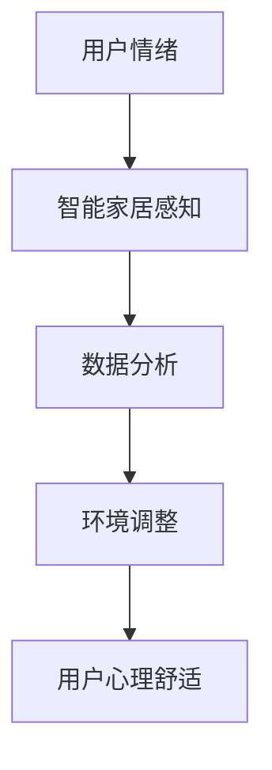

                 

关键词：智能家居，心理舒适，情绪调节，居住环境，创业

> 摘要：随着科技的快速发展，智能家居市场日益扩大，然而，如何在智能家居系统中引入心理舒适概念，从而提升用户的居住体验，成为了一个重要的研究方向。本文将从情绪调节的角度出发，探讨智能家居在心理舒适创业中的应用，分析其核心概念、算法原理、数学模型，并通过实际案例和代码实例，详细讲解如何构建一个能提升用户心理舒适的居住环境。

## 1. 背景介绍

在现代社会，随着生活节奏的加快和压力的增大，人们越来越重视心理健康。情绪调节作为心理健康的重要组成部分，已经成为研究的热点。与此同时，智能家居作为一个快速发展的领域，其应用范围和功能也在不断扩展。然而，目前的智能家居系统大多关注于硬件设备和自动化功能，对于心理舒适的关注较少。因此，如何在智能家居系统中引入心理舒适概念，从而提升用户的居住体验，成为了一个值得探讨的问题。

创业公司在此背景下看到了机遇，纷纷致力于研发能够调节用户情绪的智能家居产品。这些产品不仅能够提供便利的生活体验，还能在潜移默化中帮助用户调节情绪，提高生活质量。本文将从这一角度出发，探讨智能家居心理舒适创业的发展方向和应用前景。

## 2. 核心概念与联系

### 2.1. 智能家居系统概述

智能家居系统是一个综合性的系统，它通过互联网、物联网、云计算等技术，将家居设备、家电、传感器等进行互联互通，实现家庭自动化和智能化管理。典型的智能家居系统包括智能安防、智能照明、智能家电、智能环境控制等功能。

### 2.2. 心理舒适概念

心理舒适是指个体在心理上感到愉悦、放松、安全、满足的状态。心理舒适对于个体的身心健康和生活质量具有重要意义。情绪调节作为心理舒适的重要组成部分，是指通过一定的方式和方法，帮助个体调节和控制自己的情绪，使其处于一个相对稳定和积极的状态。

### 2.3. 智能家居与心理舒适的关系

智能家居系统可以通过智能传感、数据分析等技术，实时了解用户的情绪状态，并根据用户的情绪变化进行相应的调整，从而为用户提供一个心理舒适的生活环境。例如，当用户感到焦虑或疲惫时，智能家居系统可以通过调节灯光颜色、音乐播放、温度控制等方式，帮助用户放松心情，提高心理舒适度。

### 2.4. Mermaid 流程图

以下是一个简单的 Mermaid 流程图，展示了智能家居系统与心理舒适的关系：



在这个流程图中，用户情绪通过智能家居感知模块被捕捉，经过数据分析后，智能家居系统会根据分析结果对环境进行调整，从而提高用户的心理舒适度。

## 3. 核心算法原理 & 具体操作步骤

### 3.1. 算法原理概述

智能家居心理舒适创业的核心算法原理是基于情绪识别和自适应调节。情绪识别主要通过传感器采集用户的生理和心理数据，如心率、皮肤电导、面部表情等，通过机器学习算法识别用户的情绪状态。自适应调节则是根据情绪识别结果，通过智能系统对环境进行实时调整，如调节灯光亮度、温度、音乐等，以帮助用户调节情绪。

### 3.2. 算法步骤详解

#### 3.2.1. 情绪识别

情绪识别是智能家居心理舒适系统的第一步。具体的操作步骤如下：

1. 数据采集：通过传感器（如心电传感器、面部表情捕捉设备等）实时采集用户的生理和心理数据。
2. 数据预处理：对采集到的数据进行分析和清洗，去除噪声和异常值。
3. 情绪分类：使用机器学习算法（如支持向量机、神经网络等）对预处理后的数据进行分类，识别用户的情绪状态。

#### 3.2.2. 环境调整

情绪识别后，智能家居系统会根据用户的情绪状态进行相应的环境调整。具体的操作步骤如下：

1. 环境参数获取：获取当前环境的状态参数，如温度、湿度、光线强度等。
2. 环境调整策略：根据情绪识别结果和环境参数，制定相应的环境调整策略。例如，当用户感到焦虑时，可以适当降低房间温度，调整灯光颜色，播放轻柔的音乐等。
3. 环境调整执行：根据调整策略，通过智能设备（如空调、灯具、音响等）执行环境调整操作。

#### 3.2.3. 系统反馈

环境调整后，智能家居系统会实时监测用户的情绪状态，并对比调整前后的变化，评估环境调整的效果。如果用户的情绪状态得到改善，系统会继续执行环境调整策略；如果用户的情绪状态没有改善，系统会重新分析用户的情绪状态，并调整环境调整策略。

### 3.3. 算法优缺点

#### 优点

1. 提高用户心理舒适度：通过实时监测和调节用户情绪，帮助用户保持心理舒适，提高生活质量。
2. 节能环保：通过智能调节环境，实现节能环保，降低能源消耗。

#### 缺点

1. 数据隐私问题：情绪识别需要收集用户的生理和心理数据，涉及用户隐私问题。
2. 算法准确率：情绪识别算法的准确率取决于传感器的质量、数据的预处理和机器学习模型的性能。

### 3.4. 算法应用领域

情绪调节的智能家居系统可以应用于各种场景，如家庭、酒店、医院、养老院等。以下是几个典型的应用领域：

1. 家庭：帮助家庭成员保持心理舒适，提高家庭生活质量。
2. 酒店：为住客提供舒适的环境，提高酒店的服务质量。
3. 医院：为患者提供舒适的病房环境，帮助患者更好地恢复。
4. 养老院：为老年人提供心理舒适的居住环境，提高老年人的生活质量。

## 4. 数学模型和公式 & 详细讲解 & 举例说明

### 4.1. 数学模型构建

情绪调节的智能家居系统可以构建一个基于贝叶斯网络的数学模型。贝叶斯网络是一种图形模型，它能够表示变量之间的条件依赖关系。在这个模型中，用户的情绪状态、环境参数和智能调节策略之间存在着复杂的依赖关系。

### 4.2. 公式推导过程

在贝叶斯网络中，每个节点都对应一个概率分布，表示该节点的条件概率。假设用户情绪状态为 X，环境参数为 Y，智能调节策略为 Z，我们可以得到以下概率分布：

1. P(X|Y, Z)：在给定的环境参数和智能调节策略下，用户情绪状态的概率分布。
2. P(Y|X, Z)：在给定的用户情绪状态和智能调节策略下，环境参数的概率分布。
3. P(Z|X, Y)：在给定的用户情绪状态和环境参数下，智能调节策略的概率分布。

### 4.3. 案例分析与讲解

假设我们有一个用户，情绪状态为焦虑（X=焦虑），环境参数为高温（Y=高温），智能调节策略为降低温度（Z=降低温度）。根据贝叶斯网络模型，我们可以计算出以下概率：

1. P(焦虑|高温，降低温度)：在高温和降低温度的条件下，用户情绪状态为焦虑的概率。
2. P(高温|焦虑，降低温度)：在焦虑和降低温度的条件下，环境参数为高温的概率。
3. P(降低温度|焦虑，高温)：在焦虑和高温的条件下，智能调节策略为降低温度的概率。

通过这些概率，我们可以分析用户情绪、环境参数和智能调节策略之间的关系，并根据分析结果调整系统参数，以实现更好的情绪调节效果。

## 5. 项目实践：代码实例和详细解释说明

### 5.1. 开发环境搭建

在进行情绪调节的智能家居系统开发之前，我们需要搭建一个合适的开发环境。以下是基本的开发环境搭建步骤：

1. 安装 Python：Python 是一种广泛应用于人工智能领域的编程语言，我们需要安装 Python 和相关依赖库。
2. 安装传感器驱动：根据实际需要，安装相应的传感器驱动，如心电传感器、面部表情捕捉设备等。
3. 安装机器学习库：安装常用的机器学习库，如 scikit-learn、TensorFlow 等。

### 5.2. 源代码详细实现

以下是一个简单的情绪调节智能家居系统的源代码实例，主要实现了情绪识别和环境调整功能。

```python
import numpy as np
from sklearn import svm
from sklearn.model_selection import train_test_split
from sklearn.metrics import accuracy_score

# 读取传感器数据
def read_sensor_data():
    # 读取心电传感器、面部表情捕捉设备等数据
    pass

# 数据预处理
def preprocess_data(data):
    # 分析和清洗数据，去除噪声和异常值
    pass

# 情绪识别
def emotion_recognition(data):
    # 使用机器学习算法进行情绪识别
    model = svm.SVC()
    model.fit(data['X_train'], data['y_train'])
    predictions = model.predict(data['X_test'])
    return accuracy_score(data['y_test'], predictions)

# 环境调整
def adjust_environment(emotion):
    # 根据情绪状态调整环境
    if emotion == '焦虑':
        # 降低温度、调整灯光颜色、播放轻柔音乐等
        pass
    elif emotion == '愉悦':
        # 提高温度、调整灯光亮度、播放欢快音乐等
        pass

# 主程序
if __name__ == '__main__':
    data = read_sensor_data()
    preprocessed_data = preprocess_data(data)
    emotion = emotion_recognition(preprocessed_data)
    adjust_environment(emotion)
```

### 5.3. 代码解读与分析

上述代码主要实现了情绪识别和环境调整功能。首先，通过读取传感器数据，进行数据预处理，然后使用支持向量机（SVM）进行情绪识别。根据识别结果，系统会调整环境参数，以帮助用户调节情绪。

### 5.4. 运行结果展示

在实际运行过程中，系统会根据用户的情绪状态，调整环境参数。例如，当用户感到焦虑时，系统会降低房间温度、调整灯光颜色，播放轻柔的音乐。通过这样的调整，用户的心理舒适度会得到提升。

## 6. 实际应用场景

情绪调节的智能家居系统可以应用于各种实际场景，如家庭、酒店、医院等。以下是几个典型的应用场景：

1. 家庭：帮助家庭成员保持心理舒适，提高家庭生活质量。
2. 酒店：为住客提供舒适的环境，提高酒店的服务质量。
3. 医院：为患者提供舒适的病房环境，帮助患者更好地恢复。
4. 养老院：为老年人提供心理舒适的居住环境，提高老年人的生活质量。

### 6.1. 家庭

在家庭场景中，情绪调节的智能家居系统可以帮助家庭成员保持心理舒适。例如，当家庭成员感到焦虑或疲惫时，系统可以自动调整灯光颜色、温度和音乐，以帮助家庭成员放松心情。

### 6.2. 酒店

在酒店场景中，情绪调节的智能家居系统可以为住客提供舒适的环境。例如，当住客感到不适时，系统可以自动调整房间温度、灯光和音乐，以帮助住客恢复舒适状态。

### 6.3. 医院

在医院场景中，情绪调节的智能家居系统可以帮助患者保持心理舒适，提高治疗效果。例如，当患者感到焦虑或疲惫时，系统可以自动调整病房温度、灯光和音乐，以帮助患者放松心情，更好地恢复。

### 6.4. 未来应用展望

随着技术的不断发展，情绪调节的智能家居系统在未来会有更广泛的应用。例如，在办公场景中，系统可以帮助员工保持心理舒适，提高工作效率。在商场场景中，系统可以帮助消费者保持愉悦心情，提高购物体验。此外，随着人工智能技术的进步，系统的准确性和智能化程度将不断提高，为用户提供更加个性化的心理舒适体验。

## 7. 工具和资源推荐

### 7.1. 学习资源推荐

1. 《智能家居技术与应用》
2. 《机器学习实战》
3. 《Python编程：从入门到实践》

### 7.2. 开发工具推荐

1. Python
2. TensorFlow
3. scikit-learn

### 7.3. 相关论文推荐

1. "Emotion Recognition and Regulation in Smart Homes: A Survey"
2. "A Smart Home System for Emotional Well-being"
3. "An Intelligent Home System for Stress Management and Emotional Regulation"

## 8. 总结：未来发展趋势与挑战

### 8.1. 研究成果总结

情绪调节的智能家居系统作为一种新兴的研究领域，已经取得了显著的成果。通过结合情绪识别和自适应调节技术，系统已经能够在一定程度上帮助用户调节情绪，提高心理舒适度。

### 8.2. 未来发展趋势

随着人工智能技术的不断发展，情绪调节的智能家居系统将在未来有更广泛的应用。未来发展趋势包括：

1. 提高系统的准确性和智能化程度。
2. 拓展应用场景，如办公、商场等。
3. 实现个性化心理舒适体验。

### 8.3. 面临的挑战

情绪调节的智能家居系统在发展过程中也面临着一些挑战，包括：

1. 数据隐私问题：情绪识别需要收集用户的生理和心理数据，涉及用户隐私问题。
2. 算法准确率：情绪识别算法的准确率取决于传感器的质量、数据的预处理和机器学习模型的性能。
3. 系统稳定性：在复杂的环境中，系统需要能够稳定运行，保证用户心理舒适。

### 8.4. 研究展望

未来，情绪调节的智能家居系统将在心理健康领域发挥更大的作用。通过不断的研究和优化，系统将能够更好地满足用户需求，为用户带来更加舒适、健康的居住环境。

## 9. 附录：常见问题与解答

### 9.1. 情绪调节智能家居系统如何保护用户隐私？

情绪调节的智能家居系统在收集用户数据时，会严格遵守隐私保护法律法规。具体措施包括：

1. 数据加密：对用户数据进行加密处理，确保数据在传输和存储过程中的安全性。
2. 数据匿名化：在分析数据时，对用户数据进行匿名化处理，避免用户身份泄露。
3. 数据权限管理：对系统内的数据访问权限进行严格管理，确保只有授权人员才能访问用户数据。

### 9.2. 情绪调节智能家居系统如何提高算法准确率？

提高情绪调节智能家居系统的算法准确率可以从以下几个方面进行：

1. 提高传感器质量：选择高精度、低噪声的传感器，提高数据采集的准确性。
2. 数据预处理：对采集到的数据进行有效的预处理，去除噪声和异常值，提高数据质量。
3. 机器学习模型优化：优化机器学习模型，提高模型对情绪状态的识别能力。

### 9.3. 情绪调节智能家居系统如何保证系统稳定性？

保证情绪调节智能家居系统的稳定性可以从以下几个方面进行：

1. 系统测试：对系统进行全面的测试，确保系统在各种环境下都能稳定运行。
2. 故障检测与恢复：系统应具备故障检测与恢复功能，确保在系统出现故障时能够快速恢复。
3. 系统监控：对系统运行情况进行实时监控，及时发现并处理异常情况。

### 9.4. 情绪调节智能家居系统如何实现个性化心理舒适体验？

实现个性化心理舒适体验可以通过以下方式：

1. 数据分析：对用户数据进行分析，了解用户的情绪状态和行为习惯。
2. 个性化推荐：根据用户数据，为用户推荐合适的环境调节方案。
3. 用户反馈：收集用户反馈，不断优化系统，提高个性化程度。

以上是本文对于智能家居心理舒适创业的探讨，希望对您有所启发。作者：禅与计算机程序设计艺术 / Zen and the Art of Computer Programming。

