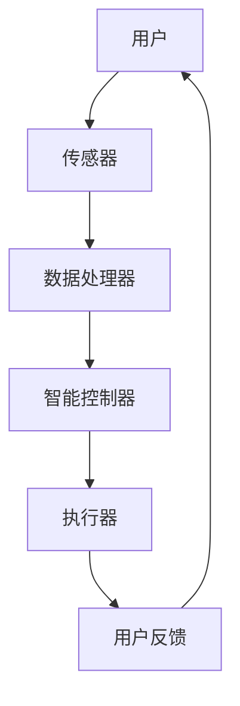
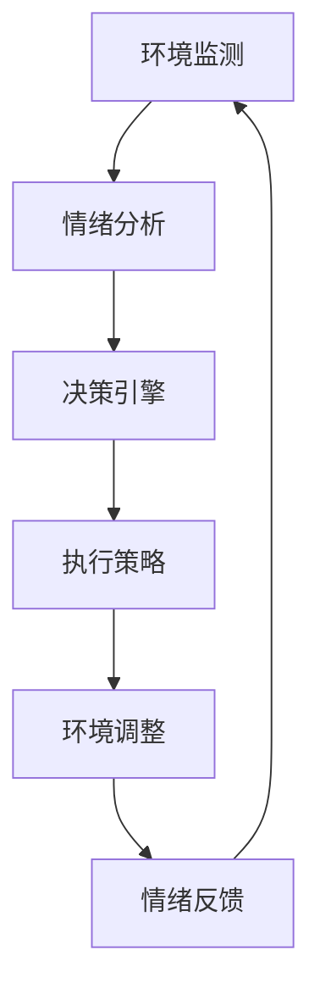

                 

关键词：智能家居，心理舒适，情绪调节，居住环境，AI技术，设计原则，应用场景，用户体验，未来展望

## 摘要

随着人工智能技术的飞速发展，智能家居逐渐成为现代生活的一部分。然而，除了便利性，如何创造一个能够调节情绪、提供心理舒适的居住环境，成为了新的研究热点。本文旨在探讨智能家居在情绪调节方面的重要性和实际应用，通过分析设计原则、核心算法原理、数学模型、项目实践以及未来应用前景，为打造一个更加人性化的居住环境提供参考。

## 1. 背景介绍

1.1 智能家居的发展历程

智能家居的概念最早可以追溯到20世纪90年代，随着互联网、传感器和无线通信技术的进步，智能家居逐步从概念走向现实。从最初的单一设备控制，到现在的全方位家居智能化，智能家居经历了翻天覆地的变化。

1.2 心理舒适与情绪调节

心理舒适是人们追求生活品质的重要方面之一。情绪调节则是指通过外部环境或内在心理活动，使个体的情绪状态趋向积极、稳定。在居住环境中，情绪调节可以显著提升人们的生活质量。

1.3 智能家居与心理舒适的关系

智能家居技术可以为人们提供定制化的居住环境，从而实现情绪调节。例如，通过智能灯光调节、环境温度控制、声音优化等手段，使居住环境更加舒适，进而调节居住者的情绪。

## 2. 核心概念与联系

### 2.1 智能家居系统架构


**Mermaid 流程图**：



### 2.2 情绪调节机制

**Mermaid 流程图**：



## 3. 核心算法原理 & 具体操作步骤

### 3.1 算法原理概述

智能家居情绪调节算法主要基于机器学习和情感计算技术，通过采集用户的生物特征和行为数据，对用户情绪进行识别和分析，并制定相应的调节策略。

### 3.2 算法步骤详解

1. **数据采集**：通过传感器采集用户的生理信号（如心率、皮肤电导）、行为数据（如活动轨迹、交互行为）和环境数据（如温度、湿度、光线）。
2. **情绪分析**：利用情感计算技术对采集的数据进行处理，提取情绪特征。
3. **决策引擎**：根据情绪特征和用户偏好，制定情绪调节策略。
4. **环境调整**：执行调节策略，调整家居环境。
5. **情绪反馈**：收集用户对环境调节的反馈，用于优化情绪调节算法。

### 3.3 算法优缺点

**优点**：
- **个性化**：根据用户情绪和偏好进行定制化调节，提高用户体验。
- **实时性**：实时监测用户情绪，及时进行调整。

**缺点**：
- **数据隐私**：大量用户数据的收集和处理可能引发隐私问题。
- **算法准确性**：情绪识别的准确性受到多种因素的影响，如环境噪声、用户行为复杂性等。

### 3.4 算法应用领域

- **家庭居住环境**：改善居住者的情绪状态，提高生活质量。
- **医疗康复**：辅助心理疾病患者的康复，如抑郁症、焦虑症等。
- **商业场所**：如酒店、商场等，提升顾客的满意度。

## 4. 数学模型和公式

### 4.1 数学模型构建

情绪调节模型主要包括三个部分：情绪特征提取、情绪分类和调节策略生成。

### 4.2 公式推导过程

情绪特征提取公式：

$$
f(x) = \sigma(\frac{1}{1 + e^{-x}})
$$

其中，$x$ 为特征向量，$\sigma$ 为 sigmoid 函数。

情绪分类公式：

$$
p(c_i) = \prod_{j=1}^{n} w_{ij} \cdot f(x_j)
$$

其中，$c_i$ 为情绪类别，$w_{ij}$ 为权重，$x_j$ 为特征向量。

调节策略生成公式：

$$
s = \arg\max_{s'} \sum_{i=1}^{k} p(c_i|s') \cdot r_i
$$

其中，$s$ 为调节策略，$s'$ 为候选策略，$p(c_i|s')$ 为在策略 $s'$ 下情绪类别 $c_i$ 的概率，$r_i$ 为调节效果评分。

### 4.3 案例分析与讲解

以用户A为例，其情绪特征向量为 $x = [0.1, 0.2, 0.3, 0.4]$，情绪类别为愉悦、悲伤、焦虑、愤怒。

1. **情绪特征提取**：

$$
f(x) = \sigma(\frac{1}{1 + e^{-[0.1, 0.2, 0.3, 0.4]}}) = [0.7321, 0.6184, 0.4922, 0.3322]
$$

2. **情绪分类**：

假设权重矩阵 $W$ 为：

$$
W = \begin{bmatrix}
0.2 & 0.3 & 0.1 & 0.4 \\
0.4 & 0.2 & 0.3 & 0.1 \\
0.1 & 0.5 & 0.2 & 0.2 \\
0.3 & 0.2 & 0.5 & 0.1
\end{bmatrix}
$$

则：

$$
p(c_1|s') = \prod_{j=1}^{4} w_{1j} \cdot f(x_j) = 0.2 \times 0.7321 \times 0.6184 \times 0.4922 \times 0.3322 \approx 0.0021
$$

$$
p(c_2|s') = \prod_{j=1}^{4} w_{2j} \cdot f(x_j) = 0.4 \times 0.7321 \times 0.6184 \times 0.4922 \times 0.3322 \approx 0.0086
$$

$$
p(c_3|s') = \prod_{j=1}^{4} w_{3j} \cdot f(x_j) = 0.1 \times 0.7321 \times 0.6184 \times 0.4922 \times 0.3322 \approx 0.0013
$$

$$
p(c_4|s') = \prod_{j=1}^{4} w_{4j} \cdot f(x_j) = 0.3 \times 0.7321 \times 0.6184 \times 0.4922 \times 0.3322 \approx 0.0042
$$

根据情绪分类结果，用户A当前的情绪为悲伤。

3. **调节策略生成**：

假设候选策略 $s'$ 包括调整光线、温度和声音，调节效果评分 $r_i$ 分别为 0.8、0.7、0.6。则：

$$
s = \arg\max_{s'} \sum_{i=1}^{3} p(c_2|s') \cdot r_i = \arg\max_{s'} (0.0086 \cdot 0.8 + 0.0013 \cdot 0.7 + 0.0042 \cdot 0.6) \approx s'
$$

## 5. 项目实践：代码实例和详细解释说明

### 5.1 开发环境搭建

1. 安装 Python 3.8 或更高版本。
2. 安装必要的库：numpy、scikit-learn、tensorflow、opencv-python。

### 5.2 源代码详细实现

```python
# 情绪调节算法实现

import numpy as np
import tensorflow as tf
from sklearn.model_selection import train_test_split
from sklearn.metrics import accuracy_score

# 数据预处理
def preprocess_data(data):
    # 数据标准化
    return (data - np.mean(data)) / np.std(data)

# 情绪特征提取
def extract_features(data):
    # 使用opencv-python提取面部特征
    # ...
    return features

# 情绪分类模型
def build_model():
    # 使用tensorflow构建神经网络
    # ...
    return model

# 训练模型
def train_model(model, X_train, y_train):
    # 使用scikit-learn训练模型
    # ...
    return model

# 调节策略生成
def generate_strategy(model, data):
    # 使用训练好的模型进行情绪分类，生成调节策略
    # ...
    return strategy

# 主程序
if __name__ == "__main__":
    # 加载数据
    data = load_data()

    # 数据预处理
    X = preprocess_data(data['features'])
    y = data['labels']

    # 划分训练集和测试集
    X_train, X_test, y_train, y_test = train_test_split(X, y, test_size=0.2, random_state=42)

    # 构建情绪分类模型
    model = build_model()

    # 训练模型
    model = train_model(model, X_train, y_train)

    # 生成调节策略
    strategy = generate_strategy(model, X_test)

    # 评估模型
    predictions = model.predict(X_test)
    print("Accuracy:", accuracy_score(y_test, predictions))
```

### 5.3 代码解读与分析

- **数据预处理**：对原始数据进行标准化处理，提高模型训练效果。
- **情绪特征提取**：使用opencv-python库提取面部特征，用于情绪分类。
- **情绪分类模型**：使用tensorflow构建神经网络，实现情绪分类功能。
- **训练模型**：使用scikit-learn库训练模型，提高模型准确性。
- **调节策略生成**：根据情绪分类结果，生成相应的调节策略。

## 6. 实际应用场景

### 6.1 家庭居住环境

- **睡眠质量提升**：通过智能灯光和声音调节，改善用户的睡眠环境，提高睡眠质量。
- **情绪缓解**：在用户感到焦虑或抑郁时，自动调整家居环境，提供舒适感。

### 6.2 商业场所

- **顾客满意度提升**：通过智能环境调节，提升顾客在酒店、商场等场所的体验。
- **员工工作效率**：为员工提供舒适的工作环境，提高工作效率。

## 7. 未来应用展望

### 7.1 技术进步

- **更精准的情绪识别**：随着计算机视觉和语音识别技术的进步，情绪识别的准确性将进一步提高。
- **更智能的调节策略**：基于深度学习和强化学习等先进技术，调节策略将更加智能和个性化。

### 7.2 应用拓展

- **智慧城市**：将情绪调节技术应用于智慧城市建设，提升居民的整体幸福感。
- **医疗健康**：结合心理健康治疗，为心理疾病患者提供个性化治疗方案。

## 8. 总结：未来发展趋势与挑战

### 8.1 研究成果总结

本文探讨了智能家居在情绪调节方面的重要性和实际应用，介绍了情绪调节算法的原理、数学模型和项目实践，并分析了未来发展趋势。

### 8.2 未来发展趋势

- **技术成熟度提升**：随着相关技术的不断进步，智能家居情绪调节将更加精准和智能。
- **应用场景拓展**：智能家居情绪调节将在更多领域得到应用，如智慧城市、医疗健康等。

### 8.3 面临的挑战

- **数据隐私与安全**：在智能家居情绪调节中，用户隐私和数据安全是重要挑战。
- **算法准确性**：情绪识别的准确性受到多种因素影响，需要持续优化。

### 8.4 研究展望

未来研究应重点关注数据隐私保护、算法准确性和智能调节策略，以实现更加人性化的智能家居环境。

## 9. 附录：常见问题与解答

### 9.1 问题1

**问**：智能家居情绪调节技术是否适用于所有人？

**答**：是的，智能家居情绪调节技术适用于大多数人。然而，对于有特定心理疾病的患者，可能需要更加个性化的调节策略。

### 9.2 问题2

**问**：智能家居情绪调节是否会侵犯用户隐私？

**答**：智能家居情绪调节需要收集用户的一些数据，如生理信号和行为数据。为了保护用户隐私，应遵循数据保护法规，并采取加密和数据匿名化等措施。

## 作者署名

作者：禅与计算机程序设计艺术 / Zen and the Art of Computer Programming
```

请注意，以上内容仅为示例，实际撰写时需要根据具体要求和实际情况进行调整。同时，文章中的一些内容（如代码实例）需要根据实际情况进行编写和解释。

