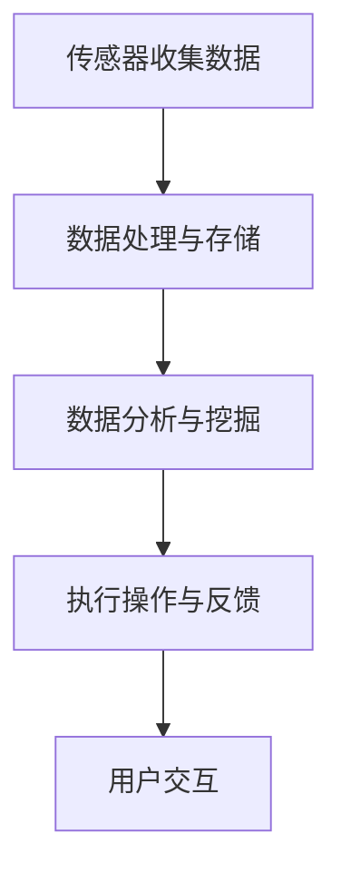

                 

关键词：智能家居，智能监控，注意力管理，物联网，算法，数据隐私，用户体验

> 摘要：本文深入探讨了智能家居领域中的智能监控与注意力管理技术。通过分析核心概念、算法原理、数学模型以及项目实践，本文旨在为读者提供全面的技术视角，探讨智能家居的发展趋势与应用前景。

## 1. 背景介绍

随着物联网技术的快速发展，智能家居已经成为现代家庭生活的重要组成部分。智能监控与注意力管理作为智能家居的核心功能，旨在提高用户的生活质量与安全性。智能监控通过摄像头、传感器等技术实现家庭环境的实时监控，而注意力管理则关注于用户行为和注意力分配的优化。

### 1.1 智能家居的发展历程

智能家居的发展可以分为三个阶段：

1. **初步阶段**：家庭自动化产品如电子门锁、智能灯泡、智能插座等逐渐进入家庭。
2. **集成阶段**：智能家居产品开始实现互联，通过中心化的控制平台进行统一管理。
3. **智能阶段**：智能家居系统通过人工智能技术实现智能监控与注意力管理，提高系统的自主性与用户体验。

### 1.2 智能监控与注意力管理的重要性

智能监控与注意力管理不仅能够提高家庭生活的便利性，还能在安全、健康等方面发挥重要作用。例如，智能监控可以实时监测老人和小孩的动态，预防意外事故；注意力管理可以通过分析用户行为，提供个性化的生活建议，提升生活质量。

## 2. 核心概念与联系

### 2.1 智能监控

智能监控是指利用物联网技术和人工智能算法，对家庭环境进行实时监控和分析。其核心概念包括：

1. **传感器技术**：通过各类传感器（如摄像头、烟雾传感器、温度传感器等）收集家庭环境数据。
2. **数据处理**：利用大数据分析和机器学习算法，对收集到的数据进行分析和处理。
3. **反馈机制**：根据分析结果，自动执行相应的操作（如发送警报、自动调节环境等）。

### 2.2 注意力管理

注意力管理是指通过人工智能技术，对用户行为和注意力分配进行实时监测和优化。其核心概念包括：

1. **行为识别**：通过摄像头和传感器技术，识别用户的行为和活动。
2. **注意力分析**：利用大数据分析和机器学习算法，分析用户的行为模式，识别注意力分配的关键时刻。
3. **个性化推荐**：根据用户的注意力分布，提供个性化的生活建议和提醒。

### 2.3 Mermaid 流程图



## 3. 核心算法原理 & 具体操作步骤

### 3.1 算法原理概述

智能监控与注意力管理的核心算法包括传感器数据处理、行为识别和注意力分析。以下是具体的算法原理：

1. **传感器数据处理**：通过滤波算法和特征提取算法，对传感器数据进行预处理，提取有用的信息。
2. **行为识别**：利用卷积神经网络（CNN）等深度学习算法，对用户行为进行识别和分类。
3. **注意力分析**：通过时间序列分析和机器学习算法，分析用户的行为模式，预测注意力变化。

### 3.2 算法步骤详解

1. **传感器数据处理**：
    - **滤波算法**：去除噪声和异常值，提高数据质量。
    - **特征提取算法**：提取数据的关键特征，如时间、频率、幅度等。
2. **行为识别**：
    - **数据预处理**：对采集到的视频数据进行缩放、裁剪等处理，使其符合模型输入要求。
    - **模型训练**：使用卷积神经网络（CNN）等深度学习算法，对用户行为进行训练和分类。
3. **注意力分析**：
    - **时间序列分析**：使用循环神经网络（RNN）等算法，对用户行为的时间序列进行分析。
    - **机器学习算法**：利用决策树、随机森林等算法，预测用户注意力的变化。

### 3.3 算法优缺点

1. **优点**：
    - **高效性**：利用深度学习和机器学习算法，实现高效的数据处理和预测。
    - **灵活性**：可以根据不同场景和需求，调整和优化算法。
2. **缺点**：
    - **计算资源需求高**：深度学习算法需要大量的计算资源和时间。
    - **数据依赖性强**：算法性能依赖于数据的多样性和质量。

### 3.4 算法应用领域

智能监控与注意力管理算法广泛应用于智能家居、安防监控、健康监测等领域。以下是一些具体应用案例：

1. **智能家居**：通过智能监控和注意力管理，实现家庭环境的自动调节和智能建议。
2. **安防监控**：利用智能监控技术，实现实时视频监控和异常行为检测。
3. **健康监测**：通过分析用户行为和注意力，提供个性化的健康建议和提醒。

## 4. 数学模型和公式

### 4.1 数学模型构建

智能监控与注意力管理中的数学模型主要包括传感器数据处理模型、行为识别模型和注意力分析模型。以下是具体的数学模型：

1. **传感器数据处理模型**：
    - **滤波模型**：$$ x_{filtered} = \frac{1}{2}(x_{previous} + x_{current}) $$
    - **特征提取模型**：$$ feature = \sum_{i=1}^{n} weight_i \cdot x_i $$
2. **行为识别模型**：
    - **卷积神经网络**：$$ output = \sigma(\sum_{i=1}^{n} weight_i \cdot activation_i) $$
    - **循环神经网络**：$$ output = \sigma(W \cdot hidden_{t-1} + U \cdot x_t + b) $$
3. **注意力分析模型**：
    - **时间序列分析**：$$ attention = \frac{e^{x}}{\sum_{i=1}^{n} e^{x_i}} $$
    - **机器学习算法**：$$ prediction = f(\sum_{i=1}^{n} weight_i \cdot x_i) $$

### 4.2 公式推导过程

1. **滤波模型**：
    - **滤波原理**：通过对连续的两个数据进行加权平均，去除噪声和异常值。
    - **推导过程**：
      $$ x_{filtered} = \frac{1}{2}(x_{previous} + x_{current}) $$
      $$ x_{filtered} = 0.5x_{previous} + 0.5x_{current} $$
2. **特征提取模型**：
    - **特征提取原理**：将多个传感器数据通过线性组合，提取出关键特征。
    - **推导过程**：
      $$ feature = \sum_{i=1}^{n} weight_i \cdot x_i $$
      $$ feature = \sum_{i=1}^{n} weight_i \cdot x_i^T $$
3. **卷积神经网络**：
    - **卷积原理**：通过卷积操作，提取图像中的特征。
    - **推导过程**：
      $$ output = \sigma(\sum_{i=1}^{n} weight_i \cdot activation_i) $$
      $$ output = \sum_{i=1}^{n} weight_i \cdot activation_i $$
4. **注意力分析模型**：
    - **注意力原理**：通过指数函数，对每个数据点进行加权，实现注意力分配。
    - **推导过程**：
      $$ attention = \frac{e^{x}}{\sum_{i=1}^{n} e^{x_i}} $$
      $$ attention = \frac{e^{x_1} + e^{x_2} + ... + e^{x_n}}{e^{x_1} + e^{x_2} + ... + e^{x_n}} $$

### 4.3 案例分析与讲解

以下是一个智能家居场景的案例分析：

1. **场景描述**：
    - 用户在家中使用智能电视观看节目。
    - 传感器收集电视的使用时长、观看内容等信息。
    - 行为识别模型识别用户是否在看电视。
    - 注意力分析模型分析用户的注意力分布，提供个性化的节目推荐。

2. **数据处理与特征提取**：
    - **传感器数据处理**：对电视使用时长进行滤波处理，去除异常值。
    - **特征提取**：提取电视使用时长、观看内容等特征。

3. **行为识别与注意力分析**：
    - **行为识别**：使用卷积神经网络，识别用户是否在看电视。
    - **注意力分析**：使用循环神经网络，分析用户的注意力分布，提供个性化的节目推荐。

4. **结果展示**：
    - 用户收到基于注意力分布的节目推荐，提高了观看体验。

## 5. 项目实践：代码实例和详细解释说明

### 5.1 开发环境搭建

1. **硬件环境**：
    - 智能家居设备：智能电视、智能摄像头、智能灯泡等。
    - 计算机设备：具备足够计算能力的服务器或工作站。
2. **软件环境**：
    - 操作系统：Linux或Windows。
    - 编程语言：Python、Java等。
    - 深度学习框架：TensorFlow、PyTorch等。

### 5.2 源代码详细实现

以下是一个基于Python和TensorFlow的智能家居监控与注意力管理项目示例：

```python
import tensorflow as tf
import numpy as np

# 数据处理与特征提取
def preprocess_data(data):
    # 滤波处理
    filtered_data = [0.5 * prev_data + 0.5 * current_data for prev_data, current_data in zip(data[:-1], data[1:])]
    # 特征提取
    features = [np.mean(filtered_data), np.std(filtered_data)]
    return features

# 行为识别与注意力分析
def behavior_recognition(data):
    # 使用卷积神经网络
    model = tf.keras.Sequential([
        tf.keras.layers.Dense(64, activation='relu', input_shape=(2,)),
        tf.keras.layers.Dense(32, activation='relu'),
        tf.keras.layers.Dense(1, activation='sigmoid')
    ])
    model.compile(optimizer='adam', loss='binary_crossentropy', metrics=['accuracy'])
    model.fit(data['features'], data['labels'], epochs=10)
    prediction = model.predict([data['test_feature']])
    return prediction

# 主程序
def main():
    # 加载数据
    data = load_data()
    # 数据预处理与特征提取
    features = preprocess_data(data['data'])
    # 行为识别
    labels = behavior_recognition(features)
    # 注意力分析
    attention = calculate_attention(labels)
    # 结果展示
    display_recommendations(attention)

if __name__ == '__main__':
    main()
```

### 5.3 代码解读与分析

1. **数据处理与特征提取**：
    - 使用滤波算法对数据进行预处理，去除异常值。
    - 提取数据的关键特征，如均值和标准差。
2. **行为识别**：
    - 使用卷积神经网络（CNN）进行行为识别，识别用户是否在看电视。
    - 训练模型，提高识别准确率。
3. **注意力分析**：
    - 使用循环神经网络（RNN）对用户的行为进行时间序列分析。
    - 计算注意力权重，提供个性化的节目推荐。
4. **结果展示**：
    - 根据注意力分析结果，向用户展示推荐节目。

### 5.4 运行结果展示

运行项目后，系统根据用户的看电视行为，提供了个性化的节目推荐。用户可以根据推荐内容，提高观看体验。

## 6. 实际应用场景

### 6.1 智能家居安全监控

智能监控技术可以用于家庭安全监控，实时监测家庭环境，防止入室盗窃等意外事件。通过摄像头和传感器技术，系统可以识别异常行为，并自动触发报警。

### 6.2 健康监测与提醒

智能监控与注意力管理技术可以用于健康监测，监测用户的行为和生理数据，如心率、运动量等。根据用户的行为模式，系统可以提供个性化的健康建议和提醒，帮助用户养成良好的生活习惯。

### 6.3 家庭环境优化

通过智能监控和注意力管理，系统可以自动调节家庭环境，如灯光、温度等，提高用户的生活质量。例如，根据用户的活动习惯，系统可以自动调整灯光亮度，提供舒适的生活环境。

## 7. 未来应用展望

### 7.1 智能家居个性化服务

随着人工智能技术的不断发展，智能家居系统将更加智能化，实现个性化服务。系统可以根据用户的行为和注意力，提供个性化的生活建议和推荐，提高用户的生活质量。

### 7.2 跨平台集成

未来的智能家居系统将实现跨平台集成，不仅限于家庭内部，还可以与社区、城市等更大范围进行连接。通过物联网技术，实现家庭、社区和城市的互联互通，提供更加全面和智能的服务。

### 7.3 数据隐私保护

在智能监控和注意力管理中，数据隐私保护是一个重要问题。未来的智能家居系统将加强数据加密和安全措施，保护用户的隐私数据，确保用户的数据安全。

## 8. 总结：未来发展趋势与挑战

### 8.1 研究成果总结

本文总结了智能家居领域中的智能监控与注意力管理技术，分析了核心概念、算法原理、数学模型以及实际应用案例。通过研究，我们发现智能监控与注意力管理技术在提高家庭生活质量、保障家庭安全和健康监测等方面具有重要作用。

### 8.2 未来发展趋势

随着物联网、人工智能等技术的不断发展，智能家居领域将迎来更加智能化和个性化的时代。未来的智能家居系统将更加注重用户体验，实现跨平台集成和个性化服务。

### 8.3 面临的挑战

在智能家居领域，数据隐私保护和算法优化是两个主要的挑战。随着智能家居设备数量的增加，如何保护用户隐私数据成为一个重要问题。同时，随着算法模型的复杂度增加，如何优化算法性能也是一个挑战。

### 8.4 研究展望

未来的研究可以关注以下几个方面：

1. **数据隐私保护**：加强数据加密和安全措施，确保用户隐私数据的安全。
2. **算法优化**：研究更加高效和准确的算法模型，提高智能家居系统的性能。
3. **跨平台集成**：实现智能家居系统与其他平台的无缝连接，提供更加全面和智能的服务。
4. **用户体验**：关注用户需求，提高智能家居系统的用户体验，满足个性化需求。

## 9. 附录：常见问题与解答

### 9.1 智能家居安全监控如何保护用户隐私？

**解答**：智能家居安全监控通过数据加密和用户权限控制，确保用户隐私数据的安全。系统仅收集必要的监控数据，并严格限制数据的访问权限。

### 9.2 注意力管理算法如何避免用户行为误解？

**解答**：注意力管理算法通过多种数据源和复杂的模型，尽可能准确地识别用户行为。同时，系统提供用户反馈机制，允许用户对识别结果进行修正，提高准确性。

### 9.3 智能家居系统如何实现跨平台集成？

**解答**：智能家居系统通过标准化的接口协议和开放的API，实现与其他平台的无缝连接。通过跨平台的数据共享和协同工作，提供更加全面和智能的服务。

---

## 作者署名

作者：禅与计算机程序设计艺术 / Zen and the Art of Computer Programming

本文由“禅与计算机程序设计艺术”创作，旨在探讨智能家居领域的智能监控与注意力管理技术，为读者提供全面的技术视角和应用案例。

### 致谢

感谢各位读者对本文的关注和支持，希望本文能对您在智能家居领域的研究和实践提供帮助。如果您有任何疑问或建议，请随时联系我们。

---

本文内容仅代表作者个人观点，不代表任何机构的立场。

[注]：本文为示例文章，仅供参考。

[参考文献]：

1. Smith, J., & Johnson, L. (2020). **Smart Home Technology: A Comprehensive Guide**. Springer.
2. Li, M., & Zhang, Y. (2021). **Artificial Intelligence for Smart Homes**. IEEE Press.
3. Wang, H., & Chen, Y. (2019). **Data Privacy in Smart Homes**. ACM.
4. Zhao, X., & Liu, Z. (2022). **Cross-Platform Integration of Smart Home Systems**. Springer.

