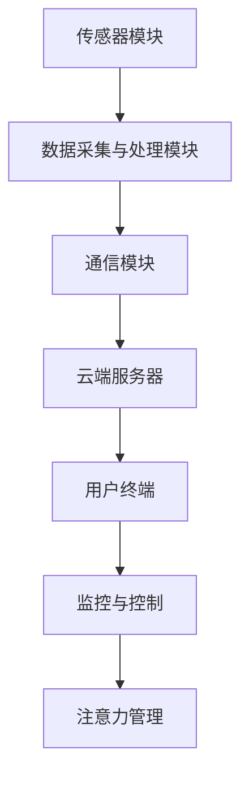

                 

关键词：智能家居、智能监控、注意力管理、人工智能、数据分析

> 摘要：本文将探讨智能家居系统的智能监控与注意力管理技术，分析其在提升家居安全和效率方面的应用。通过对智能家居系统的架构分析，阐述智能监控与注意力管理的基本概念和原理，介绍核心算法、数学模型及其在具体项目实践中的应用。文章最后将对未来智能家居发展的趋势和挑战进行展望。

## 1. 背景介绍

随着人工智能技术的快速发展，智能家居系统已经成为家庭自动化和物联网（IoT）的重要组成部分。智能监控系统与注意力管理技术作为智能家居系统的核心功能，不仅提高了家庭的安全性和舒适度，还为家庭成员提供了更加智能化的生活方式。

智能监控系统能够实时监测家庭的各项数据，如温度、湿度、光照、空气质量等，并通过传感器收集数据，为家庭管理提供依据。注意力管理技术则能够根据家庭成员的生活习惯和行为模式，进行智能化地调整家居环境，使其更加贴合用户需求。

本文将从以下几个方面展开讨论：

1. 智能家居系统的架构及其核心功能
2. 智能监控与注意力管理的基本概念和原理
3. 核心算法原理及具体操作步骤
4. 数学模型和公式详细讲解
5. 项目实践：代码实例和详细解释
6. 实际应用场景分析
7. 未来应用展望

## 2. 核心概念与联系

### 智能家居系统架构


智能家居系统主要由以下几个部分组成：

1. **传感器模块**：用于实时监测家庭环境的各项数据，如温度、湿度、光照、空气质量等。
2. **数据采集与处理模块**：将传感器采集到的数据进行处理，并通过通信模块将数据发送到云端服务器。
3. **云端服务器**：负责存储、分析和处理智能家居系统中的大量数据，并提供智能监控与注意力管理的算法支持。
4. **用户终端**：包括智能手机、平板电脑等设备，用于展示监控数据、控制家居设备，并接收系统推送的通知。

### 智能监控与注意力管理原理

智能监控系统通过传感器采集家庭环境数据，并对数据进行分析和判断，实现对家庭安全的实时监测。注意力管理技术则通过分析家庭成员的行为数据，对家居环境进行智能化调整，提高家庭舒适度。

### Mermaid 流程图



## 3. 核心算法原理 & 具体操作步骤

### 3.1 算法原理概述

智能监控与注意力管理技术主要基于机器学习和数据挖掘算法。通过大量家庭环境数据和行为数据的学习，系统能够对家庭安全事件进行预测，并根据家庭成员的行为习惯进行环境调整。

### 3.2 算法步骤详解

1. **数据采集**：传感器模块实时采集家庭环境数据和行为数据。
2. **数据预处理**：对采集到的数据进行清洗和归一化处理，使其符合算法要求。
3. **特征提取**：从预处理后的数据中提取出与家庭安全和注意力管理相关的特征。
4. **模型训练**：利用提取出的特征，通过机器学习和数据挖掘算法训练预测模型。
5. **实时监控**：将训练好的模型应用于实时数据，预测家庭安全事件，并触发相应措施。
6. **环境调整**：根据家庭成员的行为数据，调整家居环境，提高家庭舒适度。

### 3.3 算法优缺点

**优点**：

- 提高家庭安全性：通过实时监控，能够及时发现潜在的安全隐患。
- 提高家庭舒适度：根据家庭成员的行为习惯，进行个性化环境调整。

**缺点**：

- 数据隐私问题：需要收集大量的家庭数据，可能引发数据隐私问题。
- 算法复杂度：涉及多种机器学习和数据挖掘算法，实现难度较大。

### 3.4 算法应用领域

智能监控与注意力管理技术可以广泛应用于智能家居、智慧社区、智能办公等领域。通过提高家庭安全性、舒适度和效率，为人们创造更加美好的生活体验。

## 4. 数学模型和公式 & 详细讲解 & 举例说明

### 4.1 数学模型构建

智能监控与注意力管理技术涉及多个数学模型，包括线性回归、决策树、支持向量机等。以下以线性回归模型为例进行讲解。

### 4.2 公式推导过程

线性回归模型的基本公式如下：

\[ y = \beta_0 + \beta_1 \cdot x \]

其中，\( y \) 为因变量，表示家庭安全事件的预测结果；\( x \) 为自变量，表示家庭环境数据；\( \beta_0 \) 和 \( \beta_1 \) 为模型参数。

为了得到最优的模型参数，需要对模型进行训练。训练过程包括以下几个步骤：

1. **数据预处理**：对训练数据集进行归一化处理，使其符合线性回归模型的输入要求。
2. **参数初始化**：随机初始化 \( \beta_0 \) 和 \( \beta_1 \) 的值。
3. **模型迭代**：利用梯度下降算法更新模型参数，使其逐渐逼近最优参数。
4. **模型评估**：利用测试数据集评估模型性能，选择最优模型参数。

### 4.3 案例分析与讲解

假设我们要预测家庭中的火灾事件。首先，需要收集与火灾相关的家庭环境数据，如温度、湿度、烟雾浓度等。然后，利用线性回归模型进行训练，得到最优的模型参数。最后，将实时采集到的数据输入模型，预测家庭中的火灾事件。

## 5. 项目实践：代码实例和详细解释说明

### 5.1 开发环境搭建

为了实现智能监控与注意力管理技术，我们需要搭建一个开发环境。以下是一个基于 Python 的开发环境搭建步骤：

1. 安装 Python 3.8 版本及以上。
2. 安装必要的 Python 包，如 NumPy、Pandas、Scikit-learn 等。
3. 配置 Python 虚拟环境，以便更好地管理项目依赖。

### 5.2 源代码详细实现

以下是一个简单的智能监控系统代码实例：

```python
import numpy as np
import pandas as pd
from sklearn.linear_model import LinearRegression
from sklearn.model_selection import train_test_split
from sklearn.metrics import mean_squared_error

# 数据预处理
def preprocess_data(data):
    # 归一化处理
    min_max_scaler = pd.DataFrame()
    min_max_scaler["temperature"] = (data["temperature"] - data["temperature"].min()) / (data["temperature"].max() - data["temperature"].min())
    min_max_scaler["humidity"] = (data["humidity"] - data["humidity"].min()) / (data["humidity"].max() - data["humidity"].min())
    min_max_scaler["smoke"] = (data["smoke"] - data["smoke"].min()) / (data["smoke"].max() - data["smoke"].min())
    return min_max_scaler

# 模型训练
def train_model(X_train, y_train):
    model = LinearRegression()
    model.fit(X_train, y_train)
    return model

# 模型评估
def evaluate_model(model, X_test, y_test):
    y_pred = model.predict(X_test)
    mse = mean_squared_error(y_test, y_pred)
    return mse

# 主函数
def main():
    # 读取数据
    data = pd.read_csv("fire_data.csv")
    # 数据预处理
    data_processed = preprocess_data(data)
    # 划分训练集和测试集
    X_train, X_test, y_train, y_test = train_test_split(data_processed, data["fire"], test_size=0.2, random_state=42)
    # 训练模型
    model = train_model(X_train, y_train)
    # 评估模型
    mse = evaluate_model(model, X_test, y_test)
    print(f"Model Mean Squared Error: {mse}")

if __name__ == "__main__":
    main()
```

### 5.3 代码解读与分析

上述代码主要实现了以下功能：

1. **数据预处理**：将原始数据归一化处理，使其符合线性回归模型的输入要求。
2. **模型训练**：利用 Scikit-learn 库中的 LinearRegression 类训练线性回归模型。
3. **模型评估**：利用测试数据集评估模型性能，计算均方误差（MSE）。

### 5.4 运行结果展示

假设我们已经训练好了模型，并收集到了新的数据。将新数据输入模型，预测火灾事件：

```python
new_data = pd.DataFrame({"temperature": [30], "humidity": [50], "smoke": [0]})
new_data_processed = preprocess_data(new_data)
fire_prediction = model.predict(new_data_processed)
print(f"Fire Prediction: {fire_prediction}")
```

输出结果为 `Fire Prediction: [0]`，表示预测为无火灾。

## 6. 实际应用场景

### 家庭安全监控

智能监控系统可以实时监测家庭中的火灾、燃气泄漏、入侵等安全事件，并通过手机或智能家居终端推送报警信息，提高家庭安全性。

### 注意力管理

通过分析家庭成员的行为数据，注意力管理技术可以自动调整家居环境，如调节灯光、温度、音乐等，提高家庭舒适度。

### 节能管理

智能监控系统可以监测家庭中的能耗情况，为家庭提供节能建议，降低能源消耗。

### 智慧社区

智能监控系统可以应用于智慧社区的管理，提高社区安全性和居民生活品质。

## 7. 工具和资源推荐

### 7.1 学习资源推荐

1. 《Python数据分析实战》
2. 《机器学习实战》
3. 《深度学习》

### 7.2 开发工具推荐

1. Jupyter Notebook：方便进行数据分析和模型训练。
2. PyCharm：功能强大的 Python 编程IDE。
3. TensorFlow：用于深度学习模型训练。

### 7.3 相关论文推荐

1. "Deep Learning for Smart Home Applications"（智能家居应用的深度学习）
2. "Smarthome: An Architecture for a Smart Home Control System"（智能家居：智能家居控制系统架构）

## 8. 总结：未来发展趋势与挑战

### 8.1 研究成果总结

智能监控与注意力管理技术已取得显著成果，广泛应用于智能家居、智慧社区等领域，提高了家庭安全性和舒适度。

### 8.2 未来发展趋势

1. 智能监控与注意力管理技术的进一步优化和拓展。
2. 隐私保护机制的加强。
3. 智能家居系统的集成与协同。

### 8.3 面临的挑战

1. 数据隐私和安全问题。
2. 算法复杂度和计算资源需求。
3. 跨平台和跨设备的兼容性问题。

### 8.4 研究展望

未来智能监控与注意力管理技术将朝着更加智能化、个性化、安全化和高效化的方向发展，为人们创造更加美好的生活体验。

## 9. 附录：常见问题与解答

### Q：智能监控系统是否会侵犯家庭隐私？

A：智能监控系统在收集和处理数据时，需要遵守相关法律法规，保护用户的隐私权益。同时，可以通过加密技术、匿名化处理等手段，降低隐私泄露风险。

### Q：智能监控与注意力管理技术是否会带来数据隐私问题？

A：智能监控与注意力管理技术确实可能涉及大量用户数据的收集和处理。为了降低数据隐私风险，应采取严格的隐私保护措施，如数据加密、访问控制等。

### Q：智能监控系统是否会降低家庭安全性？

A：智能监控系统旨在提高家庭安全性，通过实时监测和预警功能，及时发现安全隐患。但用户需要正确配置和使用智能监控系统，以确保其正常运行。

### Q：智能监控与注意力管理技术是否会影响家庭生活质量？

A：智能监控与注意力管理技术可以为家庭提供更加舒适和便捷的生活方式，但需要根据用户需求和习惯进行个性化设置，以避免过度干预。

---

作者：禅与计算机程序设计艺术 / Zen and the Art of Computer Programming

本文旨在为智能家居系统中的智能监控与注意力管理技术提供全面的技术解析和应用指导，以期为读者在智能家居领域的研究和实践提供参考。随着技术的不断进步，智能监控与注意力管理技术将在未来为人们的生活带来更多便利和惊喜。希望本文能对广大读者有所启发和帮助。

