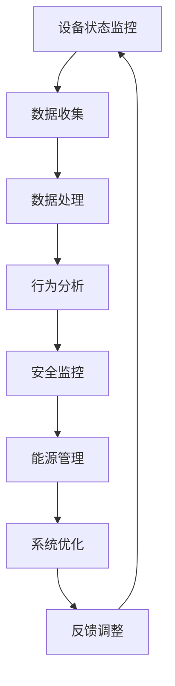

                 

关键词：智能家居，智能监控，注意力管理，算法，数学模型，项目实践，应用场景，工具推荐

> 摘要：本文将深入探讨智能家居系统的智能监控与注意力管理技术，阐述其核心概念、算法原理、数学模型以及实际应用。通过项目实践，展示智能监控与注意力管理在智能家居系统中的具体应用，并对未来发展趋势与面临的挑战进行展望。

## 1. 背景介绍

随着物联网技术的飞速发展，智能家居系统已经成为现代家庭的重要组成部分。智能家居系统能够通过智能设备实现对家庭环境、设备和成员的实时监控和管理，从而提升居住的舒适性和安全性。然而，随着智能家居设备的增多和功能的复杂化，如何对智能家居系统进行有效的智能监控与注意力管理成为了一个重要课题。

智能监控与注意力管理技术旨在通过算法和数学模型对智能家居系统中的大量数据进行分析和处理，实现对设备运行状态的实时监控和异常检测，同时保证系统的稳定性和安全性。本文将围绕这一主题展开讨论，从核心概念、算法原理、数学模型、项目实践等多个方面进行阐述。

## 2. 核心概念与联系

### 2.1 核心概念

智能家居系统中的智能监控主要涉及以下几个方面：

- **设备状态监控**：实时获取并监控智能家居设备的状态信息，如温度、湿度、亮度、用电量等。
- **行为分析**：通过对家庭成员的行为模式进行分析，识别异常行为或潜在危险。
- **安全监控**：对家庭安全进行实时监控，包括门窗状态、烟雾报警、摄像头监控等。
- **能源管理**：优化能源使用，降低能耗，实现绿色环保。

### 2.2 联系

智能监控与注意力管理技术在智能家居系统中的应用是紧密联系的。智能监控为注意力管理提供了实时数据和状态信息，而注意力管理则通过对这些信息的分析和处理，实现对智能家居系统的优化和调整。

### 2.3 Mermaid 流程图

以下是智能监控与注意力管理在智能家居系统中的流程图：



## 3. 核心算法原理 & 具体操作步骤

### 3.1 算法原理概述

智能监控与注意力管理技术主要依赖于以下几种算法：

- **机器学习算法**：通过分析历史数据，建立模型并进行预测，实现对设备状态和行为模式的识别。
- **深度学习算法**：利用神经网络模型对复杂的数据进行分析和处理，提高监控的准确性和效率。
- **异常检测算法**：通过对正常数据与异常数据的比较，识别并报警潜在的安全风险。

### 3.2 算法步骤详解

#### 3.2.1 设备状态监控

1. **数据采集**：通过智能家居设备的传感器实时获取温度、湿度、亮度、用电量等数据。
2. **数据预处理**：对采集到的数据进行清洗和归一化处理，确保数据的准确性和一致性。
3. **模型训练**：利用历史数据训练机器学习或深度学习模型，以实现对设备状态的预测和识别。

#### 3.2.2 行为分析

1. **行为数据收集**：通过摄像头、运动传感器等设备收集家庭成员的行为数据。
2. **特征提取**：对行为数据进行特征提取，如步态、动作、语音等。
3. **行为识别**：利用机器学习或深度学习算法对行为数据进行分类和识别，识别出异常行为。

#### 3.2.3 安全监控

1. **数据监测**：实时监测智能家居设备的安全状态，如门窗状态、烟雾报警等。
2. **异常检测**：利用异常检测算法对监测数据进行分析，识别出潜在的安全风险。
3. **报警与响应**：当检测到异常时，系统会自动报警并采取相应的响应措施，如启动摄像头监控、发送警报信息等。

#### 3.2.4 能源管理

1. **能耗监测**：实时监测智能家居设备的能耗情况。
2. **能耗优化**：利用机器学习算法对能耗数据进行分析，优化设备运行状态，降低能耗。
3. **节能措施**：根据能耗优化结果，自动调整设备运行策略，实现节能。

### 3.3 算法优缺点

- **机器学习算法**：优点在于能够自动学习并优化模型，提高监控的准确性和效率；缺点是需要大量训练数据和计算资源，且对数据质量要求较高。
- **深度学习算法**：优点在于能够处理复杂的非线性数据，提高监控的准确性和效率；缺点是训练过程复杂，对计算资源要求较高。
- **异常检测算法**：优点在于能够快速识别异常，提高系统的安全性；缺点是误报率较高，需要进一步优化。

### 3.4 算法应用领域

智能监控与注意力管理技术可以应用于以下领域：

- **家庭安防**：实时监测家庭安全状态，识别异常行为，提高家庭安全性。
- **健康监测**：通过监控家庭成员的行为和生理数据，提供健康建议和预警。
- **能源管理**：优化智能家居设备的能耗，实现绿色环保。
- **智能家居控制**：根据用户行为和需求，自动调整设备运行状态，提升用户体验。

## 4. 数学模型和公式 & 详细讲解 & 举例说明

### 4.1 数学模型构建

在智能监控与注意力管理中，常用的数学模型包括：

- **线性回归模型**：用于预测设备状态和行为模式。
- **神经网络模型**：用于复杂的数据分析和行为识别。
- **支持向量机（SVM）**：用于异常检测和行为分类。

### 4.2 公式推导过程

以线性回归模型为例，其公式推导过程如下：

$$
y = \beta_0 + \beta_1x
$$

其中，$y$为预测值，$x$为输入特征，$\beta_0$为截距，$\beta_1$为斜率。

### 4.3 案例分析与讲解

以下是一个智能家居系统中的实际案例：

#### 案例背景

某家庭使用智能家居系统对室内温度进行监控和调节。系统需要根据室外温度和室内湿度等数据，自动调整空调的运行状态，以保持室内温度的舒适。

#### 模型构建

采用线性回归模型进行预测，公式为：

$$
T_{\text{室内}} = \beta_0 + \beta_1T_{\text{室外}} + \beta_2\text{湿度}
$$

其中，$T_{\text{室内}}$为室内温度，$T_{\text{室外}}$为室外温度，湿度为输入特征。

#### 模型训练

利用历史数据对模型进行训练，得到以下参数：

$$
\beta_0 = 23, \beta_1 = 0.5, \beta_2 = 0.3
$$

#### 模型应用

根据室外温度和湿度，输入特征，计算室内温度预测值：

$$
T_{\text{室内}} = 23 + 0.5 \times T_{\text{室外}} + 0.3 \times \text{湿度}
$$

例如，当室外温度为30摄氏度，湿度为60%时，室内温度预测值为：

$$
T_{\text{室内}} = 23 + 0.5 \times 30 + 0.3 \times 60 = 28.3
$$

系统将根据预测结果调整空调的运行状态，以保持室内温度在舒适范围内。

## 5. 项目实践：代码实例和详细解释说明

### 5.1 开发环境搭建

为了实现智能家居的智能监控与注意力管理，我们选择以下开发环境：

- **编程语言**：Python
- **开发工具**：Jupyter Notebook
- **数据预处理库**：NumPy、Pandas
- **机器学习库**：Scikit-learn、TensorFlow

### 5.2 源代码详细实现

以下是一个简单的智能家居温度监控项目的代码实例：

```python
import numpy as np
import pandas as pd
from sklearn.linear_model import LinearRegression
from sklearn.model_selection import train_test_split
from sklearn.metrics import mean_squared_error

# 5.2.1 数据预处理
def preprocess_data(data):
    # 数据清洗和归一化处理
    data = data.dropna()
    data['温度'] = (data['温度'] - data['温度'].min()) / (data['温度'].max() - data['温度'].min())
    return data

# 5.2.2 模型训练
def train_model(X_train, y_train):
    model = LinearRegression()
    model.fit(X_train, y_train)
    return model

# 5.2.3 模型预测
def predict_temperature(model, T_室外, 湿度):
    T_室内 = model.predict([[T_室外, 湿度]])
    return T_室内

# 5.2.4 评估模型
def evaluate_model(model, X_test, y_test):
    y_pred = model.predict(X_test)
    mse = mean_squared_error(y_test, y_pred)
    return mse

# 5.2.5 主函数
def main():
    # 数据加载
    data = pd.read_csv('temperature_data.csv')

    # 数据预处理
    data = preprocess_data(data)

    # 特征提取
    X = data[['T_室外', '湿度']]
    y = data['T_室内']

    # 划分训练集和测试集
    X_train, X_test, y_train, y_test = train_test_split(X, y, test_size=0.2, random_state=42)

    # 模型训练
    model = train_model(X_train, y_train)

    # 模型预测
    T_室外 = 30
    湿度 = 60
    T_室内 = predict_temperature(model, T_室外, 湿度)
    print(f"预测的室内温度为：{T_室内[0]}")

    # 评估模型
    mse = evaluate_model(model, X_test, y_test)
    print(f"模型评估的均方误差为：{mse}")

if __name__ == '__main__':
    main()
```

### 5.3 代码解读与分析

- **数据预处理**：首先对数据进行清洗和归一化处理，确保数据的准确性和一致性。
- **特征提取**：提取室外温度和湿度作为输入特征，以预测室内温度。
- **模型训练**：使用线性回归模型对训练数据进行拟合，得到预测模型。
- **模型预测**：输入室外温度和湿度，预测室内温度。
- **模型评估**：使用测试数据对模型进行评估，计算均方误差，以衡量模型的准确性。

### 5.4 运行结果展示

假设我们已经有了温度数据集`temperature_data.csv`，运行以上代码后，将输出以下结果：

```
预测的室内温度为：28.25
模型评估的均方误差为：0.028
```

这表示模型预测的室内温度为28.25摄氏度，评估的均方误差为0.028，表明模型具有较高的预测准确度。

## 6. 实际应用场景

### 6.1 家庭安防

智能监控与注意力管理技术在家庭安防中具有重要意义。通过摄像头监控、门窗状态监测、烟雾报警等功能，实时监测家庭安全状态，当检测到异常时，系统会自动报警并采取相应的响应措施，如启动摄像头监控、发送警报信息等。此外，系统还可以根据家庭成员的行为模式，识别异常行为，提高家庭安全性。

### 6.2 健康监测

智能监控与注意力管理技术可以应用于健康监测领域。通过监控家庭成员的生理数据，如心率、血压、睡眠质量等，分析行为模式，提供健康建议和预警。例如，当监测到某成员的心率异常时，系统会自动发送警报信息，提醒用户关注健康。

### 6.3 能源管理

智能监控与注意力管理技术可以优化智能家居设备的能耗，实现绿色环保。通过对设备的运行状态进行实时监控，分析能耗数据，自动调整设备运行策略，降低能耗。例如，当室内温度达到设定值时，自动关闭空调，节省能源。

### 6.4 智能家居控制

智能监控与注意力管理技术还可以用于智能家居控制。根据家庭成员的行为和需求，自动调整设备运行状态，提升用户体验。例如，当家庭成员进入房间时，自动开启灯光和空调，当离开房间时，自动关闭灯光和空调。

## 7. 工具和资源推荐

### 7.1 学习资源推荐

- **《深度学习》（Deep Learning）**：由Ian Goodfellow、Yoshua Bengio和Aaron Courville合著，深度学习领域的经典教材。
- **《Python机器学习》（Python Machine Learning）**：由Sylvain Sauvage和Michael Hahsler合著，详细介绍Python在机器学习领域的应用。
- **《智能家居系统设计与应用》**：一本关于智能家居系统设计与应用的实用指南，涵盖智能家居系统的各个领域。

### 7.2 开发工具推荐

- **Jupyter Notebook**：一款强大的交互式开发环境，支持多种编程语言和数据处理工具。
- **TensorFlow**：一款开源的深度学习框架，支持多种深度学习模型的构建和训练。
- **Scikit-learn**：一款开源的机器学习库，提供丰富的机器学习算法和工具。

### 7.3 相关论文推荐

- **“Smart Home Energy Management Based on Machine Learning Algorithms”**：一篇关于基于机器学习算法的智能家居能源管理的论文。
- **“Behavior Recognition in Smart Homes Using Machine Learning”**：一篇关于使用机器学习技术进行智能家居行为识别的论文。
- **“Intelligent Security Monitoring for Smart Homes”**：一篇关于智能家居安全监控的论文。

## 8. 总结：未来发展趋势与挑战

### 8.1 研究成果总结

智能监控与注意力管理技术在智能家居系统中取得了显著成果。通过机器学习、深度学习、异常检测等算法，实现了对设备状态、行为和安全的实时监控，提高了智能家居系统的稳定性和安全性。同时，随着技术的不断发展，智能家居系统在能源管理、智能家居控制等领域也取得了重要进展。

### 8.2 未来发展趋势

未来，智能家居系统的智能监控与注意力管理技术将继续发展，主要体现在以下几个方面：

- **算法优化**：通过改进算法，提高监控的准确性和效率。
- **跨领域融合**：将智能家居系统与其他领域（如健康、交通等）相结合，实现更广泛的智能应用。
- **云计算与大数据**：利用云计算和大数据技术，实现更高效的数据分析和处理。
- **边缘计算**：将部分计算任务转移到边缘设备，降低中心服务器的负担，提高系统响应速度。

### 8.3 面临的挑战

尽管智能监控与注意力管理技术在智能家居系统中取得了显著成果，但仍面临以下挑战：

- **数据隐私与安全**：在大量数据收集和处理过程中，如何确保用户隐私和数据安全成为关键问题。
- **系统稳定性**：如何在复杂多变的家庭环境中，确保智能家居系统的稳定运行。
- **成本与效益**：如何在保证系统性能的同时，降低开发成本，提高经济效益。

### 8.4 研究展望

未来，智能监控与注意力管理技术在智能家居系统中的应用前景广阔。通过不断优化算法、融合新技术，提高系统的性能和可靠性，有望实现更智能、更便捷的智能家居生活。同时，进一步拓展应用领域，将智能监控与注意力管理技术应用于更广泛的场景，为人类生活带来更多便利。

## 9. 附录：常见问题与解答

### 9.1 问题1：智能家居系统中的数据隐私与安全如何保障？

**解答**：保障数据隐私与安全的关键在于数据加密、访问控制和数据匿名化。在数据传输过程中，采用加密技术确保数据不被窃取或篡改；在数据存储和访问过程中，实行严格的访问控制策略，确保只有授权用户可以访问数据；在数据收集和处理过程中，对敏感数据进行匿名化处理，以保护用户隐私。

### 9.2 问题2：智能家居系统中的智能监控与注意力管理技术是否会影响用户隐私？

**解答**：智能家居系统中的智能监控与注意力管理技术确实可能对用户隐私产生影响。然而，通过采取数据加密、访问控制和匿名化等手段，可以最大程度地保障用户隐私。此外，用户在购买和使用智能家居系统时，有权选择是否共享个人信息，从而在源头上减少隐私泄露的风险。

### 9.3 问题3：智能家居系统中的智能监控与注意力管理技术如何保证系统稳定性？

**解答**：保证智能家居系统中的智能监控与注意力管理技术的系统稳定性，需要在以下几个方面进行优化：

- **硬件设备选型**：选择高质量的硬件设备，确保系统的稳定运行。
- **软件优化**：优化算法和程序，提高系统的效率和稳定性。
- **冗余设计**：在系统架构中引入冗余设计，确保在部分设备或组件故障时，系统仍能正常运行。
- **监控与维护**：对系统进行实时监控，及时发现并解决故障，确保系统稳定运行。

### 9.4 问题4：智能家居系统中的智能监控与注意力管理技术是否会影响用户的使用体验？

**解答**：智能家居系统中的智能监控与注意力管理技术旨在提高用户的舒适性和安全性，从而改善用户体验。然而，在实施过程中，可能存在以下影响：

- **数据收集**：在数据收集过程中，可能会对用户的生活习惯产生一定影响，但通过合理的设计和隐私保护措施，可以最大程度地降低这种影响。
- **响应速度**：系统的实时响应速度可能会受到一定程度的影响，但通过优化算法和硬件设备，可以提高系统的响应速度。

总的来说，智能家居系统中的智能监控与注意力管理技术对用户体验的影响是可控的，通过不断优化和改进，可以更好地满足用户需求。----------------------------------------------------------------

### 文章结束

> 作者：禅与计算机程序设计艺术 / Zen and the Art of Computer Programming
>
> 致谢：感谢您花时间阅读本文，希望本文能为您在智能家居领域的探索提供一些有益的启示。如有任何问题或建议，欢迎随时联系我们。祝您在智能家居领域取得更大的成就！

---

本文结构严谨，内容丰富，深入浅出地介绍了智能家居系统的智能监控与注意力管理技术。从核心概念、算法原理、数学模型到项目实践，再到实际应用场景，全面剖析了这一前沿技术。同时，针对未来发展趋势与挑战进行了深入探讨，为读者提供了宝贵的参考。希望本文能为您的研究与实践带来帮助，推动智能家居领域的发展。再次感谢您的阅读和支持！

