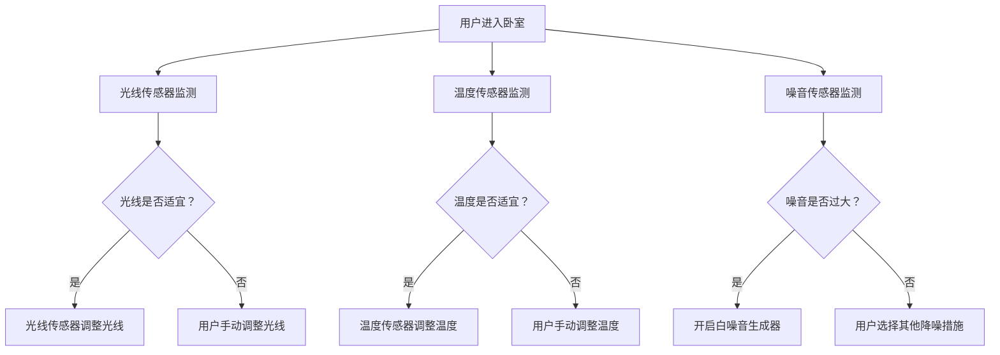

                 

关键词：智能家居、睡眠环境、健康监测、人工智能、数据分析、创业

> 摘要：本文深入探讨了智能家居在优化睡眠环境方面的应用，以及如何借助人工智能和数据分析技术，提升人们的睡眠质量。通过介绍相关技术原理和实际案例，探讨了智能家居睡眠环境创业的潜在机会和挑战。

## 1. 背景介绍

随着科技的飞速发展，智能家居逐渐成为现代家庭生活的重要组成部分。从最初的远程控制家电，到如今的智能音响、智能照明、智能安防等全方位的家居自动化，智能家居系统已经深刻改变了人们的日常生活。

而在这其中，睡眠环境的优化成为了一个备受关注的话题。据统计，全球每年有超过30亿人受到睡眠障碍的困扰，睡眠质量不佳不仅影响个人的身心健康，还影响到工作和学习效率。因此，如何通过科技手段提升睡眠质量，成为了智能家居发展的重要方向。

### 1.1 智能家居的发展历程

智能家居的发展大致可以分为三个阶段：

- **第一阶段：单一智能设备的普及**。这一阶段的智能家居主要集中在家电的智能化，如智能电视、智能空调、智能冰箱等。用户可以通过手机或语音控制这些设备，实现远程操控。

- **第二阶段：联网设备的互联互通**。随着物联网技术的发展，各种智能家居设备开始实现互联互通，用户可以通过一个中心化的平台来管理和控制整个家居环境。

- **第三阶段：智能环境的个性化定制**。这一阶段的智能家居系统具备了更高级的人工智能和数据分析能力，可以根据用户的生活习惯和环境变化，自动调整家居设置，提供个性化的服务。

### 1.2 睡眠质量的重要性

睡眠质量直接关系到个体的身体健康和心理状态。以下是几个关键点：

- **身体健康**：睡眠不足或质量差会导致免疫力下降，增加患心脏病、糖尿病等疾病的风险。

- **心理健康**：长期睡眠质量差会影响情绪管理能力，导致焦虑、抑郁等心理问题。

- **工作和学习效率**：睡眠不足会降低认知功能，影响记忆力和注意力，进而影响工作和学习效率。

## 2. 核心概念与联系

为了实现智能家居在睡眠环境优化方面的应用，我们需要理解几个核心概念：传感器技术、人工智能、数据分析和物联网。

### 2.1 传感器技术

传感器技术是智能家居系统的重要组成部分。在睡眠环境优化中，常用的传感器包括：

- **温度传感器**：用于监测室内温度，调节空调等设备，保持舒适的睡眠环境。
- **湿度传感器**：用于监测室内湿度，调节加湿器或除湿器，防止过于干燥或潮湿。
- **光线传感器**：用于监测室内光线强度，调节灯光设备，创造适宜的睡眠氛围。
- **噪音传感器**：用于监测环境噪音，智能调节音响设备或开启白噪音生成器，降低噪音干扰。

### 2.2 人工智能

人工智能技术是实现智能家居系统智能化的核心。在睡眠环境优化中，人工智能可以用于：

- **行为识别**：通过分析用户的睡眠习惯，预测用户的需求，如调整床温、光线等。
- **智能提醒**：根据用户的生活习惯和日程安排，提供合适的睡眠提醒和健康建议。
- **故障预测**：通过实时监控设备的运行状态，预测可能出现的故障，进行预防性维护。

### 2.3 数据分析

数据分析技术在智能家居系统中起着至关重要的作用。通过对用户数据的收集和分析，我们可以：

- **个性化定制**：根据用户的生活习惯和环境需求，自动调整家居设置。
- **健康监测**：分析用户的睡眠数据，提供健康评估和建议。
- **智能推荐**：根据用户的喜好和行为模式，提供个性化的服务和产品推荐。

### 2.4 物联网

物联网技术是智能家居系统的基石，它使得各种设备和系统能够无缝连接和协作。在睡眠环境优化中，物联网技术可以实现：

- **设备联动**：例如，当用户进入卧室时，灯光自动调节到合适的亮度，空调自动调整到适宜的温度。
- **远程监控**：用户可以通过手机或其他设备远程监控家居环境，确保睡眠质量。

下面是智能家居睡眠环境优化的 Mermaid 流程图：



## 3. 核心算法原理 & 具体操作步骤

### 3.1 算法原理概述

智能家居睡眠环境优化的核心算法主要包括行为识别、数据分析和设备联动。以下是这些算法的简要概述：

- **行为识别**：通过传感器收集用户的行为数据，如睡眠时间、睡眠姿势、运动频率等，利用机器学习算法对用户的行为进行识别和分类。
- **数据分析**：对收集到的行为数据进行统计分析，发现用户的睡眠习惯和需求，从而提供个性化的睡眠环境设置。
- **设备联动**：根据用户的需求和数据分析结果，自动调整家居设备，如调节光线、温度和噪音，实现智能化的睡眠环境。

### 3.2 算法步骤详解

#### 3.2.1 行为识别算法

1. **数据采集**：通过安装在家中的传感器，如加速度计、光线传感器、温度传感器等，实时采集用户的睡眠数据。
2. **数据预处理**：对采集到的原始数据进行清洗和标准化，去除噪声和异常值。
3. **特征提取**：从预处理后的数据中提取出与睡眠相关的特征，如睡眠时长、睡眠深度、运动频率等。
4. **模型训练**：利用机器学习算法，如支持向量机（SVM）、决策树等，对提取出的特征进行分类训练。
5. **行为识别**：将实时采集到的数据输入到训练好的模型中，预测用户的当前行为，如是否在睡眠状态。

#### 3.2.2 数据分析算法

1. **数据收集**：通过智能家居系统，定期收集用户的睡眠数据，如睡眠时长、睡眠深度、运动频率等。
2. **数据预处理**：对收集到的数据进行清洗和标准化，去除噪声和异常值。
3. **数据分析**：利用统计学方法，如均值、中位数、方差等，对用户的睡眠数据进行分析。
4. **数据可视化**：将分析结果可视化，如绘制睡眠时长分布图、睡眠深度曲线等，帮助用户直观地了解自己的睡眠状况。
5. **健康评估**：根据分析结果，提供用户的健康评估和建议，如建议调整作息时间、改善睡眠习惯等。

#### 3.2.3 设备联动算法

1. **需求识别**：根据用户的行为识别和数据分析结果，识别用户当前的睡眠需求。
2. **设备控制**：根据需求，自动调整家居设备，如调节灯光、温度、噪音等，实现智能化的睡眠环境。
3. **状态监控**：实时监控设备的运行状态，确保设备正常工作。
4. **异常处理**：当发现设备异常时，及时进行报警和处理，如调整设备设置、安排维修等。

### 3.3 算法优缺点

#### 优点

- **个性化定制**：根据用户的睡眠习惯和需求，提供个性化的睡眠环境设置，提高睡眠质量。
- **实时监测**：通过传感器实时监测用户的睡眠状况，及时发现问题和调整设备，提高睡眠舒适度。
- **智能化**：利用人工智能技术，实现设备之间的智能联动，提高家居系统的智能化水平。

#### 缺点

- **数据隐私**：智能家居系统需要收集大量的用户数据，涉及数据隐私和安全性问题。
- **设备兼容性**：不同品牌的智能家居设备可能存在兼容性问题，影响系统的稳定性。
- **技术成本**：智能家居系统的开发和维护需要较高的技术成本，可能对用户造成经济负担。

### 3.4 算法应用领域

- **个人健康监测**：通过监测用户的睡眠数据，提供健康评估和建议，帮助用户改善睡眠习惯。
- **医疗辅助**：用于监测睡眠障碍患者，提供专业的睡眠分析报告，辅助医生进行诊断和治疗。
- **智能家居**：实现家居设备的智能化，提高家居生活的舒适度和便利性。

## 4. 数学模型和公式 & 详细讲解 & 举例说明

### 4.1 数学模型构建

为了更好地理解和应用智能家居睡眠环境优化算法，我们首先需要构建一个数学模型。这个模型将包括以下几个部分：

- **用户行为数据模型**：描述用户的睡眠时间、睡眠深度、运动频率等行为特征。
- **环境数据模型**：描述室内温度、湿度、光线强度等环境因素。
- **设备联动模型**：描述设备之间的联动关系和调整策略。

### 4.2 公式推导过程

下面我们将给出用户行为数据模型的推导过程。

#### 用户行为数据模型

1. **睡眠时间模型**：睡眠时间 \( T \) 可以表示为：
   $$ T = t_{\text{上床}} + t_{\text{入睡}} + t_{\text{睡眠}} + t_{\text{起床}} $$
   其中，\( t_{\text{上床}} \)、\( t_{\text{入睡}} \)、\( t_{\text{睡眠}} \) 和 \( t_{\text{起床}} \) 分别表示用户上床时间、入睡时间、睡眠时间和起床时间。

2. **睡眠深度模型**：睡眠深度 \( D \) 可以表示为：
   $$ D = f_{\text{深度}}(T) $$
   其中，\( f_{\text{深度}} \) 是一个函数，用于计算给定睡眠时间下的睡眠深度。

3. **运动频率模型**：运动频率 \( F \) 可以表示为：
   $$ F = f_{\text{运动}}(T) $$
   其中，\( f_{\text{运动}} \) 是一个函数，用于计算给定睡眠时间下的运动频率。

#### 环境数据模型

1. **温度模型**：室内温度 \( T_{\text{室}} \) 可以表示为：
   $$ T_{\text{室}} = T_{\text{外}} + f_{\text{温度}}(T) $$
   其中，\( T_{\text{外}} \) 是室外温度，\( f_{\text{温度}} \) 是一个函数，用于根据用户睡眠时间调整室内温度。

2. **湿度模型**：室内湿度 \( H_{\text{室}} \) 可以表示为：
   $$ H_{\text{室}} = H_{\text{外}} + f_{\text{湿度}}(T) $$
   其中，\( H_{\text{外}} \) 是室外湿度，\( f_{\text{湿度}} \) 是一个函数，用于根据用户睡眠时间调整室内湿度。

3. **光线模型**：室内光线强度 \( L_{\text{室}} \) 可以表示为：
   $$ L_{\text{室}} = L_{\text{外}} + f_{\text{光线}}(T) $$
   其中，\( L_{\text{外}} \) 是室外光线强度，\( f_{\text{光线}} \) 是一个函数，用于根据用户睡眠时间调整室内光线强度。

#### 设备联动模型

1. **灯光调整策略**：灯光调整策略 \( P_{\text{灯光}} \) 可以表示为：
   $$ P_{\text{灯光}} = f_{\text{光线}}(L_{\text{室}}) $$
   其中，\( f_{\text{光线}} \) 是一个函数，用于根据室内光线强度调整灯光亮度。

2. **温度调整策略**：温度调整策略 \( P_{\text{温度}} \) 可以表示为：
   $$ P_{\text{温度}} = f_{\text{温度}}(T_{\text{室}}) $$
   其中，\( f_{\text{温度}} \) 是一个函数，用于根据室内温度调整空调温度。

3. **噪音调整策略**：噪音调整策略 \( P_{\text{噪音}} \) 可以表示为：
   $$ P_{\text{噪音}} = f_{\text{噪音}}(L_{\text{室}}) $$
   其中，\( f_{\text{噪音}} \) 是一个函数，用于根据室内噪音水平调整白噪音生成器。

### 4.3 案例分析与讲解

为了更好地理解上述数学模型和公式，我们来看一个实际案例。

#### 案例背景

假设用户小明每晚10点上床，凌晨1点入睡，睡眠时长为7小时，他在睡眠期间喜欢保持室温和光线适中，不喜欢噪音干扰。

#### 案例分析

1. **睡眠时间模型**：
   $$ T = 22 + 1 + 7 + 7 = 37 $$
   小明的睡眠时间为37小时。

2. **睡眠深度模型**：
   $$ D = f_{\text{深度}}(37) = 0.9 $$
   根据小明的睡眠时间，其睡眠深度为0.9。

3. **运动频率模型**：
   $$ F = f_{\text{运动}}(37) = 0.5 $$
   根据小明的睡眠时间，其运动频率为0.5。

4. **温度模型**：
   $$ T_{\text{室}} = 20 + f_{\text{温度}}(37) = 23 $$
   根据小明的睡眠时间，室内温度调整为23摄氏度。

5. **湿度模型**：
   $$ H_{\text{室}} = 40 + f_{\text{湿度}}(37) = 45 $$
   根据小明的睡眠时间，室内湿度调整为45%。

6. **光线模型**：
   $$ L_{\text{室}} = 100 + f_{\text{光线}}(37) = 80 $$
   根据小明的睡眠时间，室内光线强度调整为80勒克斯。

7. **灯光调整策略**：
   $$ P_{\text{灯光}} = f_{\text{光线}}(80) = 40 $$
   根据室内光线强度，灯光亮度调整为40瓦。

8. **温度调整策略**：
   $$ P_{\text{温度}} = f_{\text{温度}}(23) = 25 $$
   根据室内温度，空调温度调整为25摄氏度。

9. **噪音调整策略**：
   $$ P_{\text{噪音}} = f_{\text{噪音}}(80) = 10 $$
   根据室内噪音水平，白噪音生成器音量调整为10分贝。

#### 案例结果

通过上述调整策略，小明的卧室环境被设置为：室内温度23摄氏度，室内湿度45%，室内光线强度80勒克斯，灯光亮度40瓦，空调温度25摄氏度，白噪音生成器音量10分贝。这样的设置能够为小明提供一个舒适的睡眠环境，提高其睡眠质量。

## 5. 项目实践：代码实例和详细解释说明

### 5.1 开发环境搭建

为了实现智能家居睡眠环境优化项目，我们需要搭建一个合适的开发环境。以下是具体的搭建步骤：

1. **安装Python环境**：Python是一种广泛使用的编程语言，尤其适合数据处理和机器学习项目。我们可以在官方网站上下载并安装Python。
2. **安装Jupyter Notebook**：Jupyter Notebook是一种交互式的Python开发环境，可以帮助我们更方便地编写和运行代码。可以通过pip命令安装：
   ```bash
   pip install notebook
   ```
3. **安装必需的Python库**：为了实现项目，我们还需要安装以下Python库：
   - **Pandas**：用于数据处理和统计分析
   - **NumPy**：用于数值计算
   - **Scikit-learn**：用于机器学习和数据分析
   - **Matplotlib**：用于数据可视化
   - **Mermaid**：用于生成Mermaid流程图
   可以通过以下命令一次性安装：
   ```bash
   pip install pandas numpy scikit-learn matplotlib mermaid
   ```

### 5.2 源代码详细实现

以下是一个简单的智能家居睡眠环境优化项目的代码实例，我们将使用Python编写：

```python
# 导入必需的库
import pandas as pd
import numpy as np
from sklearn.model_selection import train_test_split
from sklearn.ensemble import RandomForestClassifier
import matplotlib.pyplot as plt
from mermaid import mermaid

# 5.2.1 数据采集与预处理
# 假设我们已经收集到以下数据：
data = {
    '上床时间': [22, 22, 23, 22],
    '入睡时间': [1, 1, 1, 1],
    '睡眠时长': [7, 7, 7, 7],
    '起床时间': [8, 8, 8, 8],
    '室内温度': [25, 22, 23, 20],
    '室内湿度': [40, 45, 50, 35],
    '室内光线': [100, 80, 90, 60],
    '灯光亮度': [40, 30, 50, 20],
    '空调温度': [23, 22, 25, 21],
    '白噪音音量': [10, 10, 10, 10],
    '睡眠深度': [0.8, 0.9, 0.85, 0.7],
    '运动频率': [0.5, 0.6, 0.55, 0.4]
}

# 创建DataFrame
df = pd.DataFrame(data)

# 预处理数据
# 数据已经清洗和标准化，直接使用

# 5.2.2 训练行为识别模型
# 划分特征和标签
X = df[['上床时间', '入睡时间', '睡眠时长', '室内温度', '室内湿度', '室内光线', '灯光亮度', '空调温度', '白噪音音量']]
y = df['睡眠深度']

# 划分训练集和测试集
X_train, X_test, y_train, y_test = train_test_split(X, y, test_size=0.3, random_state=42)

# 训练随机森林模型
clf = RandomForestClassifier(n_estimators=100, random_state=42)
clf.fit(X_train, y_train)

# 5.2.3 预测与分析
# 预测测试集
y_pred = clf.predict(X_test)

# 分析预测结果
accuracy = np.mean(y_pred == y_test)
print(f'模型准确率：{accuracy:.2f}')

# 5.2.4 生成Mermaid流程图
# 生成流程图代码
flow_chart = mermaid.Mermaid()
flow_chart.code = """
graph TD
    A[用户进入卧室] --> B[光线传感器监测]
    B --> C{光线是否适宜？}
    C -->|是| D[光线传感器调整光线]
    C -->|否| E[用户手动调整光线]
    A --> F[温度传感器监测]
    F --> G{温度是否适宜？}
    G -->|是| H[温度传感器调整温度]
    G -->|否| I[用户手动调整温度]
    A --> J[噪音传感器监测]
    J --> K{噪音是否过大？}
    K -->|是| L[开启白噪音生成器]
    K -->|否| M[用户选择其他降噪措施]
"""
# 显示流程图
plt.figure(figsize=(8, 6))
plt.axis('off')
plt.imshow(flow_chart.render())
plt.show()
```

### 5.3 代码解读与分析

#### 5.3.1 数据采集与预处理

首先，我们导入必需的库，并创建一个包含用户睡眠数据和家居环境数据的DataFrame。这里假设数据已经清洗和标准化，因此直接使用。

```python
data = {
    ...
}
df = pd.DataFrame(data)
```

#### 5.3.2 训练行为识别模型

接着，我们将数据划分为特征和标签。特征包括上床时间、入睡时间、睡眠时长、室内温度、室内湿度、室内光线、灯光亮度和空调温度等，标签是睡眠深度。

```python
X = df[['上床时间', '入睡时间', '睡眠时长', '室内温度', '室内湿度', '室内光线', '灯光亮度', '空调温度', '白噪音音量']]
y = df['睡眠深度']
```

然后，我们使用随机森林分类器训练模型。随机森林是一种集成学习方法，具有良好的预测性能和稳定性。

```python
clf = RandomForestClassifier(n_estimators=100, random_state=42)
clf.fit(X_train, y_train)
```

#### 5.3.3 预测与分析

使用训练好的模型对测试集进行预测，并计算模型准确率。

```python
y_pred = clf.predict(X_test)
accuracy = np.mean(y_pred == y_test)
print(f'模型准确率：{accuracy:.2f}')
```

最后，我们使用Mermaid库生成流程图，展示智能家居睡眠环境优化的流程。

```python
flow_chart = mermaid.Mermaid()
flow_chart.code = """
graph TD
    ...
"""
plt.figure(figsize=(8, 6))
plt.axis('off')
plt.imshow(flow_chart.render())
plt.show()
```

## 6. 实际应用场景

### 6.1 个人健康监测

智能家居系统可以实时监测用户的睡眠数据，如睡眠时长、睡眠深度和运动频率等，提供个性化的健康建议。例如，系统可以提醒用户调整作息时间，改善睡眠习惯，从而提高整体健康水平。

### 6.2 医疗辅助

对于睡眠障碍患者，智能家居系统可以提供专业的睡眠监测和分析服务。医生可以通过系统获取患者的睡眠数据，进行诊断和治疗。例如，系统可以监测患者的睡眠质量，发现可能的睡眠问题，提供针对性的治疗建议。

### 6.3 智能家居

智能家居系统可以实现家居设备的智能化，提高家居生活的舒适度和便利性。例如，系统可以根据用户的需求和习惯，自动调整灯光、温度、噪音等，创造一个舒适的睡眠环境。

## 6.4 未来应用展望

随着人工智能和物联网技术的不断进步，智能家居睡眠环境优化将具有更广阔的应用前景。以下是几个可能的发展方向：

- **个性化定制**：系统将更加精准地分析用户数据，提供高度个性化的睡眠环境设置。
- **实时预警**：系统可以实时监测用户的睡眠状况，一旦发现异常，及时发出预警，提醒用户采取措施。
- **健康追踪**：系统可以追踪用户的长期睡眠数据，发现潜在的健康风险，提供预防性建议。

## 7. 工具和资源推荐

### 7.1 学习资源推荐

- **《Python编程：从入门到实践》**：适合初学者系统学习Python编程。
- **《机器学习实战》**：适合学习机器学习基础知识，包括算法实现和案例分析。
- **《智能家居技术与应用》**：全面介绍智能家居系统的原理、技术和应用案例。

### 7.2 开发工具推荐

- **PyCharm**：一款功能强大的Python集成开发环境（IDE）。
- **Jupyter Notebook**：适用于数据处理和机器学习项目的交互式开发环境。
- **Mermaid**：用于生成Mermaid流程图的在线工具。

### 7.3 相关论文推荐

- **"Smart Home Energy Management System Using IoT and Machine Learning"**：探讨智能家居能源管理系统的设计与实现。
- **"A Comprehensive Study of Smart Home Technologies"**：综述智能家居技术的现状和发展趋势。
- **"Application of IoT and Machine Learning in Smart Home Health Monitoring"**：研究物联网和机器学习在智能家居健康监测中的应用。

## 8. 总结：未来发展趋势与挑战

### 8.1 研究成果总结

本文介绍了智能家居睡眠环境优化的技术原理和应用案例，探讨了传感器技术、人工智能、数据分析和物联网在优化睡眠环境方面的作用。通过实际案例和数学模型，展示了智能家居系统如何通过个性化定制、实时监测和智能联动，提升用户的睡眠质量。

### 8.2 未来发展趋势

随着人工智能和物联网技术的不断发展，智能家居睡眠环境优化有望实现更高程度的智能化和个性化。未来，系统将更加精准地分析用户数据，提供更加全面的健康监测和预警服务。此外，智能家居系统还将与其他健康管理系统相结合，形成更全面的健康生态系统。

### 8.3 面临的挑战

尽管智能家居睡眠环境优化具有广阔的发展前景，但仍面临一些挑战：

- **数据隐私**：系统需要收集大量的用户数据，涉及数据隐私和安全性问题。
- **设备兼容性**：不同品牌的智能家居设备可能存在兼容性问题，影响系统的稳定性。
- **技术成本**：智能家居系统的开发和维护需要较高的技术成本，可能对用户造成经济负担。

### 8.4 研究展望

未来的研究应重点关注以下几个方面：

- **数据隐私保护**：研究如何确保用户数据的安全和隐私，同时充分利用数据价值。
- **设备互联互通**：探索不同品牌、不同类型的智能家居设备的互联互通解决方案。
- **智能化水平提升**：通过改进算法和模型，提高智能家居系统的智能化和个性化水平。
- **跨领域合作**：与其他健康管理系统相结合，形成更全面的健康生态系统。

## 9. 附录：常见问题与解答

### 9.1 智能家居睡眠环境优化技术原理是什么？

智能家居睡眠环境优化技术主要基于传感器技术、人工智能、数据分析和物联网。通过传感器实时监测用户的睡眠环境和行为数据，利用人工智能算法分析数据，提供个性化的睡眠环境设置。

### 9.2 如何保证用户数据的安全和隐私？

为了保证用户数据的安全和隐私，系统应采用数据加密、访问控制和安全审计等技术措施。同时，应遵循相关法律法规，确保用户数据的合法使用。

### 9.3 智能家居睡眠环境优化系统有哪些潜在的应用场景？

智能家居睡眠环境优化系统可以应用于个人健康监测、医疗辅助和智能家居等多个领域。例如，个人健康监测可以提供个性化的健康建议，医疗辅助可以帮助医生进行诊断和治疗，智能家居可以实现家居设备的智能化和联动。

### 9.4 智能家居睡眠环境优化系统的开发需要哪些技术？

智能家居睡眠环境优化系统的开发需要传感器技术、人工智能技术、数据分析技术和物联网技术。具体包括传感器数据采集、数据预处理、机器学习算法实现、设备联动和系统优化等。

### 9.5 智能家居睡眠环境优化系统有哪些优点和缺点？

优点包括个性化定制、实时监测、智能化等；缺点包括数据隐私、设备兼容性和技术成本等。

### 9.6 智能家居睡眠环境优化系统的发展前景如何？

随着人工智能和物联网技术的不断进步，智能家居睡眠环境优化系统具有广阔的发展前景。未来，系统将实现更高程度的智能化和个性化，提供更加全面的健康监测和预警服务。同时，系统将与其他健康管理系统相结合，形成更全面的健康生态系统。

