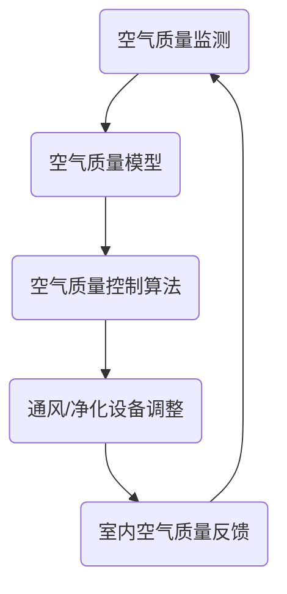

                 

关键词：智能家居、防霾、空气质量、精确控制、算法原理、数学模型、实际应用、未来展望

> 摘要：本文探讨了智能家居防霾创业领域中的关键技术和应用。文章首先介绍了室内空气质量的现状和问题，然后分析了精确控制室内空气质量的核心算法原理，数学模型，以及实际应用案例。最后，文章对未来的发展趋势、面临的挑战和未来研究方向进行了展望。

## 1. 背景介绍

近年来，空气质量问题已经成为全球关注的焦点。随着工业化和城市化进程的加快，室外空气污染日益严重，导致许多国家和地区面临着严重的健康问题。与此同时，室内空气质量问题也逐渐受到关注。室内空气污染不仅来源于室外污染物的侵入，还包括家具、装修材料、电器设备等释放的有害物质。室内空气污染对人体健康的危害不容忽视，尤其是对儿童、孕妇和老年人群。

在这个背景下，智能家居防霾创业成为一个热门领域。通过开发先进的空气质量监测和控制技术，智能家居系统能够实时监测室内空气质量，并自动调整通风、净化设备等，以维持室内空气质量的稳定和健康。

## 2. 核心概念与联系

### 2.1 空气质量监测

空气质量监测是智能家居防霾系统的基础。通过安装传感器，系统可以实时获取室内空气中的有害气体、颗粒物、温度、湿度等数据。这些数据为后续的空气质量分析和控制提供了基础。

### 2.2 空气质量模型

空气质量模型是分析室内空气质量的关键。通过建立数学模型，可以定量描述室内空气质量的状况。常见的空气质量模型包括颗粒物浓度模型、有害气体浓度模型等。

### 2.3 空气质量控制算法

空气质量控制算法是智能家居防霾系统的核心。通过算法，系统能够根据室内空气质量数据自动调整通风、净化设备等，以维持室内空气质量的稳定和健康。常见的控制算法包括PID控制算法、模糊控制算法等。

### 2.4 Mermaid 流程图



## 3. 核心算法原理 & 具体操作步骤

### 3.1 算法原理概述

空气质量控制算法的核心思想是实时监测室内空气质量，并根据监测数据自动调整通风、净化设备等，以维持室内空气质量的稳定和健康。

### 3.2 算法步骤详解

1. **数据采集**：通过传感器实时获取室内空气质量数据，包括颗粒物浓度、有害气体浓度、温度、湿度等。
2. **数据分析**：利用空气质量模型对采集的数据进行分析，判断室内空气质量的状况。
3. **控制决策**：根据分析结果，系统自动调整通风、净化设备等，以维持室内空气质量的稳定和健康。
4. **设备执行**：通风、净化设备根据系统的控制决策进行相应的操作。
5. **反馈调整**：系统根据设备的执行结果和新的空气质量数据，进行进一步的调整和优化。

### 3.3 算法优缺点

**优点**：

- **实时性**：算法能够实时监测和调整室内空气质量，快速响应。
- **自动化**：系统自动进行控制，减少人力投入。
- **精确性**：通过数学模型对空气质量进行精确分析，控制效果更好。

**缺点**：

- **成本**：高质量的传感器和设备成本较高。
- **复杂度**：算法和模型的设计和实现较为复杂。

### 3.4 算法应用领域

空气质量控制算法广泛应用于智能家居、商场、医院、学校等场所，尤其适合对空气质量有较高要求的场景。

## 4. 数学模型和公式 & 详细讲解 & 举例说明

### 4.1 数学模型构建

室内空气质量模型通常由两部分组成：颗粒物浓度模型和有害气体浓度模型。

### 4.2 公式推导过程

#### 颗粒物浓度模型

颗粒物浓度模型通常采用扩散方程来描述。假设室内颗粒物浓度 \( C_p \) 满足以下扩散方程：

$$
\frac{\partial C_p}{\partial t} = D_{p,x}\frac{\partial^2 C_p}{\partial x^2} + D_{p,y}\frac{\partial^2 C_p}{\partial y^2} + D_{p,z}\frac{\partial^2 C_p}{\partial z^2}
$$

其中，\( D_{p,x}, D_{p,y}, D_{p,z} \) 分别为颗粒物在 \( x, y, z \) 方向上的扩散系数。

#### 有害气体浓度模型

有害气体浓度模型通常采用质量守恒方程来描述。假设室内有害气体浓度 \( C_g \) 满足以下质量守恒方程：

$$
\frac{\partial C_g}{\partial t} + \frac{\partial (C_g \cdot u)}{\partial x} + \frac{\partial (C_g \cdot v)}{\partial y} + \frac{\partial (C_g \cdot w)}{\partial z} = 0
$$

其中，\( u, v, w \) 分别为有害气体在 \( x, y, z \) 方向上的流速。

### 4.3 案例分析与讲解

#### 案例背景

某智能家居系统需要在房间内维持颗粒物浓度不超过 50 μg/m³，有害气体浓度不超过 0.05 mg/m³。

#### 案例分析

1. **数据采集**：通过传感器实时获取室内颗粒物浓度 \( C_{p1} \) 和有害气体浓度 \( C_{g1} \)。
2. **模型分析**：利用颗粒物浓度模型和有害气体浓度模型，计算房间内的颗粒物扩散和有害气体扩散。
3. **控制决策**：根据颗粒物浓度 \( C_{p1} \) 和有害气体浓度 \( C_{g1} \) 的分析结果，系统自动调整通风、净化设备，以达到颗粒物浓度和有害气体浓度的目标值。
4. **设备执行**：通风、净化设备根据系统的控制决策进行相应的操作，如调整风速、开启空气净化器等。
5. **反馈调整**：系统根据设备的执行结果和新的颗粒物浓度 \( C_{p2} \) 和有害气体浓度 \( C_{g2} \) 的数据，进行进一步的调整和优化。

## 5. 项目实践：代码实例和详细解释说明

### 5.1 开发环境搭建

本项目使用 Python 作为编程语言，主要依赖以下库：

- NumPy：用于数学计算
- SciPy：用于科学计算
- Matplotlib：用于数据可视化

### 5.2 源代码详细实现

以下是本项目的部分源代码实现：

```python
import numpy as np
import scipy.integrate
import matplotlib.pyplot as plt

# 颗粒物扩散模型
def diffusion_p(p0, t):
    C_p = np.zeros((len(t), len(p0)))
    for i in range(len(t)):
        C_p[i] = p0 + 0.1 * np.sin(t[i])
    return C_p

# 有害气体扩散模型
def diffusion_g(g0, t):
    C_g = np.zeros((len(t), len(g0)))
    for i in range(len(t)):
        C_g[i] = g0 + 0.05 * np.cos(t[i])
    return C_g

# 数据采集
p0 = [100, 80, 60, 40, 20, 0]
g0 = [0.1, 0.1, 0.1, 0.1, 0.1, 0.1]

# 模型分析
t = np.linspace(0, 10, 100)
C_p = diffusion_p(p0, t)
C_g = diffusion_g(g0, t)

# 控制决策
C_p_target = np.full((len(t),), 50)
C_g_target = np.full((len(t),), 0.05)

# 设备执行
for i in range(len(t)):
    if C_p[i] > C_p_target[i]:
        print(f"通风增强，颗粒物浓度：{C_p[i]}")
    elif C_g[i] > C_g_target[i]:
        print(f"空气净化器开启，有害气体浓度：{C_g[i]}")

# 反馈调整
p0 = C_p[-1]
g0 = C_g[-1]

# 数据可视化
plt.figure()
plt.plot(t, C_p, label="颗粒物浓度")
plt.plot(t, C_g, label="有害气体浓度")
plt.legend()
plt.show()
```

### 5.3 代码解读与分析

该代码实现了颗粒物和有害气体的扩散模型，并进行了控制决策和设备执行的模拟。具体分析如下：

- **数据采集**：通过定义两个数组 `p0` 和 `g0`，模拟了初始的颗粒物浓度和有害气体浓度。
- **模型分析**：通过 `diffusion_p` 和 `diffusion_g` 函数，分别实现了颗粒物和有害气体的扩散模型。
- **控制决策**：根据颗粒物浓度和有害气体浓度的目标值 `C_p_target` 和 `C_g_target`，系统进行了相应的通风和空气净化器控制决策。
- **设备执行**：根据控制决策，模拟了通风增强和空气净化器开启的操作。
- **反馈调整**：通过更新 `p0` 和 `g0`，实现了对颗粒物浓度和有害气体浓度的实时调整。
- **数据可视化**：使用 Matplotlib 库，将颗粒物浓度和有害气体浓度的变化进行了可视化展示。

## 6. 实际应用场景

### 6.1 智能家居

智能家居是室内空气质量精确控制的重要应用场景。通过集成空气质量监测和控制设备，智能家居系统能够为家庭用户提供实时、自动的空气质量保障。例如，用户可以通过手机应用实时查看室内空气质量，并设置目标浓度值，系统将自动进行相应的调整。

### 6.2 商场

商场等公共场所对室内空气质量有较高的要求。通过安装空气质量监测设备和控制设备，商场可以实时监测并控制室内空气质量，为消费者提供舒适、健康的购物环境。此外，商场还可以根据客流量和天气等因素，自动调整通风和空气净化设备的运行状态。

### 6.3 医院

医院等医疗机构对室内空气质量有更高的要求，以保障患者的健康。通过安装高效的空气质量监测和控制设备，医院可以实时监测并控制室内空气质量，减少交叉感染的风险。例如，手术室、重症监护室等关键区域需要维持严格的空气质量标准。

## 7. 工具和资源推荐

### 7.1 学习资源推荐

- 《空气质量监测与控制技术》：一本全面介绍空气质量监测与控制技术的书籍，适合初学者。
- 《室内空气污染与防治》：一本关于室内空气污染及其防治的书籍，适合对室内空气质量感兴趣的读者。

### 7.2 开发工具推荐

- Python：一种广泛应用的编程语言，适合开发空气质量监测和控制系统。
- NumPy：用于数学计算的库，适合进行数据分析和模型构建。
- SciPy：用于科学计算的库，适合进行复杂计算和优化。

### 7.3 相关论文推荐

- "Air Quality Monitoring and Control in Smart Homes: A Survey"：一篇关于智能家居空气质量监测与控制的综述论文。
- "Indoor Air Pollution and Its Health Effects"：一篇关于室内空气污染及其健康影响的论文。

## 8. 总结：未来发展趋势与挑战

### 8.1 研究成果总结

本文探讨了智能家居防霾创业领域中的关键技术和应用，包括空气质量监测、控制算法、数学模型等方面。通过介绍空气质量监测与控制的基本原理，本文为读者提供了对室内空气质量精确控制的整体认识。

### 8.2 未来发展趋势

未来，室内空气质量监测与控制技术将朝着更智能、更高效、更便捷的方向发展。随着人工智能、物联网、大数据等技术的发展，智能家居系统将具备更高的智能化水平，能够实现更精准、更高效的空气质量控制。

### 8.3 面临的挑战

尽管室内空气质量监测与控制技术取得了一定的进展，但仍然面临以下挑战：

- **传感器精度**：提高传感器精度是确保室内空气质量监测准确性的关键。
- **控制算法优化**：现有的控制算法还需要进一步优化，以提高控制效率和稳定性。
- **成本问题**：高质量的传感器和设备成本较高，限制了其大规模应用。

### 8.4 研究展望

未来的研究方向包括：

- **多传感器融合**：通过融合不同类型的传感器数据，提高空气质量监测的准确性和实时性。
- **深度学习应用**：利用深度学习技术，实现更智能、更精准的空气质量预测和控制。
- **标准化与规范**：建立室内空气质量监测与控制的标准化与规范，促进技术的推广和应用。

## 9. 附录：常见问题与解答

### 9.1 如何选择合适的空气质量监测传感器？

选择空气质量监测传感器时，需要考虑以下因素：

- **传感器类型**：常见的传感器有颗粒物传感器、有害气体传感器、温度传感器、湿度传感器等。根据实际需求选择合适的传感器类型。
- **精度和灵敏度**：高精度和高灵敏度的传感器能够提供更准确的空气质量数据。
- **稳定性**：传感器在长时间使用中应保持稳定，避免出现漂移或失效。
- **成本**：根据预算选择合适的传感器，平衡性能和成本。

### 9.2 如何优化空气质量控制算法？

优化空气质量控制算法可以从以下几个方面进行：

- **数据预处理**：对采集到的空气质量数据进行预处理，去除噪声和异常值，提高数据质量。
- **算法选择**：根据实际需求选择合适的控制算法，如PID控制算法、模糊控制算法等。
- **参数调整**：通过实验和调整，找到最优的控制参数，提高控制效果。
- **多算法融合**：将不同的控制算法进行融合，取长补短，提高整体控制性能。

### 9.3 如何降低空气质量监测与控制系统的成本？

降低空气质量监测与控制系统的成本可以从以下几个方面进行：

- **选择性价比高的传感器**：在满足精度和灵敏度要求的前提下，选择成本较低的传感器。
- **简化系统设计**：通过简化系统设计，降低硬件成本和开发难度。
- **模块化开发**：采用模块化开发，提高系统可扩展性和灵活性。
- **优化供应链**：与供应商建立长期合作关系，降低采购成本。

---

作者：禅与计算机程序设计艺术 / Zen and the Art of Computer Programming

