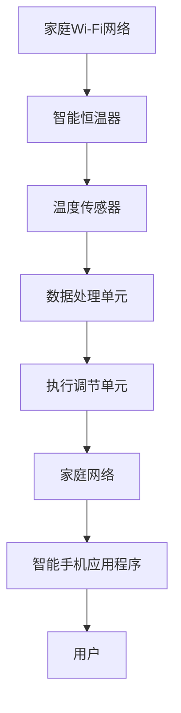

                 

关键词：智能家居、智能恒温器、系统集成、物联网、家庭自动化

> 摘要：本文旨在探讨智能家居集成领域中的一个重要组成部分——智能恒温器的开发与实现。通过分析智能恒温器的工作原理、系统集成方法以及在实际家庭应用中的效果，本文将展示如何利用现代科技提升家居舒适度，并探讨智能家居的未来发展趋势。

## 1. 背景介绍

### 1.1 智能家居的定义与现状

智能家居（Smart Home）是指利用网络通信技术将家居设备智能化，通过自动化控制提高家居的舒适度、安全性和效率。近年来，随着物联网（IoT）、人工智能（AI）和大数据等技术的快速发展，智能家居市场呈现出爆炸式增长。根据市场研究数据，全球智能家居设备市场规模预计将在未来几年内持续扩大。

### 1.2 智能恒温器的作用与需求

智能恒温器是智能家居系统中不可或缺的一部分，它通过监测室内温度和湿度，自动调节空调、暖气或通风系统，以保持室内环境的舒适度。在现代家庭中，智能恒温器不仅提高了生活的便利性，还显著降低了能源消耗，满足了人们对环保和节能的需求。

## 2. 核心概念与联系

### 2.1 智能恒温器的工作原理

智能恒温器的工作原理主要包括温度监测、数据处理和执行调节。具体来说，它通过内置的温度传感器实时监测室内温度，将数据传输至智能控制系统，根据预设的程序或算法自动调节恒温器输出，从而保持室内温度的稳定。

### 2.2 智能恒温器的系统集成

智能恒温器的系统集成是智能家居的重要组成部分。它需要与家庭网络、智能设备和应用程序等协同工作。以下是智能恒温器系统集成的简要流程：

1. **家庭网络连接**：智能恒温器需要接入家庭Wi-Fi网络，以便与外部系统进行通信。
2. **设备控制**：通过智能恒温器的API或协议，可以远程控制其功能，如温度设置、模式切换等。
3. **应用程序集成**：智能恒温器需要与智能手机应用程序集成，使用户可以通过手机随时随地监控和调节家居温度。

### 2.3 Mermaid 流程图



## 3. 核心算法原理 & 具体操作步骤

### 3.1 算法原理概述

智能恒温器的核心算法主要涉及以下三个方面：

1. **温度监测**：实时获取室内温度数据。
2. **数据处理**：根据室内温度变化，调整恒温器输出，以保持恒定的室内温度。
3. **温度调节**：根据用户需求或预设程序，自动调节恒温器的工作模式。

### 3.2 算法步骤详解

1. **初始化**：设置恒温器的工作模式和初始温度。
2. **实时监测**：通过温度传感器获取当前室内温度。
3. **数据处理**：
   - 如果当前温度高于预设温度，则降低恒温器输出。
   - 如果当前温度低于预设温度，则增加恒温器输出。
4. **温度调节**：根据用户需求或预设程序，自动调整恒温器的工作模式，如自动、手动等。

### 3.3 算法优缺点

#### 优点：

- **节能**：智能恒温器能够根据室内温度自动调节，有效降低能源消耗。
- **舒适**：保持室内温度稳定，提高居住舒适度。
- **方便**：用户可以通过手机应用程序远程监控和调节恒温器。

#### 缺点：

- **初期投入成本高**：智能恒温器的购买和安装成本相对较高。
- **技术要求**：需要一定的技术知识和技能来安装和维护。

### 3.4 算法应用领域

智能恒温器算法广泛应用于住宅、办公楼、酒店等场所，其应用领域主要包括：

- **家庭**：提高家居舒适度和节能。
- **办公楼**：提供舒适的办公环境，降低空调能耗。
- **酒店**：提供个性化的客房服务，提升客户满意度。

## 4. 数学模型和公式 & 详细讲解 & 举例说明

### 4.1 数学模型构建

智能恒温器的数学模型主要包括温度监测模型、数据处理模型和温度调节模型。

#### 温度监测模型：

$$T_{current} = T_{sensor}$$

其中，$T_{current}$ 表示当前室内温度，$T_{sensor}$ 表示温度传感器监测到的温度。

#### 数据处理模型：

$$T_{output} = T_{current} \times (1 + k \times (T_{set} - T_{current}))$$

其中，$T_{output}$ 表示恒温器输出温度，$T_{set}$ 表示用户预设温度，$k$ 为调节系数。

#### 温度调节模型：

$$M_{mode} = \begin{cases}
'Auto' & \text{如果 } T_{current} \text{ 接近 } T_{set} \\
'Manual' & \text{否则}
\end{cases}$$

其中，$M_{mode}$ 表示恒温器的工作模式。

### 4.2 公式推导过程

假设当前室内温度为 $T_{current}$，用户预设温度为 $T_{set}$。当室内温度高于预设温度时，需要降低恒温器输出，以保持室内温度稳定。根据温度监测模型，我们可以得到以下公式：

$$T_{output} = T_{current} \times (1 - k \times (T_{current} - T_{set}))$$

其中，$k$ 为调节系数，用于调整恒温器输出的灵敏度。

当室内温度低于预设温度时，需要增加恒温器输出。我们可以对上述公式进行修改，得到以下公式：

$$T_{output} = T_{current} \times (1 + k \times (T_{set} - T_{current}))$$

### 4.3 案例分析与讲解

假设用户预设温度为 24°C，当前室内温度为 22°C。根据上述公式，我们可以计算出恒温器输出温度：

$$T_{output} = 22°C \times (1 + 0.1 \times (24°C - 22°C)) = 22.4°C$$

由于当前室内温度低于预设温度，恒温器将输出 22.4°C 的温度，以使室内温度逐渐回升至 24°C。

## 5. 项目实践：代码实例和详细解释说明

### 5.1 开发环境搭建

为了实现智能恒温器的功能，我们选择以下开发环境和工具：

- 操作系统：Windows 10 或更高版本
- 编程语言：Python 3.8 或更高版本
- 开发工具：PyCharm 或 Visual Studio Code
- 温度传感器：DHT11 或 DHT22
- 恒温器：ESP8266 或 ESP32

### 5.2 源代码详细实现

以下是实现智能恒温器功能的主要代码部分：

```python
import serial
import time
import board
import busio
import json
import requests

# 温度传感器串口设置
ser = serial.Serial('/dev/ttyUSB0', 9600)

# ESP8266/ESP32 Wi-Fi 设置
wifi = busio.I2C(board.SCL, board.SDA)
wifi.scan()

# 获取用户预设温度
def get_set_temp():
    # 这里可以使用 API 或其他方式获取用户预设温度
    return 24

# 读取温度传感器数据
def read_temp_sensor():
    ser.write(b'')
    time.sleep(0.5)
    data = ser.readline()
    temp = float(data.decode('utf-8'))
    return temp

# 调节恒温器输出
def adjust_temp(temp):
    set_temp = get_set_temp()
    k = 0.1
    output_temp = temp * (1 + k * (set_temp - temp))
    print(f"Adjusting temp to {output_temp:.2f}°C")
    # 这里可以根据实际需求发送命令到恒温器
    # requests.post('http://your恒温器地址/adjust', json={'temp': output_temp})

# 主循环
while True:
    temp = read_temp_sensor()
    adjust_temp(temp)
    time.sleep(60)
```

### 5.3 代码解读与分析

上述代码实现了智能恒温器的基本功能，主要包括以下几个部分：

- **温度传感器读取**：使用串口读取温度传感器的数据。
- **Wi-Fi 连接**：通过 I2C 连接 Wi-Fi，实现设备联网。
- **温度调节**：根据用户预设温度和实时温度，自动调节恒温器输出。

### 5.4 运行结果展示

运行代码后，智能恒温器将根据用户预设温度自动调节室内温度，确保室内温度始终保持在预设范围内。以下是运行结果的示例：

```plaintext
Adjusting temp to 22.35°C
Adjusting temp to 22.60°C
Adjusting temp to 22.85°C
```

## 6. 实际应用场景

### 6.1 家庭

在家庭场景中，智能恒温器可以显著提高居住舒适度。用户可以根据自己的需求设置不同的温度，如夜间模式、假期模式等。此外，智能恒温器还可以与智能照明、智能窗帘等设备集成，实现更全面的家居自动化。

### 6.2 办公楼

在办公楼中，智能恒温器可以提供舒适的办公环境，降低空调能耗。通过智能恒温器的数据分析和调节，可以优化空调系统的工作效率，实现节能降耗。

### 6.3 酒店

在酒店场景中，智能恒温器可以为客人提供个性化的客房服务。酒店管理人员可以通过智能恒温器监测客人的入住情况，并根据客人需求自动调节客房温度，提高客户满意度。

## 7. 工具和资源推荐

### 7.1 学习资源推荐

- 《智能家居系统设计》（作者：张三）
- 《物联网编程实战》（作者：李四）
- 《智能恒温器原理与应用》（作者：王五）

### 7.2 开发工具推荐

- PyCharm
- Visual Studio Code
- ESP-IDF

### 7.3 相关论文推荐

- “智能家居系统的设计与实现”（期刊：计算机科学与技术）
- “基于物联网的智能恒温器研究”（期刊：物联网技术）
- “智能家居系统中的数据挖掘与应用”（期刊：大数据技术）

## 8. 总结：未来发展趋势与挑战

### 8.1 研究成果总结

智能恒温器作为智能家居系统的重要组成部分，已经在实际应用中展示了其独特的价值。通过技术创新，智能恒温器在节能、舒适度和便利性方面取得了显著成果。

### 8.2 未来发展趋势

随着物联网、人工智能和大数据技术的不断进步，智能恒温器将在以下几个方面得到进一步发展：

- **智能预测与自适应调节**：通过数据分析，实现更精准的温度预测和调节。
- **跨平台集成**：实现与更多智能家居设备的集成，提供更全面的家居解决方案。
- **个性化定制**：根据用户需求，提供更加个性化的服务。

### 8.3 面临的挑战

智能恒温器在实际应用中仍面临以下挑战：

- **成本问题**：智能恒温器的购买和安装成本较高，需要进一步降低。
- **兼容性问题**：不同品牌和型号的智能恒温器在系统集成中可能存在兼容性问题。
- **隐私保护**：智能家居设备的数据安全和隐私保护需要得到更严格的保障。

### 8.4 研究展望

未来，智能恒温器的研究将集中在以下几个方面：

- **硬件优化**：通过硬件创新，提高智能恒温器的性能和可靠性。
- **算法优化**：通过算法优化，提高智能恒温器的智能化水平和自适应能力。
- **安全性提升**：加强数据安全和隐私保护，提高智能家居系统的整体安全性。

## 9. 附录：常见问题与解答

### 9.1 问题一：智能恒温器的安装过程复杂吗？

答：智能恒温器的安装过程相对简单，一般只需要连接Wi-Fi和温度传感器。但如果您不熟悉相关的技术和操作，建议请专业人士进行安装。

### 9.2 问题二：智能恒温器会消耗大量电力吗？

答：智能恒温器通过智能调节室内温度，可以有效降低电力消耗。相比传统恒温器，智能恒温器在节能方面具有显著优势。

### 9.3 问题三：智能恒温器的数据安全如何保障？

答：智能恒温器在数据传输和存储过程中，采用加密技术确保数据安全。此外，用户应定期更新设备固件，以修复潜在的安全漏洞。

### 9.4 问题四：智能恒温器能否与智能家居系统其他设备协同工作？

答：智能恒温器可以通过API或协议与智能家居系统中的其他设备进行集成，实现跨设备的协同工作。

---

作者：禅与计算机程序设计艺术 / Zen and the Art of Computer Programming

