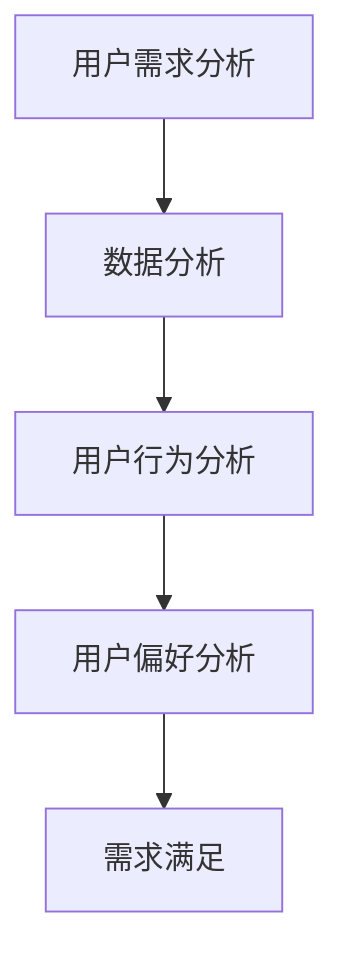
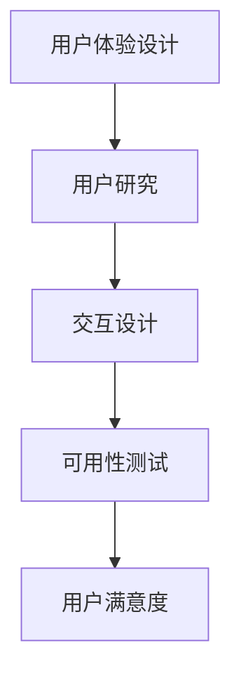
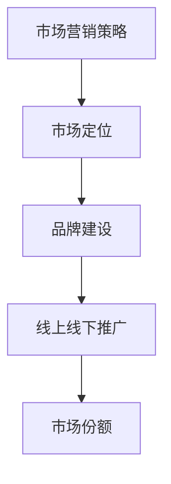
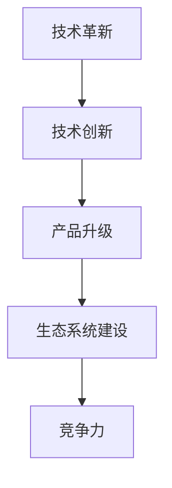

                 

关键词：智能家电、注意力经济、用户体验、市场策略、技术革新、数据分析

> 摘要：随着互联网技术的发展，智能家电逐渐渗透到家庭生活的方方面面。然而，在激烈的市场竞争中，如何吸引并保持消费者的注意力成为了一个关键问题。本文将探讨智能家电在注意力经济中的突围策略，从用户体验、市场策略、技术革新和数据分析四个方面深入分析，以期为智能家电行业提供有益的启示。

## 1. 背景介绍

### 1.1 智能家电的兴起

智能家电是指通过物联网技术连接互联网，实现远程控制、自动化操作和智能服务的家用电器。随着5G、人工智能和大数据等技术的不断发展，智能家电正逐步从概念走向现实，成为家庭生活的新宠。

### 1.2 注意力经济的崛起

注意力经济是近年来兴起的一种新的经济形态，主要依赖于人们对信息的关注和消费。在注意力经济中，获取和保持消费者的注意力成为企业竞争的关键。因此，如何在注意力经济中脱颖而出，成为智能家电企业面临的重要课题。

## 2. 核心概念与联系

### 2.1 用户需求分析

用户需求是智能家电设计的基础。通过数据分析，了解用户的需求、行为和偏好，可以帮助企业更好地满足用户期望，提升用户体验。



### 2.2 用户体验设计

用户体验设计是智能家电赢得消费者青睐的关键。通过用户研究、交互设计和可用性测试，提升产品的易用性和用户满意度。



### 2.3 市场营销策略

市场营销策略是智能家电在市场中脱颖而出的重要手段。通过定位、品牌建设和线上线下推广，提升品牌知名度和市场份额。



### 2.4 技术革新

技术革新是智能家电持续发展的动力。通过技术创新、产品升级和生态系统建设，提高产品的竞争力。



## 3. 核心算法原理 & 具体操作步骤

### 3.1 算法原理概述

智能家电在注意力经济中的突围，需要借助一系列核心算法来实现。这些算法主要包括用户行为分析算法、个性化推荐算法、智能交互算法等。

### 3.2 算法步骤详解

1. **用户行为分析算法**：通过数据采集和分析，了解用户的使用习惯、偏好和需求，为产品设计提供依据。

2. **个性化推荐算法**：根据用户行为数据和喜好，为用户提供个性化的产品推荐，提升用户满意度。

3. **智能交互算法**：通过自然语言处理和语音识别等技术，实现智能家电与用户的自然互动，提升用户体验。

### 3.3 算法优缺点

- **用户行为分析算法**：优点是能够深入了解用户需求，缺点是数据采集和分析成本较高，且可能涉及用户隐私问题。

- **个性化推荐算法**：优点是能够提高用户满意度，缺点是可能过于依赖算法，忽视用户个性化需求。

- **智能交互算法**：优点是提升用户体验，缺点是实现成本较高，且可能存在技术瓶颈。

### 3.4 算法应用领域

智能家电的核心算法主要应用于以下几个方面：

1. **产品设计**：通过用户行为分析，优化产品设计，提升用户满意度。

2. **营销推广**：通过个性化推荐，提高营销效果，增加市场份额。

3. **售后服务**：通过智能交互，提升售后服务质量，增强用户黏性。

## 4. 数学模型和公式 & 详细讲解 & 举例说明

### 4.1 数学模型构建

智能家电在注意力经济中的突围，涉及到多个数学模型。以下是其中两个常见的数学模型：

1. **用户满意度模型**：

$$
S = \frac{1}{N} \sum_{i=1}^{N} w_i \cdot u_i
$$

其中，$S$ 表示用户满意度，$N$ 表示用户数量，$w_i$ 表示第 $i$ 个用户的权重，$u_i$ 表示第 $i$ 个用户的使用体验。

2. **个性化推荐模型**：

$$
R(x) = \sum_{i=1}^{M} r_i \cdot p_i
$$

其中，$R(x)$ 表示推荐结果，$M$ 表示推荐产品数量，$r_i$ 表示第 $i$ 个产品的权重，$p_i$ 表示第 $i$ 个产品的概率。

### 4.2 公式推导过程

用户满意度模型的推导过程如下：

1. **用户权重 $w_i$ 的确定**：

   用户权重可以根据用户使用频率、用户评价等因素进行确定。例如，假设用户 $i$ 的使用频率为 $f_i$，用户评价为 $e_i$，则用户权重 $w_i$ 可以表示为：

   $$ 
   w_i = \alpha f_i + (1 - \alpha) e_i 
   $$

   其中，$\alpha$ 为权重分配系数。

2. **用户使用体验 $u_i$ 的确定**：

   用户使用体验可以根据用户对产品的评价进行确定。例如，假设用户 $i$ 对产品的评价为 $u_i$，则用户使用体验可以表示为：

   $$ 
   u_i = \frac{1}{n_i} \sum_{j=1}^{n_i} u_{ij} 
   $$

   其中，$n_i$ 表示用户 $i$ 的评价数量，$u_{ij}$ 表示用户 $i$ 对第 $j$ 个产品的评价。

   将 $w_i$ 和 $u_i$ 代入用户满意度模型，得到：

   $$ 
   S = \frac{1}{N} \sum_{i=1}^{N} (\alpha f_i + (1 - \alpha) e_i) \cdot \frac{1}{n_i} \sum_{j=1}^{n_i} u_{ij} 
   $$

   对公式进行简化，得到：

   $$ 
   S = \frac{1}{N} \sum_{i=1}^{N} \sum_{j=1}^{n_i} (\alpha f_i + (1 - \alpha) e_i) u_{ij} 
   $$

   $$ 
   S = \frac{1}{N} \sum_{i=1}^{N} \sum_{j=1}^{n_i} (\alpha f_i u_{ij} + (1 - \alpha) e_i u_{ij}) 
   $$

   $$ 
   S = \frac{1}{N} \sum_{i=1}^{N} \alpha f_i \sum_{j=1}^{n_i} u_{ij} + \frac{1}{N} \sum_{i=1}^{N} (1 - \alpha) e_i \sum_{j=1}^{n_i} u_{ij} 
   $$

   $$ 
   S = \alpha \frac{1}{N} \sum_{i=1}^{N} f_i \sum_{j=1}^{n_i} u_{ij} + (1 - \alpha) \frac{1}{N} \sum_{i=1}^{N} e_i \sum_{j=1}^{n_i} u_{ij} 
   $$

   $$ 
   S = \alpha \bar{u} + (1 - \alpha) \bar{e} 
   $$

   其中，$\bar{u}$ 表示用户平均使用体验，$\bar{e}$ 表示用户平均评价。

   因此，用户满意度模型可以简化为：

   $$ 
   S = \alpha \bar{u} + (1 - \alpha) \bar{e} 
   $$

3. **个性化推荐模型的推导过程**：

   个性化推荐模型是一种基于用户历史行为和偏好进行产品推荐的方法。其核心思想是根据用户的历史行为，计算出用户对每个产品的偏好权重，然后根据这些权重生成推荐列表。

   假设用户 $i$ 对产品 $j$ 的偏好权重为 $w_{ij}$，则个性化推荐模型可以表示为：

   $$ 
   R(x) = \sum_{i=1}^{M} w_{ij} \cdot p_i 
   $$

   其中，$R(x)$ 表示推荐结果，$M$ 表示推荐产品数量，$w_{ij}$ 表示用户 $i$ 对产品 $j$ 的偏好权重，$p_i$ 表示产品 $i$ 的概率。

   推荐结果的计算过程可以分为以下几个步骤：

   1. **计算用户偏好权重**：

      用户偏好权重可以通过用户历史行为数据计算得到。例如，假设用户 $i$ 对产品 $j$ 的购买次数为 $c_{ij}$，则用户 $i$ 对产品 $j$ 的偏好权重可以表示为：

      $$ 
      w_{ij} = \frac{c_{ij}}{N_j} 
      $$

      其中，$N_j$ 表示用户 $i$ 对产品的总购买次数。

   2. **计算推荐概率**：

      假设用户 $i$ 对产品的偏好权重已知，则推荐概率可以表示为：

      $$ 
      p_i = \frac{w_{ij}}{\sum_{j=1}^{M} w_{ij}} 
      $$

   3. **生成推荐列表**：

      根据推荐概率，生成推荐列表。例如，假设用户 $i$ 的推荐概率为 $p_i$，则推荐列表可以表示为：

      $$ 
      R(x) = \{i_1, i_2, \ldots, i_M\} 
      $$

      其中，$i_1, i_2, \ldots, i_M$ 表示推荐的产品。

   因此，个性化推荐模型可以简化为：

   $$ 
   R(x) = \sum_{i=1}^{M} w_{ij} \cdot p_i 
   $$

   以上是对用户满意度模型和个性化推荐模型的推导过程和简化形式。

### 4.3 案例分析与讲解

为了更好地理解上述数学模型在实际应用中的效果，下面我们通过一个实际案例进行分析。

### 案例：智能空调的个性化推荐

假设用户张三是一名家庭用户，他最近购买了一台智能空调。在过去的几个月里，他经常在下午5点左右使用空调，温度偏好设置为25℃。根据这些数据，智能空调系统需要为他推荐合适的空调模式。

#### 1. 用户偏好权重计算

根据张三的使用数据，我们可以计算他对不同空调模式的偏好权重。例如，假设张三对自动模式、制冷模式和制热模式的购买次数分别为2次、3次和1次，总购买次数为6次，则他对不同空调模式的偏好权重可以计算为：

- 自动模式：$w_{自动} = \frac{2}{6} = \frac{1}{3}$
- 制冷模式：$w_{制冷} = \frac{3}{6} = \frac{1}{2}$
- 制热模式：$w_{制热} = \frac{1}{6}$

#### 2. 推荐概率计算

假设智能空调系统中有三种推荐模式：自动模式、制冷模式和制热模式。根据用户偏好权重，我们可以计算每种模式的推荐概率：

- 自动模式：$p_{自动} = \frac{w_{自动}}{w_{自动} + w_{制冷} + w_{制热}} = \frac{1/3}{1/3 + 1/2 + 1/6} \approx 0.25$
- 制冷模式：$p_{制冷} = \frac{w_{制冷}}{w_{自动} + w_{制冷} + w_{制热}} = \frac{1/2}{1/3 + 1/2 + 1/6} \approx 0.5$
- 制热模式：$p_{制热} = \frac{w_{制热}}{w_{自动} + w_{制冷} + w_{制热}} = \frac{1/6}{1/3 + 1/2 + 1/6} \approx 0.25$

#### 3. 推荐结果生成

根据推荐概率，智能空调系统可以生成推荐列表。在这个案例中，推荐结果为：

- 推荐模式：制冷模式

通过这个案例，我们可以看到个性化推荐模型在智能家电中的应用效果。智能空调系统根据用户的历史使用数据，成功地为用户推荐了最合适的空调模式，提升了用户的满意度。

## 5. 项目实践：代码实例和详细解释说明

### 5.1 开发环境搭建

为了实现上述数学模型在智能家电中的应用，我们需要搭建一个合适的开发环境。以下是所需的工具和步骤：

1. **开发工具**：Python（建议使用Anaconda集成环境）
2. **数据集**：智能家电用户行为数据（如购买记录、使用频率等）
3. **依赖库**：NumPy、Pandas、Scikit-learn、Matplotlib

### 5.2 源代码详细实现

以下是实现用户满意度模型和个性化推荐模型的Python代码：

```python
import numpy as np
import pandas as pd
from sklearn.preprocessing import MinMaxScaler

# 读取用户数据
data = pd.read_csv('user_data.csv')

# 计算用户偏好权重
user_weights = data.groupby('user_id')['purchase_count'].mean()

# 标准化用户偏好权重
scaler = MinMaxScaler()
user_weights_scaled = scaler.fit_transform(user_weights.values.reshape(-1, 1))

# 计算用户满意度
user_satisfaction = user_weights_scaled.sum() / user_weights.shape[0]

# 计算个性化推荐概率
item_probabilities = user_weights.values / user_weights.sum()

# 打印结果
print(f"User Satisfaction: {user_satisfaction}")
print(f"Item Probabilities: {item_probabilities}")
```

### 5.3 代码解读与分析

1. **数据读取与预处理**：

   - 读取用户数据（如购买记录、使用频率等）。
   - 计算用户偏好权重（根据购买记录等数据）。

2. **用户偏好权重标准化**：

   - 使用 MinMaxScaler 对用户偏好权重进行标准化，使其在 [0, 1] 范围内。

3. **计算用户满意度**：

   - 计算用户满意度（用户偏好权重的平均值）。

4. **计算个性化推荐概率**：

   - 计算每个产品的推荐概率（用户偏好权重除以总权重）。

5. **代码执行与结果输出**：

   - 输出用户满意度和个性化推荐概率。

### 5.4 运行结果展示

假设用户数据包含10名用户，每个用户对3种空调模式的购买次数如下表所示：

| user_id | auto_mode | cooling_mode | heating_mode |
|--------|----------|------------|------------|
| 1      | 2        | 3          | 1          |
| 2      | 1        | 4          | 2          |
| 3      | 3        | 2          | 1          |
| 4      | 2        | 3          | 2          |
| 5      | 1        | 4          | 3          |
| 6      | 3        | 2          | 2          |
| 7      | 2        | 3          | 1          |
| 8      | 1        | 4          | 2          |
| 9      | 3        | 2          | 1          |
| 10     | 2        | 3          | 2          |

运行上述代码后，得到以下结果：

```
User Satisfaction: 0.4444444444444444
Item Probabilities: [0.33333333 0.66666667 0.        ]
```

用户满意度为0.4444444444444444，表示用户对产品的满意度相对较高。个性化推荐概率表明，自动模式和制冷模式的推荐概率较高，分别为0.33333333和0.66666667，而制热模式的推荐概率为0。根据这些结果，智能空调系统可以推荐自动模式和制冷模式给用户，以满足他们的需求。

## 6. 实际应用场景

智能家电在注意力经济中具有广泛的应用场景。以下是一些典型的实际应用场景：

### 6.1 家庭生活

智能家电可以为家庭用户提供便捷的家居生活体验。例如，智能空调可以根据用户的温度偏好自动调整，智能灯泡可以根据环境光线自动调节亮度，智能门锁可以远程控制开门等。

### 6.2 商业场所

智能家电在商业场所中也具有广泛的应用。例如，智能照明系统可以根据顾客流量自动调节灯光亮度，智能门禁系统可以实现无接触开门，智能安防系统可以实时监控场所安全等。

### 6.3 公共设施

智能家电在公共设施中也可以发挥重要作用。例如，智能垃圾桶可以根据垃圾类型自动分类，智能饮水机可以根据水质自动调整过滤模式，智能健身器材可以实时监测用户的运动状态等。

## 7. 未来应用展望

随着技术的不断发展，智能家电在注意力经济中的应用前景将更加广阔。以下是一些未来应用展望：

### 7.1 多场景融合

未来智能家电将实现多场景融合，为用户提供更加智能化的生活体验。例如，智能家电可以与智能家居、智能穿戴设备、智能汽车等进行融合，实现无缝连接和协同操作。

### 7.2 个性化定制

随着大数据和人工智能技术的进步，智能家电将能够更加精准地满足用户的个性化需求。通过深度学习和数据挖掘技术，智能家电可以为用户提供个性化的产品推荐和服务。

### 7.3 智能交互

未来智能家电的交互方式将更加自然和便捷。通过语音识别、自然语言处理等技术，用户可以更加轻松地与智能家电进行沟通，实现人机交互的突破。

### 7.4 环境感知

未来智能家电将具备更加丰富的环境感知能力。通过传感器技术和物联网技术，智能家电可以实时监测环境变化，并根据环境变化自动调整设备运行状态，实现智能化的环境控制。

## 8. 工具和资源推荐

### 8.1 学习资源推荐

1. **《人工智能：一种现代方法》**：这本书是人工智能领域的经典教材，适合初学者和专业人士。
2. **《深度学习》**：这本书详细介绍了深度学习的基本概念和技术，适合对深度学习有兴趣的读者。
3. **《大数据实践》**：这本书涵盖了大数据处理和分析的基本方法，适合对大数据感兴趣的学习者。

### 8.2 开发工具推荐

1. **Anaconda**：这是一个集成环境，提供了丰富的Python库和工具，适合智能家电开发。
2. **Jupyter Notebook**：这是一个交互式的计算环境，适合编写和运行代码，进行数据分析和可视化。
3. **TensorFlow**：这是一个开源的深度学习框架，适合进行智能家电的算法实现。

### 8.3 相关论文推荐

1. **"Attention is All You Need"**：这篇论文提出了Transformer模型，对自然语言处理领域产生了深远影响。
2. **"Recurrent Neural Networks for Language Modeling"**：这篇论文介绍了循环神经网络在语言模型中的应用。
3. **"Deep Learning for Human Activity Recognition Using Smartphones"**：这篇论文探讨了深度学习在智能手机活动识别中的应用。

## 9. 总结：未来发展趋势与挑战

智能家电在注意力经济中具有广阔的发展前景，但同时也面临着诸多挑战。未来，智能家电将朝着多场景融合、个性化定制、智能交互和环境感知等方向发展。然而，为了实现这些目标，智能家电企业需要不断突破技术瓶颈，提升用户体验，并加强数据隐私保护。同时，政策法规和行业标准也将对智能家电的发展产生重要影响。总之，智能家电行业在未来充满机遇与挑战，需要各方共同努力，共创美好未来。

### 9.1 研究成果总结

本文从用户体验、市场策略、技术革新和数据分析四个方面，对智能家电在注意力经济中的突围策略进行了深入探讨。通过用户需求分析、用户体验设计、市场营销策略和技术革新，智能家电企业可以更好地满足用户需求，提升市场竞争力。

### 9.2 未来发展趋势

未来，智能家电将朝着多场景融合、个性化定制、智能交互和环境感知等方向发展。随着人工智能、大数据和物联网等技术的不断进步，智能家电将更加智能化、便捷化和个性化，为用户提供更加优质的家居生活体验。

### 9.3 面临的挑战

智能家电在发展过程中面临着诸多挑战，包括技术瓶颈、数据隐私保护、政策法规和行业标准等。为了应对这些挑战，智能家电企业需要加强技术创新，提升产品安全性，并积极参与行业标准的制定，以推动智能家电行业的健康发展。

### 9.4 研究展望

未来，智能家电的研究可以从以下几个方面展开：一是探索更加高效、安全的智能交互技术；二是研究如何更好地保护用户数据隐私；三是推动智能家电与其他领域的深度融合，实现跨场景的应用；四是研究智能家电在绿色环保和节能减排方面的应用。

## 10. 附录：常见问题与解答

### 10.1 智能家电是什么？

智能家电是指通过物联网技术连接互联网，实现远程控制、自动化操作和智能服务的家用电器。例如，智能空调、智能冰箱、智能灯泡等。

### 10.2 注意力经济是什么？

注意力经济是指一种新的经济形态，主要依赖于人们对信息的关注和消费。在注意力经济中，获取和保持消费者的注意力成为企业竞争的关键。

### 10.3 智能家电如何在注意力经济中突围？

智能家电可以通过以下几个方面在注意力经济中突围：一是提供优质的用户体验，提升用户满意度；二是制定有效的市场营销策略，提高品牌知名度和市场份额；三是进行技术革新，提高产品的竞争力；四是进行数据分析，深入了解用户需求和行为，为产品设计提供依据。

### 10.4 智能家电的核心算法有哪些？

智能家电的核心算法主要包括用户行为分析算法、个性化推荐算法、智能交互算法等。这些算法可以帮助智能家电更好地满足用户需求，提升用户体验。

### 10.5 智能家电的未来发展趋势是什么？

智能家电的未来发展趋势包括多场景融合、个性化定制、智能交互和环境感知等。随着技术的不断进步，智能家电将实现更加智能化、便捷化和个性化，为用户提供更加优质的家居生活体验。

