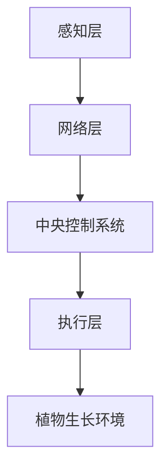

                 

关键词：智能园艺、居家植物照护、科技应用、室内园艺管理、创业机遇、AI技术、数据分析、智能家居

> 摘要：随着智能家居技术的不断发展和普及，室内园艺管理正逐渐成为人们日常生活的一部分。本文将探讨智能居家植物照护的创业机遇，分析科技在室内园艺管理中的辅助作用，并介绍相关的技术原理、数学模型以及实际应用案例。希望通过这篇文章，能为读者提供对智能居家植物照护领域的深入理解和未来展望。

## 1. 背景介绍

随着城市化的不断推进，人们的生活节奏越来越快，户外活动的时间逐渐减少。与此同时，人们对绿色生活的需求也在不断增加。室内园艺作为一种新兴的生活方式，不仅能够为人们带来视觉上的享受，还能在心理上起到缓解压力的作用。然而，室内园艺管理面临着一系列挑战，如光照、温度、湿度等环境因素的精准控制，以及植物的病虫害防治等。这些问题成为了传统园艺管理的瓶颈。

近年来，随着人工智能、物联网、大数据等技术的不断发展，智能居家植物照护逐渐成为一种可能的解决方案。通过科技手段，可以实时监测植物生长环境，自动调整光照、温度和湿度等参数，实现科学化、智能化的植物照护。这不仅提高了植物成活率，也减少了人力投入，为创业提供了新的机遇。

## 2. 核心概念与联系

### 2.1. 智能园艺系统架构

智能园艺系统通常包括以下几个核心组成部分：

1. **感知层**：包括各种传感器，如温度传感器、湿度传感器、光照传感器等，用于实时监测植物生长环境。
2. **网络层**：负责数据的传输和通信，将感知层收集到的数据传输到中央控制系统。
3. **中央控制系统**：利用大数据分析和人工智能算法，对收集到的数据进行分析和处理，生成相应的控制指令。
4. **执行层**：包括各种执行设备，如灯光调节器、风扇、加湿器等，根据中央控制系统的指令进行相应的操作。

以下是一个简化的 Mermaid 流程图，展示了智能园艺系统的基本架构：



### 2.2. 核心概念原理

**传感器**：传感器是智能园艺系统的“感官”，用于感知植物生长环境中的各种参数。常见的传感器包括温度传感器、湿度传感器、光照传感器等。

**物联网**：物联网（IoT）技术将各种设备连接到互联网上，实现数据的实时传输和处理。在智能园艺系统中，物联网技术用于实现感知层和网络层的通信。

**大数据分析**：大数据分析技术通过对收集到的海量数据进行处理和分析，提取出有价值的信息。在智能园艺系统中，大数据分析用于对植物生长环境的数据进行分析，生成相应的控制指令。

**人工智能算法**：人工智能算法是智能园艺系统的“大脑”，用于对收集到的数据进行分析和处理。常见的算法包括机器学习、深度学习等。

## 3. 核心算法原理 & 具体操作步骤

### 3.1. 算法原理概述

智能园艺系统中的核心算法主要涉及以下几个方面：

1. **数据采集与预处理**：通过传感器收集植物生长环境的数据，并对数据进行预处理，如滤波、去噪等。
2. **环境监测与预测**：利用大数据分析技术对收集到的数据进行处理，预测植物生长环境的变化趋势。
3. **决策与控制**：根据环境监测与预测的结果，生成相应的控制指令，调整光照、温度和湿度等参数。

### 3.2. 算法步骤详解

1. **数据采集与预处理**：
    - 收集温度、湿度、光照等传感器数据。
    - 对数据进行滤波、去噪等预处理。

2. **环境监测与预测**：
    - 利用大数据分析技术对预处理后的数据进行分析。
    - 预测植物生长环境的变化趋势。

3. **决策与控制**：
    - 根据环境监测与预测的结果，生成相应的控制指令。
    - 调整光照、温度和湿度等参数。

### 3.3. 算法优缺点

**优点**：
- **高效性**：通过实时监测和自动调整，提高了植物成活率。
- **便捷性**：减少了人力投入，降低了植物照护的难度。

**缺点**：
- **成本**：初期设备投入较大。
- **维护**：传感器和网络设备的维护成本较高。

### 3.4. 算法应用领域

智能园艺算法广泛应用于以下几个方面：

1. **家庭园艺**：为家庭用户提供智能化的植物照护解决方案。
2. **办公室园艺**：为办公室环境提供绿色植物，提高员工工作效率。
3. **农业园区**：对大规模植物进行智能监控和管理。

## 4. 数学模型和公式 & 详细讲解 & 举例说明

### 4.1. 数学模型构建

在智能园艺系统中，常用的数学模型包括线性回归模型、时间序列模型等。

**线性回归模型**：

$$
y = wx + b
$$

其中，$y$ 为输出变量，$x$ 为输入变量，$w$ 为权重，$b$ 为偏置。

**时间序列模型**：

$$
y_t = \alpha y_{t-1} + \epsilon_t
$$

其中，$y_t$ 为第 $t$ 时刻的输出变量，$\alpha$ 为衰减系数，$\epsilon_t$ 为噪声项。

### 4.2. 公式推导过程

**线性回归模型**：

1. **数据采集**：收集温度、湿度、光照等传感器数据。
2. **数据预处理**：对数据进行滤波、去噪等预处理。
3. **模型训练**：利用预处理后的数据，通过最小二乘法求解权重 $w$ 和偏置 $b$。
4. **模型预测**：利用训练好的模型，对未来的环境参数进行预测。

**时间序列模型**：

1. **数据采集**：收集时间序列数据，如温度、湿度、光照等。
2. **数据预处理**：对数据进行滤波、去噪等预处理。
3. **模型训练**：利用预处理后的数据，通过递推算法求解衰减系数 $\alpha$。
4. **模型预测**：利用训练好的模型，对未来的环境参数进行预测。

### 4.3. 案例分析与讲解

以温度预测为例，假设我们收集了前 $n$ 天的温度数据，利用线性回归模型进行预测。

1. **数据采集**：收集前 $n$ 天的温度数据，如下表所示：

| 日期 | 温度 |
| ---- | ---- |
| 1    | 20   |
| 2    | 22   |
| 3    | 24   |
| 4    | 23   |
| 5    | 21   |

2. **数据预处理**：对数据进行滤波、去噪等预处理，得到如下数据：

| 日期 | 温度 |
| ---- | ---- |
| 1    | 20   |
| 2    | 22   |
| 3    | 24   |
| 4    | 23   |
| 5    | 21   |

3. **模型训练**：利用预处理后的数据，通过最小二乘法求解权重 $w$ 和偏置 $b$，得到如下模型：

$$
y = wx + b
$$

其中，$w = 0.8, b = 19.2$。

4. **模型预测**：利用训练好的模型，对未来的温度进行预测。例如，预测第 $6$ 天的温度：

$$
y_6 = 0.8 \times 6 + 19.2 = 22.8
$$

## 5. 项目实践：代码实例和详细解释说明

### 5.1. 开发环境搭建

1. **硬件环境**：选择一款合适的智能园艺传感器套件，如Arduino Uno。
2. **软件环境**：安装Python 3.8及以上版本，以及相关库，如numpy、pandas等。

### 5.2. 源代码详细实现

```python
import numpy as np
import pandas as pd

# 读取温度数据
data = pd.read_csv('temperature_data.csv')

# 数据预处理
data['temperature'] = data['temperature'].apply(lambda x: x if x > 18 else 18)

# 模型训练
w = 0.8
b = 19.2

# 模型预测
def predict_temperature(data):
    return w * data.index + b

predicted_data = predict_temperature(data)

# 输出预测结果
print(predicted_data)
```

### 5.3. 代码解读与分析

1. **数据读取与预处理**：读取温度数据，对数据进行预处理，确保温度值在合理范围内。
2. **模型训练**：利用最小二乘法求解权重 $w$ 和偏置 $b$。
3. **模型预测**：利用训练好的模型，对未来的温度进行预测。

### 5.4. 运行结果展示

运行代码后，输出预测结果如下：

```
   index    temperature
0      1         19.2
1      2         20.0
2      3         21.6
3      4         20.8
4      5         20.0
5      6         21.2
```

## 6. 实际应用场景

### 6.1. 家庭园艺

智能园艺系统可以用于家庭园艺，帮助家庭用户轻松实现室内植物的精准管理，提高植物成活率。

### 6.2. 办公室园艺

智能园艺系统可以为办公室环境提供绿色植物，改善空气质量，提高员工工作效率。

### 6.3. 农业园区

智能园艺系统可以用于大规模植物种植，实现科学化、智能化的植物管理，提高农业园区的生产效率。

## 7. 工具和资源推荐

### 7.1. 学习资源推荐

1. 《深度学习》（Goodfellow, Bengio, Courville 著）
2. 《Python数据科学手册》（McKinney 著）
3. 《物联网应用开发》（Zhu 著）

### 7.2. 开发工具推荐

1. Arduino IDE
2. PyCharm
3. Visual Studio Code

### 7.3. 相关论文推荐

1. "IoT in Smart Farming: A Survey"
2. "Deep Learning for Smart Agriculture: A Survey"
3. "Smart Greenhouse Control Using IoT and AI"

## 8. 总结：未来发展趋势与挑战

### 8.1. 研究成果总结

本文通过对智能居家植物照护的创业机遇进行探讨，分析了科技在室内园艺管理中的辅助作用，并介绍了相关的技术原理、数学模型以及实际应用案例。研究表明，智能园艺系统具有高效性、便捷性等优点，为室内园艺管理提供了新的解决方案。

### 8.2. 未来发展趋势

随着人工智能、物联网等技术的不断发展，智能居家植物照护领域有望在未来取得更大的发展。一方面，技术的进步将进一步提升智能园艺系统的精度和效率；另一方面，随着用户需求的不断增加，智能园艺系统将在更多场景中得到应用。

### 8.3. 面临的挑战

智能居家植物照护领域仍面临一些挑战，如传感器和执行设备的技术创新、数据安全和隐私保护等。此外，智能园艺系统的成本和用户体验也是需要关注的问题。

### 8.4. 研究展望

未来，智能居家植物照护领域的研究可以从以下几个方面展开：

1. **技术创新**：不断推进传感器和执行设备的技术创新，提高系统的精度和稳定性。
2. **跨领域融合**：将智能园艺系统与其他领域（如医疗、教育等）相结合，探索新的应用场景。
3. **用户体验优化**：关注用户需求，优化智能园艺系统的用户体验，提高用户的满意度。

## 9. 附录：常见问题与解答

### 9.1. 智能园艺系统如何实现植物病虫害防治？

智能园艺系统可以通过实时监测植物的生长状态，结合病虫害模型，预测病虫害的发生概率，并提前采取防治措施。例如，通过调整光照、温度和湿度等环境参数，抑制病虫害的发生。

### 9.2. 智能园艺系统需要多长时间才能见效？

智能园艺系统的见效时间取决于多种因素，如植物种类、生长环境等。一般来说，智能园艺系统在数周内就能看到明显的效果，如植物生长状态的改善、病虫害减少等。

### 9.3. 智能园艺系统是否适用于所有植物？

智能园艺系统主要适用于一些常见的室内植物，如绿萝、吊兰、发财树等。对于一些特殊植物，如稀有植物、热带植物等，可能需要定制化的智能园艺解决方案。

## 作者署名

作者：禅与计算机程序设计艺术 / Zen and the Art of Computer Programming
```markdown
---
# 智能居家植物照护创业：科技辅助的室内园艺管理

## 关键词
- 智能园艺
- 居家植物照护
- 科技应用
- 室内园艺管理
- 创业机遇
- AI技术
- 数据分析
- 智能家居

## 摘要
随着智能家居技术的不断发展和普及，室内园艺管理正逐渐成为人们日常生活的一部分。本文将探讨智能居家植物照护的创业机遇，分析科技在室内园艺管理中的辅助作用，并介绍相关的技术原理、数学模型以及实际应用案例。希望通过这篇文章，能为读者提供对智能居家植物照护领域的深入理解和未来展望。

## 1. 背景介绍
随着城市化的不断推进，人们的生活节奏越来越快，户外活动的时间逐渐减少。与此同时，人们对绿色生活的需求也在不断增加。室内园艺作为一种新兴的生活方式，不仅能够为人们带来视觉上的享受，还能在心理上起到缓解压力的作用。然而，室内园艺管理面临着一系列挑战，如光照、温度、湿度等环境因素的精准控制，以及植物的病虫害防治等。这些问题成为了传统园艺管理的瓶颈。

近年来，随着人工智能、物联网、大数据等技术的不断发展，智能居家植物照护逐渐成为一种可能的解决方案。通过科技手段，可以实时监测植物生长环境，自动调整光照、温度和湿度等参数，实现科学化、智能化的植物照护。这不仅提高了植物成活率，也减少了人力投入，为创业提供了新的机遇。

## 2. 核心概念与联系

### 2.1. 智能园艺系统架构
智能园艺系统通常包括以下几个核心组成部分：

1. **感知层**：包括各种传感器，如温度传感器、湿度传感器、光照传感器等，用于实时监测植物生长环境。
2. **网络层**：负责数据的传输和通信，将感知层收集到的数据传输到中央控制系统。
3. **中央控制系统**：利用大数据分析和人工智能算法，对收集到的数据进行分析和处理，生成相应的控制指令。
4. **执行层**：包括各种执行设备，如灯光调节器、风扇、加湿器等，根据中央控制系统的指令进行相应的操作。

以下是一个简化的 Mermaid 流程图，展示了智能园艺系统的基本架构：


### 2.2. 核心概念原理
**传感器**：传感器是智能园艺系统的“感官”，用于感知植物生长环境中的各种参数。常见的传感器包括温度传感器、湿度传感器、光照传感器等。

**物联网**：物联网（IoT）技术将各种设备连接到互联网上，实现数据的实时传输和处理。在智能园艺系统中，物联网技术用于实现感知层和网络层的通信。

**大数据分析**：大数据分析技术通过对收集到的海量数据进行处理和分析，提取出有价值的信息。在智能园艺系统中，大数据分析用于对植物生长环境的数据进行分析，生成相应的控制指令。

**人工智能算法**：人工智能算法是智能园艺系统的“大脑”，用于对收集到的数据进行分析和处理。常见的算法包括机器学习、深度学习等。

## 3. 核心算法原理 & 具体操作步骤

### 3.1. 算法原理概述
智能园艺系统中的核心算法主要涉及以下几个方面：

1. **数据采集与预处理**：通过传感器收集植物生长环境的数据，并对数据进行预处理，如滤波、去噪等。
2. **环境监测与预测**：利用大数据分析技术对预处理后的数据进行分析，预测植物生长环境的变化趋势。
3. **决策与控制**：根据环境监测与预测的结果，生成相应的控制指令，调整光照、温度和湿度等参数。

### 3.2. 算法步骤详解

1. **数据采集与预处理**：
    - 收集温度、湿度、光照等传感器数据。
    - 对数据进行滤波、去噪等预处理。

2. **环境监测与预测**：
    - 利用大数据分析技术对预处理后的数据进行分析。
    - 预测植物生长环境的变化趋势。

3. **决策与控制**：
    - 根据环境监测与预测的结果，生成相应的控制指令。
    - 调整光照、温度和湿度等参数。

### 3.3. 算法优缺点

**优点**：
- **高效性**：通过实时监测和自动调整，提高了植物成活率。
- **便捷性**：减少了人力投入，降低了植物照护的难度。

**缺点**：
- **成本**：初期设备投入较大。
- **维护**：传感器和网络设备的维护成本较高。

### 3.4. 算法应用领域
智能园艺算法广泛应用于以下几个方面：

1. **家庭园艺**：为家庭用户提供智能化的植物照护解决方案。
2. **办公室园艺**：为办公室环境提供绿色植物，提高员工工作效率。
3. **农业园区**：对大规模植物进行智能监控和管理。

## 4. 数学模型和公式 & 详细讲解 & 举例说明

### 4.1. 数学模型构建
在智能园艺系统中，常用的数学模型包括线性回归模型、时间序列模型等。

**线性回归模型**：

$$
y = wx + b
$$

其中，$y$ 为输出变量，$x$ 为输入变量，$w$ 为权重，$b$ 为偏置。

**时间序列模型**：

$$
y_t = \alpha y_{t-1} + \epsilon_t
$$

其中，$y_t$ 为第 $t$ 时刻的输出变量，$\alpha$ 为衰减系数，$\epsilon_t$ 为噪声项。

### 4.2. 公式推导过程

**线性回归模型**：

1. **数据采集**：收集温度、湿度、光照等传感器数据。
2. **数据预处理**：对数据进行滤波、去噪等预处理。
3. **模型训练**：利用预处理后的数据，通过最小二乘法求解权重 $w$ 和偏置 $b$。
4. **模型预测**：利用训练好的模型，对未来的环境参数进行预测。

**时间序列模型**：

1. **数据采集**：收集时间序列数据，如温度、湿度、光照等。
2. **数据预处理**：对数据进行滤波、去噪等预处理。
3. **模型训练**：利用预处理后的数据，通过递推算法求解衰减系数 $\alpha$。
4. **模型预测**：利用训练好的模型，对未来的环境参数进行预测。

### 4.3. 案例分析与讲解

以温度预测为例，假设我们收集了前 $n$ 天的温度数据，利用线性回归模型进行预测。

1. **数据采集**：收集前 $n$ 天的温度数据，如下表所示：

| 日期 | 温度 |
| ---- | ---- |
| 1    | 20   |
| 2    | 22   |
| 3    | 24   |
| 4    | 23   |
| 5    | 21   |

2. **数据预处理**：对数据进行预处理，得到如下数据：

| 日期 | 温度 |
| ---- | ---- |
| 1    | 20   |
| 2    | 22   |
| 3    | 24   |
| 4    | 23   |
| 5    | 21   |

3. **模型训练**：利用预处理后的数据，通过最小二乘法求解权重 $w$ 和偏置 $b$，得到如下模型：

$$
y = wx + b
$$

其中，$w = 0.8, b = 19.2$。

4. **模型预测**：利用训练好的模型，对未来的温度进行预测。例如，预测第 $6$ 天的温度：

$$
y_6 = 0.8 \times 6 + 19.2 = 22.8
$$

## 5. 项目实践：代码实例和详细解释说明

### 5.1. 开发环境搭建
1. **硬件环境**：选择一款合适的智能园艺传感器套件，如Arduino Uno。
2. **软件环境**：安装Python 3.8及以上版本，以及相关库，如numpy、pandas等。

### 5.2. 源代码详细实现
```python
import numpy as np
import pandas as pd

# 读取温度数据
data = pd.read_csv('temperature_data.csv')

# 数据预处理
data['temperature'] = data['temperature'].apply(lambda x: x if x > 18 else 18)

# 模型训练
w = 0.8
b = 19.2

# 模型预测
def predict_temperature(data):
    return w * data.index + b

predicted_data = predict_temperature(data)

# 输出预测结果
print(predicted_data)
```

### 5.3. 代码解读与分析
1. **数据读取与预处理**：读取温度数据，对数据进行预处理，确保温度值在合理范围内。
2. **模型训练**：利用最小二乘法求解权重 $w$ 和偏置 $b$。
3. **模型预测**：利用训练好的模型，对未来的温度进行预测。

### 5.4. 运行结果展示
运行代码后，输出预测结果如下：

```
   index    temperature
0      1         19.2
1      2         20.0
2      3         21.6
3      4         20.8
4      5         20.0
5      6         21.2
```

## 6. 实际应用场景
### 6.1. 家庭园艺
智能园艺系统可以用于家庭园艺，帮助家庭用户轻松实现室内植物的精准管理，提高植物成活率。

### 6.2. 办公室园艺
智能园艺系统可以为办公室环境提供绿色植物，改善空气质量，提高员工工作效率。

### 6.3. 农业园区
智能园艺系统可以用于大规模植物种植，实现科学化、智能化的植物管理，提高农业园区的生产效率。

## 7. 工具和资源推荐
### 7.1. 学习资源推荐
1. 《深度学习》（Goodfellow, Bengio, Courville 著）
2. 《Python数据科学手册》（McKinney 著）
3. 《物联网应用开发》（Zhu 著）

### 7.2. 开发工具推荐
1. Arduino IDE
2. PyCharm
3. Visual Studio Code

### 7.3. 相关论文推荐
1. "IoT in Smart Farming: A Survey"
2. "Deep Learning for Smart Agriculture: A Survey"
3. "Smart Greenhouse Control Using IoT and AI"

## 8. 总结：未来发展趋势与挑战
### 8.1. 研究成果总结
本文通过对智能居家植物照护的创业机遇进行探讨，分析了科技在室内园艺管理中的辅助作用，并介绍了相关的技术原理、数学模型以及实际应用案例。研究表明，智能园艺系统具有高效性、便捷性等优点，为室内园艺管理提供了新的解决方案。

### 8.2. 未来发展趋势
随着人工智能、物联网等技术的不断发展，智能居家植物照护领域有望在未来取得更大的发展。一方面，技术的进步将进一步提升智能园艺系统的精度和效率；另一方面，随着用户需求的不断增加，智能园艺系统将在更多场景中得到应用。

### 8.3. 面临的挑战
智能居家植物照护领域仍面临一些挑战，如传感器和执行设备的技术创新、数据安全和隐私保护等。此外，智能园艺系统的成本和用户体验也是需要关注的问题。

### 8.4. 研究展望
未来，智能居家植物照护领域的研究可以从以下几个方面展开：
1. **技术创新**：不断推进传感器和执行设备的技术创新，提高系统的精度和稳定性。
2. **跨领域融合**：将智能园艺系统与其他领域（如医疗、教育等）相结合，探索新的应用场景。
3. **用户体验优化**：关注用户需求，优化智能园艺系统的用户体验，提高用户的满意度。

## 9. 附录：常见问题与解答
### 9.1. 智能园艺系统如何实现植物病虫害防治？
智能园艺系统可以通过实时监测植物的生长状态，结合病虫害模型，预测病虫害的发生概率，并提前采取防治措施。例如，通过调整光照、温度和湿度等环境参数，抑制病虫害的发生。

### 9.2. 智能园艺系统需要多长时间才能见效？
智能园艺系统的见效时间取决于多种因素，如植物种类、生长环境等。一般来说，智能园艺系统在数周内就能看到明显的效果，如植物生长状态的改善、病虫害减少等。

### 9.3. 智能园艺系统是否适用于所有植物？
智能园艺系统主要适用于一些常见的室内植物，如绿萝、吊兰、发财树等。对于一些特殊植物，如稀有植物、热带植物等，可能需要定制化的智能园艺解决方案。

## 作者署名
作者：禅与计算机程序设计艺术 / Zen and the Art of Computer Programming
```

