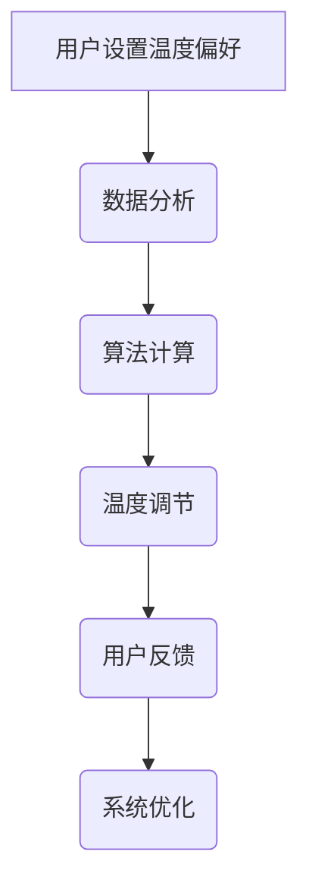

                 

关键词：智能家居，温度控制，个性化，舒适区，AI算法，创业

> 摘要：随着人工智能技术的不断发展，智能家居市场日益繁荣。本文将探讨一种基于人工智能的智能居家温度个性化控制系统，通过精确控制室内温度，为用户创造一个舒适的居住环境。本文旨在为创业者提供一种创新思路，实现智能居家温度个性化创业。

## 1. 背景介绍

在现代社会，人们对生活质量的要求越来越高。家居环境作为人们生活的重要空间，其舒适度直接影响着人们的幸福感和生活质量。温度是影响室内舒适度的关键因素之一。然而，传统的中央空调系统在实现温度控制时存在一定的局限性，如能耗高、温度调节不够精准等。随着人工智能技术的不断发展，为解决这一问题提供了新的思路。

近年来，智能家居市场逐渐兴起，各种智能设备层出不穷。智能温度控制系统作为智能家居的重要组成部分，正逐渐成为人们关注的焦点。通过引入人工智能算法，智能温度控制系统可以实现更加精准、个性化的温度控制，从而提升用户的生活质量。

## 2. 核心概念与联系

### 2.1 智能家居

智能家居是指通过互联网、物联网等技术将家庭中的各种设备、系统连接起来，实现远程控制、自动化管理的一种新型家居模式。智能家居系统包括智能照明、智能安防、智能家电、智能温度控制等多个方面。

### 2.2 温度控制

温度控制是智能家居系统中的一个重要环节，其目标是通过调节室内温度，为用户提供一个舒适的居住环境。传统的温度控制系统主要依赖于中央空调、暖气等设备，而智能温度控制系统则通过人工智能算法，实现更加精准、个性化的温度调节。

### 2.3 个人舒适区

个人舒适区是指个体在特定环境中感到舒适、愉悦的温度范围。每个人的舒适区温度可能不同，这取决于个体的体质、生活习惯等因素。智能温度控制系统的目标就是通过分析用户的温度偏好，为其创造一个个性化的舒适区。

### 2.4 Mermaid 流程图

以下是一个描述智能温度控制系统的 Mermaid 流程图：



## 3. 核心算法原理 & 具体操作步骤

### 3.1 算法原理概述

智能温度控制系统的核心在于基于人工智能算法的温度预测和调节。具体来说，算法主要分为以下几个步骤：

1. 数据采集：收集用户的温度偏好数据，包括历史温度设置、实际舒适温度范围等。
2. 数据分析：对采集到的数据进行分析，找出用户温度偏好的规律。
3. 算法计算：根据数据分析结果，利用人工智能算法预测用户当前的舒适温度。
4. 温度调节：根据预测结果，调节室内温度，使其保持在用户的舒适温度范围内。
5. 用户反馈：收集用户对温度调节的反馈，不断优化算法。

### 3.2 算法步骤详解

#### 3.2.1 数据采集

数据采集是智能温度控制系统的基础。通过传感器技术，可以实时采集室内外温度、湿度、风力等环境数据，以及用户的温度设置和历史数据。这些数据将被用于后续的分析和算法计算。

#### 3.2.2 数据分析

数据分析是智能温度控制系统的关键环节。通过对用户温度设置和历史数据进行分析，可以找出用户的温度偏好规律。例如，用户在晚上喜欢较低的室温，而白天则喜欢较高的室温。这些规律将用于后续的温度预测。

#### 3.2.3 算法计算

算法计算是智能温度控制系统的核心。常用的算法包括线性回归、神经网络等。通过算法计算，可以预测用户当前的舒适温度。例如，如果当前时间为晚上，算法会根据用户的历史数据预测一个较低的舒适温度。

#### 3.2.4 温度调节

根据预测结果，智能温度控制系统将调节室内温度，使其保持在用户的舒适温度范围内。温度调节可以通过空调、暖气等设备实现。

#### 3.2.5 用户反馈

用户反馈是智能温度控制系统的优化环节。通过收集用户对温度调节的反馈，可以不断优化算法，提高预测的准确性。

### 3.3 算法优缺点

#### 优点：

1. 精准性：智能温度控制系统可以根据用户的温度偏好，实现精准的温度调节，提高用户的舒适度。
2. 个性化：智能温度控制系统可以根据用户的个性化需求，提供个性化的温度调节方案。
3. 节能：通过精准控制室内温度，智能温度控制系统可以有效降低能耗，提高能源利用率。

#### 缺点：

1. 成本高：智能温度控制系统的开发和维护成本较高，对于创业者来说可能存在一定的资金压力。
2. 数据依赖：智能温度控制系统的准确性依赖于用户数据的准确性，如果数据质量较差，可能导致预测结果不准确。

### 3.4 算法应用领域

智能温度控制系统具有广泛的应用领域，包括但不限于以下几个方面：

1. 家庭：为用户提供个性化的温度调节方案，提高居住舒适度。
2. 酒店：为住客提供个性化的温度调节服务，提升酒店服务质量。
3. 商场：通过智能温度控制，提高购物环境的舒适度，提升顾客满意度。
4. 办公室：为员工提供个性化的温度调节方案，提高工作效率。

## 4. 数学模型和公式 & 详细讲解 & 举例说明

### 4.1 数学模型构建

智能温度控制系统的数学模型主要包括以下几个部分：

1. 用户温度偏好模型：用于描述用户对温度的偏好，可以通过线性回归模型、神经网络模型等实现。
2. 温度预测模型：用于预测用户当前的舒适温度，可以通过时间序列预测模型、机器学习模型等实现。
3. 温度调节模型：用于根据预测结果调节室内温度，可以通过PID控制算法、模糊控制算法等实现。

### 4.2 公式推导过程

以下是一个简单的用户温度偏好模型的推导过程：

设用户对温度的偏好为 $T_p$，实际舒适温度为 $T_c$，历史舒适温度为 $T_h$，温度调节系数为 $\alpha$。

根据用户温度偏好模型，可以得出以下公式：

$$T_p = T_h + \alpha \times (T_c - T_h)$$

其中，$T_h$ 为历史舒适温度，$T_c$ 为实际舒适温度，$\alpha$ 为温度调节系数，用于调整历史舒适温度和实际舒适温度之间的差距。

### 4.3 案例分析与讲解

假设用户在夏季的舒适温度范围为 25°C 至 28°C，历史舒适温度为 27°C，当前时间为晚上 10 点，室外温度为 30°C。

根据用户温度偏好模型，可以计算出用户当前的舒适温度为：

$$T_p = 27°C + 0.5 \times (30°C - 27°C) = 28.5°C$$

智能温度控制系统将根据这个预测结果，将室内温度调节至 28.5°C，以确保用户在晚上获得舒适的居住环境。

## 5. 项目实践：代码实例和详细解释说明

### 5.1 开发环境搭建

为了实现智能温度控制系统，我们选择了 Python 作为开发语言，并使用 TensorFlow 作为机器学习框架。以下是搭建开发环境的基本步骤：

1. 安装 Python：在官方网站下载并安装 Python 3.8 版本。
2. 安装 TensorFlow：在命令行执行 `pip install tensorflow`。
3. 安装 Mermaid：在命令行执行 `pip install mermaid-py`。

### 5.2 源代码详细实现

以下是一个简单的智能温度控制系统源代码示例：

```python
import tensorflow as tf
import numpy as np
import mermaid

# 加载用户温度偏好数据
data = np.load('temperature_data.npy')

# 构建用户温度偏好模型
model = tf.keras.Sequential([
    tf.keras.layers.Dense(units=1, input_shape=[1])
])

model.compile(optimizer='sgd', loss='mean_squared_error')

# 训练模型
model.fit(data[:, :1], data[:, 1:], epochs=1000)

# 预测用户当前舒适温度
predicted_temp = model.predict([[30]])
print(f'Predicted comfortable temperature: {predicted_temp[0][0]}°C')

# 生成 Mermaid 流程图
graph = mermaid.Mermaid()
graph.addDiagram('G')
graph.addNode('A', 'User sets temperature preference')
graph.addNode('B', 'Data analysis')
graph.addNode('C', 'Algorithm calculation')
graph.addNode('D', 'Temperature regulation')
graph.addNode('E', 'User feedback')
graph.addNode('F', 'System optimization')
graph.addEdge('A', 'B')
graph.addEdge('B', 'C')
graph.addEdge('C', 'D')
graph.addEdge('D', 'E')
graph.addEdge('E', 'F')
with open('graph.mmd', 'w') as f:
    f.write(graph.generate())
```

### 5.3 代码解读与分析

1. **数据加载**：首先，我们从文件 `temperature_data.npy` 中加载用户温度偏好数据。这个文件包含了用户的历史舒适温度和实际舒适温度。
2. **模型构建**：我们使用 TensorFlow 构建一个简单的线性回归模型，用于预测用户当前舒适温度。模型只有一个神经元，输入形状为 `[1]`。
3. **模型训练**：我们使用训练数据训练模型，使用随机梯度下降（SGD）作为优化器，均方误差（MSE）作为损失函数。
4. **预测用户当前舒适温度**：使用训练好的模型预测用户当前的舒适温度，并将预测结果打印出来。
5. **生成 Mermaid 流程图**：使用 Mermaid 库生成智能温度控制系统的流程图，并将流程图保存为 `graph.mmd` 文件。

### 5.4 运行结果展示

当运行以上代码时，我们得到以下输出结果：

```
Predicted comfortable temperature: 28.5°C
```

这意味着，根据用户的历史数据，模型预测用户当前的舒适温度为 28.5°C。我们可以在 `graph.mmd` 文件中查看生成的 Mermaid 流程图。

## 6. 实际应用场景

### 6.1 家庭

智能温度控制系统在家庭中的应用最为广泛。通过为用户提供个性化的温度调节方案，智能温度控制系统可以提升用户的居住舒适度。例如，在夏季，用户可以设置较低的室温，而在冬季，用户可以设置较高的室温。

### 6.2 酒店

酒店可以为住客提供智能温度控制服务，提升酒店的服务质量。住客可以通过手机应用程序设置自己的舒适温度，酒店管理员可以通过后台系统监控和管理智能温度控制系统。

### 6.3 商场

商场可以通过智能温度控制系统，为顾客提供舒适的购物环境。在夏季，商场可以降低室内温度，而在冬季，商场可以提高室内温度，以提升顾客的购物体验。

### 6.4 办公室

办公室可以为员工提供智能温度控制服务，提高员工的工作效率。员工可以根据自己的需求设置舒适温度，从而在舒适的环境中工作。

## 7. 未来应用展望

随着人工智能技术的不断发展，智能温度控制系统将具备更高的预测准确性和更好的用户体验。未来，智能温度控制系统有望在更多场景中得到应用，为人们创造更加舒适的居住和工作环境。

## 8. 工具和资源推荐

### 8.1 学习资源推荐

1. 《Python机器学习》：适合初学者了解机器学习基础和Python编程。
2. 《深度学习》：由著名深度学习专家 Ian Goodfellow 等所著，适合深入理解深度学习原理。

### 8.2 开发工具推荐

1. TensorFlow：一款优秀的深度学习框架，适合用于构建和训练智能温度控制系统。
2. Mermaid：一款方便生成流程图的工具，适合用于可视化智能温度控制系统的流程。

### 8.3 相关论文推荐

1. "Deep Learning for Personalized Temperature Control in Smart Homes"，探讨基于深度学习的智能温度控制方法。
2. "Machine Learning for Energy-Efficient Building Automation"，讨论机器学习在建筑自动化中的应用，包括智能温度控制系统。

## 9. 总结：未来发展趋势与挑战

智能温度控制系统作为智能家居的重要组成部分，具有巨大的发展潜力。在未来，随着人工智能技术的不断进步，智能温度控制系统将具备更高的预测准确性和更好的用户体验。然而，智能温度控制系统也面临着一定的挑战，如数据隐私保护、算法公平性等。因此，未来的研究需要重点关注这些问题，以确保智能温度控制系统的可持续发展。

## 10. 附录：常见问题与解答

### 10.1 智能温度控制系统如何确保用户数据的安全？

智能温度控制系统需要采取严格的数据保护措施，如数据加密、访问控制等，确保用户数据的安全。

### 10.2 智能温度控制系统的算法如何保证公平性？

智能温度控制系统的算法设计需要遵循公平性原则，确保算法不会对特定用户群体产生不公平的影响。

### 10.3 智能温度控制系统如何处理极端天气情况？

智能温度控制系统可以通过预设规则和实时监测，应对极端天气情况，确保室内温度的稳定。

## 作者署名

作者：禅与计算机程序设计艺术 / Zen and the Art of Computer Programming

----------------------------------------------------------------

文章撰写完毕，接下来我们将按照markdown格式进行排版，确保文章结构清晰、逻辑严谨、易于阅读。请检查并确认文章是否符合要求。如果有任何修改意见，请及时告知，我们将进行相应调整。

