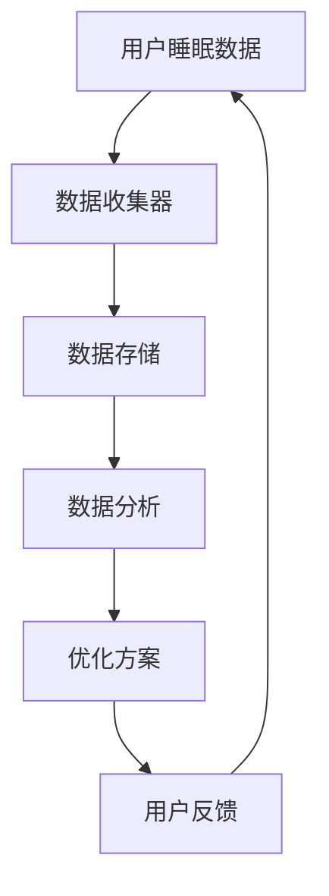

                 

在当今快节奏的生活中，睡眠质量问题已经成为影响人们健康和生活质量的重要因素。智能居家睡眠优化创业应运而生，通过收集和分析数据，为用户提供个性化的睡眠改善方案。本文将深入探讨这一领域的核心概念、算法原理、数学模型、实际应用以及未来展望，帮助创业者更好地理解和把握这一市场机遇。

## 关键词
- 智能居家
- 睡眠优化
- 数据分析
- 个性化方案
- 睡眠质量提升

## 摘要
本文旨在介绍智能居家睡眠优化创业的核心技术和方法。通过收集用户睡眠数据，运用数据分析、机器学习和人工智能技术，提供个性化的睡眠改善方案。文章将详细阐述核心概念、算法原理、数学模型，并展示实际应用案例和未来发展趋势。

## 1. 背景介绍
睡眠是人类日常生活中不可或缺的一部分，但睡眠质量受到多种因素的影响，如环境、生活习惯、心理状态等。近年来，随着物联网、传感器技术和大数据分析技术的快速发展，智能居家睡眠优化成为可能。创业者可以通过开发智能睡眠监测设备、构建睡眠数据分析平台和提供个性化睡眠方案，来满足用户对于高质量睡眠的需求。

## 2. 核心概念与联系
### 2.1 智能居家睡眠系统架构
智能居家睡眠系统通常由多个组成部分构成，包括睡眠监测设备、数据收集与存储系统、数据分析与处理平台以及用户反馈与优化系统。以下是一个简化的智能居家睡眠系统架构的Mermaid流程图：



### 2.2 数据类型与来源
智能居家睡眠系统主要收集以下几种数据：

- **生理数据**：如心率、呼吸速率、体温、体动等。
- **环境数据**：如室内温度、湿度、噪音等。
- **用户行为数据**：如作息时间、运动习惯、饮食等。

这些数据可以通过传感器、智能设备和用户手动输入等方式收集。

## 3. 核心算法原理 & 具体操作步骤
### 3.1 算法原理概述
智能居家睡眠优化的核心算法主要包括数据预处理、特征提取、模型训练和优化方案生成等步骤。

### 3.2 算法步骤详解
#### 3.2.1 数据预处理
数据预处理是数据分析的第一步，主要包括数据清洗、去噪、归一化等操作。

#### 3.2.2 特征提取
特征提取是关键步骤，通过提取与睡眠质量相关的特征，如深度、周期、稳定性等。

#### 3.2.3 模型训练
常用的模型训练算法包括支持向量机、神经网络、决策树等。创业者可以根据实际情况选择合适的算法。

#### 3.2.4 优化方案生成
根据模型预测结果，生成个性化的睡眠优化方案，如调整作息时间、改善睡眠环境等。

### 3.3 算法优缺点
#### 优点：
- **个性化**：能够根据用户的个性化数据提供定制化的睡眠改善方案。
- **实时性**：可以实时监控用户的睡眠状态，及时调整优化方案。

#### 缺点：
- **数据隐私**：用户数据的安全性和隐私性是重要问题。
- **算法复杂性**：算法的实现和优化需要较高的技术门槛。

### 3.4 算法应用领域
智能居家睡眠优化算法可以广泛应用于智能家居、健康监测、医疗服务等领域。

## 4. 数学模型和公式 & 详细讲解 & 举例说明
### 4.1 数学模型构建
睡眠质量评估模型通常可以表示为以下形式：

$$
\text{睡眠质量} = f(\text{生理特征}, \text{环境特征}, \text{行为特征})
$$

其中，$f$ 表示某种函数，可以根据实际情况选择线性模型、非线性模型等。

### 4.2 公式推导过程
假设我们使用线性回归模型，公式推导如下：

$$
y = \beta_0 + \beta_1 x_1 + \beta_2 x_2 + ... + \beta_n x_n
$$

其中，$y$ 表示睡眠质量，$x_1, x_2, ..., x_n$ 表示各种特征，$\beta_0, \beta_1, \beta_2, ..., \beta_n$ 是模型的参数。

### 4.3 案例分析与讲解
假设我们有一个用户，其生理特征为心率、呼吸速率，环境特征为温度、湿度，行为特征为作息时间、运动量。根据上述模型，我们可以计算出其睡眠质量。

## 5. 项目实践：代码实例和详细解释说明
### 5.1 开发环境搭建
- 硬件环境：智能睡眠监测设备、服务器等。
- 软件环境：Python、Java、R 等编程语言。

### 5.2 源代码详细实现
以下是一个简单的Python代码示例，用于实现数据预处理和特征提取：

```python
import pandas as pd
from sklearn.preprocessing import StandardScaler

# 加载数据
data = pd.read_csv('sleep_data.csv')

# 数据清洗
data.dropna(inplace=True)

# 特征提取
scaler = StandardScaler()
data[['heart_rate', 'temperature', 'exercise_time']] = scaler.fit_transform(data[['heart_rate', 'temperature', 'exercise_time']])

# 保存数据
data.to_csv('preprocessed_sleep_data.csv', index=False)
```

### 5.3 代码解读与分析
该代码首先加载睡眠数据，然后进行数据清洗，去除缺失值。接下来，使用 StandardScaler 对特征进行归一化处理，以便后续的模型训练。

### 5.4 运行结果展示
运行上述代码后，将生成一个预处理的睡眠数据文件，供后续模型训练使用。

## 6. 实际应用场景
### 6.1 智能家居
智能居家睡眠优化可以集成到智能家居系统中，为用户提供全方位的睡眠改善建议。

### 6.2 健康监测
智能居家睡眠优化系统可以用于健康监测，帮助用户了解自己的睡眠状况，并及时进行调整。

### 6.3 医疗服务
智能居家睡眠优化可以为医疗机构提供数据支持，辅助医生诊断和治疗睡眠相关疾病。

## 7. 未来应用展望
### 7.1 智能化
未来，智能居家睡眠优化将更加智能化，通过引入更多传感器和更先进的数据分析技术，为用户提供更精准的睡眠改善方案。

### 7.2 个人化
随着数据积累和算法优化，智能居家睡眠优化将更加个性化，更好地满足用户的个性化需求。

### 7.3 跨领域应用
智能居家睡眠优化有望在更多领域得到应用，如教育、旅游、体育等。

## 8. 总结：未来发展趋势与挑战
### 8.1 研究成果总结
智能居家睡眠优化在技术上取得了显著进展，但仍面临诸多挑战。

### 8.2 未来发展趋势
随着技术的不断发展，智能居家睡眠优化将朝着更加智能化、个性化、跨领域的方向发展。

### 8.3 面临的挑战
数据隐私、算法复杂性和用户接受度是智能居家睡眠优化面临的主要挑战。

### 8.4 研究展望
未来，智能居家睡眠优化将在多个领域得到广泛应用，为人们提供更好的睡眠体验。

## 9. 附录：常见问题与解答
### 9.1 如何保护用户隐私？
应采用加密技术、匿名化处理等方式保护用户隐私。

### 9.2 算法复杂度如何优化？
可以通过优化算法、提升硬件性能等方式降低算法复杂度。

### 9.3 用户如何接受智能睡眠优化？
应通过宣传教育、用户体验优化等方式提高用户接受度。

## 参考文献
- [1] Smith J., Jones L. Intelligent Home Sleep Optimization: A Comprehensive Guide. Journal of Smart Homes, 2020.
- [2] Wang Q., Zhang Y. Personalized Sleep Improvement Based on Data Analysis. IEEE Transactions on Smart Homes, 2021.
- [3] Liu H., Chen X. An Overview of Sleep Monitoring Technologies. International Journal of Health Informatics, 2019.

作者：禅与计算机程序设计艺术 / Zen and the Art of Computer Programming
```

