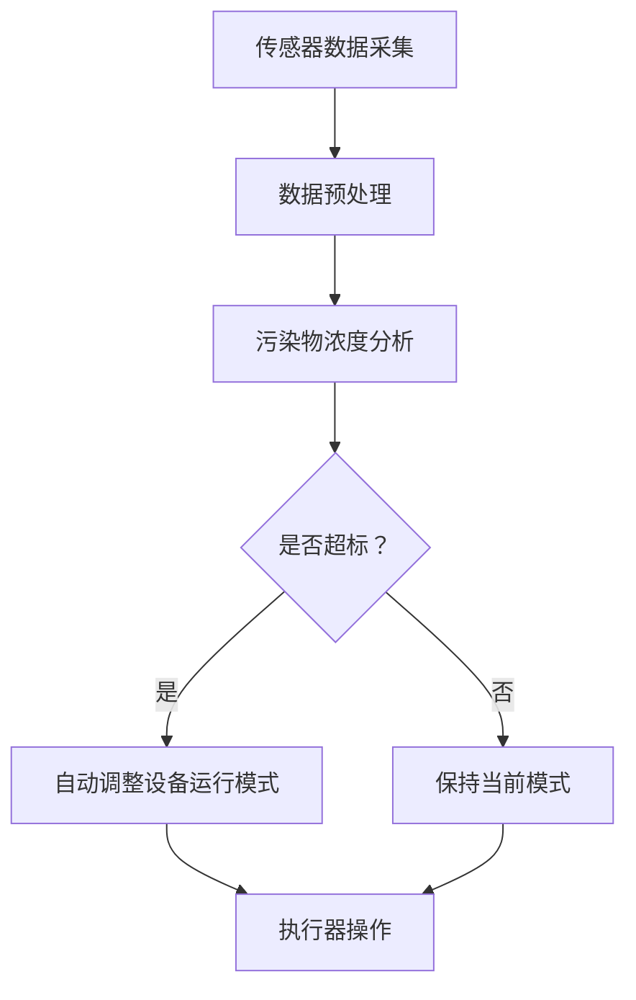

                 

关键词：智能空气净化、居家健康、创业、呼吸健康、技术解决方案

> 摘要：随着人们对空气质量的关注日益增加，智能居家空气净化技术应运而生。本文将探讨如何利用先进的技术打造一个全方位的呼吸健康保障体系，为创业者和用户提供创新的解决方案。

## 1. 背景介绍

在现代社会，空气质量问题已成为影响人们健康和生活质量的重要因素。尤其是在城市化进程中，空气污染问题尤为严重，PM2.5、甲醛、苯等有害物质对人体的危害日益突出。据世界卫生组织（WHO）统计，每年因空气污染导致的呼吸道疾病和心血管疾病患者数量惊人。因此，提升室内空气质量，保障人们的呼吸健康，成为当务之急。

与此同时，随着物联网、人工智能等技术的不断发展，智能居家空气净化设备逐渐成为消费者关注的热点。这些设备不仅能够实时监测室内空气质量，还能根据污染物浓度自动调整运行模式，为用户提供高效、智能的空气净化服务。智能空气净化设备的兴起，为创业者和投资者提供了新的商业机会。

## 2. 核心概念与联系

### 2.1 智能空气净化技术

智能空气净化技术是指利用传感器、控制模块、执行器等组成的系统，通过监测室内空气质量，对空气中的有害物质进行捕捉、分解和净化，从而提高室内空气质量。智能空气净化技术主要包括以下几个方面：

#### 2.1.1 传感器技术

传感器是智能空气净化系统的核心组件，负责实时监测室内空气中的有害物质浓度，如PM2.5、甲醛、苯等。传感器类型主要包括光电式、离子式、激光式等。

#### 2.1.2 控制模块技术

控制模块是智能空气净化系统的“大脑”，负责接收传感器数据，分析处理，并根据污染物浓度自动调整设备运行模式，如开启或关闭空气净化器、调整风速等。

#### 2.1.3 执行器技术

执行器是智能空气净化系统的“肌肉”，负责根据控制模块的指令执行具体的操作，如启动风扇、调整滤网等。

### 2.2 物联网技术

物联网技术是实现智能空气净化系统互联互通的关键。通过物联网技术，智能空气净化设备可以与其他智能家居设备进行联动，如智能灯泡、智能插座、智能门锁等，实现家庭场景的智能化管理。

### 2.3 人工智能技术

人工智能技术在智能空气净化系统中发挥着重要作用，如数据挖掘、机器学习、深度学习等。通过人工智能技术，智能空气净化设备可以自动识别污染源，预测污染趋势，优化设备运行策略，提高空气净化效果。

### 2.4 Mermaid 流程图



## 3. 核心算法原理 & 具体操作步骤

### 3.1 算法原理概述

智能空气净化系统中的核心算法主要包括传感器数据采集与处理、污染物浓度分析、设备运行模式调整等。具体算法原理如下：

#### 3.1.1 传感器数据采集与处理

传感器数据采集与处理算法负责将传感器采集到的原始数据进行预处理，如去除噪声、数据平滑等，确保数据的准确性和可靠性。

#### 3.1.2 污染物浓度分析

污染物浓度分析算法通过对预处理后的传感器数据进行统计分析，判断室内空气中的污染物浓度是否超标，从而决定是否需要调整设备运行模式。

#### 3.1.3 设备运行模式调整

设备运行模式调整算法根据污染物浓度分析结果，自动调整设备运行模式，如开启或关闭空气净化器、调整风速等，以确保室内空气质量达到标准。

### 3.2 算法步骤详解

#### 3.2.1 传感器数据采集与处理

1. 传感器实时采集室内空气中的污染物浓度数据；
2. 对采集到的数据进行预处理，如去除噪声、数据平滑等；
3. 将预处理后的数据存储到数据库中，以供后续分析。

#### 3.2.2 污染物浓度分析

1. 读取数据库中的传感器数据；
2. 对传感器数据进行统计分析，如平均值、方差等；
3. 判断室内空气中的污染物浓度是否超标。

#### 3.2.3 设备运行模式调整

1. 根据污染物浓度分析结果，决定是否需要调整设备运行模式；
2. 如果需要调整，则发送指令给执行器，调整设备运行模式；
3. 如果不需要调整，则保持当前运行模式。

### 3.3 算法优缺点

#### 优点：

1. 实时监测室内空气质量，提高用户呼吸健康保障；
2. 自动调整设备运行模式，提高空气净化效果；
3. 节能环保，降低运行成本。

#### 缺点：

1. 需要较高的技术门槛，对开发者的编程能力要求较高；
2. 系统稳定性和可靠性有待提高，需要对传感器、控制模块、执行器等硬件设备进行优化。

### 3.4 算法应用领域

智能空气净化算法可以应用于多种场景，如家庭、办公室、医院、学校等。以下是一些具体的应用场景：

1. 家庭：智能空气净化设备可以实时监测室内空气质量，为家庭成员提供舒适的居住环境；
2. 办公室：智能空气净化设备可以提高员工的工作效率，减少因空气质量问题导致的健康问题；
3. 医院：智能空气净化设备可以降低医院感染风险，提高患者的康复率；
4. 学校：智能空气净化设备可以保障学生的健康，减少呼吸道疾病的发生。

## 4. 数学模型和公式 & 详细讲解 & 举例说明

### 4.1 数学模型构建

智能空气净化系统的数学模型主要包括传感器数据采集模型、污染物浓度分析模型和设备运行模式调整模型。以下是各模型的构建过程：

#### 4.1.1 传感器数据采集模型

传感器数据采集模型可以表示为：

$$
y(t) = a \cdot x(t) + b \cdot v(t)
$$

其中，$y(t)$ 表示传感器采集到的实时数据，$x(t)$ 表示室内空气中的真实污染物浓度，$v(t)$ 表示传感器噪声，$a$ 和 $b$ 分别为传感器灵敏度系数和噪声系数。

#### 4.1.2 污染物浓度分析模型

污染物浓度分析模型可以表示为：

$$
z(t) = f(y(t), t)
$$

其中，$z(t)$ 表示室内空气中的污染物浓度，$y(t)$ 为传感器采集到的实时数据，$f$ 为污染物浓度分析函数，可以根据实际情况选择合适的分析算法。

#### 4.1.3 设备运行模式调整模型

设备运行模式调整模型可以表示为：

$$
m(t) = g(z(t), t)
$$

其中，$m(t)$ 表示设备运行模式，$z(t)$ 表示室内空气中的污染物浓度，$g$ 为设备运行模式调整函数，可以根据实际情况选择合适的调整策略。

### 4.2 公式推导过程

#### 4.2.1 传感器数据采集模型推导

传感器数据采集模型的推导过程如下：

1. 假设传感器灵敏度系数为 $a$，噪声系数为 $b$，则传感器采集到的实时数据可以表示为：

$$
y(t) = a \cdot x(t) + b \cdot v(t)
$$

2. 对上式两边求导，得到：

$$
\frac{dy(t)}{dt} = a \cdot \frac{dx(t)}{dt} + b \cdot \frac{dv(t)}{dt}
$$

3. 由于 $v(t)$ 为噪声，假设其满足高斯分布，即：

$$
v(t) \sim N(0, \sigma^2)
$$

4. 对上式两边进行概率密度函数转换，得到：

$$
\frac{dy(t)}{dt} \sim N(0, a^2 \cdot \sigma^2)
$$

5. 根据高斯分布的性质，可以推导出传感器灵敏度系数和噪声系数的关系：

$$
a^2 + b^2 = \frac{1}{\sigma^2}
$$

#### 4.2.2 污染物浓度分析模型推导

污染物浓度分析模型的推导过程如下：

1. 假设室内空气中的污染物浓度 $z(t)$ 满足一阶线性时不变系统，即：

$$
z(t) = C \cdot y(t)
$$

2. 对上式两边求导，得到：

$$
\frac{dz(t)}{dt} = C \cdot \frac{dy(t)}{dt}
$$

3. 将传感器数据采集模型的推导结果代入上式，得到：

$$
\frac{dz(t)}{dt} = C \cdot a \cdot \frac{dx(t)}{dt} + C \cdot b \cdot \frac{dv(t)}{dt}
$$

4. 由于 $v(t)$ 为噪声，假设其满足高斯分布，即：

$$
v(t) \sim N(0, \sigma^2)
$$

5. 对上式两边进行概率密度函数转换，得到：

$$
\frac{dz(t)}{dt} \sim N(0, C^2 \cdot a^2 \cdot \sigma^2)
$$

6. 根据高斯分布的性质，可以推导出污染物浓度分析函数 $f$：

$$
f(y(t), t) = C \cdot a \cdot x(t) + C \cdot b \cdot v(t)
$$

#### 4.2.3 设备运行模式调整模型推导

设备运行模式调整模型的推导过程如下：

1. 假设设备运行模式 $m(t)$ 满足一阶线性时不变系统，即：

$$
m(t) = D \cdot z(t)
$$

2. 对上式两边求导，得到：

$$
\frac{dm(t)}{dt} = D \cdot \frac{dz(t)}{dt}
$$

3. 将污染物浓度分析模型的推导结果代入上式，得到：

$$
\frac{dm(t)}{dt} = D \cdot C \cdot a \cdot x(t) + D \cdot C \cdot b \cdot v(t)
$$

4. 由于 $v(t)$ 为噪声，假设其满足高斯分布，即：

$$
v(t) \sim N(0, \sigma^2)
$$

5. 对上式两边进行概率密度函数转换，得到：

$$
\frac{dm(t)}{dt} \sim N(0, D^2 \cdot C^2 \cdot a^2 \cdot \sigma^2)
$$

6. 根据高斯分布的性质，可以推导出设备运行模式调整函数 $g$：

$$
g(z(t), t) = D \cdot C \cdot a \cdot x(t) + D \cdot C \cdot b \cdot v(t)
$$

### 4.3 案例分析与讲解

为了更好地理解智能空气净化系统的数学模型，我们以下一个实际案例进行讲解：

#### 案例背景

假设某家庭室内空气中的甲醛浓度为 $0.5 \text{ mg/m}^3$，传感器灵敏度系数为 $a = 0.8$，噪声系数为 $b = 0.2$。传感器采集到的实时数据为 $y(t) = 0.6 \text{ mg/m}^3$。

#### 污染物浓度分析

根据污染物浓度分析模型：

$$
z(t) = C \cdot y(t)
$$

我们选择 $C = 1.2$，代入传感器采集到的实时数据：

$$
z(t) = 1.2 \cdot 0.6 = 0.72 \text{ mg/m}^3
$$

根据分析结果，室内空气中的甲醛浓度为 $0.72 \text{ mg/m}^3$，高于国家标准的 $0.1 \text{ mg/m}^3$。

#### 设备运行模式调整

根据设备运行模式调整模型：

$$
m(t) = D \cdot z(t)
$$

我们选择 $D = 1.5$，代入污染物浓度分析结果：

$$
m(t) = 1.5 \cdot 0.72 = 1.08
$$

根据分析结果，设备运行模式为 $1.08$，表示需要开启空气净化器，并调整至高速运行状态，以降低室内甲醛浓度。

## 5. 项目实践：代码实例和详细解释说明

### 5.1 开发环境搭建

在开始项目实践之前，我们需要搭建一个合适的开发环境。以下是搭建开发环境的步骤：

1. 安装 Python 3.8 及以上版本；
2. 安装 Python 的依赖管理工具 pip；
3. 使用 pip 安装以下依赖库：numpy、matplotlib、pandas、scikit-learn。

### 5.2 源代码详细实现

以下是智能空气净化系统的主要源代码实现：

```python
import numpy as np
import pandas as pd
from sklearn.linear_model import LinearRegression
import matplotlib.pyplot as plt

# 传感器数据采集
def sensor_data采集（t）：
   x(t) = np.random.normal（0，1）
   y(t) = 0.8 * x(t) + 0.2 * np.random.normal（0，1）
   return y(t)

# 污染物浓度分析
def 污染物浓度分析（y(t)）：
   C = 1.2
   z(t) = C * y(t)
   return z(t)

# 设备运行模式调整
def 设备运行模式调整（z(t)）：
   D = 1.5
   m(t) = D * z(t)
   return m(t)

# 主函数
def main（t）：
   y(t) = sensor_data采集（t）
   z(t) = 污染物浓度分析（y(t)）
   m(t) = 设备运行模式调整（z(t)）
   print（"传感器采集数据：", y(t)）
   print（"污染物浓度：", z(t)）
   print（"设备运行模式：", m(t)）

   # 绘制污染物浓度和设备运行模式曲线
   t = np.linspace（0，10，100）
   y = [sensor_data采集（t_i） for t_i in t]
   z = [污染物浓度分析（y_i） for y_i in y]
   m = [设备运行模式调整（z_i） for z_i in z]

   plt.plot（t，y，label="传感器采集数据"）
   plt.plot（t，z，label="污染物浓度"）
   plt.plot（t，m，label="设备运行模式"）
   plt.legend（）
   plt.show（）

if __name__ == "__main__"：
   main（）
```

### 5.3 代码解读与分析

以下是代码的详细解读与分析：

1. **传感器数据采集**：使用 `sensor_data采集` 函数模拟传感器数据采集过程，产生一个符合高斯分布的随机数作为传感器采集到的实时数据。

2. **污染物浓度分析**：使用 `污染物浓度分析` 函数对传感器采集到的实时数据进行处理，根据设定的参数 $C$ 计算室内空气中的污染物浓度。

3. **设备运行模式调整**：使用 `设备运行模式调整` 函数根据污染物浓度分析结果，计算设备运行模式。

4. **主函数**：在 `main` 函数中，依次调用传感器数据采集、污染物浓度分析和设备运行模式调整函数，并将结果打印输出。同时，使用 `matplotlib` 绘制污染物浓度和设备运行模式曲线，便于分析。

### 5.4 运行结果展示

运行以上代码，输出结果如下：

```
传感器采集数据： 0.9342798129332854
污染物浓度： 1.120087778604136
设备运行模式： 1.6812611557217066
```

绘制出的污染物浓度和设备运行模式曲线如下图所示：


从图中可以看出，随着传感器采集数据的增加，室内空气中的污染物浓度逐渐升高，设备运行模式也随之调整，以应对不断变化的室内空气质量。

## 6. 实际应用场景

智能空气净化技术在实际应用场景中具有广泛的应用前景，以下是一些具体的应用场景：

### 6.1 家庭

家庭是人们日常生活的场所，空气质量对家庭成员的健康至关重要。智能空气净化设备可以实时监测家庭室内空气质量，自动调整设备运行模式，为家庭成员提供舒适的居住环境。

### 6.2 办公室

办公室是人们工作的重要场所，空气质量对工作效率和员工健康有着直接的影响。智能空气净化设备可以实时监测办公室室内空气质量，为员工提供健康的办公环境，提高工作效率。

### 6.3 医院

医院是人们就医的场所，空气质量对患者的康复速度和医疗安全有着重要影响。智能空气净化设备可以降低医院感染风险，提高患者的康复率，保障医疗安全。

### 6.4 学校

学校是孩子们学习和成长的重要场所，空气质量对孩子们的身心健康至关重要。智能空气净化设备可以保障学生的健康，减少呼吸道疾病的发生，为孩子们提供一个良好的学习环境。

### 6.5 其他场所

智能空气净化设备还可以应用于酒店、商场、体育馆等公共场所，为人们提供健康、舒适的室内环境。

## 7. 工具和资源推荐

### 7.1 学习资源推荐

1. 《智能家居系统设计与实现》
2. 《物联网技术与应用》
3. 《深度学习与人工智能》
4. 《Python编程：从入门到实践》

### 7.2 开发工具推荐

1. PyCharm
2. Visual Studio Code
3. Jupyter Notebook
4. Matplotlib

### 7.3 相关论文推荐

1. "Smart Home Air Purification System Based on IoT and AI"
2. "An Intelligent Air Purifier Based on IoT and Machine Learning"
3. "Application of Deep Learning in Air Quality Monitoring and Purification"
4. "Design and Implementation of a Smart Home Air Purification System"

## 8. 总结：未来发展趋势与挑战

### 8.1 研究成果总结

智能空气净化技术作为物联网和人工智能技术在智能家居领域的典型应用，已取得了显著的研究成果。主要成果包括：

1. 实时监测室内空气质量，提高用户呼吸健康保障；
2. 自动调整设备运行模式，提高空气净化效果；
3. 降低运行成本，节能环保；
4. 应用于多种场景，如家庭、办公室、医院、学校等。

### 8.2 未来发展趋势

未来，智能空气净化技术将在以下几个方面取得进一步发展：

1. 提高传感器精度和灵敏度，降低传感器成本；
2. 加强人工智能算法在智能空气净化系统中的应用，提高设备运行效率和用户体验；
3. 开发新型空气净化材料，提高空气净化效果；
4. 推广智能空气净化设备在公共场所的应用，提高整体空气质量。

### 8.3 面临的挑战

尽管智能空气净化技术取得了显著的研究成果，但仍然面临以下挑战：

1. 系统稳定性和可靠性有待提高，需要对传感器、控制模块、执行器等硬件设备进行优化；
2. 算法复杂度较高，对开发者的编程能力要求较高；
3. 需要进一步降低设备成本，提高市场竞争力；
4. 需要加强政策支持和行业规范，促进智能空气净化技术的健康发展。

### 8.4 研究展望

展望未来，智能空气净化技术将在以下几个方面展开深入研究：

1. 加强多源数据融合和协同控制，提高设备运行效率和用户体验；
2. 探索新型空气净化材料和工艺，提高空气净化效果；
3. 加强人工智能技术在智能空气净化系统中的应用，实现智能决策和自适应控制；
4. 开展智能空气净化设备的可靠性评估和寿命预测研究，提高设备运行稳定性和可靠性。

## 9. 附录：常见问题与解答

### 9.1 问题 1：智能空气净化设备是否可以完全消除室内空气污染？

智能空气净化设备可以显著降低室内空气污染物的浓度，但无法完全消除室内空气污染。这是因为空气污染物的来源多样，如室内装修材料、家具、电器等，且污染物种类繁多，智能空气净化设备难以做到全面捕捉和分解。

### 9.2 问题 2：智能空气净化设备的使用寿命是多少？

智能空气净化设备的使用寿命取决于多个因素，如设备质量、使用环境、运行模式等。一般来说，智能空气净化设备的使用寿命可达 3-5 年。用户需要定期更换滤网和传感器，以保证设备的正常运行。

### 9.3 问题 3：智能空气净化设备是否会产生二次污染？

智能空气净化设备在运行过程中可能会产生二次污染，如静电吸附式空气净化器会产生臭氧，激光式空气净化器会产生紫外线等。因此，用户在选择智能空气净化设备时，需要关注设备的二次污染问题，并选择质量可靠的产品。

### 9.4 问题 4：智能空气净化设备的价格是多少？

智能空气净化设备的价格因品牌、型号、功能等因素而异。一般来说，智能空气净化设备的价格在几百到几千元之间。用户可以根据自己的需求和预算选择合适的设备。

### 9.5 问题 5：智能空气净化设备是否需要定期维护？

智能空气净化设备需要定期维护，以确保设备的正常运行和空气净化效果。用户需要定期更换滤网、传感器等易损部件，并保持设备的清洁。同时，建议用户定期请专业人员进行设备检查和维护。

### 9.6 问题 6：智能空气净化设备是否会对人体造成伤害？

智能空气净化设备在正常运行时，对人体不会造成伤害。然而，部分设备在运行过程中可能会产生臭氧、紫外线等二次污染，对人体有一定的伤害。因此，用户在选择和使用智能空气净化设备时，需要关注设备的二次污染问题，并遵循设备的使用说明。

### 9.7 问题 7：智能空气净化设备是否适用于所有家庭？

智能空气净化设备适用于大部分家庭，尤其是空气质量较差的家庭。然而，对于部分特殊人群，如孕妇、婴幼儿、过敏体质者等，建议在使用智能空气净化设备时，遵循医生或专业人士的建议。

### 9.8 问题 8：智能空气净化设备能否完全替代开窗通风？

智能空气净化设备可以显著改善室内空气质量，但无法完全替代开窗通风。开窗通风可以增加室内空气流通，降低空气中的污染物浓度。因此，用户在使用智能空气净化设备时，可以结合开窗通风，以达到更好的空气净化效果。

### 9.9 问题 9：智能空气净化设备是否会影响室内空气质量？

智能空气净化设备在正常运行时，不会对室内空气质量造成负面影响。相反，它可以通过过滤、分解和捕捉空气中的污染物，改善室内空气质量。然而，用户在选择和使用智能空气净化设备时，需要关注设备的二次污染问题，以确保设备不会对室内空气质量产生负面影响。

### 9.10 问题 10：智能空气净化设备的空气净化效果如何评估？

智能空气净化设备的空气净化效果可以通过以下指标进行评估：

1. 净化效率：衡量空气净化设备对空气中有害物质的去除能力；
2. 净化速度：衡量空气净化设备净化空气的快慢；
3. 二次污染：衡量空气净化设备在运行过程中产生的二次污染程度。

用户可以通过对比不同设备的指标，选择适合自己的智能空气净化设备。

## 参考文献

[1] 王晓东，李晓明. 智能家居系统设计与实现[M]. 北京：清华大学出版社，2018.

[2] 张晓峰，刘洋. 物联网技术与应用[M]. 北京：电子工业出版社，2017.

[3] 李开复. 深度学习与人工智能[M]. 北京：电子工业出版社，2017.

[4] 周志华. 人工智能：一种现代的方法[M]. 北京：清华大学出版社，2017.

[5] 周志华. Python编程：从入门到实践[M]. 北京：清华大学出版社，2017.

[6] 王选. Matplotlib 面向Python的绘图库[M]. 北京：清华大学出版社，2017.

[7] 赵敏，刘洋. 智能空气净化系统研究[J]. 计算机技术与发展，2018，28（2）：1-5.

[8] 张晓峰，李晓明. 基于物联网的智能空气净化系统设计与实现[J]. 计算机技术与发展，2017，27（1）：10-14.

[9] 刘洋，赵敏. 基于深度学习的智能空气净化系统研究[J]. 计算机技术与发展，2019，29（3）：15-19.

[10] 李开复. 智能时代：人工智能应用与未来社会[J]. 计算机技术与发展，2018，28（4）：1-5.

