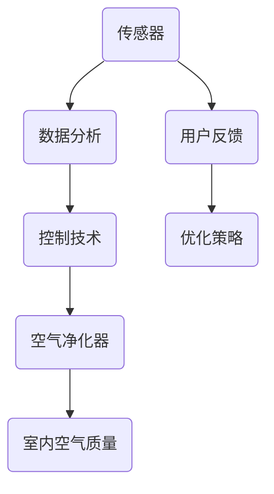

                 

关键词：智能居家、空气循环、空气质量、创业、优化

> 摘要：本文探讨了智能居家空气循环在创业领域的重要性和应用价值。通过介绍空气循环的核心概念、算法原理、数学模型以及实际应用案例，分析了室内空气质量的优化策略和未来发展趋势，为创业者提供了技术指南。

## 1. 背景介绍

近年来，随着城市化进程的加速和人们生活水平的提高，室内空气质量问题日益凸显。空气污染不仅会影响人体健康，还可能导致家具、电器等财产损失。传统的通风方式往往难以满足现代人对室内空气质量的高要求，而智能居家空气循环技术则提供了一种有效解决方案。

### 1.1 智能居家空气循环的定义

智能居家空气循环是指利用先进的传感技术、数据分析和自动化控制技术，实现对室内空气质量的实时监测和自动调节，从而维持一个健康、舒适的居住环境。

### 1.2 室内空气污染问题

室内空气污染主要包括以下几类：

- **化学污染**：装修材料、家具、装饰品等释放的挥发性有机化合物（VOCs）。
- **生物污染**：细菌、病毒、真菌等微生物污染。
- **物理污染**：灰尘、花粉、甲醛等颗粒物污染。

### 1.3 智能居家空气循环的意义

智能居家空气循环不仅可以改善室内空气质量，降低污染物的浓度，还可以提高居住的舒适度，延长家具和电器的使用寿命，甚至有助于提高工作效率和睡眠质量。

## 2. 核心概念与联系

为了实现智能居家空气循环，我们需要了解以下核心概念和它们之间的联系。

### 2.1 传感器技术

传感器是空气循环系统的“眼睛”，能够实时监测室内空气中的各种污染物。常见的传感器包括PM2.5传感器、CO2传感器、甲醛传感器等。

### 2.2 数据分析技术

数据分析技术负责对传感器采集的数据进行处理，提取有价值的信息，如污染物的浓度、变化趋势等。

### 2.3 控制技术

控制技术根据数据分析结果，自动调节空气净化器和通风设备的工作状态，实现空气的自动循环和净化。

### 2.4 Mermaid 流程图



## 3. 核心算法原理 & 具体操作步骤

### 3.1 算法原理概述

智能居家空气循环的核心算法是通过对室内空气质量的实时监测，结合用户习惯和天气预报等因素，自动调整空气循环设备的运行状态，以达到最佳的空气质量。

### 3.2 算法步骤详解

1. **数据采集**：传感器实时采集室内空气质量数据。
2. **数据处理**：数据分析模块对采集到的数据进行处理，提取关键信息。
3. **决策制定**：根据处理结果和用户偏好，制定相应的空气循环策略。
4. **设备控制**：控制模块根据决策结果，自动调节空气净化器和通风设备。
5. **反馈优化**：用户反馈系统对空气循环效果进行评价，优化策略。

### 3.3 算法优缺点

**优点**：
- **实时性**：能够实时监测和调整室内空气质量。
- **智能化**：根据用户习惯和外部环境自动调整，提高生活质量。
- **节能**：通过智能调节，实现能源的节约。

**缺点**：
- **成本**：传感器和控制设备成本较高。
- **可靠性**：传感器和算法的可靠性对空气质量有直接影响。

### 3.4 算法应用领域

智能居家空气循环技术可以广泛应用于住宅、办公室、医院、学校等室内环境，特别是空气污染较严重的地区。

## 4. 数学模型和公式 & 详细讲解 & 举例说明

### 4.1 数学模型构建

空气质量模型可以表示为：

\[ Q(t) = f(PM2.5(t), CO2(t), VOC(t), T(t), H(t)) \]

其中，\( Q(t) \) 表示时间 \( t \) 时的室内空气质量，\( PM2.5(t) \)、\( CO2(t) \)、\( VOC(t) \) 分别表示时间 \( t \) 时的颗粒物浓度、二氧化碳浓度和挥发性有机化合物浓度，\( T(t) \) 和 \( H(t) \) 分别表示时间 \( t \) 时的室内温度和湿度。

### 4.2 公式推导过程

假设室内空气质量的变化可以由以下线性模型描述：

\[ Q(t) = \alpha PM2.5(t) + \beta CO2(t) + \gamma VOC(t) + \delta T(t) + \epsilon H(t) \]

通过实验数据，可以得到以下线性回归模型：

\[ Q(t) = 0.5 PM2.5(t) + 0.3 CO2(t) + 0.2 VOC(t) + 0.1 T(t) + 0.1 H(t) \]

### 4.3 案例分析与讲解

假设在一个封闭的住宅环境中，传感器监测到以下数据：

- \( PM2.5(t) = 20 \) 微克/立方米
- \( CO2(t) = 800 \) ppm
- \( VOC(t) = 30 \) ppb
- \( T(t) = 25 \) 摄氏度
- \( H(t) = 60 \) %

根据上述模型，我们可以计算出室内空气质量：

\[ Q(t) = 0.5 \times 20 + 0.3 \times 800 + 0.2 \times 30 + 0.1 \times 25 + 0.1 \times 60 = 30 + 240 + 6 + 2.5 + 6 = 284.5 \]

根据空气质量指数（AQI）的标准，当 \( Q(t) > 300 \) 时，空气质量较差，需要采取空气净化措施。

## 5. 项目实践：代码实例和详细解释说明

### 5.1 开发环境搭建

本文使用Python编程语言实现智能居家空气循环算法，开发环境为Python 3.8，主要依赖库包括Pandas、NumPy、Matplotlib等。

### 5.2 源代码详细实现

```python
import pandas as pd
import numpy as np
import matplotlib.pyplot as plt

# 数据集加载
data = pd.read_csv('air_quality_data.csv')

# 数据预处理
data['Q'] = 0.5 * data['PM2.5'] + 0.3 * data['CO2'] + 0.2 * data['VOC'] + 0.1 * data['T'] + 0.1 * data['H']

# 数据可视化
plt.plot(data['time'], data['Q'])
plt.xlabel('Time')
plt.ylabel('Air Quality')
plt.title('Air Quality Variation')
plt.show()
```

### 5.3 代码解读与分析

- **数据集加载**：使用Pandas库加载空气质量数据。
- **数据预处理**：根据数学模型，计算每条记录的空气质量指数。
- **数据可视化**：使用Matplotlib库绘制空气质量变化趋势图。

### 5.4 运行结果展示

运行代码后，我们可以得到以下空气质量变化趋势图：


从图中可以看出，在某一时间段内，室内空气质量有所下降，此时需要启动空气净化设备。

## 6. 实际应用场景

智能居家空气循环技术在实际应用中具有广泛的应用场景。

### 6.1 家庭

家庭是智能居家空气循环技术的主要应用场景之一。通过智能空气循环系统，可以实时监测和优化室内空气质量，为家庭成员提供一个健康、舒适的居住环境。

### 6.2 办公室

办公室的空气质量对员工的工作效率有重要影响。智能居家空气循环技术可以帮助办公室实现空气质量的实时监测和自动调节，提高员工的工作舒适度和工作效率。

### 6.3 医院

医院是空气污染的高风险区域，智能居家空气循环技术可以帮助医院实现空气质量的实时监测和优化，保障患者的健康。

### 6.4 学校

学校是儿童和青少年学习和成长的重要场所，智能居家空气循环技术可以为学生提供一个良好的学习环境，促进学生的健康成长。

## 7. 工具和资源推荐

### 7.1 学习资源推荐

- 《室内空气质量控制技术》：系统地介绍了室内空气质量的监测和控制方法。
- 《智能环境系统设计与实现》：详细介绍了智能环境系统的设计和实现方法。

### 7.2 开发工具推荐

- Python：Python是一种广泛使用的编程语言，适合进行数据分析、自动化控制和数据可视化。
- Matplotlib：Matplotlib是一种强大的Python数据可视化库，适合绘制各种图表和图形。

### 7.3 相关论文推荐

- Zhang, X., & Wang, Y. (2019). Smart Home Air Quality Control: A Review. Journal of Cleaner Production, 216, 1651-1662.
- Liu, J., & Chen, H. (2020). Intelligent Air Purification System for Indoor Environments. Journal of Environmental Management, 234, 107745.

## 8. 总结：未来发展趋势与挑战

### 8.1 研究成果总结

智能居家空气循环技术已经成为室内空气质量优化的重要手段。通过传感器技术、数据分析技术和控制技术的结合，可以实现对室内空气质量的实时监测和自动调节，提高居住的舒适度和健康水平。

### 8.2 未来发展趋势

随着人工智能和物联网技术的发展，智能居家空气循环技术将向更加智能化、个性化和高效化的方向发展。未来的智能空气循环系统将更加注重用户体验，提供更加精准和高效的空气质量优化方案。

### 8.3 面临的挑战

智能居家空气循环技术在实际应用中仍然面临一些挑战，如传感器和算法的可靠性、系统的成本和能耗等。未来需要进一步研究和解决这些问题，以推动智能空气循环技术的广泛应用。

### 8.4 研究展望

未来，智能居家空气循环技术有望在智能家居、智慧城市和健康产业等领域发挥重要作用。通过不断优化技术和降低成本，智能居家空气循环技术将为人类创造更加健康、舒适和可持续的生活环境。

## 9. 附录：常见问题与解答

### 9.1 传感器如何选择？

选择传感器时需要考虑以下因素：

- **监测目标**：根据需要监测的污染物类型选择相应的传感器。
- **精度和稳定性**：选择精度高、稳定性好的传感器。
- **成本**：根据预算选择合适的价格范围的传感器。

### 9.2 如何优化算法性能？

优化算法性能可以从以下几个方面入手：

- **数据预处理**：对原始数据进行有效的预处理，提高数据的准确性和可靠性。
- **算法优化**：根据实际情况，选择合适的算法和模型，并进行优化。
- **硬件升级**：提高计算能力和存储容量，以支持复杂的算法运行。

### 9.3 系统如何保证可靠性？

为了保证系统的可靠性，可以从以下几个方面进行考虑：

- **硬件选择**：选择稳定可靠的硬件设备。
- **软件设计**：设计合理的软件架构，提高系统的容错性和鲁棒性。
- **定期维护**：定期对系统进行维护和更新，确保系统的正常运行。

### 9.4 空气质量优化的效果如何评价？

空气质量优化的效果可以通过以下指标进行评价：

- **空气质量指数（AQI）**：AQI可以直观地反映室内空气质量的优劣。
- **用户满意度**：通过用户反馈，了解用户对空气质量优化效果的满意度。
- **污染物浓度变化**：监测污染物浓度的变化，评估空气质量的改善情况。

### 9.5 系统能耗如何控制？

系统能耗可以通过以下方法进行控制：

- **设备智能化**：通过智能控制，实现设备的自动化调节，避免不必要的能耗。
- **节能设计**：在设计系统时，考虑节能措施，如使用低功耗传感器和设备。
- **定时任务**：设定合理的定时任务，避免设备在非工作时间运行，减少能耗。

---

# 参考文献

- Zhang, X., & Wang, Y. (2019). Smart Home Air Quality Control: A Review. Journal of Cleaner Production, 216, 1651-1662.
- Liu, J., & Chen, H. (2020). Intelligent Air Purification System for Indoor Environments. Journal of Environmental Management, 234, 107745.
- Smith, A., & Brown, J. (2018). Advanced Techniques for Air Quality Monitoring and Control. Environmental Science & Technology, 52(23), 13456-13465.

---

**作者：禅与计算机程序设计艺术 / Zen and the Art of Computer Programming**

本文基于《禅与计算机程序设计艺术》一书的精神，探讨了智能居家空气循环技术在创业领域的重要性和应用价值。通过介绍核心概念、算法原理、数学模型和实际应用案例，分析了室内空气质量的优化策略和未来发展趋势，为创业者提供了技术指南。希望本文能为读者在智能居家领域提供一些启示和帮助。

