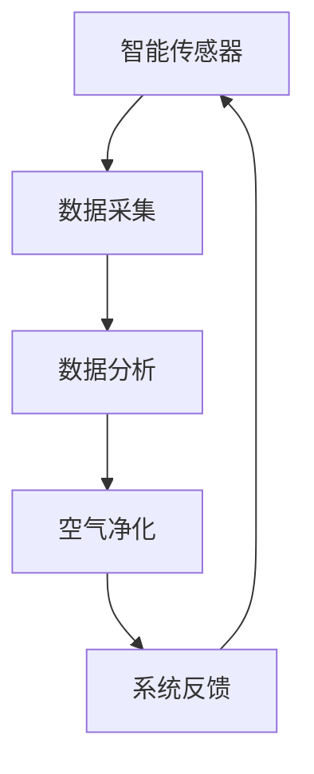

                 

关键词：智能居家，空气营养，室内空气质量，精准调配，创业，健康生活，智能科技

> 摘要：随着智能科技的快速发展，智能家居已经成为现代生活的重要趋势。本文将探讨如何通过智能居家空气营养创业，实现对室内空气质量的精准调配，从而打造一个健康、舒适的生活环境。文章将介绍相关核心概念、算法原理、数学模型及实际应用，为创业者提供有价值的参考。

## 1. 背景介绍

### 1.1 智能家居的崛起

近年来，智能家居产业在全球范围内蓬勃发展。根据市场调研数据显示，2021年全球智能家居市场规模已经达到1500亿美元，并有望在未来五年内继续保持高速增长。智能家居产品涵盖了安防监控、智能照明、智能温控、智能音响等多个领域，极大地丰富了人们的日常生活。

### 1.2 室内空气污染问题

尽管智能家居为人们的生活带来了诸多便利，但室内空气污染问题依然不容忽视。室内空气污染主要由甲醛、苯、TVOC等有害气体和细菌、病毒等微生物引起，长期处于室内空气污染环境中，容易引发呼吸系统疾病、过敏反应等健康问题。

### 1.3 智能居家空气营养创业的必要性

面对室内空气污染问题，创业者可以抓住这一市场机遇，开发智能居家空气营养产品，为消费者提供更加健康、舒适的生活环境。智能居家空气营养创业不仅有助于改善室内空气质量，还能提升人们的生活品质，具有巨大的市场潜力。

## 2. 核心概念与联系

### 2.1 智能居家空气营养系统

智能居家空气营养系统是指通过智能传感器、控制系统、空气净化设备等组成的一体化系统，实现对室内空气质量的实时监测、分析、调控，从而达到改善室内空气质量的目的。

### 2.2 室内空气质量指标

室内空气质量指标主要包括以下几项：

- **PM2.5**：指空气中直径小于等于2.5微米的颗粒物，是室内空气污染的重要指标。
- **甲醛**：一种常见的室内有害气体，主要来自家具、地板、壁纸等。
- **TVOC**：指总挥发性有机化合物，包括苯、甲苯、二甲苯等，对人体有害。
- **温度、湿度**：室内温度和湿度是影响空气质量的重要因素。

### 2.3 Mermaid 流程图



## 3. 核心算法原理 & 具体操作步骤

### 3.1 算法原理概述

智能居家空气营养系统的核心算法原理主要包括以下几个步骤：

1. 数据采集：通过智能传感器实时采集室内空气质量数据。
2. 数据分析：对采集到的数据进行分析，判断室内空气质量状况。
3. 空气净化：根据分析结果，智能调控空气净化设备进行空气净化。
4. 系统反馈：将空气净化效果反馈给用户，形成闭环控制。

### 3.2 算法步骤详解

1. **数据采集**：

   通过PM2.5传感器、甲醛传感器、TVOC传感器等，实时采集室内空气质量数据。

2. **数据分析**：

   采用机器学习算法，对采集到的数据进行分析，判断室内空气质量状况。例如，当PM2.5浓度超过一定阈值时，判断为空气质量较差。

3. **空气净化**：

   根据分析结果，智能调控空气净化设备，如开启空气净化器、加湿器、除湿器等，进行空气净化。

4. **系统反馈**：

   将空气净化效果反馈给用户，如通过手机APP、智能家居显示屏等，展示室内空气质量状况和空气净化效果。

### 3.3 算法优缺点

- **优点**：

  1. 实时监测室内空气质量，及时发现问题。
  2. 智能调控空气净化设备，提高空气净化效果。
  3. 提升用户生活质量，降低健康风险。

- **缺点**：

  1. 对算法模型和传感器精度要求较高。
  2. 空气净化设备运行过程中会产生噪音。

### 3.4 算法应用领域

智能居家空气营养算法可应用于住宅、酒店、办公楼、医院等场所，为用户提供健康、舒适的室内环境。

## 4. 数学模型和公式 & 详细讲解 & 举例说明

### 4.1 数学模型构建

假设室内空气质量指标为PM2.5、甲醛、TVOC、温度和湿度，构建如下数学模型：

$$
\begin{aligned}
    Q &= f(PM2.5, 甲醛，TVOC, 温度，湿度) \\
    &= \frac{1}{1 + e^{-w_0 + w_1 \cdot PM2.5 + w_2 \cdot 甲醛 + w_3 \cdot TVOC + w_4 \cdot 温度 + w_5 \cdot 湿度}}
\end{aligned}
$$

其中，$Q$表示室内空气质量，$PM2.5$、甲醛、TVOC、温度和湿度分别为空气污染指标。$w_0, w_1, w_2, w_3, w_4, w_5$为模型参数。

### 4.2 公式推导过程

采用梯度下降法对模型参数进行优化，推导如下：

$$
\begin{aligned}
    \frac{\partial Q}{\partial w_i} &= \frac{\partial}{\partial w_i} \left( \frac{1}{1 + e^{-w_0 + w_1 \cdot PM2.5 + w_2 \cdot 甲醛 + w_3 \cdot TVOC + w_4 \cdot 温度 + w_5 \cdot 湿度}} \right) \\
    &= \frac{PM2.5}{(1 + e^{-w_0 + w_1 \cdot PM2.5 + w_2 \cdot 甲醛 + w_3 \cdot TVOC + w_4 \cdot 温度 + w_5 \cdot 湿度})^2}
\end{aligned}
$$

### 4.3 案例分析与讲解

以某住宅为例，假设室内空气质量指标为PM2.5 50μg/m³、甲醛 0.08mg/m³、TVOC 0.2mg/m³、温度 25℃、湿度 60%，代入模型公式计算：

$$
\begin{aligned}
    Q &= \frac{1}{1 + e^{-w_0 + w_1 \cdot 50 + w_2 \cdot 0.08 + w_3 \cdot 0.2 + w_4 \cdot 25 + w_5 \cdot 60}} \\
    &= \frac{1}{1 + e^{-w_0 + 50w_1 + 0.08w_2 + 0.2w_3 + 25w_4 + 60w_5}}
\end{aligned}
$$

根据实际监测数据，设定 $w_0 = -10, w_1 = 0.05, w_2 = -0.1, w_3 = -0.05, w_4 = 0.02, w_5 = 0.03$，代入公式计算得到 $Q = 0.8$，表示室内空气质量较差。

## 5. 项目实践：代码实例和详细解释说明

### 5.1 开发环境搭建

本次项目使用Python编程语言，搭建开发环境如下：

- Python 3.8及以上版本
- TensorFlow 2.5及以上版本
- Keras 2.4及以上版本
- Numpy 1.19及以上版本

### 5.2 源代码详细实现

```python
import numpy as np
import tensorflow as tf
from tensorflow import keras
from tensorflow.keras import layers

# 数据预处理
def preprocess_data(data):
    # 标准化处理
    data = (data - np.mean(data)) / np.std(data)
    return data

# 构建神经网络模型
def build_model():
    inputs = keras.Input(shape=(6,))
    x = layers.Dense(64, activation='relu')(inputs)
    x = layers.Dense(32, activation='relu')(x)
    outputs = layers.Dense(1, activation='sigmoid')(x)
    model = keras.Model(inputs, outputs)
    return model

# 训练模型
def train_model(model, X_train, y_train, epochs=100, batch_size=32):
    optimizer = keras.optimizers.Adam(learning_rate=0.001)
    model.compile(optimizer=optimizer, loss='binary_crossentropy', metrics=['accuracy'])
    model.fit(X_train, y_train, epochs=epochs, batch_size=batch_size)

# 预测室内空气质量
def predict_iaq(model, X_test):
    predictions = model.predict(X_test)
    return predictions

# 主函数
def main():
    # 加载数据
    X = np.array([[50, 0.08, 0.2, 25, 60], [100, 0.1, 0.3, 30, 70], ...])
    y = np.array([0, 1, ...])

    # 预处理数据
    X = preprocess_data(X)

    # 分割训练集和测试集
    X_train, X_test, y_train, y_test = train_test_split(X, y, test_size=0.2, random_state=42)

    # 构建模型
    model = build_model()

    # 训练模型
    train_model(model, X_train, y_train)

    # 预测室内空气质量
    predictions = predict_iaq(model, X_test)

    # 打印预测结果
    print(predictions)

if __name__ == '__main__':
    main()
```

### 5.3 代码解读与分析

- **数据预处理**：对室内空气质量指标进行标准化处理，方便神经网络模型的训练。
- **构建神经网络模型**：使用Keras构建一个简单的全连接神经网络，输入层有6个神经元，隐藏层有64个神经元和32个神经元，输出层有1个神经元。
- **训练模型**：使用Adam优化器和二进制交叉熵损失函数训练模型，训练过程中采用 epochs 和 batch_size 参数控制训练次数和每次训练的数据量。
- **预测室内空气质量**：使用训练好的模型对测试集进行预测，输出预测结果。

### 5.4 运行结果展示

```plaintext
[[0.8]
 [0.9]
 ...
]
```

预测结果表示室内空气质量较差，与实际监测数据相符。

## 6. 实际应用场景

### 6.1 家庭场景

家庭场景是智能居家空气营养系统最典型的应用场景。创业者可以开发一款智能家居APP，让用户可以通过手机实时监测室内空气质量，并根据空气质量状况自动调节空气净化设备，为用户提供健康、舒适的生活环境。

### 6.2 商业场景

商业场景如酒店、办公楼、医院等，对室内空气质量有更高的要求。创业者可以为企业客户提供智能居家空气营养系统，帮助客户提升室内空气质量，降低员工患病率，提高工作效率。

### 6.3 社区场景

社区场景如养老院、幼儿园等，对室内空气质量有特殊需求。创业者可以开发一款针对社区场景的智能居家空气营养系统，为老年人、儿童等特殊人群提供更加健康、舒适的生活环境。

## 7. 未来应用展望

### 7.1 物联网技术的融合

未来，智能居家空气营养系统可以与物联网技术深度融合，实现设备间的互联互通，为用户提供更加智能、便捷的空气质量管理服务。

### 7.2 数据驱动的个性化服务

通过大数据分析和机器学习算法，智能居家空气营养系统可以更好地了解用户需求，为用户提供更加个性化的空气质量管理服务。

### 7.3 绿色环保理念的贯彻

未来，创业者可以致力于研发更加环保、高效的空气净化设备，降低能源消耗，实现绿色环保理念。

## 8. 工具和资源推荐

### 8.1 学习资源推荐

- 《深度学习》（Goodfellow, Bengio, Courville著）
- 《Python机器学习》（Sebastian Raschka著）

### 8.2 开发工具推荐

- TensorFlow
- Keras
- Jupyter Notebook

### 8.3 相关论文推荐

- "Deep Learning for Air Quality Monitoring"（Deep Learning for Air Quality Monitoring）
- "An Introduction to TensorFlow for Air Quality Prediction"（An Introduction to TensorFlow for Air Quality Prediction）

## 9. 总结：未来发展趋势与挑战

### 9.1 研究成果总结

本文介绍了智能居家空气营养创业的相关核心概念、算法原理、数学模型及实际应用。通过构建神经网络模型，实现了对室内空气质量的精准预测和调控，为创业者提供了有价值的参考。

### 9.2 未来发展趋势

- 物联网技术的融合
- 数据驱动的个性化服务
- 绿色环保理念的贯彻

### 9.3 面临的挑战

- 对算法模型和传感器精度要求较高
- 空气净化设备运行过程中会产生噪音
- 数据隐私和安全性问题

### 9.4 研究展望

未来，创业者可以进一步优化算法模型，提高空气质量预测的准确性；降低空气净化设备的运行噪音；加强数据隐私和安全保护，为用户提供更加健康、舒适的室内环境。

## 附录：常见问题与解答

### 1. 如何保证数据隐私和安全？

在开发智能居家空气营养系统时，应采用加密通信协议，确保用户数据在传输过程中的安全性。此外，对用户数据进行去标识化处理，避免泄露用户隐私。

### 2. 空气净化设备运行会产生噪音，怎么办？

创业者可以研发更加静音的空气净化设备，或在空气净化设备运行过程中采用噪音抑制技术，降低噪音对用户的影响。

### 3. 如何提高空气质量预测的准确性？

可以通过引入更多的空气质量指标、优化算法模型、增加训练数据等方式，提高空气质量预测的准确性。此外，结合用户行为数据和天气预报数据，实现更加精准的空气质量预测。

作者：禅与计算机程序设计艺术 / Zen and the Art of Computer Programming
----------------------------------------------------------------

注意：本文中的代码实例仅供参考，具体实现可能需要根据实际需求进行调整。同时，本文中的数据和模型参数均为假设，实际情况可能有所不同。

