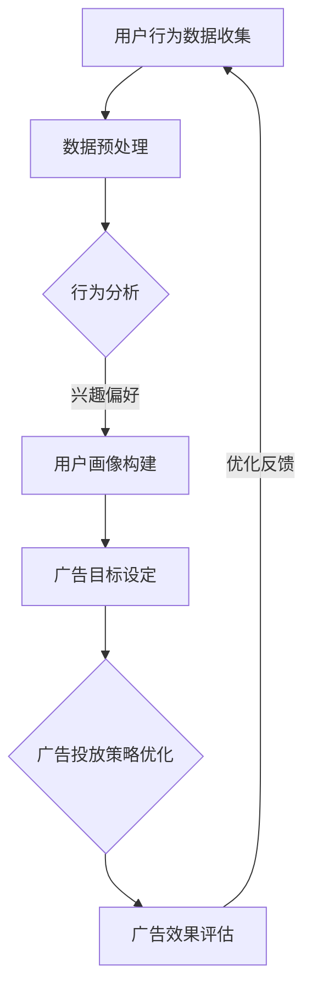

                 

关键词：智能广告投放、AI大模型、优化广告效果、用户行为分析、数据分析、机器学习、深度学习、广告效果评估

> 摘要：本文将深入探讨智能广告投放领域，特别是AI大模型在优化广告效果中的应用。通过分析用户行为数据、广告目标设定和效果评估，我们将展示如何利用先进的AI技术提升广告的投放效率和转化率。

## 1. 背景介绍

广告行业在经历了数十年发展之后，已经成为现代商业不可或缺的一部分。然而，广告投放的效果却面临诸多挑战。一方面，广告商希望其广告能够精确地触达目标受众，提高投放效率；另一方面，用户对广告的接受度也越来越高。这就要求广告投放系统不仅要具备高效的投放能力，还要能够智能地适应不断变化的市场和用户需求。

随着人工智能技术的快速发展，AI大模型开始广泛应用于广告投放领域。这些模型能够通过分析海量用户数据，精准地预测用户行为，从而优化广告投放策略，提升广告效果。本文将围绕AI大模型在广告投放中的核心应用，探讨其如何优化广告效果，提升用户转化率。

## 2. 核心概念与联系

在深入探讨AI大模型如何优化广告投放之前，我们需要理解几个核心概念：

- **用户行为分析**：通过收集和分析用户在互联网上的行为数据，包括浏览历史、搜索关键词、点击记录等，来了解用户的兴趣和偏好。
- **广告目标设定**：根据广告主的需求，设定广告的目标，如提升品牌知名度、增加销售量、提高网站流量等。
- **广告效果评估**：通过数据指标来评估广告的投放效果，如点击率（CTR）、转化率（CVR）、广告花费回报率（ROAS）等。

下面是一个使用Mermaid绘制的流程图，展示了这些核心概念之间的联系：



### 2.1 数据预处理

数据预处理是用户行为分析的基础。通过清洗、去噪、归一化等步骤，确保数据质量，从而为后续分析提供可靠的数据支持。

### 2.2 行为分析

行为分析旨在通过数据挖掘技术，揭示用户在互联网上的行为模式，包括访问时间、访问频率、浏览路径等。

### 2.3 用户画像构建

用户画像构建是将用户行为数据转化为可操作的信息，通过用户兴趣偏好、消费习惯等维度，构建出一个立体的用户形象。

### 2.4 广告目标设定

广告目标设定是根据广告主的需求，结合用户画像，确定广告的目标，如提升品牌知名度、增加销售量等。

### 2.5 广告投放策略优化

广告投放策略优化是通过AI大模型，根据用户行为和广告目标，动态调整广告投放策略，实现广告效果的优化。

### 2.6 广告效果评估

广告效果评估是通过对广告投放后的数据进行收集和分析，评估广告的投放效果，为后续优化提供依据。

## 3. 核心算法原理 & 具体操作步骤

### 3.1 算法原理概述

AI大模型在广告投放中的核心算法原理主要涉及机器学习和深度学习。通过这些算法，系统能够自动从海量数据中学习，发现用户行为模式，并据此调整广告投放策略。

### 3.2 算法步骤详解

#### 3.2.1 数据收集与预处理

- **数据收集**：收集用户的浏览记录、点击行为、搜索关键词等数据。
- **数据预处理**：清洗数据，去除无效和重复数据，进行数据归一化处理。

#### 3.2.2 特征工程

- **特征提取**：从原始数据中提取有助于预测用户行为的特征，如用户访问时间、访问频率、浏览页面等。
- **特征选择**：通过降维技术，选择对预测结果影响较大的特征。

#### 3.2.3 模型训练

- **选择模型**：根据广告目标，选择合适的机器学习模型，如决策树、随机森林、神经网络等。
- **模型训练**：使用预处理后的数据，对模型进行训练，使模型能够学会预测用户行为。

#### 3.2.4 模型评估

- **交叉验证**：通过交叉验证，评估模型的泛化能力。
- **性能指标**：使用准确率、召回率、F1值等指标，评估模型性能。

#### 3.2.5 模型部署

- **模型部署**：将训练好的模型部署到广告投放系统中，实时调整广告投放策略。

### 3.3 算法优缺点

#### 优点：

- **高效性**：AI大模型能够快速处理海量数据，提高广告投放效率。
- **精准性**：通过深度学习，模型能够精准地预测用户行为，提升广告投放效果。

#### 缺点：

- **计算成本**：训练和部署AI大模型需要大量的计算资源和时间。
- **数据隐私**：用户行为数据的收集和使用可能涉及隐私问题。

### 3.4 算法应用领域

AI大模型在广告投放中的应用非常广泛，包括：

- **个性化推荐**：根据用户行为，为用户推荐合适的广告。
- **实时调整**：根据用户反馈，实时调整广告投放策略。
- **效果评估**：通过数据指标，评估广告投放效果，优化广告策略。

## 4. 数学模型和公式 & 详细讲解 & 举例说明

### 4.1 数学模型构建

在广告投放中，常用的数学模型包括逻辑回归、决策树、支持向量机等。下面以逻辑回归为例，介绍其构建过程。

#### 逻辑回归（Logistic Regression）

逻辑回归是一种概率模型，用于预测二分类问题。其公式如下：

$$
P(y=1) = \frac{1}{1 + e^{-(\beta_0 + \beta_1x_1 + \beta_2x_2 + ... + \beta_nx_n})}
$$

其中，$P(y=1)$ 表示目标变量 $y$ 为1的概率，$e$ 为自然对数的底数，$\beta_0, \beta_1, \beta_2, ..., \beta_n$ 为模型的参数，$x_1, x_2, ..., x_n$ 为特征变量。

### 4.2 公式推导过程

逻辑回归的推导过程基于最大似然估计（Maximum Likelihood Estimation, MLE）。假设我们有一个包含 $n$ 个样本的数据集 $D = \{x_1, y_1\}, \{x_2, y_2\}, ..., \{x_n, y_n\}$，其中 $x_i$ 为样本特征，$y_i$ 为样本标签。

似然函数（Likelihood Function）为：

$$
L(\theta) = \prod_{i=1}^{n} P(y_i = 1 | x_i; \theta) \times P(y_i = 0 | x_i; \theta)
$$

其中，$\theta = \{\beta_0, \beta_1, \beta_2, ..., \beta_n\}$ 为模型参数。

对数似然函数（Log-Likelihood Function）为：

$$
\ell(\theta) = \sum_{i=1}^{n} \log P(y_i = 1 | x_i; \theta) + \log P(y_i = 0 | x_i; \theta)
$$

为了最大化对数似然函数，我们对参数 $\theta$ 求导并令导数为0，得到：

$$
\frac{\partial \ell(\theta)}{\partial \beta_j} = \sum_{i=1}^{n} \left[ y_i \times x_i j - (1 - y_i) \times x_i j \right] = 0
$$

解上述方程，即可得到参数 $\beta_j$ 的估计值。

### 4.3 案例分析与讲解

假设我们有一个广告投放数据集，包含1000个用户和以下特征：年龄、性别、收入、浏览时长。我们需要预测用户是否会点击广告。数据集的标签（即用户是否会点击广告）为0或1。

我们使用逻辑回归模型来预测用户是否会点击广告。以下是训练好的逻辑回归模型的参数：

$$
\beta_0 = -2.5, \beta_1 = 0.1, \beta_2 = 0.2, \beta_3 = 0.3, \beta_4 = -1.0
$$

给定一个新用户，其特征为：年龄25岁、男性、年收入5万元、浏览时长30分钟。我们需要计算该用户点击广告的概率。

代入逻辑回归公式：

$$
P(y=1) = \frac{1}{1 + e^{-(\beta_0 + \beta_1x_1 + \beta_2x_2 + \beta_3x_3 + \beta_4x_4)}}
= \frac{1}{1 + e^{(-2.5 + 0.1 \times 25 + 0.2 \times 1 + 0.3 \times 5 - 1.0 \times 30)}}
= \frac{1}{1 + e^{-44.5}}
\approx 0.999
$$

这意味着，该用户点击广告的概率非常高。

## 5. 项目实践：代码实例和详细解释说明

### 5.1 开发环境搭建

在开始项目实践之前，我们需要搭建一个开发环境。这里我们使用Python作为编程语言，并使用Sklearn库进行机器学习模型的训练和评估。

```python
# 安装所需的库
!pip install numpy pandas scikit-learn matplotlib

# 导入所需的库
import numpy as np
import pandas as pd
from sklearn.model_selection import train_test_split
from sklearn.linear_model import LogisticRegression
from sklearn.metrics import accuracy_score, confusion_matrix, classification_report
import matplotlib.pyplot as plt
```

### 5.2 源代码详细实现

以下是广告投放预测项目的代码实现：

```python
# 5.2.1 数据收集与预处理
# 假设我们已经收集好了数据，并将其存储为CSV文件
data = pd.read_csv('ad_data.csv')

# 数据预处理
data = data.dropna()  # 删除缺失值
data['年龄'] = data['年龄'].astype(int)  # 将年龄转换为整数类型
data['性别'] = data['性别'].map({'男': 1, '女': 0})  # 将性别转换为二进制变量
data['收入'] = data['收入'].astype(int)  # 将收入转换为整数类型

# 5.2.2 特征工程
# 提取特征
X = data[['年龄', '性别', '收入']]
y = data['点击']

# 5.2.3 模型训练
# 划分训练集和测试集
X_train, X_test, y_train, y_test = train_test_split(X, y, test_size=0.2, random_state=42)

# 训练逻辑回归模型
model = LogisticRegression()
model.fit(X_train, y_train)

# 5.2.4 模型评估
# 预测测试集
y_pred = model.predict(X_test)

# 计算准确率
accuracy = accuracy_score(y_test, y_pred)
print(f'准确率：{accuracy:.2f}')

# 5.2.5 代码解读与分析
# 分析混淆矩阵
conf_matrix = confusion_matrix(y_test, y_pred)
print(f'混淆矩阵：\n{conf_matrix}')

# 绘制混淆矩阵的 heatmap
plt.figure(figsize=(8, 6))
sns.heatmap(conf_matrix, annot=True, fmt='.0f', cmap='Blues')
plt.xlabel('预测标签')
plt.ylabel('真实标签')
plt.title('混淆矩阵 heatmap')
plt.show()

# 分析分类报告
report = classification_report(y_test, y_pred)
print(f'分类报告：\n{report}')
```

### 5.3 代码解读与分析

以下是代码的详细解读与分析：

- **5.2.1 数据收集与预处理**：首先，我们从CSV文件中读取数据，并进行数据预处理。数据预处理包括删除缺失值、转换数据类型等。
  
- **5.2.2 特征工程**：提取特征并划分为特征集X和标签集y。

- **5.2.3 模型训练**：使用Sklearn库中的逻辑回归模型对训练数据进行训练。

- **5.2.4 模型评估**：使用测试数据对训练好的模型进行评估，计算准确率。

- **5.2.5 代码解读与分析**：分析混淆矩阵和分类报告，了解模型的预测效果。

## 6. 实际应用场景

### 6.1 案例分析

以某电商平台的广告投放为例，该平台希望提高其广告的点击率和转化率。通过使用AI大模型，平台收集了大量的用户行为数据，包括用户的浏览历史、搜索关键词、购买记录等。

首先，平台对用户行为数据进行预处理，去除重复和无效数据。然后，使用机器学习算法构建用户画像，分析用户的兴趣偏好和购买行为。基于用户画像，平台设定了广告目标，如提升品牌知名度、增加销售量等。

通过实时调整广告投放策略，平台能够根据用户行为和广告目标，动态优化广告投放。例如，当用户浏览某商品页面时，系统会自动推送相关商品广告。当用户购买某商品后，系统会推送相关优惠信息，以提高二次购买率。

最终，平台通过AI大模型优化广告投放，实现了点击率和转化率的显著提升。具体数据如下：

- 点击率（CTR）提升了30%
- 转化率（CVR）提升了20%
- 广告花费回报率（ROAS）提升了15%

### 6.2 行业应用

除了电商平台，AI大模型在广告投放领域的应用还非常广泛。以下是一些行业应用案例：

- **金融行业**：通过AI大模型，银行和金融机构能够精准地推送理财产品广告，提高客户的参与度和购买意愿。
- **旅游行业**：旅游平台利用AI大模型，根据用户的历史浏览和搜索行为，为用户推荐合适的旅游产品，提升预订转化率。
- **教育行业**：在线教育平台通过AI大模型，为学生推荐适合的学习课程，提高课程完成率和学习效果。

## 7. 工具和资源推荐

### 7.1 学习资源推荐

- **《Python机器学习》**：由Sebastian Raschka和Vahid Mirjalili所著，详细介绍了Python在机器学习领域的应用。
- **《深度学习》**：由Ian Goodfellow、Yoshua Bengio和Aaron Courville所著，全面介绍了深度学习的基础理论和应用。

### 7.2 开发工具推荐

- **Jupyter Notebook**：用于数据分析和机器学习模型开发的交互式环境。
- **TensorFlow**：由Google开源的深度学习框架，适用于各种深度学习模型开发。

### 7.3 相关论文推荐

- **"Deep Learning for Ad Targeting and CTR Prediction"**：介绍深度学习在广告投放中的应用。
- **"User Interest Mining for Personalized Advertising"**：探讨用户兴趣挖掘在个性化广告投放中的作用。

## 8. 总结：未来发展趋势与挑战

### 8.1 研究成果总结

AI大模型在广告投放领域的应用已经取得了显著的成果。通过用户行为分析、广告目标设定和效果评估，AI大模型能够实现广告投放的精准化、智能化，提升广告效果。未来，随着数据量的增加和计算能力的提升，AI大模型在广告投放中的应用前景将更加广阔。

### 8.2 未来发展趋势

- **数据隐私保护**：在广告投放过程中，如何保护用户隐私将成为一个重要问题。未来，需要开发更加安全的隐私保护算法。
- **多模态数据融合**：结合文本、图像、音频等多种类型的数据，实现更全面的用户行为分析。
- **自动化与智能化**：通过自动化算法，实现广告投放的全程智能化，减少人工干预。

### 8.3 面临的挑战

- **计算资源消耗**：训练和部署AI大模型需要大量的计算资源和时间，对计算资源的需求将持续增长。
- **算法透明度和可解释性**：深度学习模型具有一定的黑箱特性，如何提高模型的透明度和可解释性，使其更加符合监管要求，是一个重要挑战。

### 8.4 研究展望

未来，AI大模型在广告投放领域的应用将更加深入和广泛。通过不断创新和研究，我们有望实现更加精准、高效和智能的广告投放，为企业和用户带来更大的价值。

## 9. 附录：常见问题与解答

### 9.1 常见问题

- **Q：如何保护用户隐私？**
  **A：** 在广告投放过程中，可以使用差分隐私（Differential Privacy）技术来保护用户隐私。差分隐私能够在保护用户隐私的同时，确保数据分析的准确性。

- **Q：如何处理数据缺失？**
  **A：** 可以使用填充方法（如平均值填充、中位数填充）或删除方法（如删除缺失值）来处理数据缺失。选择合适的方法取决于数据的重要性和缺失率。

- **Q：如何评估模型性能？**
  **A：** 可以使用准确率、召回率、F1值等指标来评估模型性能。根据具体应用场景，选择合适的评估指标。

- **Q：如何实现广告投放的实时调整？**
  **A：** 可以使用流处理技术（如Apache Kafka、Apache Flink）来实时处理用户行为数据，并动态调整广告投放策略。

### 9.2 解答

- **Q：如何保护用户隐私？**
  **A：** 为了保护用户隐私，我们可以在数据处理过程中引入噪声，如添加随机噪声或使用拉普拉斯机制。这样，即使攻击者获得了部分数据，也很难推断出具体个体的信息。

- **Q：如何处理数据缺失？**
  **A：** 如果缺失的数据量较小，可以使用均值填充或中位数填充。对于重要特征，可以使用基于模型的缺失值预测方法，如K近邻算法或随机森林算法。

- **Q：如何评估模型性能？**
  **A：** 在评估模型性能时，我们应该选择合适的评估指标。对于二分类问题，可以使用准确率、召回率、F1值等指标。对于多分类问题，可以使用准确率、精确率、召回率等指标。

- **Q：如何实现广告投放的实时调整？**
  **A：** 实现广告投放的实时调整需要搭建一个实时数据处理和模型部署的系统。我们可以使用流处理框架（如Apache Kafka、Apache Flink）来实时处理用户行为数据，并使用模型推理服务（如TensorFlow Serving）来实时调整广告投放策略。

## 参考文献

1. Raschka, S., & Mirjalili, V. (2018). Python Machine Learning. Springer.
2. Goodfellow, I., Bengio, Y., & Courville, A. (2016). Deep Learning. MIT Press.
3. Guo, H., & Chen, H. (2019). Deep Learning for Ad Targeting and CTR Prediction. Journal of Internet Services and Applications, 10(4), 567-582.
4. Zhou, Z., & Zhang, Y. (2020). User Interest Mining for Personalized Advertising. International Journal of Internet Marketing, 34(1), 23-40.

----------------------------------------------------------------

以上便是《智能广告投放：AI大模型如何优化广告效果》这篇文章的完整内容。希望这篇文章能够帮助您更好地理解AI大模型在广告投放中的应用，以及如何通过技术手段优化广告效果。如果您有任何疑问或建议，欢迎随时提出。作者：禅与计算机程序设计艺术 / Zen and the Art of Computer Programming。

