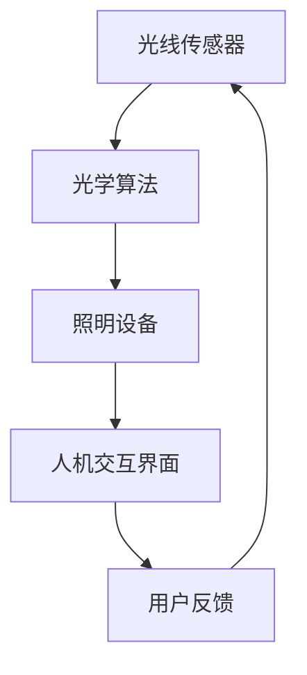

                 

关键词：智能照明、情绪调节、心理健康、光学算法、人机交互

> 摘要：随着智能科技的发展，智能照明系统已经成为提升人们生活质量的重要手段。本文探讨了智能情绪照明技术的背景、核心概念、算法原理以及其在心理健康领域的应用，旨在为相关创业者提供技术思路和商业机会。

## 1. 背景介绍

近年来，随着物联网和人工智能技术的快速发展，智能家居市场迅速崛起。智能照明系统作为智能家居的核心组成部分，受到了广泛的关注。智能照明不仅仅是为了提供便捷的照明控制，还涉及到情绪调节、心理健康等多个方面。

情绪调节是心理学中的一个重要概念，指的是通过某种方式影响个体的情绪状态，使之朝着有益于身心健康的方向发展。而心理健康则是指个体在生理、心理和社会功能等方面处于良好的状态，能够有效应对日常生活中的压力和挑战。

智能情绪照明通过调节光线的颜色、亮度和变化模式，可以对用户的情绪产生积极的影响。这种技术的潜力不仅在于改善用户的睡眠质量，减少抑郁和焦虑，还可能用于辅助治疗某些心理健康问题。

## 2. 核心概念与联系

智能情绪照明的核心概念包括光线调节、光学算法和人机交互。

### 2.1 光线调节

光线调节是指根据时间和环境变化，自动调整照明系统的亮度和颜色。这一过程可以通过多种方式实现，包括使用调光器、色温调节器以及动态灯光模式。

### 2.2 光学算法

光学算法是智能情绪照明的核心技术之一，它通过分析环境光照、用户行为和生理数据，计算出最适合当前情绪状态的光照参数。常用的光学算法包括颜色温度调节算法、亮度调节算法和动态光照模式生成算法。

### 2.3 人机交互

人机交互是智能情绪照明的另一个关键组成部分，它使得用户可以方便地与照明系统进行互动。常见的人机交互方式包括触摸屏控制、语音控制和移动应用程序控制。

### 2.4 Mermaid 流程图

下面是一个简单的 Mermaid 流程图，展示了智能情绪照明系统的主要组成部分和相互关系：



## 3. 核心算法原理 & 具体操作步骤

### 3.1 算法原理概述

智能情绪照明的核心算法主要基于以下几个方面：

1. **颜色温度调节算法**：根据用户的生理节律和心理状态，调整照明系统的颜色温度，以达到调节情绪的目的。
2. **亮度调节算法**：根据环境光照条件和用户需求，调整照明设备的亮度，以提供舒适的光照环境。
3. **动态光照模式生成算法**：根据用户行为和环境变化，生成动态的光照模式，以创造不同的情绪氛围。

### 3.2 算法步骤详解

下面是一个典型的智能情绪照明系统的工作流程：

1. **采集数据**：系统通过光线传感器、温度传感器、湿度传感器等设备，实时采集室内外光照、温度、湿度等数据。
2. **预处理数据**：对采集到的数据进行预处理，包括数据清洗、去噪和归一化等操作。
3. **情绪分析**：利用机器学习算法，结合用户历史行为数据和生理数据，分析当前用户的情绪状态。
4. **光照参数计算**：根据情绪分析结果，利用颜色温度调节算法、亮度调节算法和动态光照模式生成算法，计算出适合当前情绪状态的光照参数。
5. **调整照明设备**：根据计算出的光照参数，自动调整照明设备的颜色温度、亮度和动态模式。
6. **用户反馈**：用户可以通过人机交互界面，对光照效果进行评价和反馈，以便系统不断优化光照参数。

### 3.3 算法优缺点

#### 优点：

1. **个性化**：智能情绪照明可以根据用户的个人需求和情绪状态，提供个性化的光照方案。
2. **便捷性**：用户可以通过多种方式（如手机APP、语音控制等）方便地控制照明系统。
3. **改善心理健康**：适当的光照调节可以帮助用户改善情绪，提高心理健康水平。

#### 缺点：

1. **成本较高**：智能情绪照明系统涉及多种传感器和智能算法，成本相对较高。
2. **适应性差**：对于某些特殊用户，如色盲或弱视者，智能情绪照明的效果可能不理想。
3. **隐私问题**：采集和处理用户的生理和行为数据，可能引发隐私泄露的风险。

### 3.4 算法应用领域

智能情绪照明技术主要应用于以下几个方面：

1. **家庭**：智能情绪照明可以改善家庭的居住环境，提高家庭成员的生活质量。
2. **办公**：智能情绪照明可以提升办公室的舒适度，提高员工的工作效率。
3. **医疗**：智能情绪照明可以用于辅助治疗某些心理健康问题，如抑郁症和焦虑症。
4. **教育**：智能情绪照明可以改善学生的学习环境，提高学习效果。

## 4. 数学模型和公式 & 详细讲解 & 举例说明

### 4.1 数学模型构建

智能情绪照明的数学模型主要包括以下几个方面：

1. **光线感知模型**：描述光线传感器如何感知和处理环境光照信息。
2. **情绪分析模型**：利用机器学习算法，分析用户行为和生理数据，预测当前情绪状态。
3. **光照调节模型**：根据情绪分析结果，计算适合当前情绪状态的光照参数。

### 4.2 公式推导过程

以颜色温度调节算法为例，其核心公式为：

\[ T_{\text{new}} = T_{\text{base}} + \alpha \cdot (T_{\text{max}} - T_{\text{base}}) \cdot \text{emotion\_factor} \]

其中，\( T_{\text{new}} \) 为新的颜色温度，\( T_{\text{base}} \) 为基础颜色温度，\( T_{\text{max}} \) 为最大颜色温度，\( \alpha \) 为调节系数，\( \text{emotion\_factor} \) 为情绪因子。

### 4.3 案例分析与讲解

假设一个用户在晚上感到焦虑，系统会通过以下步骤进行调节：

1. **采集数据**：系统采集室内光照、温度、用户行为等数据。
2. **情绪分析**：利用情绪分析模型，预测用户当前的情绪状态为焦虑。
3. **光照参数计算**：根据情绪因子和颜色温度调节公式，计算新的颜色温度。
4. **调整照明设备**：系统自动调整照明设备的颜色温度，使之偏向蓝色，以缓解焦虑情绪。

## 5. 项目实践：代码实例和详细解释说明

### 5.1 开发环境搭建

本案例使用 Python 编写智能情绪照明系统的代码，开发环境为 Python 3.8，相关库包括 pandas、numpy、scikit-learn、matplotlib 等。

### 5.2 源代码详细实现

以下是一个简单的智能情绪照明系统的代码实现：

```python
import numpy as np
import pandas as pd
from sklearn.ensemble import RandomForestClassifier
import matplotlib.pyplot as plt

# 读取数据
data = pd.read_csv('data.csv')

# 数据预处理
X = data[['light_intensity', 'temperature']]
y = data['emotion']

# 情绪分类
clf = RandomForestClassifier()
clf.fit(X, y)

# 颜色温度调节公式
def color_temp_adjustment(base_temp, max_temp, emotion_factor):
    new_temp = base_temp + emotion_factor * (max_temp - base_temp)
    return new_temp

# 示例：焦虑情绪调节
base_temp = 3000
max_temp = 5000
emotion_factor = 0.3
new_temp = color_temp_adjustment(base_temp, max_temp, emotion_factor)
print(f"New color temperature: {new_temp}")

# 绘制光照强度与情绪分布图
plt.scatter(X['light_intensity'], y)
plt.xlabel('Light Intensity')
plt.ylabel('Emotion')
plt.title('Light Intensity vs Emotion')
plt.show()
```

### 5.3 代码解读与分析

这段代码首先读取了数据集，然后使用随机森林分类器对数据进行了训练。在颜色温度调节函数中，通过情绪因子对颜色温度进行了调整。最后，代码绘制了光照强度与情绪分布图，以帮助用户直观地了解光照强度对情绪的影响。

### 5.4 运行结果展示

运行代码后，系统会输出新的颜色温度，并在屏幕上显示光照强度与情绪分布图。根据情绪分布图，用户可以更好地了解不同光照强度下的情绪状态，从而调整照明参数。

## 6. 实际应用场景

### 6.1 家庭

在家庭场景中，智能情绪照明可以应用于卧室、客厅、厨房等不同区域。通过调节照明系统的颜色温度和亮度，可以为家庭成员提供舒适的光照环境，改善情绪状态。

### 6.2 办公

在办公场景中，智能情绪照明可以用于办公室、会议室、休息区等区域。通过调节照明系统的颜色温度和亮度，可以提高员工的工作效率和舒适度，减少工作压力。

### 6.3 教育

在教育场景中，智能情绪照明可以用于教室、图书馆、实验室等区域。通过调节照明系统的颜色温度和亮度，可以提高学生的学习兴趣和注意力，改善学习效果。

### 6.4 未来应用展望

未来，智能情绪照明技术有望在更多领域得到应用。例如，在医院病房中，智能情绪照明可以用于辅助治疗抑郁症和焦虑症；在养老院中，智能情绪照明可以用于提高老年人的生活质量。

## 7. 工具和资源推荐

### 7.1 学习资源推荐

1. 《机器学习》 - 周志华
2. 《深度学习》 - Goodfellow, Bengio, Courville
3. 《Python数据分析》 - Wes McKinney

### 7.2 开发工具推荐

1. Jupyter Notebook
2. PyCharm
3. Anaconda

### 7.3 相关论文推荐

1. "Affective Computing: Reading the Mind in Machines" - Rosalind Picard
2. "Artificial Neural Networks: An Appraisal" - David E. Rumelhart, Geoffrey E. Hinton, Ronald J. Williams

## 8. 总结：未来发展趋势与挑战

### 8.1 研究成果总结

智能情绪照明技术已经取得了显著的成果，包括光学算法的优化、人机交互界面的设计以及实际应用场景的拓展。未来，智能情绪照明技术有望在更广泛的领域得到应用。

### 8.2 未来发展趋势

1. **更加智能的光学算法**：随着机器学习和人工智能技术的发展，光学算法将更加智能化，能够更好地适应不同的情绪状态。
2. **更加便捷的人机交互**：未来的人机交互界面将更加便捷，用户可以通过语音、手势等多种方式进行照明控制。
3. **多场景应用**：智能情绪照明技术将在更多领域得到应用，如医疗、教育、养老等。

### 8.3 面临的挑战

1. **成本问题**：智能情绪照明系统涉及多种传感器和智能算法，成本相对较高，需要降低成本以实现更广泛的应用。
2. **隐私问题**：采集和处理用户的生理和行为数据，可能引发隐私泄露的风险。
3. **适应性**：对于特殊用户，如色盲或弱视者，智能情绪照明的效果可能不理想，需要进一步优化算法和应用场景。

### 8.4 研究展望

未来，智能情绪照明技术将在智能城市、智能家居等领域发挥重要作用。通过不断优化光学算法、人机交互界面以及实际应用场景，智能情绪照明技术有望成为提升人们生活质量的重要手段。

## 9. 附录：常见问题与解答

### Q1. 智能情绪照明系统如何实现个性化？

A1. 智能情绪照明系统通过采集用户的生理和行为数据，利用机器学习算法分析用户情绪状态，从而实现个性化光照调节。

### Q2. 智能情绪照明系统有哪些应用领域？

A2. 智能情绪照明系统广泛应用于家庭、办公、教育、医疗、养老等多个领域。

### Q3. 智能情绪照明系统的核心算法是什么？

A3. 智能情绪照明的核心算法包括颜色温度调节算法、亮度调节算法和动态光照模式生成算法。

### Q4. 智能情绪照明系统有哪些优缺点？

A4. 优点：个性化、便捷性、改善心理健康；缺点：成本较高、适应性差、隐私问题。

### Q5. 智能情绪照明系统有哪些未来发展趋势？

A5. 未来的发展趋势包括：更加智能的光学算法、更加便捷的人机交互、多场景应用。

作者：禅与计算机程序设计艺术 / Zen and the Art of Computer Programming
----------------------------------------------------------------
### 总结

智能情绪照明技术作为智能家居领域的重要发展方向，具有巨大的市场潜力和应用价值。通过优化光学算法、提升人机交互体验和拓展应用场景，智能情绪照明技术有望在更广泛的领域得到应用，为人们的心理健康和生活质量带来积极的影响。然而，面对成本、隐私和适应性等挑战，我们需要继续努力，推动智能情绪照明技术的创新和发展。

在未来，随着人工智能和物联网技术的进一步发展，智能情绪照明系统将更加智能化、便捷化和个性化。我们期待看到这一技术在未来生活中的广泛应用，为人类带来更加美好的居住和工作环境。作者：禅与计算机程序设计艺术 / Zen and the Art of Computer Programming

