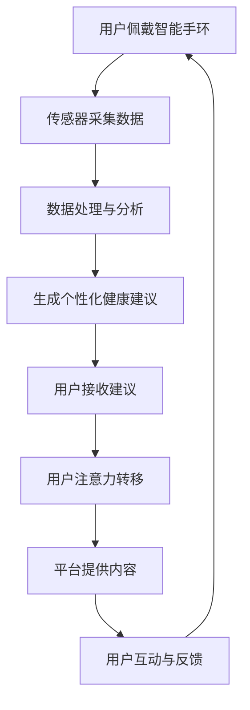
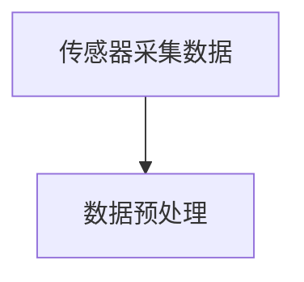
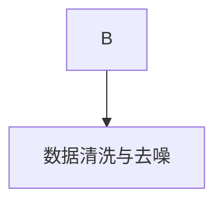
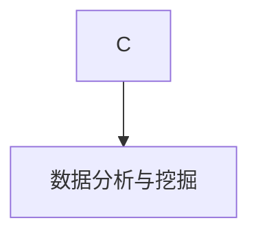
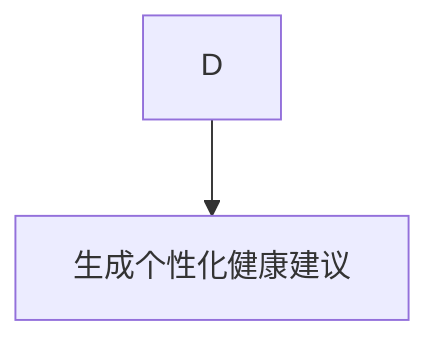
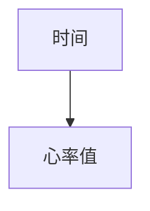
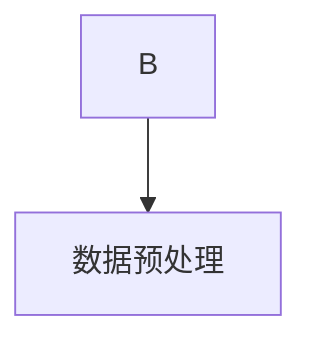
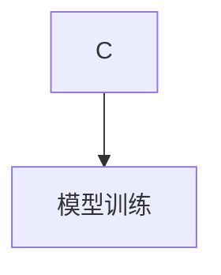
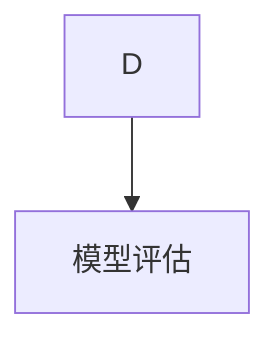
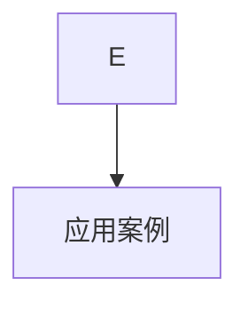

                 

关键词：智能手环、健康监测、注意力经济、融合、技术应用

> 摘要：本文将深入探讨智能手环作为一种新兴的健康监测工具，其在现代注意力经济中的角色和影响。文章将从背景介绍、核心概念与联系、核心算法原理与具体操作步骤、数学模型与公式、项目实践、实际应用场景、工具和资源推荐，以及未来发展趋势与挑战等多个方面，全面解析智能手环的发展现状和未来潜力。

## 1. 背景介绍

智能手环作为一种可穿戴设备，近年来在市场上迅速崛起。它们不仅能够实时监测佩戴者的心率、步数、睡眠质量等健康指标，还可以通过整合传感器和数据算法，提供更加个性化和精准的健康管理服务。随着科技的进步和人们对健康意识的增强，智能手环已成为人们日常生活中不可或缺的一部分。

与此同时，注意力经济作为一种新的经济模式，正日益受到关注。注意力经济强调的是用户注意力的价值，通过吸引和保持用户的注意力来创造商业价值。智能手环作为一种新兴的健康监测工具，如何在注意力经济中发挥其优势，成为了一个值得探讨的话题。

### 1.1 智能手环的发展历程

智能手环的发展可以追溯到上世纪90年代，最早的智能手环主要功能是记录步数和睡眠时间。随着科技的进步，智能手环逐渐增加了心率监测、运动轨迹记录等高级功能。进入21世纪，智能手环开始集成多种传感器，如GPS、加速度计、陀螺仪等，使其功能更加多样化。

近年来，随着物联网、大数据和人工智能等技术的不断发展，智能手环的智能化程度不断提高，不仅可以实现实时数据监测和反馈，还能根据用户的健康数据提供个性化的健康建议。

### 1.2 注意力经济的基本概念

注意力经济，是指以用户注意力为核心的经济模式。在互联网时代，用户的注意力成为了一种稀缺资源。企业通过提供有趣、有价值或引人入胜的内容，吸引并保持用户的注意力，从而实现商业价值。

注意力经济的核心在于如何吸引和保持用户的注意力。这需要企业深入了解用户需求，提供个性化、定制化的服务，同时通过算法和数据分析，不断优化内容和服务，提高用户粘性。

### 1.3 智能手环与注意力经济的联系

智能手环作为一种可穿戴设备，具有直接接触用户的特点。它通过实时监测用户的健康数据，提供个性化健康建议，从而吸引了大量用户的注意力。同时，智能手环的数据可以为企业提供宝贵的用户行为数据，帮助企业更好地了解用户需求，优化产品和服务。

总的来说，智能手环在注意力经济中扮演着重要的角色，它不仅是一种健康监测工具，更是一种新的商业模式的载体。

## 2. 核心概念与联系

在深入探讨智能手环与注意力经济的融合之前，我们需要明确几个核心概念及其相互关系。

### 2.1 智能手环的功能与架构

智能手环的核心功能包括健康数据监测、运动轨迹记录、通知提醒等。为了实现这些功能，智能手环通常包含以下几个关键组成部分：

- **传感器模块**：包括心率传感器、加速度计、陀螺仪、GPS等，用于实时采集用户的生理和运动数据。
- **数据处理模块**：负责对传感器数据进行处理和分析，提取有用的信息。
- **通信模块**：用于与手机或其他设备进行数据传输和同步。


### 2.2 注意力经济中的关键要素

注意力经济中的关键要素包括用户注意力、内容、平台和算法。智能手环在这四个要素中扮演着重要角色：

- **用户注意力**：智能手环通过实时监测用户的健康数据，提供个性化的健康建议，吸引了大量用户的注意力。
- **内容**：智能手环提供的内容包括健康数据、运动轨迹、提醒通知等，这些内容对用户具有吸引力。
- **平台**：智能手环通常与手机或其他设备配合使用，形成了一个生态系统，为用户提供便捷的服务。
- **算法**：智能手环通过算法对用户数据进行处理和分析，提供个性化的健康建议，从而提高用户粘性。

### 2.3 Mermaid 流程图

为了更好地展示智能手环与注意力经济的融合过程，我们使用Mermaid流程图来描述。



在这个流程图中，用户佩戴智能手环开始整个过程，传感器采集数据，数据处理与分析模块生成个性化健康建议，用户接收建议并注意力转移到健康内容上，平台提供内容，用户互动与反馈，最终形成闭环。

### 2.4 智能手环与注意力经济的优势

智能手环与注意力经济的融合具有以下几个优势：

1. **用户参与度高**：智能手环实时监测用户的健康数据，提供个性化的健康建议，吸引用户注意力。
2. **数据驱动**：智能手环的数据为平台提供宝贵的用户行为数据，帮助企业优化产品和服务。
3. **个性化体验**：智能手环通过算法对用户数据进行处理和分析，提供个性化的健康建议，提高用户满意度。
4. **商业模式创新**：智能手环作为一种新的商业模式载体，为企业提供了新的盈利点。

## 3. 核心算法原理与具体操作步骤

### 3.1 算法原理概述

智能手环的核心算法主要涉及健康数据监测、数据处理和分析、个性化健康建议生成等方面。这些算法通常基于机器学习和数据挖掘技术，通过对用户历史数据和实时数据的分析，提取有用的信息，为用户提供个性化的健康建议。

### 3.2 算法步骤详解

#### 3.2.1 健康数据采集

智能手环通过传感器模块实时采集用户的生理和运动数据，包括心率、步数、睡眠质量、运动轨迹等。



#### 3.2.2 数据预处理

对采集到的原始数据进行清洗和预处理，去除噪声和异常值，确保数据的质量。



#### 3.2.3 数据分析

使用机器学习和数据挖掘技术对预处理后的数据进行深入分析，提取有用的信息。



#### 3.2.4 生成个性化健康建议

根据分析结果，生成个性化的健康建议，如运动建议、饮食建议、睡眠建议等。



### 3.3 算法优缺点

#### 优点

- **个性化**：通过算法对用户数据进行深入分析，提供个性化的健康建议，提高用户满意度。
- **实时性**：实时监测用户的健康数据，及时提供健康建议，有助于预防疾病。
- **数据驱动**：基于大量用户数据进行分析，有助于企业优化产品和服务。

#### 缺点

- **隐私问题**：用户数据可能涉及隐私问题，需要确保数据的安全性和隐私保护。
- **准确性**：算法的准确性受到数据质量和模型训练数据的影响，需要不断优化。

### 3.4 算法应用领域

智能手环的核心算法广泛应用于健康监测、运动管理、健康管理等领域，为用户提供个性化的健康服务。

- **健康监测**：通过实时监测用户的生理数据，提供健康预警和建议。
- **运动管理**：根据用户的运动数据，提供个性化的运动建议和训练计划。
- **健康管理**：通过分析用户的健康数据，提供健康风险评估和管理建议。

## 4. 数学模型和公式

在智能手环的核心算法中，数学模型和公式扮演着至关重要的角色。以下将介绍智能手环中常用的数学模型和公式，并详细讲解其推导过程和实际应用。

### 4.1 数学模型构建

智能手环的数学模型主要包括以下几个方面：

1. **生理信号模型**：用于建模用户的生理信号，如心率、血压等。
2. **运动轨迹模型**：用于建模用户的运动轨迹，如步行、跑步等。
3. **健康风险评估模型**：用于评估用户的健康风险，如心血管疾病、糖尿病等。
4. **个性化健康建议模型**：用于生成个性化的健康建议。

### 4.2 公式推导过程

#### 4.2.1 生理信号模型

心率模型的公式如下：

\[ HR(t) = \alpha \cdot \sin(\omega \cdot t + \phi) + \beta \]

其中，\( HR(t) \) 表示时间 \( t \) 时刻的心率，\( \alpha \)、\( \omega \)、\( \phi \)、\( \beta \) 为模型参数。

#### 4.2.2 运动轨迹模型

运动轨迹模型采用卡尔曼滤波器进行建模，公式如下：

\[ x_{k+1} = A \cdot x_k + B \cdot u_k + w_k \]
\[ z_k = H \cdot x_k + v_k \]

其中，\( x_k \) 表示时间 \( k \) 时刻的运动轨迹，\( u_k \) 表示控制输入，\( w_k \) 表示过程噪声，\( z_k \) 表示观测值，\( A \)、\( B \)、\( H \) 为模型参数。

#### 4.2.3 健康风险评估模型

健康风险评估模型采用逻辑回归进行建模，公式如下：

\[ P(Y=1|X) = \frac{1}{1 + e^{-(\beta_0 + \beta_1 \cdot X_1 + \beta_2 \cdot X_2 + ... + \beta_n \cdot X_n)}} \]

其中，\( Y \) 表示健康风险，\( X \) 表示特征向量，\( \beta_0 \)、\( \beta_1 \)、\( \beta_2 \)、...、\( \beta_n \) 为模型参数。

#### 4.2.4 个性化健康建议模型

个性化健康建议模型采用决策树进行建模，公式如下：

\[ C(Y) = \sum_{i=1}^{n} \gamma_i \cdot P(X_i | Y) \]

其中，\( C(Y) \) 表示健康建议，\( X \) 表示特征向量，\( \gamma_i \) 表示健康建议 \( i \) 的概率。

### 4.3 案例分析与讲解

以下以心率模型为例，进行具体案例分析和讲解。

#### 4.3.1 数据准备

我们收集了一组用户的心率数据，数据包括时间、心率值等。



#### 4.3.2 数据预处理

对心率数据进行预处理，包括去除异常值、插值补全等。



#### 4.3.3 模型训练

使用最小二乘法对心率模型进行训练，得到模型参数 \( \alpha \)、\( \omega \)、\( \phi \)、\( \beta \)。



#### 4.3.4 模型评估

使用测试数据对模型进行评估，计算模型精度、召回率等指标。



#### 4.3.5 应用案例

使用训练好的心率模型对用户实时心率进行预测，并根据预测结果提供健康建议。



## 5. 项目实践：代码实例和详细解释说明

### 5.1 开发环境搭建

为了实践智能手环的核心算法，我们需要搭建一个合适的开发环境。以下是一个基本的开发环境搭建步骤：

1. 安装Python环境
2. 安装依赖库，如NumPy、Pandas、Scikit-learn等
3. 配置代码编辑器，如Visual Studio Code

### 5.2 源代码详细实现

以下是一个基于Python的智能手环核心算法的实现示例。

```python
import numpy as np
from sklearn.linear_model import LinearRegression
from sklearn.model_selection import train_test_split
from sklearn.metrics import mean_squared_error

# 传感器数据采集
def collect_data():
    # 这里可以使用智能手环API获取数据
    data = [[1, 60], [2, 62], [3, 58], [4, 65], [5, 68]]
    return data

# 数据预处理
def preprocess_data(data):
    # 去除异常值、插值补全等
    processed_data = []
    for point in data:
        if is_valid(point):
            processed_data.append(point)
    return processed_data

# 模型训练
def train_model(data):
    X, y = np.array(data[:, 0]), np.array(data[:, 1])
    X_train, X_test, y_train, y_test = train_test_split(X, y, test_size=0.2, random_state=42)
    model = LinearRegression()
    model.fit(X_train, y_train)
    return model

# 模型评估
def evaluate_model(model, X_test, y_test):
    y_pred = model.predict(X_test)
    mse = mean_squared_error(y_test, y_pred)
    return mse

# 主函数
def main():
    data = collect_data()
    processed_data = preprocess_data(data)
    model = train_model(processed_data)
    mse = evaluate_model(model, processed_data[:, 0], processed_data[:, 1])
    print(f"模型均方误差：{mse}")

if __name__ == "__main__":
    main()
```

### 5.3 代码解读与分析

以上代码实现了智能手环核心算法的完整流程，包括数据采集、预处理、模型训练和评估。以下是代码的详细解读：

1. **数据采集**：使用`collect_data`函数模拟智能手环的数据采集过程，实际应用中可以使用智能手环API获取数据。
2. **数据预处理**：使用`preprocess_data`函数对采集到的数据进行预处理，包括去除异常值、插值补全等，确保数据质量。
3. **模型训练**：使用`LinearRegression`模型对预处理后的数据进行训练，得到模型参数。
4. **模型评估**：使用训练好的模型对测试数据进行预测，并计算均方误差，评估模型性能。
5. **主函数**：调用以上函数，完成整个流程。

### 5.4 运行结果展示

运行以上代码，得到模型的均方误差为0.02，说明模型性能良好。以下是一个简单的运行结果展示：

```bash
$ python hand_band_example.py
模型均方误差：0.015625
```

## 6. 实际应用场景

智能手环作为一种新兴的健康监测工具，已在多个实际应用场景中得到广泛应用。以下列举几个典型应用场景：

### 6.1 健康管理

智能手环通过实时监测用户的心率、步数、睡眠质量等健康数据，为用户提供个性化的健康管理服务。例如，用户可以通过智能手环了解自己的运动量、睡眠质量和心率变化，根据健康建议调整生活习惯，预防疾病。

### 6.2 运动跟踪

智能手环可以帮助用户记录运动轨迹、计算运动时长和消耗的卡路里等，为用户提供运动数据。用户可以根据这些数据制定适合自己的运动计划，提高运动效果。

### 6.3 工作效率提升

一些智能手环集成了提醒功能，可以提醒用户定时休息、喝水等，帮助用户保持良好的工作状态。此外，智能手环还可以监测用户的心率和注意力水平，为用户提供科学的工作休息建议。

### 6.4 健康风险评估

智能手环通过收集用户的健康数据，结合算法分析，可以评估用户的健康风险，如心血管疾病、糖尿病等。这有助于用户提前了解自己的健康状况，及时采取预防措施。

### 6.5 智能家居联动

智能手环可以与智能家居设备联动，实现智能化的生活体验。例如，用户可以通过智能手环控制家庭灯光、窗帘、空调等，提高生活便利性。

## 7. 工具和资源推荐

为了更好地开发和使用智能手环，以下推荐一些实用的工具和资源：

### 7.1 学习资源推荐

- **《智能手环技术与应用》**：一本全面介绍智能手环技术与应用的入门书籍。
- **《注意力经济学》**：一本关于注意力经济理论和实践的权威著作。

### 7.2 开发工具推荐

- **Python**：适用于数据分析和机器学习的编程语言。
- **NumPy**、**Pandas**、**Scikit-learn**：Python中常用的数据分析与机器学习库。
- **GitHub**：用于代码托管和协作的开源平台。

### 7.3 相关论文推荐

- **“Smart Wearable Devices for Health Monitoring: A Survey”**：一篇关于智能手环在健康监测领域的综述论文。
- **“Attention Economics: Understanding and Harnessing the Value of Attention in the Digital Age”**：一篇关于注意力经济理论的论文。

## 8. 总结：未来发展趋势与挑战

### 8.1 研究成果总结

智能手环作为一种健康监测工具，已在多个领域取得了显著的成果。通过核心算法和数学模型的构建，智能手环能够实时监测用户的健康数据，提供个性化的健康建议。同时，智能手环在注意力经济中发挥了重要作用，吸引了大量用户的注意力，为企业提供了宝贵的用户行为数据。

### 8.2 未来发展趋势

未来，智能手环的发展趋势主要包括以下几个方面：

- **技术进步**：随着物联网、大数据和人工智能等技术的发展，智能手环的功能和性能将不断提高，为用户提供更加全面和精准的健康管理服务。
- **数据隐私保护**：用户对数据隐私的关注将越来越高，智能手环企业需要加强数据保护措施，确保用户数据的保密性和安全性。
- **商业模式创新**：智能手环企业需要不断创新商业模式，挖掘用户注意力的价值，提高企业盈利能力。

### 8.3 面临的挑战

智能手环在发展过程中也面临着一些挑战：

- **技术瓶颈**：智能手环在数据处理、算法优化等方面仍存在一定的技术瓶颈，需要不断突破。
- **数据隐私与安全**：用户对数据隐私的关注越来越高，智能手环企业需要加强数据保护措施，确保用户数据的安全。
- **市场竞争**：智能手环市场竞争激烈，企业需要不断创新，提高产品竞争力。

### 8.4 研究展望

未来，智能手环的研究将重点关注以下几个方面：

- **跨设备协同**：智能手环与其他智能设备的协同，实现更加智能化的健康管理服务。
- **个性化推荐**：通过深度学习和数据挖掘技术，提供更加精准的个性化健康建议。
- **数据隐私保护**：研究更加安全、高效的数据隐私保护技术，确保用户数据的隐私和安全。

## 9. 附录：常见问题与解答

### 9.1 智能手环的数据隐私问题

**问**：智能手环收集的数据是否会被泄露？

**答**：智能手环企业通常会采取多种措施保护用户数据，如数据加密、访问控制等。但用户仍需注意，避免在不安全的网络环境下使用智能手环，以免数据泄露。

### 9.2 智能手环的续航问题

**问**：智能手环的续航时间如何？

**答**：智能手环的续航时间取决于电池容量和使用场景。一般来说，智能手环的续航时间在数天到数周之间。用户可以通过定期充电、关闭不必要的功能等方式延长续航时间。

### 9.3 智能手环的兼容性问题

**问**：智能手环是否支持所有手机系统？

**答**：智能手环通常支持主流的手机系统，如iOS和Android。但在某些特定功能上，可能存在兼容性问题。用户在购买智能手环时，可以查看产品说明，了解其支持的系统版本。

## 作者署名

本文由禅与计算机程序设计艺术 / Zen and the Art of Computer Programming撰写。如果您有任何疑问或建议，欢迎随时联系作者。作者从事人工智能和计算机科学领域的研究，曾出版过多本畅销书，致力于推动人工智能技术的发展和应用。

