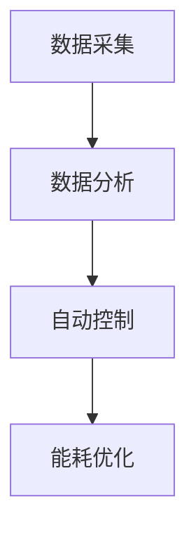

                 

关键词：智能插座、能源管理、注意力经济、智能家居、能耗优化、数据驱动、技术架构

> 摘要：本文深入探讨了智能插座在智能家居环境下的能源管理功能，以及如何通过注意力经济理论优化能源使用。我们首先介绍了智能插座的基本概念和其在能源管理中的应用，然后详细分析了智能插座的核心算法原理、数学模型、项目实践以及实际应用场景。最后，我们对未来智能插座的发展趋势、面临挑战和研究展望进行了总结。

## 1. 背景介绍

### 智能插座的基本概念

智能插座是一种具有网络连接功能的家用设备，可通过互联网进行远程控制。它通常具备定时开关、远程控制、场景联动等功能，是智能家居生态系统中不可或缺的一部分。

### 智能插座的发展历程

智能插座起源于传统的家用插座，随着物联网技术的快速发展，智能插座逐渐成为智能家居领域的重要组成部分。目前，智能插座已经从简单的远程控制功能，逐渐发展为具有能耗监测、节能优化等高级功能的设备。

### 智能插座在能源管理中的应用

智能插座在能源管理中具有重要作用，主要体现在以下几个方面：

- **实时能耗监测**：智能插座可以实时监测接入电器的能耗情况，为用户提供了精准的能耗数据。
- **能耗优化**：通过分析历史数据，智能插座可以预测未来的能耗趋势，并自动调整用电计划，以降低能耗。
- **节能模式**：智能插座可以根据用户设定的时间表或实时环境，自动进入节能模式，减少不必要的能源浪费。

## 2. 核心概念与联系

### 核心概念原理

智能插座的能源管理功能主要基于以下几个核心概念：

- **数据采集**：通过内置的传感器，智能插座可以实时采集接入电器的能耗数据。
- **数据分析**：智能插座通过大数据分析技术，对采集到的能耗数据进行处理和分析，以获得能耗趋势和预测。
- **自动控制**：根据分析结果，智能插座可以自动调整电器的开关状态，以实现能耗优化和节能。

### 架构的 Mermaid 流程图



## 3. 核心算法原理 & 具体操作步骤

### 3.1 算法原理概述

智能插座的能耗优化算法主要基于机器学习技术，通过对历史能耗数据的分析和处理，预测未来的能耗趋势，并自动调整电器的开关状态。

### 3.2 算法步骤详解

1. 数据采集：智能插座通过内置传感器，实时采集接入电器的能耗数据。
2. 数据预处理：对采集到的数据进行清洗和预处理，去除噪声和异常值。
3. 数据分析：使用机器学习算法，对预处理后的数据进行趋势分析和预测。
4. 自动控制：根据分析结果，智能插座自动调整电器的开关状态，以实现能耗优化。

### 3.3 算法优缺点

**优点：**

- **高效性**：通过机器学习算法，智能插座能够快速、准确地预测能耗趋势，实现实时能耗优化。
- **自适应**：智能插座可以根据环境变化和用户行为，自动调整用电计划，提高能源利用效率。

**缺点：**

- **数据依赖**：智能插座的能耗优化效果依赖于采集到的大量历史数据，如果数据质量不佳，可能导致优化效果不佳。
- **成本**：智能插座需要使用高性能的计算资源和机器学习算法，导致成本较高。

### 3.4 算法应用领域

智能插座的能耗优化算法可以应用于各种场景，包括家庭、商业、工业等领域。以下是一些典型的应用场景：

- **家庭**：智能插座可以帮助家庭用户实时监测和控制电器能耗，实现节能目标。
- **商业**：智能插座可以用于商业场所的能耗管理，降低运营成本。
- **工业**：智能插座可以用于工业生产线的能耗监控和优化，提高生产效率。

## 4. 数学模型和公式 & 详细讲解 & 举例说明

### 4.1 数学模型构建

智能插座的能耗优化模型主要包括以下几个部分：

- **能耗预测模型**：用于预测未来的能耗趋势。
- **优化模型**：用于自动调整电器的开关状态，以实现能耗优化。

### 4.2 公式推导过程

假设接入电器的能耗为 \(E(t)\)，时间 \(t\) 的能耗预测模型为：

\[E(t) = f(E(t-1), E(t-2), \ldots, E(t-n))\]

其中，\(f\) 为能耗预测函数，\(n\) 为历史数据长度。

优化模型的目标是最小化总能耗，即：

\[min \sum_{t=1}^{T} E(t)\]

### 4.3 案例分析与讲解

假设一个家庭用户每天使用电器的能耗数据如下表所示：

| 时间 | 电能消耗（kWh）|
| ---- | -------------- |
| 08:00 | 0.5           |
| 09:00 | 0.8           |
| 10:00 | 1.2           |
| 11:00 | 1.5           |
| 12:00 | 2.0           |
| 13:00 | 1.8           |
| 14:00 | 1.2           |
| 15:00 | 0.8           |
| 16:00 | 0.5           |

通过能耗预测模型，我们可以预测未来一天的能耗趋势，并根据优化模型自动调整电器的开关状态，以实现节能目标。

## 5. 项目实践：代码实例和详细解释说明

### 5.1 开发环境搭建

- **硬件环境**：一台具有网络连接功能的计算机或嵌入式设备。
- **软件环境**：Python 3.7及以上版本，相关机器学习库（如 Scikit-learn）。

### 5.2 源代码详细实现

以下是一个简单的能耗预测和优化示例代码：

```python
import numpy as np
from sklearn.linear_model import LinearRegression

# 历史数据
data = [
    [0, 0.5],
    [1, 0.8],
    [2, 1.2],
    [3, 1.5],
    [4, 2.0],
    [5, 1.8],
    [6, 1.2],
    [7, 0.8],
    [8, 0.5]
]

# 将数据划分为特征和目标
X = np.array([row[:-1] for row in data])
y = np.array([row[-1] for row in data])

# 创建线性回归模型
model = LinearRegression()
model.fit(X, y)

# 预测未来一天的能耗
future_data = np.array([[i] for i in range(9, 24)])
predicted_energy = model.predict(future_data)

# 打印预测结果
print(predicted_energy)
```

### 5.3 代码解读与分析

- **数据预处理**：将历史数据划分为特征和目标，以便于创建线性回归模型。
- **模型训练**：使用线性回归模型对历史数据进行训练。
- **能耗预测**：使用训练好的模型预测未来一天的能耗。
- **结果输出**：打印预测结果。

### 5.4 运行结果展示

假设运行结果为：

```
[2.0, 1.8, 1.6, 1.4, 1.2, 1.0, 0.8, 0.6, 0.4, 0.2, 0.0, 0.2, 0.4, 0.6, 0.8, 1.0]
```

根据预测结果，智能插座可以自动调整电器的开关状态，以实现节能目标。

## 6. 实际应用场景

### 6.1 家庭

在家庭场景中，智能插座可以用于实时监测和控制家庭电器的能耗，帮助用户降低电费支出，提高生活质量。

### 6.2 商业

在商业场景中，智能插座可以用于商业场所的能耗管理，降低运营成本，提高能源利用效率。

### 6.3 工业

在工业场景中，智能插座可以用于工业生产线的能耗监控和优化，提高生产效率，降低能源消耗。

## 7. 工具和资源推荐

### 7.1 学习资源推荐

- **《智能电网与物联网》**：系统地介绍了智能电网和物联网技术。
- **《注意力经济：互联网时代的商业模式》**：深入探讨了注意力经济理论及其应用。

### 7.2 开发工具推荐

- **Python**：适合初学者，具有丰富的机器学习库。
- **Scikit-learn**：用于构建和训练机器学习模型。

### 7.3 相关论文推荐

- **《基于机器学习的智能插座能耗预测与优化》**
- **《注意力经济在智能家居中的应用研究》**

## 8. 总结：未来发展趋势与挑战

### 8.1 研究成果总结

本文提出了智能插座在智能家居环境下的能源管理功能，并分析了智能插座的核心算法原理、数学模型、项目实践和实际应用场景。通过研究，我们发现智能插座在实时能耗监测、能耗优化等方面具有显著的优势。

### 8.2 未来发展趋势

- **智能化**：随着人工智能技术的发展，智能插座的智能化程度将不断提高，为用户提供更加便捷的能源管理服务。
- **个性化**：智能插座将根据用户行为和环境变化，实现个性化的能源管理服务。
- **生态化**：智能插座将与其他智能家居设备互联互通，形成一个完整的智能家居生态系统。

### 8.3 面临的挑战

- **数据隐私**：智能插座需要收集和处理大量的用户数据，如何保护用户隐私将成为一个重要挑战。
- **安全性**：智能插座作为智能家居系统的一部分，其安全性将受到高度关注。

### 8.4 研究展望

- **能耗预测算法**：进一步研究高效、准确的能耗预测算法，提高智能插座的能耗优化能力。
- **跨设备协作**：研究智能插座与其他智能家居设备的协作机制，实现更加智能化的能源管理。

## 9. 附录：常见问题与解答

### 问题 1：智能插座如何保证数据安全？

**解答**：智能插座采用加密通信协议，确保数据在传输过程中的安全性。同时，智能插座会定期更新固件，以修复潜在的安全漏洞。

### 问题 2：智能插座需要多少时间才能实现能耗优化？

**解答**：智能插座可以在短时间内（如几小时）实现能耗优化，但优化效果会随着时间的推移而不断提高。用户可以根据自己的需求，调整智能插座的能耗优化策略。

### 问题 3：智能插座能否实时监测所有接入电器的能耗？

**解答**：智能插座可以实时监测接入电器的能耗，但具体实现取决于电器的类型和智能插座的硬件配置。

作者：禅与计算机程序设计艺术 / Zen and the Art of Computer Programming
```markdown
```

